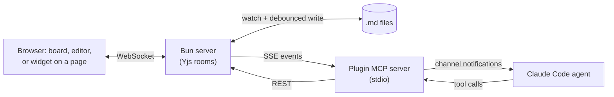

# Claude Workspaces

A Claude Code plugin that gives you and your Claude Code agents one shared
surface: a board of tasks, the docs, mockups and dev servers attached to it,
and comment threads that survive edits. You review and redirect from a browser
tab while the agents do the work. Point at a line, say "this", and the agent's
edit lands seconds later.

## Goals

The aim is to make giving feedback to an agent as fast as pointing and saying
"this".

1. **Work from the board, not from chat.** Agents file tasks and questions.
   You answer them from one queue.
2. **Review from a tablet or phone.** Every surface is laid out for an iPad in
   landscape and for a phone.
3. **Agents keep the tickets in order.** They work ranked goals in priority
   order, file what they find, and say what blocks them.
4. **Outside reviewers need no account.** A share link lets someone comment
   with an emailed sign-in code.
5. **Meetings happen on the doc.** Live transcription and notes sit beside the
   doc you are discussing.

## What it does

- **The board.** Goals, ranked tasks, review items, comments, an activity
  feed per task, and a Home queue of everything waiting on you.
- **Markdown docs** with comment threads anchored to text. You and the agent
  edit the same doc at the same time. `create_diff_review` turns a branch of a
  local repo into one review doc per changed file.
- **Mockups and live dev servers.** An HTML page or a running app gets the
  comment widget injected. Point at an element and comment on it.
- **Meetings.** Live transcription and notes that write themselves at natural
  pauses, on any doc.

## Install

You need [Claude Code](https://code.claude.com/docs), [Bun](https://bun.sh)
and git. The server is tested on macOS.

There are two parts. The **plugin** comes from the Claude Code plugin
marketplace and carries the MCP tools, hooks and skills. The **server** runs
from a clone of this repo. The plugin finds the server through
`~/.claude/claude-workspaces/server.json`, which the server writes when it
starts.

### 1. Install the plugin

```sh
claude plugin marketplace add fryanpan/claude-workspaces-plugin
claude plugin install claude-workspaces@claude-workspaces --scope user
```

The first command registers this GitHub repo as a plugin marketplace. The
second installs the plugin for every Claude Code session you start. To update
later:

```sh
command claude plugin marketplace update claude-workspaces
command claude plugin update claude-workspaces@claude-workspaces
```

`command claude` skips the shell function from step 2, whose extra flag
breaks the `plugin` subcommands.

Restart your Claude Code sessions after an update.

### 2. Launch Claude Code with channels turned on

The server pushes comments and task changes into your session as channel
events. Claude Code only accepts channel events from a plugin you name at
launch:

```sh
claude --dangerously-load-development-channels plugin:claude-workspaces@claude-workspaces
```

To make that the default, add a shell function to `~/.zshrc` or `~/.bashrc`.
Replace the path with the output of `command -v claude`:

```sh
claude() { /path/to/claude --dangerously-load-development-channels plugin:claude-workspaces@claude-workspaces "$@"; }
```

Without the flag the tools still work, but your agent only sees a comment
when it asks for one.

### 3. Run the server

```sh
git clone https://github.com/fryanpan/claude-workspaces-plugin.git
cd claude-workspaces-plugin
bun install
bun run dev
```

`bun run dev` picks a free port starting at 8787, starts the server with hot
reload, and prints the addresses it can be reached on: `localhost`, plus a
Tailscale and a LAN name when it finds them. Your data goes in `data/` inside
the clone unless you set `CW_DATA_DIR`. Keep the terminal open while you work.

### 4. Open the board

Open the `localhost` address the server printed, for example:

```
http://localhost:8787/
```

Then, in a Claude Code session launched as in step 2, ask things like:

- "Create a workspace for this project and file what we just discussed as
  tasks."
- "Show me docs/plan.md in a workspace."
- "Show me the dev server in a workspace."

The plugin's `working-in-a-workspace` skill tells the agent how to work from
the board.

### Or let Claude do the setup

Open Claude Code inside the clone and run `/setup`. It walks through the same
steps and asks before each one that changes your machine.

## Keep the server running (macOS, optional)

`bun run dev` stops when its terminal closes. To keep the server up across
logout, reboot and crashes, install it as a per-user launchd service from the
clone:

```sh
./scripts/launchd/install.sh
```

It writes a plist to `~/Library/LaunchAgents/`, starts the service on port
8787, and logs to `~/Library/Logs/`. It builds the web app once and serves
that build, with no hot reload. Re-run it after pulling changes to the launch
arguments. It is safe to run twice. To remove it:

```sh
./scripts/launchd/uninstall.sh
```

The service label defaults to the one in the plist template. Set
`CW_LAUNCHD_LABEL` on both scripts to install under a label of your own.
Two features still look for the default label: the server's self-deploy
restart, and reading the summary API key from the Keychain.

If the clone lives on a volume other than the boot disk, the launchd copy of
`bun` needs Full Disk Access first: System Settings, Privacy & Security, Full
Disk Access, then add the `bun` binary. `install.sh` prints the same advice
when it sees the symptom, which is empty logs and no listener.

Serving the board over HTTPS on a tailnet, which the microphone needs on any
device other than the host, is in
[docs/process/tailnet-https.md](docs/process/tailnet-https.md).

## How it works

- **Push, not polling.** Comments, review answers and new tasks reach the
  agent as `<channel source="claude-workspaces" ...>` events through
  [Claude Code channels](https://code.claude.com/docs/en/channels).
- **Comments are anchored to the surface.** Docs are Yjs CRDTs. Each comment
  is anchored to a text range or a DOM element, and the anchor moves with
  concurrent edits. A large rewrite can still detach a thread, and the thread
  survives.
- **Small, composable tools.** `get_doc`, `find_and_replace`,
  `create_anchor`, `edit_at_anchor`, `post_reply`, `add_review_item`,
  `create_tasks` and `next_tasks` are combined however a workflow needs.
- **A vanilla web-component widget.** One `<script>` tag with Shadow DOM and
  no framework, so it can be injected into any page.



## What it is not

- **Not hosted.** The server runs on your machine. Reviewers reach it on your
  network, over Tailscale, or through a share link you choose to publish.
- **Not a code review tool.** Diff review covers a branch of a local
  checkout. Pull requests still happen on GitHub.
- **Not tied to a framework.** The widget works on any HTML page.

## Status

Beta. One person's fleet of agents works from it every day, which is a
different claim from "works for you". Expect sharp edges.

- A bound markdown file syncs both ways with its live doc. Edit it through the
  plugin's tools, not with a plain editor save that races the write-back.
- Meetings need a transcription API key on the server. Without one the
  transcript strip says so and everything else works.
- Mobile and tablet layouts are still being tuned surface by surface.

## Contributing

Run `git config core.hooksPath .githooks` once after cloning. It turns on the
leak gates that keep private names and keys out of this public repo.
`bun run verify` runs every check CI runs.
[CLAUDE.md](CLAUDE.md) and [docs/architecture/overview.md](docs/architecture/overview.md)
are the starting points. [REVIEW.md](REVIEW.md) is what the code-review agents
check, and [WORKSPACES.md](WORKSPACES.md) says where each kind of doc goes.

## License

[MIT](LICENSE)
