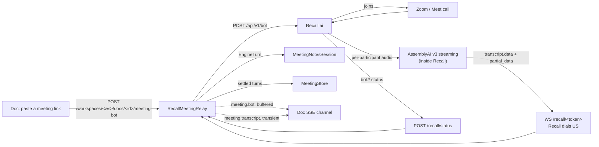

# Meeting assistant

**Goal:** a person opens a doc, presses one button, and talks. Words appear
live in a compact strip while they speak; meeting notes compose themselves
into the doc at the natural pauses in the conversation — and, when there are
none, at least every fifteen seconds. The transcript is
durable; the doc body stays the person's own writing plus the notes section.

Shipped 2026-08-28 (capture PR #408, notes PR #410). This doc is the summary
to read before touching the subsystem — the code's own header comments carry
the fine detail.

## Shape

```mermaid
flowchart LR
  Mic[Browser mic] -->|16kHz PCM16 frames| WS["WS /audio/&lt;docId&gt;"]
  WS --> Relay[MeetingRelay<br/>meeting-protocol.ts]
  Relay -->|audio| Engine[TranscriptionEngine<br/>AssemblyAI Universal Streaming]
  Engine -->|turns| Relay
  Relay -->|transcript frames| WS
  Relay -->|settled turns| Store[MeetingStore<br/>append-only JSONL]
  Relay -->|audio, teed| Raw["Raw record<br/>&lt;docname&gt;-raw-transcript.md<br/>segment-N-mic.pcm · meeting.json"]
  Store -->|at stop| Raw
  Relay -->|every turn| Notes[MeetingNotesSession<br/>pause + cadence composer]
  Notes -->|Yjs write| Doc[Doc "Meeting notes" section]
  Relay -.->|started/stopped only| SSE[Doc SSE channel]
```

- **The audio socket IS the meeting's lifecycle.** Every way the socket can
  end — clean stop, tab close, network drop — ends the meeting exactly once.
  `opening`/`ending` are real states because both ends of a meeting are round
  trips. A SOCKET that ends is no longer a MEETING that ends, though: see
  "Resume on reconnect" below.
- **Nothing word-rate enters the SSE replay buffer.** Microphone transcript
  frames return on the audio socket; only `meeting.started`/`meeting.stopped`
  broadcast to the doc channel. The SSE bus keeps 200 events for reconnect
  replay and a conversation emits that many words in about a minute —
  broadcasting partials would evict every real doc event. The bot path (below)
  has no socket to a browser, so its words DO ride the doc channel — as
  `meeting.transcript` frames through `SseBus.broadcastTransient`, which fans
  out live, buffers nothing and stamps no id, so the replay window and every
  reconnect cursor are untouched.
- **The strip, not the doc.** Desktop: a bar along the bottom of the editor
  pane, reserved as a grid track so it can never cover prose. Mobile
  (≤720px): a stacked panel at the true bottom edge. The transcript never
  enters the doc body (tested); only composed notes do, through the same Yjs
  path every other writer uses.
- **Turns revise in place.** A `transcript` frame carries the WHOLE turn text
  and a `final` flag; a later frame with the same turn number replaces the
  earlier text, which is how a mis-heard word corrects on screen.
- **A capture says who is expected to be in the room, and pays for that.**
  `solo` is the default and the whole of the default: no diarization, no
  surcharge, one voice assumed. `conversation` is asked for, and it is the
  only thing that turns speaker labels on. The choice is made BEFORE the mic
  opens and cannot move while it runs — a streaming session's configuration
  is its connect URL — so the strip's switch is disabled for the length of a
  meeting and says to stop and start. Two ways in: the Board's "Record a
  conversation" button (the press is the only thing that tells a
  server that two people sat down), which carries `mode=conversation` on the
  address beside `huddle=1`; and the strip's own "Detect multiple speakers"
  switch, for a doc already open. `ready` echoes back the mode the SERVER
  opened, so the strip reports the session being billed rather than the one
  it asked for, and the meeting record keeps it because it is what the
  meeting cost.
- **Nothing is announced to the room.** A `conversation` capture used to speak
  a fixed sentence into its own microphone and record which path told the
  room. All of it was removed on 2026-09-01; what stands in its place is one
  line at the head of the transcript panel, addressed to the person recording.
  See "The room is no longer told by us" below.
- **Who said it rides the same frame.** The engine's speaker label (`"A"`,
  `"B"`) travels as `speaker` on each transcript frame; the strip shows it as
  a muted tag at the head of the turn ("Speaker A"), and a tap on the tag
  names that voice for the meeting — every turn with the label updates, the
  strip sends `name_speaker` up the audio socket, the record keeps the name,
  and the notes composer reads it from then on AND the notes already written
  are rewritten to match ("A rename reaches backwards", below). Labels are
  per SESSION: the
  same letter is a different person next meeting, so the name map lives on
  the meeting's index line, never on the doc.

## Resume on reconnect (2026-09-08)

A dropped connection used to end the recording. The mic closed, the strip said
the connection was lost, and pressing Record again opened a meeting with a new
id — so a deploy in the middle of a conversation left two transcript files and
two `## Meeting notes` sections under one conversation, which is precisely the
split PR 824 closed on the server side.

The client now keeps the microphone and asks to be let back into the SAME
meeting: `start` carries `resume: <meetingId>`, and `ready` answers `resumed:
true` when the server took it.

- **What "took it" means.** `MeetingStore.resume` accepts an id this doc's
  index knows AND whose transcript file is still on disk, on a doc nothing
  else is recording. Anything else returns null and the relay opens a NEW
  meeting — never one under the old id, because the transcript is append-only
  and a wrong id cannot be taken back. The strip says so in one sentence and
  keeps recording; that is the documented fallback, not a failure state.
- **Turn numbers continue.** An engine session numbers its turns from zero, and
  a second line for a turn already written is a REVISION in this format — so a
  resumed leg starting at zero would overwrite the meeting's opening words.
  `ActiveMeeting.turnBase` is the highest turn already recorded plus one, and
  the relay adds it to every turn id before the frame, the record and the
  notes pipeline see it. Zero on a fresh meeting, so nothing else changed.
- **Everything named after the meeting comes back with it**: the transcript
  JSONL, `<meetingId>-timing.jsonl`, and `<meetingId>-section.json` — which is
  why the notes land under the section the meeting opened rather than a second
  one (`beginMeeting` clears only the in-memory cache, deliberately).
- **The index gains one line kind**: `{meetingId, resumedAt}`. A resume UNDOES
  the end the shutdown wrote, so the fold sets `endedAt` back to null and the
  later stop line puts it back. `MeetingRecord.resumedAt` is the list of them.
- **The raw companion gets a continuation.** A graceful shutdown flushes the
  meeting's `## Segment N` before the resume happens, and a written segment is
  skipped — so the resumed leg's words would have vanished from the file a
  person reads. `flushRawSegments` takes the leg's first turn number and
  appends `## Segment N (resumed) — <ISO>` holding exactly the turns from
  there. Same segment number, same `.pcm` files (the sink opens with `a`).
- **Audio spoken during the outage is DROPPED, and the strip says so** in the
  same sentence that says it is reconnecting. Buffering it would mean pushing a
  minute of speech into a streaming session priced by the second it is open,
  out of time with the words around it; the server's own pre-handshake buffer
  stops at a few seconds for the same reason. A gap is visible in the record;
  a burst replayed out of order is a transcript nobody can trust.
- **The backoff is 1s, 2s, 4s, 8s, then 15s, giving up after two minutes**
  (`meeting-reconnect.ts`, which holds the policy and nothing else). An
  `already_recording` refusal DURING a resume is retried rather than reported:
  the dropped socket's teardown flushes an engine session and can still hold
  the doc's lock for a moment. Past the window the strip lands exactly where it
  used to — "The connection to the meeting was lost", mic released.

## Engine choice

Criteria (owner, 2026-08-27): latency first, accuracy second, cost/privacy
deferred; the word-ticker UX requires word-level streaming.

| Engine | WER | Word latency | Words | $/hr |
|---|---|---|---|---|
| **AssemblyAI Universal Streaming** (chosen) | 8.6% | ~300ms | immutable, word-level | 0.15 |
| Soniox U-3.5 Pro | 4.1–6.3% | ~150ms | phrase bursts | 0.45 |
| Deepgram | 15.6% | <300ms | mutable, word-level | 0.46 |
| OpenAI Realtime | unbenchmarked | — | phrase | ~1.02 |
| whisper.cpp (local) | ~7.4% | 1–2s chunks | chunk | 0 |

Only AssemblyAI and Deepgram do sub-300ms word-level; Deepgram carries ~2x
the errors. The engine sits behind the `TranscriptionEngine` interface
(`packages/server/src/transcribe.ts`) so a later switch is a new adapter,
not a rework.

**The engine is not asked for at start** (Urgent-fixes ticket, 2026-09-02).
A `start` frame naming no engine opens the server's default (the first
configured, `/api/meeting-engines` lists them default-first), and the
start chooser no longer shows a picker for any source. The one place an
engine is chosen is the address — `?engine=soniox`, a preference read on
every visit and kept across the one-shot huddle flags (`huddle-entry.ts`) —
which is how a side-by-side trial is still run. The bot path streams the
vendor's raw audio into these same engines (see below), so the preference
applies there too; it was never the vendor's transcript. Advanced Options
stays, keyed on whichever engine will open.

**The Mac's own audio comes through Chrome** (Bryan, 2026-09-07: "through
Chrome", not a helper app). The chooser's third source, "This Mac's audio",
is `getDisplayMedia` with `systemAudio: 'include'` — Chrome 141+ on macOS
14.2+ puts an audio box in its share picker and hands the page an audio
track beside the screen it insists on; the screen is stopped at once
(`meeting-source.ts`). From there it is the microphone path unchanged: the
same pump, frames and socket, and the `start` frame carries `source:
'system'` only so the raw record can say where the sound came from
(`MeetingSource` gains the value beside `mic` and `bot`). A browser with no
picker is not offered the card; a picker closed with the box unticked is
refused in the strip's words. Chrome-only by nature, so never the iPad.

**Endpointing: one measured default, on the default engine** (2026-09-05).
The adapters otherwise send no turn-detection tuning at all, on the principle
that a default we never send is a default we can never get wrong. The single
exception is Soniox's `endpoint_latency_adjustment_level`, which the adapter
sends as **2** rather than the vendor's 0
(`DEFAULT_ENDPOINT_LATENCY_ADJUSTMENT`). Measured with
`scripts/endpoint-latency-check.ts --engine soniox --fixture trailing`, 15
turns per rung on a built fixture of mid-thought stops:

| level | speech end → settled turn, p50 | p90 | word recall |
|---|---|---|---|
| 0 (vendor default) | 485 ms | 503 ms | 100% |
| 1 | 302 ms | — | 100% |
| **2 (sent)** | **211 ms** | 508 ms | 100% |
| 3 | 2508 ms | 2703 ms | 100%, with stray punctuation |

Level 3 is not a further step in the same direction — it is five times slower
and mangles the text — which is why the ladder was walked rather than jumped.
A person who moves the control still wins: the sanitized tuning is spread
after the fixed fields.

**And this is a small share of the wait.** `scripts/notes-latency-check.ts`
puts the median speech → note-written wait at 9.2s before the endpointing
change and 8.9s after. Endpoint detection was 5% of that wait and is now 2%;
the rest is the notes clocks, and moving them is what the 2026-09-08 latency
work did — see "Three clocks fire a tick" below for the endpoint window that
replaced most of the four-second quiet wait, and for the ceiling that now
arms on a word.

**Speaker labels** (added 2026-08-29): `speaker_labels=true` on the same
streaming URL — supported on every streaming model, **+$0.12/hr** on top of
the $0.15 base (docs: streaming/label-speakers-and-separate-channels for the
parameter, assemblyai.com/pricing for both figures, re-checked 2026-08-30).
**Sent only for a `conversation` capture** (2026-08-30, owner: *"assume by
default that Bryan is alone"*): the parameter is absent — not `false` — on a
solo session, because an unpriced session is one that never asked.

**And capped.** `max_speakers` (1–10) rides beside it as a hard cap on how
many labels the session may ever hand out; past it, extra speakers merge into
the closest existing label (same doc page, read 2026-08-30). Absent, the count
is UNBOUNDED, and an unbounded diarizer in a room where two people share one
far-field microphone is free to answer a change of posture with a new letter.
The room's size is the browser's to know — nothing on the server can hear the
room — so it rides the `start` frame as `speakers`, clamped rather than
refused (an out-of-range value makes the engine refuse the whole session,
which reads as "transcription is broken"), and defaults to **2**. The docs
suggest a little headroom above the expected count; we do not take it,
because the failures are not symmetrical: a third voice merged into the
closest label costs one misattributed turn, an invented Speaker C costs the
reader their belief in the labels. `?speakers=3` on the doc address is how a
room that really holds three says so. A solo capture sends neither parameter.

**A meeting is a CHAIN of sessions, because a session ends at three hours.**
AssemblyAI closes one with code 3008 ("Session Expired: Maximum session
duration exceeded") and bills the full three hours
(streaming/common-session-errors-and-closures and the streaming API
reference, read 2026-08-30). There is no idle limit alongside it —
`inactivity_timeout` is optional and this adapter does not send one — so a
long QUIET session was never the risk; the wall was, and a solo working
session reaches it. A minute before the `expires_at` the engine gave in
`Begin`, the adapter opens the next session, waits for its `Begin`, moves
the audio across, and only then terminates the old one, whose flush still
delivers the sentence it was mid-way through. Two things it has to get
right, both tested: turn ids CONTINUE across the join, and a retired session
is TERMINATED rather than dropped (a socket merely closed leaves the session
open on their side, billed to the cap). Ids are the adapter's own, allocated
the first time a leg emits a given `turn_order` and then remembered per leg
— a fresh session counts from zero, and downstream a turn id is the identity
a transcript revises in place and the key the record is written under, so
the two legs must never name the same id. Allocating on first emission is
what makes that safe during the overlap: the old leg can still open a turn
while the new one is already carrying audio, and a base fixed at rollover
time would hand both of them the same number.
The two sockets overlap for one handshake and both are billed for it; that
is the price of not cutting a meeting in half at hour three.

**What a meeting costs.** Streaming is billed on the seconds the SOCKET IS
OPEN, not on the audio sent — silence in the room costs the same as speech,
and the meeting's length is the bill.

| | per hour | **per meeting-minute** |
|---|---|---|
| Universal-Streaming English (a `solo` capture) | $0.15 | $0.0025 |
| + speaker labels (a `conversation` capture) | $0.27 | **$0.0045** |

So labels add **$0.002 per meeting-minute** — $0.12 on a one-hour meeting,
against $0.15 the meeting already cost. Roughly a 1.8x transcription bill for
knowing who spoke, which is why the room has to be claimed rather than
assumed. The notes composer and task capture are separate Haiku
calls and are not in these numbers.

Each
`Turn` carries `speaker_label`; turns under ~1s of audio carry a placeholder
(`PENDING`/`UNKNOWN`) the engine adapter maps to "no speaker". A
`SpeakerRevision` arrives before `Termination` naming turns the whole-session
pass relabelled; the adapter re-emits those through `onTurn` as settled turns
with retained text, so the relay needs no second channel. A turn still
waiting on the pause tick takes the new label; a turn whose words are
ALREADY in the doc is a correction, and reaches them — see "A late
correction lands on the mentions it can prove" below. A person RENAMING a
voice reaches them too, by a different route: through the tag rewrite and
the text sweep; see "A rename reaches backwards". The revision
can also take a label away (a
placeholder is "no speaker"), which the record writes as an explicit
`speaker: null` relabel line — an absent field would read as "says nothing
about the speaker" and leave an attribution the strip had already dropped.

**What the room's microphone does to all this.** Echo cancellation, noise
suppression and automatic gain control are tuned for one near-field talker:
AGC renormalises level continuously and noise suppression gates the quieter
part of the spectrum, so both act on exactly the cues — relative loudness,
timbre, near talker against far — a diarizer uses to tell two voices apart.
They are now one config, `ROOM_AUDIO_DEFAULT` in `meeting-audio.ts`, applied
only to a `conversation` (solo capture is untouched) and overridable from the
address: `?mic=ec1-ns0-agc0`, alongside `?speakers=N`. Both are facts about
the ROOM rather than one-shot gestures, so unlike `huddle=1` and `mode=` they
survive the reload.

**The default turns gain control off, and the number is why.** Scoring is
`scripts/room-labels-check.ts`, which scores a run against the script that was
actually read and prints its scoring settings beside every figure — a
diarization accuracy number moves by tens of points on those settings alone,
so one without them is not a number. Four ways in: `--doc <docId>` scores a
meeting already in the append-only record (no key, no cost, no audio needed);
`--audio` sends a file through the real engine; `--synthetic` builds a
two-voice fixture with `say` and ffmpeg — two distances, a shared reverb tail,
overlapping turns; and `--ami` scores an excerpt of a real meeting. `--mock`
runs the whole path with no key and no bill, and measures nothing.

`--ami` is what made the microphone matrix possible at all. The browser
applies these processors BEFORE the audio exists and this server keeps no
audio, so no recording of ours can be re-scored under other settings — the
matrix would have cost one recording per combination from a person. The AMI
Meeting Corpus (CC BY 4.0) publishes unprocessed far-field audio, and its
`Array1-01` channel is a SINGLE element of the array on the table: one
microphone, people around it, which is this subsystem's case. So the
processors can be approximated on top of it offline and the same seconds
scored under each. The excerpt is range-fetched into a cache outside the repo
— the channel is already 16 kHz mono PCM16, the meeting wire's own format, so
a byte offset is a time offset and 4.8 MB arrives instead of 40 MB.

Measured 2026-08-31, ES2002a, 120-second windows, through the real engine with
`max_speakers` set to the number of people in the window. The figure is
**reference words both transcribed AND attributed to the person who said
them, over every word said in the window** — the only one on the card that
does not move with how much a run attempted. Scored
`similarity=jaccard-words threshold=0.5 alignment=monotonic-dp-span
mapping=optimal-assignment unlabelled=excluded mixed=counted-wrong`:

| window | ec1-ns0-agc0 | ec1-ns1-agc0 | ec1-ns0-agc1 | ec1-ns1-agc1 |
|---|---|---|---|---|
| two people (590s–710s), 262 words | 16.4% | **34.4%** | 13.4% | 16.4% |
| four people (900s–1020s), 400 words | 27.3% | 29.5% | 31.8% | **49.0%** |
| speakers labelled, two-person window | 2 of 2 | 2 of 2 | 2 of 2 | 2 of 2 |
| speakers labelled, four-person window | 3 of 4 | 2 of 4 | 2 of 4 | 3 of 4 |

**Why that figure and not attribution accuracy.** Each setting produces a
different transcript and therefore covers a different amount of the script, so
a percentage over the covered part compares two numbers with different
denominators. It is not a small effect here: on the two-person window,
coverage ran from 66.0% (`ns`) to 86.3% (`agc`), and `agc` — the setting that
covered the MOST — attributed the least. Ranking on the covered-part figure
would have preferred whichever setting attempted least. The scorer now prints
coverage on every card and refuses the comparison out loud when two runs
differ by more than five points.

**Noise suppression on wins all four pairings** — both windows, gain control
either way. That one is neither close nor split.

**Gain control is split, and it appears to depend on how many people are in
the room.** On two voices it costs (13.4% against 16.4%) and cancels the whole
of noise suppression's gain (16.4% against 34.4%); on four it helps (31.8%
against 27.3%, and the best row of the eight). A mechanism fits both halves:
telling people apart on ONE microphone leans on how loud each of them is, so
removing that difference costs when two voices are already separable and pays
when four voices are unequal enough that the quiet ones are lost outright.

So `ROOM_AUDIO_DEFAULT` is `ec1-ns1-agc0`, chosen for the room this product is
FOR — two people with a device on the table — and not by a majority of the
eight numbers. A bigger room wants `?mic=ec1-ns1-agc1`, which is why the knob
is on the address. Solo keeps all three; it was measured by nothing here, and
the two defaults are separate constants so that moving one cannot move the
other.

**Echo cancellation is untested and stays on.** It cancels what the device's
own speaker is playing, and an AMI recording has no far-end signal to cancel;
no run here says anything about it either way. The honest reading of the table
is four rows about two processors.

**What the AMI numbers are and are not.** They are the real engine on real
far-field audio with human reference annotations. They are NOT the browser:
`afftdn` and `dynaudnorm` are ffmpeg approximations of WebRTC's processors,
doing the same job by a different algorithm, and the report labels every such
run `EMULATED`. Two windows of one meeting is a small sample; the four-person case is harder
than the product's, and it is the half that disagrees about gain control, so
the split above rests on one window each way. Bryan's own two-minute
recording is what confirms the direction on the case we actually ship; moving
the default back is one line.

Repeats matter more than they look. `--repeat n` runs the same audio n times,
prints every run and their median, and warns when the spread WITHIN one
setting is wide enough to swallow the gaps BETWEEN settings. Measured over 20
runs, each setting's own runs agreed to within 0.1 points of attribution — the
engine is near-deterministic on identical bytes — with the largest single
disagreement being one transcribed word, and one `ns` pair differing by 1.6
points of coverage. That was worth establishing: the first pass at this matrix
printed identical scores for two settings and read them as run-to-run noise. They were identical because the emulation had silently not applied
(zsh does not word-split an unquoted parameter, so `ns agc` arrived as one
unknown key, and the script dropped it while still printing `EMULATED`).
`emulate` now refuses a key it cannot apply.

**What the synthetic fixture showed.** `--synthetic` builds 22.5 seconds of
two macOS voices at two distances with a shared reverb tail and 150 ms of
overlap. Through the real engine with `max_speakers=2` it came back as three
run-on turns, all labelled A: **one voice where there were two.** That is a
result about the fixture as much as the engine — two TTS voices over a
synthetic tail are not a room — and it is the run that exposed a scorer bug
worth naming, because the harness scored that failure as "turn attribution
100.0%". One-line-per-turn alignment had matched each turn to its best single
line and dropped the rest. Alignment is now many-to-one, a turn spanning two
people is MIXED and never correct, and a person who never gets a label is
reported as NEVER DISTINGUISHED.

**That two real voices separate is now shown.** On the two-person AMI window,
every setting produced exactly 2 labels for 2 people, each mapping to a
different person, with nothing invented — on one far-field microphone. What
the attribution percentages say is where the remaining error is: 6 of 10
aligned turns ran across both speakers. The engine finds the people; it merges
across the change.

**What diarization is actually proven by.** Every automated test drives the
MOCK engine, which returns labels a fixture chose. That covers the plumbing
end to end — label on the wire, in the record, in the composed notes, and the
rename that rewrites them (`meeting-e2e.test.ts`) — and it cannot show that
AssemblyAI separates two real voices, because no fixture can. The mock also diarizes ONLY when the open asked it to, which is what makes
the mode testable end to end: the same two-voice fixture comes back
unlabelled in solo mode, so the e2e proves the flag reached an engine rather
than proving the fixture has a `speaker` field. Run
`bun run scripts/diarize-check.ts` for the part no fixture can do: it speaks a two-voice script
through the real engine with two macOS `say` voices and prints the labels.
It needs a key, opens a metered session (~$0.001), and is deliberately not
part of any suite. The live half HAS now been run (2026-08-31), by
`room-labels-check.ts` rather than by this script: see the AMI table above —
two real voices on one far-field microphone came back as two labels for two
people.

**Key wiring:** `ASSEMBLYAI_API_KEY` env, then Keychain
(`transcribe-assemblyai.ts` names the service). No key → the socket answers
`unavailable: not_configured` and the strip says so — a settled state, not
an error. `createServer` deliberately builds NO engine; only `bin.ts`
constructs a real one, so no test run ever opens a metered session.

## The bot path (Recall.ai) — Zoom and Google Meet

Added 2026-08-30. The microphone hears the room Bryan is in; a bot joins the
call everyone else is on. Everything after the words is the same pipeline:
same `MeetingStore` record, same `beginNotesSession`, same
`meeting.started` / `meeting.stopped` broadcasts. A bot meeting is not a
second kind of meeting — it is the same meeting with a different way of
hearing.



**Both callbacks come in on a hostname of their own** (2026-08-31).
`CW_RECALL_CALLBACK_HOST` names a dedicated first-level address
(`recall.<domain>`) pointed at the same tunnel with **no Cloudflare Access
application in front of it**, and both the websocket origin and the status
webhook URL are derived from it. It classifies its own host kind that serves
exactly `GET /recall/<token>` and `POST /recall/status` — each only while its
own credential is configured (the per-bot token, and `RECALL_WEBHOOK_SECRET`)
— and answers **404 to everything else**, including to a caller holding a
valid operator Access token.

This replaced two Access exemptions on the OPERATOR's hostname, which is the
address a person opens the product on; that hostname now has no bypasses at
all. With them gone, a deployment still deriving its callback URL from
`CW_PUBLIC_BASE_URL` would look configured while every callback was refused,
so meeting bots report themselves **not configured** when the address this
server would hand Recall is one of its own Access-gated hostnames. See
`packages/server/src/middleware/recall-callback-gate.ts`,
`unreachableCallbackReason` in `packages/server/src/recall.ts`, and the
"operator's own hostname" section of docs/product/sharing.md.

**What streams, and why not the audio.** Recall can forward raw per-participant
PCM (`audio_separate_raw.data`, 16 kHz mono S16LE), which would drop straight
into the existing engine seam. It is not what this uses. Instead Recall runs
**AssemblyAI Universal Streaming itself** —
`recording_config.transcript.provider.assembly_ai_v3_streaming`, with
`format_turns: true` and
`diarization.use_separate_streams_when_available: true` — and sends back
`transcript.data` / `transcript.partial_data` carrying the platform's own
`participant.name`. Same engine, same formatted-final contract, and the
per-track audio plumbing is the vendor's problem rather than a base64 decode
and N sockets on this server's critical path. `audio_separate_raw` is also
documented as "limited support"; the transcript stream is not.

**Diarization is off on this path, and that is the saving.** The microphone
path pays AssemblyAI's `speaker_labels` surcharge to guess which voice is
which. A bot does not have to guess: the platform already knows who is
speaking and says so on every event. So the $0.12/hr label surcharge is gone.

**What a bot meeting costs.**

| | per meeting-hour |
|---|---|
| Microphone, with speaker labels (today) | $0.27 |
| Bot: AssemblyAI, separate streams | $0.15 × speaking participants |
| Bot: AssemblyAI, one mixed stream (`RECALL_SEPARATE_STREAMS=0`) | $0.15 |
| Recall's own per-bot-hour fee | account pricing — not in the API docs |
| Notes + capture (Haiku, unchanged) | $0.84 |

AssemblyAI bills per streaming SESSION-second, so separate streams multiply by
the number of people who actually speak: a two-person call is about what the
microphone costs today, a four-person call about twice. The mixed-stream mode
is a flat $0.15 and attributes turns by correlating Recall's own speech
events, which is worse over crosstalk. Accuracy is the default; the cheap mode
is opt-out, because someone asking for "who said what" asked for the accurate
one.

**Names, not labels.** The pipeline's `speaker` is an opaque LABEL that
`speakerDisplayName` renders as "Speaker A" until a person names it. Putting
"Rowan Pike" in that field directly would render "Speaker Rowan Pike"
everywhere. So a bot meeting synthesises a label per participant (`p7`) and
NAMES it immediately with the platform's name — which means the record's name
map, the composer's display logic and the retroactive-rename machinery all
work unchanged, and a person can still correct a name the platform got wrong.
Two participants with the same display name are disambiguated at that seam
("Alex Yun (2)"), because composed notes carry no per-mention attribution and
the notes session correctly REFUSES to rewrite a name that means two voices.

**Turn numbers are invented here.** AssemblyAI's own stream carries
`turn_order`; Recall's does not. `recall-turns.ts` allocates them: a partial
opens a participant's turn, a final settles it, and a final on an
already-settled turn opens a NEW one **unless its words normalise to the same
string AND it arrives within two seconds** — which is the `format_turns`
double-final arriving as two indistinguishable events. Both halves of that
clause are load-bearing. Without the same-words half, the punctuated pass
becomes a duplicate turn. Without the two-second window, "Yes." said twice in
one conversation becomes one turn and the second answer is deleted outright.
Merging two different sentences would lose one, which is worse than a
duplicated punctuation pass; deleting a repeated one is the same loss wearing
a different hat.

The record takes the SECOND of a folded pair: a later transcript line with
words for a turn already written revises it in place (see Persistence), so
the durable transcript reads the punctuated way rather than keeping the rough
first draft forever.

**The first word starts the meeting; a terminal state ends it.** Not the
`bot.in_call_recording` webhook. The status channel and the word channel are
independent and either can be late; waiting for the report would drop the
opening sentences with no meeting to record them into. Conversely the vendor
socket dropping is NOT the end — Recall reconnects, and the call is still
going. This is the exact opposite of the microphone path's "the socket IS the
meeting", and the difference is that a bot's socket is a delivery route rather
than the meeting itself.

**Zoom's consent banner is Zoom's.** Native recording permission is not a
create-time flag: the bot joins, and
`POST /api/v1/bot/{id}/request_recording_permission/` asks the host — which is
what makes Zoom's own banner fire, so the room is told it is being recorded by
Zoom rather than by us. Asked once, Zoom only. The answer arrives as
`bot.recording_permission_allowed` / `_denied`, and
`automatic_leave.recording_permission_denied_timeout` stops a refused bot from
sitting in the call billing.

**Config.** `CLAUDE_WORKSPACES_RECALL_API_KEY` env, then Keychain
(`claude-workspaces-recall-api-key`) — the same order and the same reasoning
as the AssemblyAI key. `RECALL_REGION` picks the API host and a key is only
valid in its own region (a mismatch is a 401, which the client's error names).
The key is region-bound and answers 401 everywhere else, and an unset
`RECALL_REGION` means `us-east-1`. It lives in the launchd plist's
`EnvironmentVariables`, which the 2026-09-01 boot-disk move dropped: every Meet
join answered 502 until it was put back. The server now checks the key against
its region at boot and logs `[meetings] Recall key REJECTED by <region>` when
they disagree, and a refused invite logs the vendor's message.

**Recall dials this server**, and this server binds to localhost behind a
Cloudflare Tunnel, so it has to be told the address something in front of it
answers on. That is `CW_RECALL_CALLBACK_HOST` — a hostname, and everything the
vendor is given is DERIVED from it (`recall.example.com` →
`wss://recall.example.com/recall/<token>` and
`https://recall.example.com/recall/status`) rather than configured separately:
two settings naming one host is two things to get wrong, and nothing reports
the disagreement — just a bot that records into a hostname nobody is listening
on. Unset, the derivation falls back to `CW_PUBLIC_BASE_URL`, the single
source of every link the server hands a human — but that hostname is
Access-gated with no exemptions, so bots there report themselves not
configured rather than bill for callbacks that will be refused. A fallback
base that is plain `http` disables bots rather than stream a meeting's audio
in cleartext; the callback host builds `wss://` by construction.

The status webhook URL is printed at boot for exactly one reason: this server
never calls it. It is configured at the vendor, workspace-wide, so the boot
log is the only place the right value is ever stated.
`RECALL_WEBHOOK_SECRET` verifies status webhooks (Svix HMAC); Recall publishes
no static IPs to allowlist, so that signature is the only proof available.
Retention is `{type: "timed", hours: 24}` by default — short, per the owner's
call. See `.env.example`.

**The AssemblyAI key for this path lives in Recall's dashboard**, per region,
not in this repo and not in the create-bot body. The Keychain key still serves
the browser-microphone path. Two places hold an AssemblyAI credential and they
are for two different paths.

**The live ticker rides the doc's own stream, transiently** (2026-08-31,
after the owner's first real bot call: names and notes worked, but nothing
showed the bot was hearing anything until notes appeared). A bot's words have
no socket back to any browser — the microphone strip's words come down the
socket that sent the audio — and the one channel every viewer of a doc already
holds is `/events/<docId>`. Buffered, its words would evict every real doc
event from the 200-event replay window within a minute; so the relay sends
each vendor frame, partials included, as a `meeting.transcript` event through
`SseBus.broadcastTransient`: fanned out to open streams, never appended to the
buffer, and carrying **no `id:` line** — per the SSE spec a frame without one
leaves the client's `lastEventId` alone, so a reconnect can never present a
word's id and be told it is a gap. Words missed during a blip are gone, exactly
as they are on the microphone socket; the durable transcript is the record.
`meeting-bot-client.ts` listens for both events on its one EventSource, and the
strip folds bot turns through the same `rollTranscript` window the socket
frames use, with the platform's display name (`speakerName`) filling the tag
a person would otherwise tap to fill. The tag is a fixed label on a bot turn
rather than the rename button: the platform named the voice, and the rename
route refuses a meeting still recording. The contract is
`MEETING_TRANSCRIPT_EVENT` / `MeetingTranscriptEvent` in `@claude-workspaces/core`;
`recall-transcript-stream.test.ts` drives it through the real server. It adds
no vendor or LLM spend: the frames already existed for the notes composer, and
this only forwards them.

**What is NOT here, deliberately.** Calendar auto-join, and it is not a single
config call: it needs a Google/Outlook OAuth app, per-user OAuth consent,
`POST /calendars`, and a `calendar.sync_events` webhook consumer before any
bot is scheduled.

**Load-bearing gotchas on this path**

- **A server restart loses a bot meeting's stream.** The per-bot token map is
  in memory, so a restarted process refuses the vendor's reconnect. `dispose`
  therefore takes every bot OUT of its call rather than leaving one recording
  into a socket nothing will accept — visible, rather than silently billing
  two vendors for nothing.
- **The `/recall/<token>` upgrade does NOT check Origin**, unlike `/audio/`
  and `/y/`. The caller is a vendor backend; there is no origin, and requiring
  one would refuse every real connection. The 128-bit per-bot token in the
  path is the authentication, and it is forgotten when that bot's meeting ends.
- **`assembly_ai_v3_streaming`, never `assembly_ai_streaming`** — the docs say
  the older name fails. It is also **not supported in `eu-central-1`**
  (docs.recall.ai/docs/assemblyai, FAQ), so `RECALL_REGION` and this provider
  are not independent choices: an EU region needs a different provider, not
  just a different key.
- **The AssemblyAI key goes in Recall's Transcription dashboard, per region.**
  Recall's regions are isolated, so the key is entered separately for each one
  (docs.recall.ai/docs/assemblyai, Setup). It is never in a request body and
  never in this repo.
- **Deriving the right URL is necessary and NOT sufficient — the hostname has
  to be one Access does not front.** `route()` classifies the request's Host
  and runs the Access verifier before any path match (`server.ts`, the
  `classifyHost` block), and Recall's backend can present no Access JWT, no
  share cookie and no proxied-trusted identity. Bryan's answer (2026-08-31)
  was a hostname whose whole surface is the two vendor paths, rather than two
  exemptions on the hostname that serves the product. Both paths already carry
  their own credential — a 128-bit per-bot token, and the Svix signature — so
  the unauthenticated surface is those credentials, not the API.

## Persistence

Append-only under `<dataDir>/meetings/<safeDocId>/`, with nothing rewritten in
place — every file here is a record of what happened: one
`<meetingId>.jsonl` of settled turns (`{turn, text, ts, speaker?}`; a later
`{turn, speaker, ts}` line with no text relabels a turn already written, and
`speaker: null` there un-labels it; a later line WITH text revises the words
and REPLACES the turn on read, keeping the position it first settled in —
that is how the bot path's double final, rough then punctuated, lands as one
turn reading the punctuated way),
plus a `meetings.jsonl` index whose start/stop lines fold into one record
per meeting — and whose `{meetingId, speakers: {A: "Jordan"}}` lines fold
into the record's name map, last word wins. Nothing deletes; ids sanitized
`[^A-Za-z0-9._-] → _`.

**What the vendor keeps: nothing, and a 3-day floor under everything else.**
The account (owner, 2026-08-31, Workspace → Settings → Data Controls) is
opted out of model training with a 3-day TTL on audio and transcripts. The
opt-out is what makes Streaming — the only thing this subsystem uses — ZERO
retention of audio and transcripts, leaving just logging/billing metadata.
The TTL caps AssemblyAI's ASYNC side at 3 days instead of the 30-day default,
which is belt and braces here: this repo makes no `POST /v2/transcript` call,
and on 2026-08-31 the account listed zero stored transcripts. Both are
ACCOUNT settings, not session parameters, so no code here can set or assert
them — `bun run scripts/assemblyai-retention-sweep.ts` is how you re-check
what is actually stored, and deletes anything found (`--delete`); the
mechanics it has to get right are in
`packages/server/src/assemblyai-retention.ts`.

### The raw record: transcript and audio, replayable (meeting ticket, 2026-09-02)

A meeting's only record used to be the polished doc and the pipeline's
JSONL. Now every meeting also leaves what a person needs to trace a bad
note back to what was said, in the same folder as the JSONL —
**`<dataDir>/meetings/<safeDocId>/`**:

| file | what | written |
|---|---|---|
| `<docname>-raw-transcript.md` | every settled turn, `## Segment N — <ISO start>` per recording, `- [HH:MM:SSZ] Speaker: words` per turn | at each meeting's stop, appended |
| `segment-<N>-<stream>.pcm` | the audio exactly as it reached the server: 16 kHz PCM16LE, no container, no transcode | frame by frame while live |
| `meeting.json` | the tie back to the doc — doc id, bound path and title as of the last meeting, per-segment engine/mode/audio | at start (the tie) and stop (the segment) |
| `<docname>-raw-transcript-replay-<stamp>.md` | a re-run of the audio through a chosen engine, same grammar | by `bun run meeting:replay` |

`<docname>` is the bound file's own name (`q3-plan.md` → `q3-plan-raw-transcript.md`),
else a slug of the title, else the doc id; `meeting.json` is what makes the
tie survive the doc moving, being renamed, or being committed, because the
folder is keyed by the doc id and the id never moves. A segment's number is
the meeting's ordinal on the doc; a stop-and-restart appends `## Segment 2`
rather than replacing anything. Each bullet's speaker is the engine's label
(shown as the name the person gave it, else "Speaker A"), failing that the
signed-in person on the microphone socket (`participant` on the `start`
frame), failing that "Speaker 1". The grammar is deliberately two plain
markdown forms so a viewer later is a rendering choice, not a parser.

**Written at stop, from the JSONL, never live.** The live record revises
turns in place — the bot path's rough-then-punctuated double final, the
end-of-session speaker pass — and a markdown file appended live would carry
every draft. So a segment is composed once from the folded transcript. A
server that dies mid-meeting leaves the JSONL and audio but no segment; the
next meeting on the same doc writes the missing segment first (its header
says `no recorded end`), so every meeting keeps one and they stay in order.

**Audio: one stream per source, and the bot has none.** The microphone is
one stream, `mic`. Recall runs the transcription engine on its own side and
sends this server words, not audio (see "What streams, and why not the
audio" above), so a bot meeting's segment carries names and turns but no
`Audio:` line; the file naming (`segment-<N>-<stream>.pcm`) and `meeting.json`
already hold one entry per stream for the day a source delivers several.
Play a segment with `ffplay -f s16le -ar 16000 -ac 1 segment-1-mic.pcm`.

**Replay.** `bun run meeting:replay <folder | segment-N-mic.pcm> --engine
<mock|soniox|assemblyai|assemblyai-pro> [--segment N] [--mode
solo|conversation] [--realtime]` drives the retained audio through the same
`TranscriptionEngine` seam the live relay uses, in browser-sized chunks, and
writes `<docname>-raw-transcript-replay-<stamp>.md` beside the original for a
line-by-line diff. A live engine bills for the audio's length; the mock is
free and is what `scripts/replay-meeting-lib.test.ts` runs.

**Never pushed — and what enforces it.** Prod's data dir is outside any
checkout (`CW_DATA_DIR`, "Where prod lives" in CLAUDE.md), and a dev
server's `data/` is gitignored. Belt and braces: `*-raw-transcript.md`,
`*-raw-transcript-replay-*.md` and `*.pcm` are in `.gitignore`, and
`scripts/scrub-check.py` refuses them by NAME and audio/video by extension
(`NEVER_PUSH_NAMES` / `NEVER_PUSH_EXTS`) before it consults any pattern
source — a clean transcript is still a transcript, and `scrub-allow` cannot
exempt one. `scripts/scrub-selftest.py` proves both halves on every push.

**Retention and cleanup.** Nothing removes any of it; soft delete is
project-wide and a transcript is the least reconstructible thing this server
holds. The transcript files are small. The audio is not — 16 kHz PCM16 is
**~115 MB per meeting-hour** — and it lives on prod's boot disk. No sweep is
implemented (a policy on what to keep is an owner's call, not a default):
the manual path is to remove `.pcm` files older than the window you choose,
which leaves the transcripts, the JSONL and `meeting.json` intact and the
replay script reporting `no segment-N-<stream>.pcm audio` for what is gone:

```bash
find "$CW_DATA_DIR/meetings" -name 'segment-*.pcm' -mtime +90 -print   # then -delete
```

## Notes composition

A tick triggers the composer, which sees the doc's OUTLINE — every block with
the id an edit comes back with — plus the new speech, the doc title and board
task titles for context, and answers with a handful of edits addressed to
those ids. They reach the doc through `DocStore.applyBlockEdits`, the same
verb the MCP block tools and the HTTP edit routes call: the note-taker is an
agent editing a doc with the operations every other agent uses, and it has no
private pathway. The composer is an LLM call (Haiku) and follows the same
no-default seam as the engine: nothing that merely spins a server up can
reach an LLM.

**What the note-taker is asked to write** is a settings file rather than a
code path (`notes-prompt-store.ts`), and the words in it are the behaviour.
They ask for what a good notetaker does in a shared meeting (Bryan's task,
2026-09-03: *"the doc is the room's shared memory instead of a transcript
with headings"*):

- **Paraphrase, and COMPRESS — never drop.** Say what a point MEANS in a short
  written sentence. One point per bullet, at most **20 words**. What goes is
  the packaging: greetings, thinking aloud, a point already in the notes, the
  same point said again. What stays is every idea, a brief important sentence
  included. This REPLACED "filter hard … fewer, better notes beat complete
  ones", which told the note-taker in as many words that leaving an idea out
  was a success — and it behaved accordingly: a minute of real conversation on
  one subject produced no note, and nothing downstream could see it, because
  coverage counted the turns that reached a compose rather than the ideas the
  notes came to carry.
- **The floor for every topic**, wherever the speech supplies it: what was
  discussed, what it means and why, what was decided and by whom, what happens
  next and who owns it, what is still open, what is unconfirmed, and every
  task, doc or meeting it named, linked inline. A hint became a bar. A
  decision is its own bullet, never a clause inside a description of the
  discussion.
- **Open questions have one fixed heading**, `### Open questions`, kept last.
  A fixed place beats a good place: the room stops hunting, and a question
  later answered is replaced under the topic it belongs to.
- **Organise under `###` topic headings**, one per topic or question. Speech
  that continues a topic goes under THAT heading, reused exactly; a new
  heading means the discussion actually moved.
- **Reorganise its own writing.** Rewrite, merge, split and MOVE earlier
  bullets so related points sit together. This REPLACED the opposite rule —
  new material at the end, "never to restructure notes the new speech does not
  touch" — which produced a doc shaped like the clock, where the third mention
  of a topic sat nowhere near the first two.
- **Regroup a topic that passes four bullets**, on every tick and not only on
  the one that opened it: gather its points into two or three groups, each a
  short lead bullet with its own points nested under it as sub-bullets. It is
  said twice — once in HOW TO ORGANISE with a worked example, and once as the
  last thing before the output rule, under **BEFORE YOU ANSWER**. That is not
  redundancy but measurement: stated once, the smoke slice came back with six
  flat bullets under one heading, and with the example added, five. Stated
  again at the end it holds — and the closing clause "get under the number by
  GROUPING, never by dropping a point" is there because the revision without
  it passed by deleting a note instead. The shape asked for is sub-bullets
  because nesting is the cheap edit: one `replace_block` rewrites a lead
  bullet with its points nested under it, and every block a reader may have
  commented on keeps its id. Re-cutting a section re-creates all of them,
  which is why the old whole-section write needed a gate deciding when that
  was safe and this one needs no gate at all. The instructions also tell it
  to leave a person's lines at the top level; what the doc guarantees
  underneath is narrower and matters more — their line is never rewritten or
  deleted, because an edit naming a block that is not the note-taker's own
  arrives as a suggestion instead.
- **Mark a guess.** Where the point rests on a garbled word, write the note
  and end it `(unconfirmed)`. A marked guess beats a confident wrong note and
  beats no note.
- **Keep the speaker on a decision and on an open question.** Who decided and
  who is asking is part of what those notes say.
- **Link what it names**: a board task or doc the tick's speech named arrives
  in the prompt with its URL (below), and the note cites it inline.

A person's line is protected by the DOC rather than by any of this. The
outline tells the model which blocks are its own and which are not, and the
instructions ask it to leave the rest alone — but the guarantee sits
underneath the prompt: an edit naming a block the note-taker does not still
own lands as a redline suggestion on their words rather than a rewrite of
them, whatever the model returns.

**Notes always land at the end of the doc** (owner, 2026-09-01: *"note always
at the end of doc for now"*). A meeting opens its section with one
`insert_at_end` carrying `## Meeting notes`, and from then on writes under
that heading's BLOCK ID. So anything that lands below the section — a
Research placeholder pressed or spoken between two ticks, a heading somebody
typed — grows no second one; the next tick still addresses the same heading.
The id is remembered per doc AND per meeting, and a new recording carries a
new meeting id (`NotesHeadingMemory`, below), which is the owner's 2026-08-31
rule that a stop-and-restart writes its own section rather than resuming the
last one's.
Every earlier answer to "which section is mine" was a guess a person could
invalidate — the doc's tail, the last heading whose text read "Meeting
notes", the last section a ledger still claimed items in — and each produced
its own twinning bug in turn. An id produces none, so that family is closed
rather than fixed again.

**The live transcript is one run of text at the end of the doc.** The
markdown app appends a "Live transcript" zone after the editor's content
(`meeting-live-zone.ts`, plain DOM, never Yjs) where the engine's turns
render as inline spans joined by a space: no per-turn time stamp and no
per-turn block, because a turn is the engine's unit of delivery, not anything
a reader wants marked (owner, 2026-09-01: *"engine turns have no meaning or
value to the viewer, I expect a stream of text"*). The only line breaks are
ones the engine put in a turn's own text. The zone carries no frame and no
side padding, so it sits on the notes' own left edge, and it is marked as
secondary by type alone — smaller than the notes and set at `--fg-muted`.

**A chunk settles by fading where it sits, never by moving.** The first cut
split the settled words into a card ("Writing this into the notes above…",
with a spinner) and faded it while the note above was still arriving, so the
words drifted down the page as they went — 28 measured pixels of it, on top
of the card's own box shifting the text it wrapped. The approved mock
(round 2, on the board) is three rules: nothing is drawn around a
settling chunk or in its place; the note above finishes landing BEFORE the
fade starts (`NOTE_LAND_MS`); and the fade is opacity alone at a pinned
height (`FADE_MS`), with the collapse that eases the stream up beginning only
once the words are gone (`COLLAPSE_MS`). `prefers-reduced-motion` keeps the
cross-fade and loses only the collapse's travel — less movement, not none
(owner, 2026-09-05: the instant swap *"was too sudden"*). The settle wash on
the written note carries the eye up.

**Words leave the zone only when a note carries them, and only by that
fade.** `notes_progress` has four phases, not three: `composing` splits the
words off, `written` hands the chunk to the settle, and `empty` and `failed`
both put them back in the stream — `failed` because the next tick will
compose them again, `empty` because the compose ran and wrote nothing. The
server used to report `written` for both of the last two states, so a tick
that composed no edits took the speaker's words off the screen with no note
to show for them: eleven of seventeen ticks on the meeting that produced this
finding (Bryan, 2026-09-09). An empty tick's words therefore stay on screen for
the rest of the meeting, which is the honest reading of "nothing was written
up about this".

The doc-insert fallback (`clearSettled`, for a bot meeting whose words arrive
over the doc stream rather than the audio socket) settles through the same
two beats, and it is INERT once a meeting has reported a tick. A note landing
in the doc and the `written` frame naming its turns are the same event over
two channels; the fallback carries no turn ids, so running both let the
earlier of the two wipe the very chunk the later one was about to fade.

**Three clocks fire a tick, and whichever comes first wins.**

- **The endpoint window** — `DEFAULT_NOTES_ENDPOINT_CONFIRM_MS` (1s), opened
  when a turn settles and withdrawn by any later frame. The engine's own
  endpoint detector has already decided the speaker stopped, at a median of
  about 211ms on the wire; waiting four more seconds of wall clock to agree
  with it was four seconds nobody was speaking for.
- **The quiet fallback** — `DEFAULT_NOTES_QUIET_MS` (4s). Every frame replaces
  the countdown. It is no longer the primary pause detector: it is what
  answers a stream of partials that never endpoints at all.
- **The cadence ceiling** — `DEFAULT_NOTES_CADENCE_MS` (15s), armed by the
  first unwritten **word** and **not** reset by speech. Added 2026-08-30
  (owner: *"waits too long to update notes"*); armed on a word rather than on
  a settled turn 2026-09-08, which is the fix that made it reachable at all
  in the case it exists for. A turn is one person talking until they stop —
  somebody making an argument talks for a minute — and while the ceiling
  armed only on a SETTLED turn, that whole minute ran with no clock going.

**A ceiling tick carries the sentence in progress, as far as the engine has
committed to it.** Both engines report which words of a turn are already
final: Soniox tracks its final tokens, and AssemblyAI marks `word_is_final`
per word. That prefix rides the frame as `EngineTurn.settledText`, and a
ceiling tick reached mid-turn carries it, flagged `partial` exactly as the
end tick's tail is. Those words are unformatted — punctuation and sentence
casing arrive with the settled turn — so the composer is told they are
fragments. The ticker counts what it has handed out per turn **in words**
rather than characters, because the settled text is the same words re-cased
and punctuated; the remainder goes out when the turn settles, marked
`continued`, and is never written twice.

**A tick is two Haiku calls** (compose + task capture), so the ceiling raises
the per-meeting LLM cost roughly in proportion to the extra ticks.
Transcription is billed on socket-seconds and is unchanged.

**Ticks that fire during a compose merge into one.** A tick used to queue
behind a slow reply one per tick, so a single slow compose put the notes into
a debt every later tick inherited. Only ticks that arrive with a compose IN
FLIGHT merge; two ticks with the composer idle still get a compose each. The
merged tick takes its own step on the promise chain rather than being picked
up by the running compose, because that chain is what orders composes against
speaker renames and reattributions. A size refusal, and a doc write the store
refused, retry at once instead of costing a whole tick; a composer that is
simply down still carries to the next tick, which is what keeps the window in
which a late revision can re-label a carried turn.

**A doc write that did not land fails the tick.** `applyNotesUpdate` returns
which of four things happened — `no-doc`, `not-prose`, `store-refused`,
`all-edits-failed` — rather than a boolean, and the sink reports to the
session whether the write landed. A refusal is announced as `failed`, so the
live area keeps the chunk on screen instead of clearing it against a note
that never reached the doc. A doc a meeting is being recorded into is also
held resident (`DocStoreConfig.isRecording`): the notes arrive by a door no
other eviction hold can see.

**Where the time goes, measured.** `scripts/notes-latency-check.ts --replay
<transcript.jsonl>` replays a real meeting on a virtual clock with every word
replaced by a placeholder before the pipeline sees it — word counts and
settle times are all it keeps — and reports the same meeting under pause-only,
under the ceiling, and under the ceiling plus the endpoint window. On a
7.2-minute meeting from 2026-09-08 the median speech-to-note wait went from
12.3s to 7.5s and the notes written from 18 to 29; on a 169-turn meeting,
10.4s to 7.7s and 43 to 71. `bun run notes:latency` is the same script on the
synthetic script with a ten-second threshold, run nightly.

**And per tick, for every meeting.** A `<meetingId>-timing.jsonl` is written
beside the transcript, holding one line per tick carrying
the turn numbers it composed, when its words settled, when the tick fired and why, how long it waited
behind the previous tick, the compose's prompt and reply sizes and model, the
apply time, the edit and block counts, how many ticks merged into it, and the
settled-to-written total — plus the hypothesis that line's shape settles. It
holds no words: sizes and counts only, because the transcript beside it is
already the record of what was said. The median and worst are carried into
the one-line meeting summary. `CW_NOTES_TIMING=0` turns the file off; it is
on by default because the at-stop quality report reads it, and a measurement
that exists only when somebody set a flag is one nothing downstream can rely
on.

**Stopping is the third thing that fires a tick, and the only one that carries
unfinished words.** Both clocks need the meeting to keep going: the sentence
somebody is in the middle of when they press stop is waiting on a tick that
never comes, and "wait for the next tick" is advice with no next tick behind
it. So `end()` runs a final pass over everything the meeting has — the turns
that settled since the last tick, and the latest partial of every turn that
never settled, each flagged `partial` and ordered after the settled ones. The
composer is TOLD they are fragments (`[unfinished — the recording stopped
mid-sentence]` on the line), because the alternative to saying so is a
note-taker reading a cut-off clause as a finished point. The record is
unaffected: only settled turns reach the JSONL, so the durable transcript
still keeps what a turn became rather than what it looked like mid-flight.

Two engine behaviours already covered most of this and hid the gap. The
microphone path's `close()` sends `Terminate` and waits for the flush, which
settles the open turn before `notes.end()` runs, and the mock engine settles
its open turn on close for the same reason. Neither is a guarantee: the flush
has a timeout, a dropped socket has no flush at all, and the bot path's turns
settle on a vendor event that a stop can precede. The final pass is what makes
the last sentence survive all three.

**Every meeting says what it came to, in one line.** At the stop the session
reports `ticks`, `turnsSettled`, `turnsComposed`, `turnsLost` — settled
turns no successful compose ever carried — `ideas` (seen, lost, retried),
and, when the meeting was measured, the median and worst settled-to-written
wait; `meeting-notes-doc.ts` logs it
(`console.error` when anything was lost, `console.log` otherwise). It exists
because a meeting reported as "skipping chunks" left NOTHING in the log to
check the claim against: the pipeline spoke only when a stage threw, so a
meeting whose notes covered half of what was said read exactly like a healthy
one, and the zero occurrences of every failure signal proved nothing about
coverage. It is a summary and not a tick log on purpose — a line per tick is
hundreds per meeting for a number nobody reads while the meeting is fine.
`turnsComposed` may run one ahead of `turnsSettled`, because the final pass
carries a sentence that by definition never settled.

**Coverage is counted twice, because there are two ways to lose a meeting.**
`turnsLost` counts turns the composer never SAW. `ideas` counts what it saw
and wrote nothing about — the complaint a reader actually makes. The second
number is `notes-idea-coverage.ts`: settled speech is cut into sentences,
a sentence with enough content is an idea, and an idea the notes do not carry
is offered back on the NEXT tick as its own prompt section (`missed` — a
second look, deliberately not dressed as new speech, or the mention
provenance a tick stamps would gain a turn nobody spoke in it). Missed twice,
it is counted lost. One retry and not three, because the words ride the
prompt and an unbounded queue of them is the uncapped carry-forward that once
grew a meeting's prompt without limit.

The runtime check is LEXICAL — content-word overlap, stemmed — and its errors
are asymmetric on purpose: a paraphrase it cannot recognise costs one cheap
retry, while an idea wrongly called carried is silently counted covered, so
the threshold is set to over-count misses. The real number is measured over a
corpus by `bun run notes:eval`, whose lost-idea rate is judged per idea
against a ground-truth list written once beside each fixture
(`scripts/notes-eval-ideas.ts`, hand-correctable JSON) and **fails the run
above 5%**. Unlike every other rate in that harness its denominator is fixed
rather than re-derived, which is what makes it a gate rather than a reading.
The corpus is two halves: AMI excerpts, committed; and this machine's own
meetings, which `scripts/notes-eval-prod-corpus.ts` writes OUTSIDE the repo
and refuses to write inside it (`--corpus <dir>` reads them). Only counts and
rates ever come back from that half: an example line is a line of somebody's
meeting restated, so the harness withholds every example — lost ideas and
failed bullets alike — whenever the corpus resolves outside this repo.

**CI runs the smoke slice once a day, not once a push.** It is the only
thing in this repo's CI that spends money, and Bryan's bar is a dollar a
day — a per-PR job cannot promise that, because it costs whatever the day's
traffic happens to be. One run measured 7 model calls and $0.0313 on
2026-09-09, so the daily budget is about thirty times the bill; the headroom
is margin for a fixture growing, not an argument for running it more often.
The promise is enforced rather than estimated: `--max-usd` aborts the run the
moment its priced token usage passes the cap, and CI passes 1. A run that
stops that way prints what it spent and exits 1 saying that nothing it
reports is a verdict, because the meetings it never reached were not
measured. `workflow_dispatch` is how somebody changing the prompt runs it
before merging rather than waiting for the cron.

**The bar is not met today, and the reason is arithmetic.** Measured
2026-09-08 on `claude-haiku-4-5`, the rate is 40.7% over the eight AMI
meetings (852 ideas) and 44.3% over three of this machine's own (300 ideas).
Removing the prompt's per-tick edit ceiling moved the worst meeting from 57.3%
to 46.8% and its notes from 51 bullets to 61, so wording is worth about a
tenth of the gap and no more. The rest is a collision between two things this
document asks for at once: that meeting contains 171 distinct propositions,
and a doc that stays glanceable holds a few dozen bullets. Either the notes
grow a layer that holds detail without showing it, or the ground truth stops
counting propositions a good note-taker is right to compress away. The gate
stays at 5% and stays red until one of those is decided; a bar moved to fit
the measurement would measure nothing.

**What holds all of this is a coverage audit, not more unit tests.** The ways
a meeting loses words are spread across the ticker's delta, the compose
chain's carry, the composer's own reply and the batch that applies it, and
each has tests that pass while the meeting as a whole drops a
stretch of conversation. So `notes-turn-coverage.test.ts` runs a scripted
three-minute meeting through the tick harness and asks of every settled turn
whether the notes say anything about it: the script declares, per line, either
the note it should produce or the reason it is filler, and a line with neither
is a failure that names the sentence. The script ends mid-sentence, which is
how a person stops a recording — so the audit reports the interrupted turn by
name when the final pass regresses.

**The write is a batch of block edits, and a person can type in the section
while it runs** (owner, 2026-08-30: *"destroyed my notes"*). The write he said
that about deleted the whole section and re-inserted the composed string, so
every tick ate what he had typed since the last one. What replaced it was a
merge: the composer returned the whole notes every tick, and a planner beside
the doc worked out which items were the agent's and diffed the rest in. That
is gone too — a real meeting broke it, in the way described at the end of this
section — and the doc itself now answers the question the merge existed to
answer.

**A tick reads an outline and answers with edits.** `prose.readOutline` walks
the doc and returns one entry per addressable block: its id, its kind, its
text, the heading above it, and the agent that wrote it. The composer is handed
that table rather than the section as prose — deliberately, because a model
handed prose answers with prose — together with the new speech, and returns a
short JSON list of edits addressed to those ids: `insert_under_heading`,
`insert_at_end`, `replace_block`, `delete_block`. `prose.applyBlockEdits`
applies the whole list in ONE Yjs transaction, so a reader watching the doc
never sees half a tick and a failure halfway leaves no half-batch behind. An
edit naming a block somebody deleted mid-compose reports `unknown-block` and
the rest still lands. The reply now grows with the TICK rather than with the
meeting, which is what took late ticks out of the composer's token ceiling.

**Ownership is an attribute on the block, and the doc maintains it.** Every
block the note-taker writes carries `cwAuthor: meeting-notes`
(`prose-identity.ts`), alongside the `cwId` that addresses it.
`clearAuthorshipOnPersonEdit`, installed by the doc store on every live doc,
removes that attribute the instant a person-origin transaction touches the
block. So "is this still mine?" and "has a person touched it?" are one
question with one answer, held on the block itself, and it is the answer
`applyBlockEdits` consults: a `replace_block` or `delete_block` naming a block
still marked the note-taker's applies directly, and anything else becomes a
redline suggestion through the same `suggest-ops.ts` path the assistant uses
everywhere else, authored as "Meeting Assistant". Accepting it is the person's
move; what serializes to disk until then is their words. Nothing on this path
can destroy words the note-taker did not write — not as a rule the model is
asked to follow, but as the only thing the write verb can do.

**The section is remembered by BLOCK ID.** The session stores the id of the
heading its meeting opened — learned from the outline as the level-2 heading
its first batch added — and re-checks each tick that the block is still there
(`NotesHeadingMemory` in `meeting-notes-doc.ts`). Only a heading that has been
DELETED makes it open a new one, and a new recording opens its own section
below whatever the last one wrote — it carries a new meeting id, and the
memory is keyed by meeting. A person RENAMING the heading is a non-event,
which is exactly what authorship alone could not deliver: renaming is a person
edit, so it clears `cwAuthor` on the very heading the meeting is still writing
under.

**And the memory outlives the process.** It used to be in process only: a
restarted server remembered no heading and opened a second `Meeting notes` on
its next tick, which split one conversation across two sections — and this
repo deploys mid-day, so it happened for real. The id is written beside the
meeting's own transcript as `<meetingId>-section.json`
(`notes-heading-store.ts`), with the map in front of it as a cache, so a
meeting that ticks again after a restart writes under the section it opened.
The store holds a doc id, a meeting id and a block id — no words — and never
throws: a record that cannot be written or read leaves the note-taker exactly
as it behaved before the file existed. `beginMeeting` clears only the cache,
because a session starting under a meeting id the store already knows IS that
recording coming back.

**A person and a tick may write in the same second.** There is ONE live Yjs
document per file. The browser reaches it over the collaboration socket and the
server-side edit verbs reach the same in-process object; both produce Yjs
transactions on it, and the CRDT merges them. So a keystroke and a tick landing
together both apply, and neither waits for the other. The tick does not depend
on the document standing still while the model thinks, either: it reads the
outline at its start and addresses blocks by id, so a block that has moved is
still that block, a heading renamed above it still holds the same id, and a
block the person has since typed in is no longer the note-taker's to rewrite —
the edit that names it arrives as a proposal on what they now have. The
stale-compose race that the merge needed a `basedOn` snapshot of the section to
catch has no way to occur here, and there is no such snapshot any more.

**What the real meeting did, and why none of it can recur.** The merge kept its
ownership in a ledger keyed by the Yjs element, persisted to
`<dataDir>/meetings/<docId>/notes-ledger.json`. The browser's list-join plugin
merged adjacent lists on server-originated changes as well as local ones, so as
soon as a tick wrote bullets beside an existing list the note-taker's own
bullets were re-created under fresh identity. The ledger no longer recognised
them, the next tick wrote the topic again, and one real meeting came out with
fourteen bullets repeated up to three times, a heading that landed as a
paragraph, and about a minute of lag. The same meeting grew a second "Meeting
notes" section under the first, which came from the other half of the old
design — the section was found by its heading TEXT — and is what the remembered
heading id above closes. Three changes close the identity half.
`list-behavior.ts` leaves remote transactions
alone, so the plugin re-creates nothing the server wrote. `applyBlockEdits`
GROWS an adjacent list of the same type instead of splicing a second one in
beside it, so there is nothing left for a joiner to join. And identity no
longer depends on an element surviving at all: an id travels inside the
`.ydoc`, and a block that really has gone reports `unknown-block` rather than
being quietly written a second time. The ledger's file is neither written nor
read now; folders from before the rebuild still hold one, and nothing removes
it.

**The browser has to declare the two attributes, or none of this holds.**
y-prosemirror's `updateYFragment` strips every Yjs attribute the ProseMirror
node does not carry, and counts an attribute it has never heard of as a
difference worth rewriting the block over.
`packages/workspaces-app/src/block-identity.ts` is a Tiptap extension whose
only job is to declare `cwId` and `cwAuthor` as global attributes; deleting it
silently undoes the whole design from the editor's side.

**Neither attribute survives a round trip through markdown, and that is the
right answer.** The `.md` on disk has nowhere to put them, so a
reparse-from-disk re-mints ids and drops authorship. A doc that came back off
disk is one nobody can prove the agent wrote, and an agent that cannot prove it
wrote something does not get to rewrite it.

### What a note may link: the board, searched per tick

A note-taker links the ticket somebody just named. Doing that needs the board,
and the board is hundreds of tasks — handing all of them to every tick would
cost more prompt than the notes. So the catalogue is assembled ONCE per
meeting (`resolveReferences`: every open task with its `taskCaptureUrl`, every
doc the board holds with its `docLookupUrl` and the date it last carried a
meeting) and SEARCHED per tick (`notes-references.ts`). Only what this tick's
words actually named reaches the prompt, with its URL, and the composer's job
is to write the link rather than to recognise the name.

**The matcher favours precision over recall, deliberately.** A link to the
wrong ticket is a claim, in the room's shared record, that this discussion was
about that work — and nobody rereading the notes can tell it was a guess. A
missed link costs a reader one search. So a match needs a contiguous run of
the title's own significant words: three words is distinctive by itself, two
only when they are half the title or more, and one only when it is eight
characters or longer. That coverage rule is what refuses "meeting notes" as a
match for a six-word task about meeting notes — the pair every task on a board
about this product shares. Words are stemmed on both sides, because a board
writes "Export dialog forgets the chosen range" and the room says "the export
dialog's forgetting the chosen range".

Four references per tick, at most. Tasks the capture pass FILED from this
speech arrive separately as `taskLinks`; these were merely mentioned, and most
ticks name none.

### "Link that to the existing task" — the loose matcher, and the question

The precision bar above is right for a task nobody asked about, and wrong the
moment somebody asks. "Link that to the existing task" is a person saying they
know the task exists; answering "no contiguous run of significant words" to
that is a refusal to look. And the ask is exactly when the description is
loosest — a person who could quote the title would have quoted it.

So there are two matchers with opposite bars, and which one is allowed to
answer depends on whether anybody asked (`notes-link-intent.ts`, deterministic
and testable with no model in the loop):

- **Asked.** `detectLinkAsk` reads a link verb followed by a task noun
  ("link that to the ticket", "hook this up to the card"), and refuses when
  the noun is preceded by *new* / *another* / *separate* — "file a new ticket"
  is the capture pass's job, not this one. The rest of the tick's words then
  go through `scoreRelatedWork`, the SAME scorer behind the board's
  `find_related_work` verb, over the task titles AND their bodies. The ask's
  own vocabulary is blanked out of the query first, or a task called "Task
  capture" outranks the subject in every sentence containing the word "task".
  The top task is linked when it clears a low bar and beats the runner-up by a
  margin; a near-tie is not guessed at, it is offered.
- **Not asked.** Nothing. No scoring runs at all.

**The unasked half was removed on 2026-09-08.** A task that merely scored well
used to be written into the note as a question. One planning huddle came out
with twelve of those on a single bullet and four on another, and the owner's
verdict was *"just a bunch of garbage… I did not ask for any tickets to be
attached"*. Every question the note carries now answers something somebody
said out loud.

**An ask is still never answered with silence.** An ask that finds nothing
clear leaves the shortlist in the note as questions, so the room can see what
was considered. That is the difference from the strict matcher, which is
silent by design.

**A question is a link, not a caption.** It is written as ordinary markdown
pointing at the task, with `suggest=1` on the href
(`core/note-suggestion.ts`) and the words "related: <title>?". So it survives
the `.md` on disk and a browser with no script running, it opens the right task
either way, and in the editor one tap turns it into the citation it was asking
about — the link the reader touched is the link they are left with, which is
why it needs no chip and no confirm step. Suggestions are appended
deterministically AFTER the composer returns, never asked of the model: a
marker the model has to spell exactly is a marker it will eventually spell
wrong.

**Every link a tick writes is undoable.** A spoken link puts a
`{kind:'doc'}` ref on the task (`spokenLinkRef`, the same shape the note's own
undo control deletes), and the task's backlink is computed from that ref rather
than stored beside it — so removing the ref removes both sides at once. The
control sits beside the link in the notes and appears only where the doc
actually holds a ref, which is why its presence always means there is
something to take back. Undoing removes the link, not the words: the composer
weaves a task's title into the middle of a sentence, and deleting the text
would take a clause of somebody's meeting record with it.

### A rename reaches backwards (owner's call, 2026-08-29: "rewrite them")

Naming a voice mid-meeting fixes the notes ALREADY in the doc, not just the
ones still to come — a transcript where the same person is "Speaker B" above
the rename and by name below it was the thing to avoid. Two moving parts:

- A `NotesRelabel` goes to the sink, which calls `relabelNotesSection` on the
  doc. That is a **targeted in-place replacement**, not a section rewrite: it
  changes the exact token ("Speaker B") on word boundaries, only in blocks the
  note-taker wrote and no person has since touched
  (`prose.blocksAuthoredBy`), carrying each site's marks. A rename is a
  two-word correction and costs two words.
- It is queued on the **compose chain**, behind anything in flight. A compose
  that started before the rename read an outline still saying the old name and
  will return edits written the old way; the rewrite has to land after it.
  Nothing has to be rewritten in the session's own memory, because it keeps
  none — every later tick reads the renamed outline back from the doc.

**Why not a section rewrite.** Replacing the section from a string the server
composed would discard whatever the person had typed inside it since the last
tick. No tick writes a section wholesale any more, so a rename must not become
the one remaining way for the note-taker to overwrite somebody's writing. Two
things put it out of reach: the scope is the blocks the agent still owns, and
the sweep narrows to those as well — it used to rewrite the words "Speaker B"
anywhere in the section, a person's own sentence included, and a person's
sentence is theirs. The tests fix a doc whose body says "Speaker B" three
times and assert all three survive.

Renaming an already-given name works the same way, because the rewrite reads
the OLD DISPLAY NAME (what the composer actually wrote), not the raw label —
"Devi" → "Devi Raman" replaces "Devi".

**Two voices with the same name narrow the rewrite, they no longer refuse
it.** Display text used to be the only handle the notes gave, so if both A
and B were called "Alex", "Alex" in the notes did not say which and
correcting A to "Sam" would have silently reattributed B's words; the session
detected that and skipped the retroactive part entirely. Tagged mentions have
their own handle — the label in the href — so the tag rewrite runs
unconditionally and only the UNTAGGED text sweep is skipped when the display
name is ambiguous (`rewriteUntagged: false` on the relabel). The session
still reports through `onError`, now saying the rename reached only tagged
mentions. The forward mapping always held: that voice's later turns compose
under the new name.

**The pill a person actually sees is the live zone's, and until 2026-09-09 it
was inert.** The strip's tag has been a rename button since 2026-08-31, but
the strip renders NO turns while the provisional zone exists (`renderTurns`
bails on `liveZone` — the same words in two places read as two meetings), and
the zone is mounted on every markdown doc. So on the iPad the only pills on
screen were the zone's plain spans: the affordance was real and sitting on the
surface nobody was looking at, which is the second half of "no ability to edit
the speaker names". The zone's pill is now the same two-element control the
strip's is — a button whose padding is the target, a span carrying the pencil
and the dotted underline — given a `nameSpeaker`, and the span it always was
without one (a bot meeting, or any mount with no rename channel). It renames
through the strip, because which channel a name travels on is the strip's
question, not the zone's.

**And the notes' own tag menu renames the voice**, which is the only rename
surface that outlives the capture: the zone is gone with the meeting and the
strip's row with it, so a tag in the notes is where a person meets a voice
still called Speaker A. "Rename <name>" sits below a rule under *Nobody* —
the rows above answer "who said this", it answers "what is this person
called" — and hands the answer to `MeetingStripHandle.renameSpeaker`, which is
the socket while one is open and the HTTP route once it is not. The menu
rewrites nothing in the document for it; the server's relabel does that, for
every mention of the label. A refusal is said in the menu rather than
swallowed — which is why the strip **waits for its own read of the meeting
record** before deciding it has no meeting to address. On a first open the
strip and the menu are two requests for that one record, the menu's can
answer first, and a rename refused because an id had not landed yet would
report a refusal the server never made.

**A rename works after the meeting too, and the strip keeps a surface for
it** (2026-08-31; from a real two-voice test: labels arrived, and Bryan found
"no ability to edit the speaker names"). The socket is the live rename
channel and it dies with the capture — which is exactly when a person on the
recording device gets around to the names. So: every pill carries a pencil
(hover cues are nothing on an iPad); when the strip goes idle its caption
line becomes the CAST — "Tap a voice to name it:", every label the meeting
showed, not just the three turns still on the window — seeded from the
meeting record on a doc opened after its meeting ended; and a tap with the
socket gone posts to `POST /workspaces/:workspaceId/docs/:docId/meetings/:meetingId/speakers`,
which validates the label against what the meeting carried
(`MeetingStore.nameSpeakerLater`), appends the same index line a live rename
writes, and routes the same `NotesRelabel` through the same sink. A LIVE
meeting is refused there (409): its rename must also rewrite the composer's
memory of what it wrote, which only the session on the socket can do. The
strip reverts a name the server refused — a name that only ever landed on
screen reads as saved.

### Speaker tags: attribution the notes can carry

A tag is a markdown link whose href names the voice —
`[@Devi](speaker:B)` — so the visible half is the name and the durable half
is the LABEL (`packages/core/src/speaker-tags.ts`). The shape was chosen
because a meeting doc is a live Yjs doc that flushes to a `.md` on disk: a
link is ordinary markdown and an ordinary Yjs `link` mark, so attribution
survives the round trip and rides through an edit the way bold does. A mark
invented for this would have been lost on the first flush.

- **The composer proposes, the server disposes.** Tags come back from an LLM,
  so every composed section passes `normalizeSpeakerTags` before it reaches a
  doc: a tag naming a label the meeting never carried is unwrapped to plain
  words (and reported), and a tag naming a real one is re-rendered from the
  name map rather than trusted to spell it. Same law the task capture's
  `requester` is held to — a model-claimed attribution must name something
  the tick's own transcript contained. Lines a PERSON wrote are passed
  through byte for byte: the outline says which blocks carry no author, and
  those lines ride into the check as its `protect` list.
- **A rename is keyed on the label, never the spelling.**
  `retagSpeakerInNotes` walks the `Y.XmlText` nodes of the blocks the
  note-taker owns and rewrites every run whose link href is `speaker:<label>`,
  in place, marks preserved — which is what makes two voices called Alex
  separable where the display-text sweep could not tell them apart. It runs
  AFTER the untagged sweep, and that order is load-bearing: an extension
  rename ("Devi" → "Devi Raman") leaves the old name inside the new one, so a
  sweep running second would find "Devi" inside the "@Devi Raman" the retag
  had just written and make it "@Devi Raman Raman". Sweeping first, the retag
  that follows canonicalises every tag for the voice and finds most of them
  already right. Contiguous delta ops sharing the tag's href are coalesced
  into one run before replacement, because a tag with an inner mark — half
  its name bolded — reaches Yjs as several ops and would otherwise be
  rewritten once per op.
- **A name loses its brackets on the way into a tag.** A display name is free
  text somebody typed, and a tag is a link: "Sam [PM]" written between the
  brackets produces `[@Sam [PM]](speaker:C)`, which no longer parses as a tag
  at all — the finder cannot see it, so every later rename silently reaches
  nothing and the attribution is frozen on that spelling. `speakerTagText`
  removes `[`, `]` and `\` for the tag only; the roster and the strip still
  show the name as typed. Removed rather than backslash-escaped because
  escaping is only safe if every writer escapes, and one of the writers is
  the doc serializer, which wraps EVERY link's text in brackets and escapes
  none of it — a pre-existing bug worth fixing on its own, but not one this
  feature should depend on. A name that cannot break the syntax is safe
  whichever path writes it. Found in the browser, reassigning a mention to a
  seeded "Sam [PM]"; the unit tests had only ever used plain names.
- **A suggestion may not re-attribute a person's note.** `canSuggestOn`
  refuses a rewrite that introduces a speaker label the target did not
  already carry, so the composer cannot attach a line someone typed to a
  voice in the room.
- **The editor renders a tag as a quiet chip, not a link.** Tiptap blanks an
  href whose scheme is not in `protocols`, so the Link extension is
  configured with `speaker`; `safeLinkHref` refuses the scheme, so a tag
  never navigates. Clicking one opens the reassign menu instead.
- **Correcting a tag is one mention, always** (owner's call, 2026-08-31:
  *"reassigning should just affect the one item being reassigned"*).
  `speaker-reassign.ts` rewrites the link mark under the finger and nothing
  else — not the turn, not that voice's other notes. The larger gestures
  ("…and every other note from this turn", reaching back into the
  transcript) are each a different promise about scope, and the narrow one is
  the promise nobody has to think about before tapping. The menu offers the
  voices from `speakerRoster` — the meeting's cast, each with the last thing
  it said, because "Speaker A" identifies nobody — plus *Nobody — this is not
  a quote*, which takes the claim off and leaves the words. It is a popover
  on a pointer and a bottom sheet under 560px.
- **The correction is an ordinary document edit**, dispatched through the
  editor the person is already in: same Yjs sync, same undo, same ~1s flush
  to the `.md`. Nothing about it reaches the server as a special verb, and a
  correction made a week after the meeting works exactly like one made
  during it — which is why the menu is mounted whatever the doc, rather than
  alongside the strip.

### A late correction lands on the mentions it can prove

The engine changes its mind about who spoke. A `SpeakerRevision` arrives
before `Termination` naming turns the whole-session pass relabelled, and
until now it reached only the turns still waiting on a tick — words already
composed kept the voice they were composed with, so a meeting could end with
its transcript and its notes disagreeing.

**A rename and a revision are different facts, and only one of them is about
a voice.** "B is Devi" is true of every mention of B, which is why the label
in the href was enough for it. "Turn 12 was not B after all" is true of one
turn, and `speaker:B` cannot say which of B's sentences a mention came from.

**So the href also carries the turns behind the mention** —
`[@Devi](speaker:B?t=10,12)`. Stamped by the deterministic pass, never by the
composer: the model's job is to say which voice, and everything a later
correction has to trust is supplied by code. A tag arriving WITHOUT
provenance is stamped with the tick's turns for that voice; one that already
has some keeps them: a mention the composer re-emits inside a `replace_block`
was not written from THIS tick's words, and restamping would move its
provenance forward to words it never came from. Past `MAX_SPEAKER_TAG_TURNS` (12) nothing is stamped: a
mention that could have come from thirty turns is not one a revision can
place, and saying so is cheaper than pretending.

Then, per mention, every turn behind it is asked what it is attributed to
now — a revised turn answers with its new label, an untouched one with the
label the mention already carries:

- **all agree on another voice** → the mention MOVES. Not a guess: every turn
  that could have produced those words belongs to that voice now.
- **all agree on nobody** → the claim comes off and the words stay, the same
  remedy `normalizeSpeakerTags` gives a voice the meeting never carried.
- **they disagree** → the mention is marked `unsure=1` and the session says so
  through `onError`. It belongs to one of two voices and the notes do not
  record which; a coin flip would put a name against words somebody else
  said, and silence would hide that the meeting no longer stands behind the
  name already there. The chip draws it — the warning colour and a "?" — so
  the doubt is visible to a reader and not only to a reader of the raw `.md`.
- **no provenance** → untouched. That is every tag written before this
  existed and, deliberately, every mention a PERSON has reassigned:
  `applyReassign` writes a bare `speaker:<label>`, so a human answer is never
  revisited by a machine pass. It also makes tapping the voice a mention
  already claims a real edit rather than a no-op, which is how somebody
  settles an unsure one.

Three things the plumbing has to get right, each tested:

- **The correction rides the compose chain**, behind anything in flight —
  same reason as the rename. That compose read the old labels.
- **One chain step per BATCH.** The engine sends a single `SpeakerRevision`
  and the adapter re-emits it turn by turn in a synchronous loop. Applied one
  at a time, a two-turn mention would be moved by the first revision and then
  found disagreeing with itself by the second.
- **A turn that has fallen back into `carry`** — its compose failed — leaves
  the batch and takes the new label into its retry. Correcting words nobody
  has read is nothing.

**In the doc the walk is scoped to the blocks the note-taker still owns**
(`prose.blocksAuthoredBy`), which a rename is not. What a voice is called is
true wherever it is written; a machine's second thoughts about who spoke do
not get to edit a sentence a person has taken over. That boundary used to fall
around an EARLIER meeting's leftovers in the same doc as well, whose turn
numbers start again from the beginning and could otherwise collide with this
meeting's. It no longer does: nothing releases authorship when a meeting ends,
so a previous sitting's bullets are still marked the note-taker's and still in
scope. What separates them now is the provenance each mention carries rather
than the scope, and that is worth checking rather than assuming.

What this still cannot do: a turn the revision gives a label to for the FIRST
time (a `PENDING` placeholder resolving) composed as untagged prose, and there
is no mention to move — the notes gain no attribution they did not have.

## Task capture ("file a ticket for that")

Each pause tick ALSO runs a task-capture pass (`meeting-task-capture.ts`)
before the compose: a second Haiku call — same dedicated-key consent, off
switch `CW_MEETING_TASKS=0` — extracts explicit task requests and references
to tracked work from the new speech. Find-or-create is guarded
deterministically (a model-claimed reference must share words with the tick's
own transcript; a request that duplicates open work links the task instead of
twinning it), because a wrong link is worse than no link. The pass reads the
same speaker-prefixed transcript the composer does and may return a
`requester` for a request — guarded on the same law, so it must be a voice
that tick actually carried; the created task's body then says who asked,
which is the half of "who said what" a task can still answer a week later,
once the strip is gone.

**Each pass also reads the tail of the one before it**, marked as already
read — the boundary between two ticks falls where the room went quiet, which
is nowhere near where an ask ends. Measured live, both halves: "…that is the
real cost" / boundary / "can you file a ticket for that one?" filed a task
titled *"file a ticket for that one, a small spike would do"*, and "we should
file tickets for the next few things I mention" / boundary / the things
themselves lost the ask entirely. The window is the previous tick's TAIL —
180 characters, six turns, the newest line clipped rather than dropped — kept
raw so a voice named since then reads under its new name. Marking is what
stops a second filing: the prompt says those lines were read last pass and
that every item must draw part of itself from the new ones, and the board's
own find-or-create folds a re-file into a link to the task the previous pass
created. Both the guards and the model see exactly the same window, or the
reference guard would reject the very matches the overlap exists to enable.
Cost, measured on the capture model with `count_tokens` rather than estimated
(`scripts/capture-overlap-cost.ts`): **+92 input tokens per tick** at a full
window — 43 for the standing instruction, 49 for the speech.

> **The tap is gone as of 2026-09-04, the payloads are not.** Bryan cut the
> pointer pill to a single Comment button, so nothing in the UI presses
> Research or Create Task; a reader asks for either inside the comment
> instead. Everything this section describes — the bodies, the placement, the
> routes, `runSpinoff`, and the whole spoken path — is unchanged, which is
> why the two verbs are still named below as what a spoken ask matches.

**A spoken request files what the same words tapped would file** (2026-09-01,
the mid-meeting-help board task, criterion 3). The pointer pill's Create Task and the
capture pass are one path with two triggers: both build the body with
`spinoffBody` and read readiness with `readyToWork` (`packages/core/src/
spinoff.ts`), and both go through `parseTaskCreate` — the parse every create
route runs — with `origin: {kind: 'doc'}` and the transcript's own line as
the task's quote. The first version hand-built its options and drifted from
the pill (a different body, a different readiness rule), and "create a task"
said aloud did nothing for a subtler reason: the pass scoped itself on the
doc's `setId`, which a huddle doc never has — it is HELD by a board workspace,
not owned by one. `withServerNotesSinks` now takes `boardOf`, wired to the
doc page's own back-target lookup, so the board a huddle's asks land on is
the board its back arrow points at. New tasks are attributed to the `Meeting
Assistant` agent actor and enter triage; a request judged actionable by the
model AND ready by the pill's rule is PLACED — `TaskStore.placeSpinoff`: the
goal of the task the doc BELONGS TO (a huddle started with `taskId` links
the doc onto that task, the ref `link_refs` writes; an open, worked owner
holding a listed goal), else the board's top active band (first in priority
order that is `todo` or `in-progress`, chores excluded), else chores — never
triage — owned by the lead when the seat is held, moved to `todo`, and wakes
the board's lead through `ReadyWorkNudger.taskReady`. The pill's Create Task
asks for the same placement with `spinoff: true` on its create, its origin
doc naming which huddle (Bryan, 2026-09-01: *"tasks were created in Backlog
and not automatically started"*). Every such task's body quotes the whole
line and links back to the doc (`spinoffDocHref`, core); the title is a
trimmed reading of the same words.
The composer never claims `in-progress` itself. A repeated mention links the task the board
already has (find-or-create on a normalized title, then two shared
significant words) rather than filing twice. The composer receives the resolved links and writes
plain markdown links into the notes; the doc editor's `TaskLinkChips`
decoration (workspaces-app) renders title + live status chip beside them,
refreshed on the board's `task.transitioned` SSE push, without ever touching
stored content.

**Make Plan shows on both huddle kinds** (2026-09-01: Bryan started a
discussion, reached a plan, and had no button). The plan gate's face rule
admitted only `huddleKind: 'plan'`; the plan-request route never refused a
discussion. And both floats' receipts — "Plan requested", "Review requested"
— read *no lead attached; answered when one joins* while
the seat is empty, off the lead banner's own answer (`LeadBanner.watch`),
because Bryan pressed Review with the agent offline and the receipt said
"waiting for your agent" as if one were coming.

## Acting on speech, not only recording it

Four more intents ride the SAME capture call — no router, no second pass, per
the 2026-08-30 decision *"One call per tick carries every intent"*. One reply,
one `items` array, a `kind` per intent, tasks parsed independently so a
malformed one never costs the others. The module is still called
`meeting-task-capture.ts`; its name predates most of what it carries.

**Detection is the capture call, not a keyword pass** (the approach written
down before criterion 4 was built): every ask is classified by the one Haiku
call the tick already makes, on the new lines plus the previous tick's marked
tail, so an ask that straddles a tick boundary ("Claude, can you ask the team
whether we" / boundary / "still need the tunnel") is read whole, and every
returned phrase is vouched against the transcript before anything files. What
the model is asked to read is the *shape* of an ask; what a phrase table
decides is only whether the speaker used one of the two cues below.

That division replaced an earlier one, and the earlier one is worth stating
because this doc argued for it: detection used to be the model's alone, on the
grounds that a regex "would catch 'can you research X' and miss 'go look into
that', which is most of how people ask". It is — and being caught was not
always wanted. The pass had no way to tell an ask from a thought said out
loud, so it guessed, and a guess is either an ask dropped or work started
before anybody asked for it. The convention below settles that in the room
rather than in the model.

**They are not symmetrical, and that is the design.** A LOOKUP only reads, so
a wrong one costs a link nobody wanted. A RESEARCH ask and a REVIEW ask each
address somebody — the lead — so each lands where that person reads. A
CORRECTION does neither: it *changes something already written*, so it is
the only intent whose guard cannot be finished in the capture pass at all.

### Now, later, or neither — the two spoken cues (Bryan, 2026-09-02 huddle)

The speaker says which kind of ask it is, and the assistant stops inferring
it:

| Said in the room | Read as | What happens |
| --- | --- | --- |
| "**Claude, can you** look into the retry loop" — the wake word, then "can you" / "could you" / "would you" | an ask for NOW | acted on during the meeting — research, lookup or review |
| "**Create a task** for the retry loop" opening the clause (also "make a task", "file a ticket", "add a ticket") | an ask for LATER | a task is filed, quoting the words, and nothing is started |
| "Bob, can you pass the water" · "we can add tasks later" · "the retry loop wakes the sync" | neither | a note, and only a note |

- **The prompt and the guard say the same thing, and the guard is the one
  that decides.** `ASK_CUE_PROMPT_RULE` teaches the convention; the phrase
  tables and the matcher are `meeting-ask-cues.ts`, and
  `parseTaskCaptureReply` re-checks every ask against them. A request the
  speech never cued with "create a task" is **downgraded to a note**, and so
  is a research, lookup or review ask with no "Claude, can you" behind it —
  the wake word is part of the rule, exactly as the table states it. The words
  still reach the notes composer and land in the doc — downgraded is
  recorded, not discarded.
- **Later beats now.** "Claude, can you create a task for that" carries both
  and is a request: the speaker named the artefact they wanted.
- **The wake word is part of the now cue.** The convention is literally
  "Claude, can you", and a bare "can you" is how people talk to each other:
  "Bob, can you pass me the water", "can you believe they shipped that on a
  Friday" and "sorry, could you repeat that" all read as asks to the assistant
  without it. The transcriber's near-misses count — "cloud", "clod", "claud" —
  because a convention that fails on a mis-hearing is one people stop trusting.
- **The later cue has to OPEN a clause, and its noun has to END the object.**
  So "we can add tasks to the sprint later" files nothing, and neither does
  "add a ticket TYPE for design work" — the first is a fact about the sprint,
  the second a sentence about the board's schema.
- **A cue licenses as many asks as its line asked for, within one pass, and
  is then consumed for the rest of the meeting.** The cue is a property of the
  ask, matched against the line the ask was quoted from, so a single "create a
  task for the retry loop" cannot license the tunnel and the sidebar the room
  mentioned next. Consuming it is what stops the overlap replaying it into the
  following tick, so it happens when the pass ends and not when the count runs
  out: a line that gave one of the two asks it carried is done anyway, because
  both of them were in that one window by construction. Skipping that step is
  a REPLAY — the same ask filed again next tick off the same line.
- **What a line carries is usually one thing and sometimes two.** "Claude, can
  you look at the retry loop **and pull up** last week's notes" is two asks
  said in one breath, and counting only the first dropped the second in
  silence. `nowCueAskCount` counts them off a coordinator followed by a verb
  AND by the word that proves the verb was one — an object or a particle.
  Both halves are load-bearing: without the verb, "look at the retry loop and
  the sync worker" reads as two asks about one; without the follower, every
  verb in the table is also a noun, and "and review comments" reads as a
  second ask. Erring high is not free either, because an uncounted-down cue
  is a cue the overlap can replay.
- **The cue line is still searched across the whole capture window.** The
  boundary problem the overlap exists for puts the cue and its subject in
  different ticks — "Claude, can you go and" / boundary / "look into why the
  retry loop wakes the sync" — so a cue with no words in common with the ask
  still qualifies. Spending, not adjacency, is what keeps that from being a
  licence to reuse it.
- **A PLURAL later cue stands, and its tasks must name something SPOKEN.**
  "File tickets for the next few things I mention" asks for however many tasks
  follow it, and was measured doing exactly that across a tick boundary, so it
  is not spent on its first ask. Spending is therefore not what bounds it, and
  for a while nothing was: in review one such cue licensed four requests, two
  of whose subjects nobody had said. So a request filed under a standing cue
  must clear `phraseSpokenOnTick` — the same spoken-subject guard research,
  lookup and review have always stood on, and the one intent that lacked it. A
  singular cue is exempt: it is spent on its one task, and a deictic "make that
  a task" names its subject nowhere.
- **A reference and a correction need no cue.** Neither is an ask: one names
  work the board already tracks, the other fixes a note already written.
- **What this deliberately gives up.** "Go look into that" and "ask the team
  whether we still need the tunnel" — the uncued phrasings the research and
  review rules were originally written around — now become notes. That is the
  convention working, not a regression, and it is the cost the owner accepted
  for a pass that no longer guesses.

### "Can you research that" — a placeholder in the notes, and the lead's errand

**The pointer pill's Research is a section in the doc, not a task**
(2026-09-01, after Bryan pressed it on prod: *"it just creates a task — does
not follow the flow in the mockups"*). `POST /workspaces/:workspaceId/docs/:id/research-request`
files an anchored thread on the selected line from the presser — the same
comment channel Make Plan and Review ride — and inserts `## Research:
<topic>` with a *Researching — in progress.* line as a top-level block after
that line (`researchPlaceholderMarkdown`, huddle.ts). The thread names the
section so the agent writes there and resolves the thread when it has.

The SPOKEN ask below still files the lead's task as well as the section: a
meeting has no selection to anchor on, and the task is what wakes the lead
through the ready-nudge channel. Both leave the same section shape.

The ask this catches almost never contains the word *research*: it is "go
look into that", "dig into why it does that", "find out what it would take".
So the prompt teaches the shape rather than the word, and the guard is the
transcript, not the model: `phraseSpokenOnTick` requires the returned topic's
significant words to have actually been said (two of them, or its only one),
which is the `requestMatchesCandidate` threshold and holds for the same
reason. A topic with no significant words at all — "that thing" — is dropped
rather than let through on an empty match.

What lands is **what the pointer pill's Research files** (2026-09-01,
superseding the 2026-08-31 "confirm before it is spent" gate — owner's plan:
*"the agent writes a placeholder section immediately, then fills it"*):

- **A task titled `Research: <topic>`, the lead's errand.** Filed through
  `parseTaskCreate` with `assignToLead: true`, exactly as the pill posts it:
  the board's lead owns it and it is `todo`, woken through
  `ReadyWorkNudger.taskReady`; with nobody in the seat it sits at `triage`
  owned by nobody — never by the asker, and never by the assistant. The body
  carries the question, who asked, the spoken line, and the name of the doc
  section the findings are expected in.
- **A placeholder section in the doc, at once.** `appendResearchPlaceholder`
  (meeting-notes-doc.ts) adds `## Research: <topic>` with one line linking
  the task, idempotent by heading, so the person who asked can see where the
  answer will land before the lead has started.

A second ask for the same topic — in the same tick or a later one — links
the task rather than filing a second one, on the board's own find-or-create,
and leaves the one section.

### "Ask the team whether…" — a review ask

"Ask the team whether we still need the tunnel", "can somebody check these
notes", "get the lead to review this": the same thing the Review float's press
files (PR #571), with the question attached. `fileReviewRequest` in server.ts
is one function for both triggers — a subject thread on the doc from the
meeting assistant (`spokenReviewComment`, huddle.ts) and the doc stamped
review-requested naming that thread, so the float shows the ask is open. The
guard is the transcript again (`phraseSpokenOnTick` on the question), and
"a question the room goes on to answer itself is not an ask" is in the
prompt. Deduped twice: within a tick by normalized question, and per meeting
in `withServerNotesSinks`, so a question repeated ten minutes later does not
open a second thread; a new recording on the doc is a new meeting.

### "Pull in last week's notes" — lookup

Resolution lives in `meeting-lookup.ts`, and reaches docs and past meetings,
not only board tasks:

1. **By title** — the board's docs (huddles included: a huddle IS a doc,
   filed on the board like any other) and its tasks, in ONE pool through
   `resolveByTitle`, the matcher voice navigation already uses. One pool so
   its spoken kind word ("the DOC about x") can narrow.
2. **By when** — "last week", "yesterday", "Tuesday", "this morning", "the
   last meeting", against the docs that carry a past meeting, newest inside
   the window.

**Recency is its own path because a past meeting has no title.** A
`MeetingRecord` carries times and no subject; the readable name of one is the
doc it was held on. So "last week's notes" has nothing to match against —
"notes" matches every doc on the board and "week" is a stopword — and time is
the only thing spoken that identifies it. An ambiguous title match falls
THROUGH to recency rather than failing, because two docs that score alike are
exactly what a spoken "yesterday" was there to separate.

**Two things about the windows themselves**, both found in review rather than
in writing. Each part of a day is its own window — morning, afternoon and
evening do not collapse into "today" — because the resolver answers with the
NEWEST meeting inside a window, so a single all-day window would answer "what
did we say this morning", asked after lunch, with the lunch meeting. And every
boundary is a calendar operation (`setDate`, `setHours`), never a multiple of
86,400,000 ms: a local day is 23 or 25 hours twice a year, and on those two
days fixed arithmetic lands "yesterday" at 01:00 or 23:00 of the wrong date,
putting a meeting held near midnight into the day next door.

**What the link may say about *when*** is not free either. A doc found by
recency may be labelled in the speaker's own frame ("last week") — the window
is what selected it. A doc found by NAME gets a plain date, because a doc
that matched on its title may not be from last week at all, and echoing the
phrase would put a date in the notes that nothing checked.

The composer gets these as a second link block beside the task links
(`docLinks` on `NotesComposeInput`), told to cite them where the note asked
and explicitly NOT to summarize what is inside — it has not read them.

### "No, I said Thursday" — a correction of a note already written

Correcting the note-taker out loud is how a person naturally fixes a note.
Before this, it added a second note and the doc held both, disagreeing.

**Why it is not left to the composer.** The composer already revises — it can
`replace_block` a bullet the new speech overturns, and its prompt tells it to.
What it cannot be is *relied on*: whether the ask lands as a fix or as a second
bullet disagreeing with the first is a model's reading, and it comes out the
other way on the next tick. A person saying two words wants two words changed,
and a `replace_block` rewrites the whole bullet — taking the marks and anchors
on the words nobody corrected with it. So a correction is a **targeted,
in-place replacement** — the same mechanic as the speaker rename above, for
the same reason.

**The two halves are vouched by different things, and that is the design.**

| half | vouched by | why not the other one |
|---|---|---|
| the corrected words ("Thursday") | the transcript window | they were just spoken; `correctionSpokenOnTick` can ask |
| the mistaken words ("Tuesday") | the **notes** | by the time anybody corrects a mishearing, the tick that carried it is usually outside the ~180-char overlap window |

Vouching the mistaken half against the notes is *stronger* than a transcript
check, not weaker: the phrase must sit in exactly one note, and that
resolution is what makes the correction land on something real. A phrase the
model invented matches nothing and is dropped.

**More than one match is a drop.** Three notes saying "Tuesday" and a person
saying "no, Thursday" is not a correction anybody can execute — fix the newest
and two stale ones remain and the choice looks arbitrary; fix all three and
the edit is wider than the words asked for. Ambiguity drops, the way every
other reading in this pipeline drops what it cannot prove.

**Whose note it is decides the verb.** Ownership is the block's own
`cwAuthor`: the agent may revise only a block it wrote *that no person has
touched since*, which the doc keeps true for it.

- **an agent note** → rewritten in place, so the block keeps its id, its marks
  and its comment anchors. It also keeps being the agent's with no bookkeeping
  at all: the doc clears authorship for a PERSON's edit, and this is not one.
  The old ledger recognised its own lines by their exact text, so an in-place
  fix handed each corrected line to the person and the notes froze at the
  correction until a wrapper re-claimed them; there is nothing left to
  re-claim.
- **a person's note** — one they wrote, or one the agent wrote and they have
  since edited, which the doc treats as the same thing — → a **redline
  suggestion** on the phrase, the same `suggestOps` path any edit naming
  somebody else's block takes. Accepting it is their move. One pending
  proposal per item:
  somebody who has not answered the last one does not collect a fresh copy
  every tick.
- **both carry the phrase** → the agent's own note wins, and theirs is left
  alone. Not a tiebreak so much as the definition: the note the correction is
  about is the one the assistant wrote from the mishearing.

**A site inside a speaker tag is refused outright.** Rewriting the text of
`[@Devi](speaker:B)` while its href still names voice B would leave the tag
claiming B is called something B is not. Attribution moves by the reassign
gesture, never by a correction of the words around it — the same law
`attributesToNewVoice` holds the composer to from the other side. The words
*beside* the tag in the same note are still fair game.

The refusal keys on the `speaker:` scheme, so it holds for a tag carrying its
provenance (`speaker:B?t=10,12`, and the unsure form) exactly as it does for a
bare one — and a revision beside such a tag leaves the whole href, query and
all, as it found it. That matters in one direction in particular: the turn
list is what [a late correction](#a-late-correction-lands-on-the-mentions-it-can-prove)
reads to decide which mentions move, so a correction that truncated it would
leave the mention looking untouched and quietly unmovable.

**Ordering inside the tick is load-bearing.** The correction reaches the doc
**after the capture pass and before the outline is read** for the compose. The
note it fixes was written on an earlier tick and is already in the doc, so
correcting first means this tick's compose sees the corrected words in its
outline — and no edit comes back proposing the note in the wording that was
just fixed.

**A correction and a self-correction are different things.** Somebody who
changes their mind ("actually, let's do Thursday") is speaking, and the
composer revises the notes for it as it always has. The prompt rule spends
most of its tokens on that distinction, because it is the one that decides
whether this intent is useful or a nuisance.

### When the model refuses on quota, the room is told

A compose that fails is normally one tick's bad luck: the words carry to the
next tick and nothing is said, because saying something would be noise about a
condition that has already passed. A QUOTA refusal is the exception — it will
refuse the next tick too, and every one after it, so the notes simply stop.
That is indistinguishable, from the room, from a stretch where nobody said
anything worth writing down, and on 2026-09-09 it stayed indistinguishable for
hours.

So the refusal is classified (`model-quota.ts`: a 429, or a 400 whose body
names the account rather than the request) and one sentence goes into the
meeting's own notes saying live notes are paused and the recording is not.
ONCE per outage, held by two guards that are deliberately both there — the
session's own memory, and a look for the sentence in the outline the tick
already read, which covers a session that restarted mid-outage. The first tick
that composes again deletes it, because a doc still claiming an outage under a
paragraph of fresh notes teaches the reader to disbelieve the next notice.

**What the session remembers follows what the doc ACCEPTED, never what was
attempted.** The sink can throw, answer `false`, or refuse on policy, and each
of those looks identical to a success from the calling line. Recording a
bounced notice as written suppresses every later refusal for the rest of the
meeting; recording a bounced deletion as done means nobody looks again and the
sentence stays under fresh notes forever. So both flags move only on an
accepted write, and the retraction runs on EVERY successful tick rather than
only when this session remembers writing a notice — a session that started
mid-outage remembers nothing, and the doc is the only thing that knows.
Nothing from the refusal body reaches the doc, the log or the error message.

### Is it behaving? `bun run notes:eval`

Everything in the notetaking behaviour above is a property of what a MODEL
wrote, and a unit test can only prove the instruction was SENT. So the
instructions are checked the way a person would check them — run real meetings
through the real pipeline and read the notes — except on 273 ticks rather than
three (`scripts/notes-eval.ts`).

**It spends its own key, never the live meeting's.** On 2026-09-09 both drew
on the Keychain item `claude-workspaces-summary-api-key`; the account hit its
monthly limit and a meeting in progress stopped taking notes. A measurement
job must not be able to do that, so the eval reads
`claude-workspaces-eval-api-key` and nothing else — prod's item, its legacy
name and the `CW_SUMMARY_API_KEY` override are all refused, and a run with no
eval credential fails naming the item to add rather than borrowing one
(`scripts/eval-credential.ts`). For a one-off, the Keychain reader's own env
override `CLAUDE_WORKSPACES_EVAL_API_KEY` — not a command-line flag, which
would put the key in shell history and in the process list for anything
running as this user. CI is the one other accepted route: the short-lived
access token it mints from its own OIDC identity, in
`CW_SUMMARY_ACCESS_TOKEN`, which exhausts nothing durable.

**That token variable is still shared with prod's resolver by name, and the
reason it has not been renamed is worth knowing before somebody renames it.**
When the eval resolves a TOKEN it has no way to hand it to the composer —
`createHaikuNotesComposer` takes a key string and nothing else — so the
composer re-resolves from the environment itself. Give the eval a variable of
its own without first giving the composer a credential seam, and a token run
stops finding one there and falls through to prod's Keychain item, which is
strictly worse than the sharing being removed.

**The corpus is AMI** (CC BY 4.0), the same one `room-labels-check.ts` scores
the room measurement against, excerpted into committed fixtures by
`scripts/notes-eval-fixtures.ts`: eight meetings, fifteen minutes each, cut
into ticks by the pipeline's OWN two clocks so a fixture tick holds what a
real tick would have held. Speakers are letters; nothing names a person. The
fixtures are checked in because the corpus is a 23 MB download of somebody
else's data, so a fresh clone needs only a key.

Invented speech is the one thing this could not use. A transcript written to
be summarised is already half a summary — no false starts, nobody talking
over anybody, nothing said twice — and a model scores well on it while
failing on the meeting it was built for.

**Two kinds of judge, and the split is the point.** Anything decidable is
decided in code (`notes-quality.ts`, unit-tested): bullet length, a topic
opened twice, a topic left running past four bullets with no nesting and no
heading inside it, a decision with no voice on it, a named task left unlinked,
a bullet copied verbatim out of the transcript, and the seeded human bullet
still reading character for character. Only reading comprehension goes to a
model (Sonnet): was the paraphrase faithful, does the note say what was
decided and by whom, was that new heading really a new topic. A model
grading what a regex can settle is money spent on a worse answer.

**A person's bullet is seeded into every fixture's doc** before the meeting
starts. Criterion 1.2 has no examples without one: a meeting where nobody
types is a meeting where the rule cannot be broken, and its pass rate would
be 100% and meaningless.

**A rate is over TICKS, not over model replies.** The decidable checks ask
what the notes say at each tick, so one over-long bullet nobody rewrites fails
every tick it survives — twenty-eight failures can be four bullets. That is
the honest answer to "are the notes good right now", which is what a reader of
a live doc asks; it is not "how often did the model err". The failure lines
name the bullet, and they are what to read before concluding anything about
frequency.

**The judge answers with a forced tool call**, not with JSON in prose. Asking
for a reason per behaviour made the reply long enough to truncate mid-object,
twice, at two different budgets; prefilling the opening brace — the usual fix
— this model refuses with a 400. The API enforcing the schema is the only
version of this that cannot half-answer.

#### What the run says today

Full run, 273 ticks, judge on 48 of them:

| Behaviour | examples | pass |
|---|---|---|
| Bullets: 20 words or fewer | 273 | 90% |
| Bullets: not copied from the transcript | 273 | 99% |
| Paraphrased into written sentences | 46 | 96% |
| Covers discussed / decided / next | 46 | 80% |
| Related points kept together | 46 | 74% |
| A person's bullet is never edited | 273 | 100% |
| One heading per topic | 273 | 100% |
| Notes are organised under topics | 264 | 100% |
| A new heading means a new topic | 46 | 87% |
| A named board task is linked | 36 | 81% |
| Decisions and questions keep a speaker | 273 | 86% |
| Uncertain points marked unconfirmed | 46 | 78% |

The structural guarantees — a person's line, one heading per topic, notes
under topics — are the 100%s, and they are the ones the pipeline enforces
rather than asks for. Everything the PROMPT asks for sits between 74% and 99%,
which is the honest shape of instructing a model.

**A refused compose is now visible in production.** It reports through
`onError` with the doc, the meeting and the tick, and the meeting counts the
refusals and says how many it lost when it ends (`session.stats()`). Nothing
supplied `onError` before, so the quietest failure in the subsystem — the
turns carry forward, nothing is lost, the notes simply stop growing — reached
no log at all.

**The run's own biggest finding is not in the table.** About a tenth of ticks
never composed at all: the reply hit the composer's 2000-token ceiling and was
refused rather than truncated. The refusals are all late in the longer
meetings, because a whole-notes reply grows with the MEETING and not with the
tick — ES2002d lost 13 of 52 ticks and ended with fewer bullets than meetings
half its length. Nothing said is lost, since a failed compose carries its
turns to the next tick, but the notes stop keeping up. Raising the constant
only moves the wall a meeting further out; the shape of the fix is a compose
that returns a CHANGE rather than the whole notes, and that is what the
edit-list compose is. A reply is a handful of edits whatever hour of the
meeting it is, so the reply can no longer grow into the ceiling. The constant
is left where it was measured rather than raised, so the eval goes on
reporting any refusal instead of hiding one behind a bigger number.

**On demand only.** It spends money and reaches the network, so nothing runs
it on a push except a `--smoke` slice — one meeting, three ticks, one judged —
which measured **$0.016**. It is not a test and does not live in the suites: a
check whose verdict depends on a model's mood must never take somebody else's
CI red, which is why the CI job is `continue-on-error` and skips itself, out
loud, when no key is configured.

**The flat wall is the one verdict the smoke slice returns non-zero on.**
Every rate in the report is a reading of a model's output and exits 0. A topic
left running past four bullets with nothing inside it is not a reading: it is
decidable, it is cheap to see, and it is the shape the notes are not allowed
to have — so `--smoke` exits 1 on one, and the fix is to raise the structure
rather than the threshold. The full run still only reports, per meeting, how
many such topics the meeting ended with.

### Cost

The four intents are prompt text on a call that was already being made.
Measured with `count_tokens` on the capture model
(`scripts/intent-prompt-cost.ts`, on a fixture tick carrying all four), the
prompt goes **530 → 699 → 785 → 938 → 1057 input tokens**: **+169 for
research, +86 for lookup, +153 for correction, +119 for the review ask —
+527 per tick.** (The earlier figures — 501 → 888 — were on a three-line
fixture tick; the fourth line adds ~30 tokens to every stage, and the
research stage now carries the direct-ask examples criterion 4 added.) At
~200 ticks per meeting-hour and $1/MTok the review ask is **≈ $0.024 per
meeting-hour**, the four together ≈ $0.105, taking the measured $0.84 to
about **$0.95**.

**The notetaking behaviour itself cost +541 input tokens per tick**, measured
with `count_tokens` on the compose prompt against the instructions as they
stood before it (`bun run notes:cost --baseline <file>`, on a mid-meeting
fixture tick): **1030 → 1571**. At ~200 ticks per meeting-hour and $1/MTok
that is **+$0.108 per meeting-hour**, taking the figure above from about $0.95
to about **$1.06**. The tick model is unchanged (Haiku 4.5), and prompts under
4096 tokens never cache there, so the whole delta is paid every tick. The
per-tick reference block is not in that number: it appears only on the ticks
whose speech named a board task, and costs about 20 tokens per task cited.

About a fifth of that delta buys one rule: **every note is a markdown list
item beginning with `- `**. Saying "one point per bullet" and never naming the
markdown was not enough. Run against real AMI speech, the model returned good,
well-organised, correctly-linked content as PARAGRAPHS under the topic
headings — which is the shape these notes exist instead of, and which read as
zero bullets to every check downstream. The rule that costs tokens is the one
that says what the output looks like, not the one that says what to think.

Roughly two to three times the decision's ~58-tokens-per-intent figure,
because each rule carries the example phrasings that teach an ask nobody
states explicitly — which is the feature. Correction is the priciest of the
three for the same reason it is the most likely to misfire: most of its rule
is the line separating a correction from somebody changing their mind. Output
is unchanged on the ticks that carry none of them, which is most of them.

## One more read, when the meeting is over (`notes-cleanup-pass.ts`)

Bryan already does this by hand: when a meeting finishes he asks for another
pass over the notes. It is how you end up with GREAT notes while the live
note-taker only has to be good — good enough to have the meeting with. So the
tidy-up is not a better note-taker; it is the same note-taker asked once more,
with the whole meeting in front of it and no clock behind it.

**Nothing runs unasked.** When a recording ends the doc shows one button at
the end of the prose (`meeting-cleanup-offer.ts`); the press is the approval,
and there is no setting that turns it into a default. `POST
/workspaces/:ws/docs/:docId/meetings/:meetingId/notes-cleanup` refuses a
share visitor, refuses a meeting that is still recording, and 404s a meeting
the doc never held.

**It is the composer again, not a new subsystem.** Same `NotesComposer`, same
prompt store, same `applyBlockEdits`, same authorship rules. What differs is
what it is handed: the entire transcript instead of a tick's turns, a
restraint directive appended to the operator's own instructions, and a
transcript label saying which of the two it is reading. A transcript over
120k characters is REFUSED rather than trimmed, so the pass is never silently
worse on the meetings where it is hardest to tell.

**Four refusals are structural, so no wording of a prompt can undo them.**
`confineToSection` drops — never proposes — an edit that names a block the
note-taker no longer owns, anything outside this meeting's own section, an
`insert_at_end`, or a block somebody has left a comment on. The live path's
answer to the first of those is a redline suggestion on the person's words,
which is right during a meeting and wrong here: nobody asked for their own
writing to be marked up, and a tidy-up leaving twelve redlines on somebody's
paragraph is the disruption the feature exists to avoid. The fourth is about
anchors: a `replace_block` re-creates the block's text and every relative
position inside it stops resolving, so a commented bullet is out of reach and
the pass adds beside it. `nest_blocks` stays allowed on one — nesting moves a
block without re-creating its text.

**The notes it writes highlight like every other note of the meeting.**
`settle-wash.ts` asks the live zone whether a meeting is live at the instant a
remote edit lands, and `WASH_GRACE_MS` (30s) has long run out by the time
somebody presses the button. So the offer calls `liveZone.holdWash()` before
the request; without it the one pass whose notes are the freshest thing on
the page would be the only one that never tinted and never reached recent
edits.

### Does it actually leave good notes alone?

`bun run packages/server/scripts/notes-cleanup-check.ts --arms N` is the
measurement, and it is the number that says whether this is finished. Two
arms against the same model, the same prompt and the same gate: a good record
of an invented meeting (expect 0 blocks touched), and thin disordered notes of
the SAME meeting (expect more than 0 — a zero on the first arm proves nothing
without it).

Measured 2026-09-10 on Haiku 4.5, 8 runs per arm: **restraint 0 blocks touched
on all 8**, control 6 blocks on 6 of 8 and 0 on the other two. The pass is
therefore restrained, and it is also not always helpful — a quarter of the
control runs left thin notes exactly as they were.

**What "good" turns out to mean is narrower than it sounds, and the harness is
how that was found.** The first restraint fixture wrote its decision bullets
without speaker tags, and the pass rewrote all three, every run, to add
nothing but the tag. It was not churning: the note-taker's own instructions
say a decision names who has it, so those bullets broke the house rules and
the pass was right to fix them. What the measurement can claim is that the
pass leaves alone notes that are good BY THE RULES THE LIVE NOTE-TAKER WRITES
BY. A doc whose notes were written some other way will be brought into line
with them.

### Two limits worth knowing before relying on it

`cwAuthor` is what tells a person's line from the note-taker's, and it is a
Yjs attribute on the block. It does **not** survive a markdown round trip: a
doc reparsed from disk comes back with no authorship at all, and the pass then
owns nothing and changes nothing. And `releaseNotesAuthorship` drops the
previous meeting's claim when a NEW recording starts, so a tidy-up asked for
after the next recording has begun finds nothing of its own to touch. Both
fail closed — the pass does less, never more — which is the right direction
for a feature whose hard criterion is restraint.

## Is anybody listening — lead presence (`lead-presence.ts`)

Every ask a meeting doc makes addresses the board's lead seat, and all of
them file fine into an empty one; the person then waits on an answer that is
not coming. So the doc says it (criterion 5, owner's call: a banner in the
doc, recording starts anyway): a standing line at the top of the prose —
*No lead agent is listening — asks made here will queue until one attaches*
— shown on huddle docs while it is true and gone the moment it is not.
Not dismissable: the state is the thing to fix.

"Attached" is the store's word, not a new one: `leadSeatHealth` — the seat is
held AND its holder is deliverable (a stream open on `ws~<id>`, or observed
within the delivery window), the same read the board's presence strip and
`hasLiveLeadAttachment` make. Merely connected is not enough, for the reason
that predicate exists. The page asks once (`GET
/workspaces/:workspaceId/docs/:docId/lead-presence`, which also registers the doc) and then
hears changes on the doc's event stream as a `lead.presence` transient —
change-only on the one bit the banner shows, pushed only to docs a page has
asked about, on store attach/detach/heartbeat/seat events plus the board's
`onAgentStreams` hook (a stream opening emits no store event), with a 15s
sweep for the window closing silently and for dropping docs nobody has open.

## Measuring the latency (`?timing=1`)

**How long a spoken word takes to become a word on the screen, and which hop
spent it.** Off by default and costing nothing when off: without the flag the
server allocates no ledger, reads no clock per audio chunk, and the wire is
what it always was. Add `?timing=1` to a doc's address, start a meeting, and
talk; a readout appears under the strip with the running p50/p95 and a CSV
button. Nothing is sent anywhere — the samples live in the tab until someone
downloads them, and no transcript text, doc id or path enters a sample, a
column, or Sentry.

The eight legs, in the order the time is spent: **capture** (waiting for the
100ms frame carrying the word to close, uniform 0–100 by construction) ·
**uplink** · **queue** (held on the server before the engine had a session —
zero except at the very start of a meeting) · **vendor** · **serverOut** ·
**downlink** · **render** · **paint**. They sum to **total**, spoken to
painted.

- **The correlation key is the AUDIO OFFSET, never the text.** Audio goes up
  as raw PCM with no sequence number in it, so there is nothing in a frame to
  echo back — but every `Turn` reports its words with `start`/`end` in
  milliseconds of the engine's stream, and the server knows how many bytes it
  had forwarded when it forwarded each chunk. A word's offset therefore names
  the chunk that carried it arithmetically, with nothing added to the wire.
  Correlating on text would break on the one thing this pipeline exists to do:
  revise a word after it is already on screen.
- **The ledger is written BEFORE the chunk is forwarded.** An engine may
  answer inside the very `send` that fed it, and a turn arriving then would
  resolve to the PREVIOUS chunk — understating the vendor by a whole frame.
  The server suite drives a synchronous engine precisely to hold that line.
- **Two clocks, and what survives them.** The browser and the server are
  synced by an NTP-style `timing_ping`/`timing_pong` exchange (a burst at the
  start, then a drip; lowest round trip wins). An error in the estimate moves
  time BETWEEN uplink and downlink and cancels in their sum, so `total`, the
  vendor leg and every server-internal leg are exact regardless — only the
  up/down SPLIT is indicative. Read it that way.
- **The headline is PARTIALS.** A partial is the newest word reaching the
  screen, which is the experience being measured; a final arrives after the
  engine has decided the turn ended and re-punctuated it, so it is slower by
  construction and is counted separately.
- **Paint is a frame after rAF, not rAF.** `requestAnimationFrame` runs
  BEFORE style, layout and paint, so marking inside it would time the work up
  to the frame and call it painted.
- **A handshake long enough to drop audio turns the measurement OFF.** The
  relay's opening buffer is bounded, and the two sides count frames
  independently — the browser numbers what it sent, the ledger what we
  forwarded. One dropped frame and every later ordinal names different audio,
  so from that point the relay attaches no blocks at all. The readout going
  quiet on a pathological start is the design; a plausible wrong number would
  not be.
- **What it does NOT separate.** The vendor leg is one number: the network
  round trip to AssemblyAI is inside it, and nothing the vendor sends carries
  a wall clock to subtract. Microphone and device input latency are before the
  first mark and are not in `total` at all.

Code: `packages/core/src/meeting-timing.ts` (the arithmetic, shared) ·
`packages/workspaces-app/src/meeting-timing-client.ts` (the browser marks, the
readout, the CSV).

## Load-bearing gotchas (each cost real debugging)

- **AssemblyAI `format_turns: true` ends every turn TWICE** at the same turn
  order (unformatted, then formatted). Settled means
  `end_of_turn && turn_is_formatted`. With formatting off, nothing ever
  reads as settled — a silent failure.
- **AssemblyAI auth is the bare key as the whole `Authorization` header** —
  no `Bearer` prefix.
- **A detached Yjs type reads as empty, and its children cannot be
  re-parented.** `parseMarkdownBlocks` hands back elements that belong to no
  document: serializing one returns nothing ("Invalid access: Add Yjs type to
  a document before reading data"), and moving a parsed `listItem` into a
  live list silently inserts nothing while every call reports success. Parse
  into a scratch `Y.Doc` to READ markdown, and build a `listItem` by hand
  (`listItem > paragraph > XmlText` + `insertTextWithMarks`) to WRITE one.
- **A speaker name is applied when a tick COMPOSES, not when it arrives** —
  the compose runs on the session's promise chain, so a name given right
  after the quiet timer fires still reaches that tick. Carried (failed)
  turns keep the raw label and are re-mapped on retry; mapping a display
  name twice would wrap it ("Speaker Jordan").
- **A pseudo-element tap target is eaten by a clip on ANY ancestor —
  including its own element.** Two review rounds were lost to this: the
  caption's `overflow: hidden` ate it, then the button's own `overflow`,
  added to give a long name an ellipsis, ate it again. It fails silently and
  measures 19px against the 36px floor. The target is now the button's own
  PADDING, which no ancestor property can clip away, and the button holds
  nothing that clips: the pill inside it carries every visual and the only
  overflow. Keep those two jobs on two elements. The caption still pads its
  clip box (and the mask is px-anchored to the window's top edge, so the two
  move together) because the clip box must still be at least as tall as the
  target.
- **A clipping inline-block's baseline is its BOTTOM MARGIN EDGE**, so the
  pill hung above the text with the line's descender space empty under it —
  the button was the size it was designed to be and still measured 34,
  sitting 4.3px above the clip. It also put the pill's top inside the mask's
  fade, so the label rendered washed out beside crisp words: one root cause,
  two symptoms. `vertical-align: middle` positions the box from its own
  margin box rather than from a baseline the overflow moves. Do not buy slack
  with more padding — at 430px the caption is two lines and a taller target
  reaches into the line above.
- **Assert the measured box, never the declarations.** The test for that
  floor passed through all three regressions in turn: it asserted the
  ingredients, then the box but not its clip, then the box and the clip but
  not the offset between them. It now computes the intersection of the button
  with the clip at both widths, and asserts the alignment its arithmetic
  assumes — a model whose premise is unasserted is the next silent pass.
- **A turn must be a block, or its tag strands.** Inline, a turn began where
  the last one ended and its tag landed at the end of the PREVIOUS visual
  line — above its own words, and on a phone that is the faded line being
  clipped away. A long turn still scrolls its own tag off the top, the same
  way its words scroll; that is the window being smaller than the turn.
- **Bun has ONE websocket handler per server.** Audio sockets are
  distinguished by `ws.data.kind`; the upgrade for `/audio/` sets it.
- **Audio frames must be COPIED, not viewed** — Bun reuses the receive
  buffer between messages.
- **Mic capture needs a secure context** (https or localhost). The strip
  detects plain-http and says so rather than hanging.
- **The `/audio/` upgrade checks Origin and refuses unknown docs** — CORS
  does not apply to websockets, and this socket spends money while open.

## The room is no longer told by us

**Removed 2026-09-01.** What stood here shipped on 2026-08-30 and lasted two
days: a `conversation` capture spoke a fixed sentence into its own open
microphone, a second start button declined it, and the meeting record kept
which path had been taken (`announced: 'device' | 'spoken' | 'skipped'`).

Bryan's call, verbatim: *"This is too much fiddling. I'll manually handle
consent for now."* The section is kept rather than deleted because the
mechanism was subtle, was written down carefully, and the reasons it came out
are the reasons not to build it again the same way.

**Why it went.** Two things, and only the second is about the code.

1. It put a decision in front of somebody on **every single recording**, in a
   room that was already talking. Two start buttons is a choice, and a choice
   that recurs unchanged is friction rather than consent.
2. What it bought was a **claim the client could not stand behind**. `device`
   meant the browser reported an utterance finished — not that a room heard
   it, not that it reached the transcript, and the doc said so in three
   places. `spoken` meant a sentence had been put on a screen. A record that
   has to be read with that much care is not the defensibility artefact it
   was built to be.

**What replaced it.** `RECORDING_CONSENT_NOTE` in
`packages/core/src/meeting.ts` — *"By recording, you confirm that you've asked
for consent"* — rendered as the first line of the strip's transcript panel and
gone the instant there are words to show instead. It is second person on
purpose: the asking belongs to the person holding the device, and the product
neither performs it nor claims it happened.

**What came out with it**, so nothing is left half-removed:
`RECORDING_ANNOUNCEMENT`, `AnnouncedBy`, `parseAnnouncedBy`,
`announcesRecording`, the `announced` client→server frame and its parse
branch, `MeetingStore.setAnnounced` and the record's `announced` field, the
strip's announcer and its `announced()` handle, the whole of
`meeting-announce.ts` (speech synthesis and every way it fails), the
echo-cancellation suspension that existed only so the device could be heard
over its own canceller, and `.meeting-announce-quote` / `.meeting-skip-cta`.

**Two things deliberately NOT undone.** `announced` lines already in a
meeting's `index.jsonl` stay where they are — the index is append-only and
nothing here destroys user content — and `listMeetings` simply no longer reads
them. And an old client that still sends the `announced` frame is answered
`{type: 'error', message: 'unreadable frame'}` and keeps recording; the
frame is now unknown rather than special-cased, which is the same answer any
other unknown frame gets. Both are covered by tests named for the removal
(`meetings.test.ts`, `meeting-socket.test.ts`, `core/test/meeting.test.ts`).

**Zoom's consent banner is still Zoom's.** A bot meeting was never in scope
for any of this: the platform asks for recording permission itself, and a
second announcement over the top of it would have been noise. That is
unchanged.

**If this is ever rebuilt**, the thing worth keeping from the old design is
the ordering — the microphone opened FIRST and the sentence was spoken into
it, so the announcement was in the captured audio rather than in a moment
before the recording that nothing could show afterwards. The thing worth not
repeating is the record: do not write down a claim about what a room heard
that the client has no way to verify.

## One tap when alone

**Shipped 2026-09-02** (Urgent-fixes ticket: *"start recording in one tap
when he is alone, so setup stops asking questions with no answer"*). A
Record press on a doc with nobody else on it starts a solo recording at once
— no chooser, no consent line, the server's default engine. Every question
the chooser asked had no answer with nobody else there: who the microphone
will hear, whether a bot should go instead, whom to have asked for consent.

"Alone" is the doc's presence — `othersOnDoc` in
`packages/workspaces-app/src/meeting-solo.ts` counts the distinct other people
in the Yjs awareness, ignoring nameless states and the same person in a
second tab — asked at the press through the strip's `alone` option. It is a
proxy for the room, and an honest one both ways: a doc nobody else has open
is the working session the assistant was built for, and a collaborator on
the doc is a second person the questions apply to again. With one there,
the press opens the chooser exactly as before. The chooser is also one tap
away on a solo doc, behind the small options button beside Record: a
conversation in a room where nobody else has the doc open still has to be
asked for somewhere, and that is where.

The consent line (`RECORDING_CONSENT_NOTE`, above) is shown only for a
`conversation` capture now. A solo capture — one-tap or "Just me" — has
nobody to have asked. Nothing on the server changed: a `start` with no
engine already opened the default, and the huddle routes never held a
consent step.

## The room and the call at once — two streams, one meeting

**Shipped 2026-09-08.** Bryan: *"I need it to hear what the Mac is playing
through its speakers as well as what it's recording, and ideally handle those
two groups as different sets of speakers (mic is whoever is here in the room
and Mac audio is whoever is remote)."* A laptop on a call hears two rooms, and
until this the assistant could hear either one but never both.

**The chooser's Mac Audio card MEANS the microphone as well.** It replaced the
Mac-audio-only card (PR 793), which heard the far end of a call and nobody
present — a mode nobody named a use for. The bare `system` source stays in the
wire contract and in `MeetingSource` so records written under it still parse;
nothing offers it any more. The card is shown only where
`systemAudioOffered()` is true, exactly as its predecessor was: Safari and the
iPad have no share picker, and a card that always fails is worse than no card.

**One socket, one meeting, two engine sessions.** A second socket would have
been a second meeting — the store refuses a doc that is already recording, so
two connections would need the one-at-a-time rule relaxed, two index rows, two
transcripts and two notes sessions over one conversation. Instead, when a
capture opens more than one stream, every audio frame carries a **stream byte**
in front of its PCM (`tagAudioFrame` / `untagAudioFrame` in
`packages/core/src/meeting-streams.ts`): one byte per 50 ms frame, 20 bytes a
second against 32 000. A single-stream meeting sends raw PCM exactly as it
always did, so an older server reads a microphone meeting unchanged and an
older client is never sent a tagged frame. A frame whose tag names no stream is
DROPPED rather than fed to whichever engine came first — the wrong words under
the wrong group in an append-only record cannot be corrected afterwards.

`packages/server/src/meeting-stream-set.ts` is the fan-out one level below the
relay. It opens the sessions **in sequence**, not concurrently: they are paid
sockets, and a `Promise.all` that rejects leaves the winners open with nobody
holding a handle. A set that cannot be completed closes what it already opened
before the failure leaves the function.

**Three things two sessions collide on, and what is done about each:**

- **Turn ids.** Both engines number from zero. `MeetingTurnMerger` hands out a
  global id per (stream, engine turn) **in arrival order**. The obvious fix —
  `turn * 2 + stream` — produces ids that run backwards whenever one stream is
  ahead of the other, and `rollTranscript` drops a turn whose id is below the
  newest it has seen, so the quieter stream's words would vanish from the
  strip. Arrival order is also the merge-by-time the meeting wants, and a
  revision still lands on the turn it belongs to.
- **Speaker labels.** Both engines hand out "A". `namespacedSpeaker` puts the
  group in front — `room:A`, `remote:A` — so the two are voices a person can
  name separately. `speakerDisplayName` renders an unnamed one as "Room
  Speaker A" and a named one as "Dana (Remote)": where somebody is sitting is
  the fact the streams were separated to preserve, so it stays on the name
  after the name is given. A bare label (every meeting recorded before this)
  reads exactly as it always did. The colon is safe inside a
  `speaker:room:A` tag href because `parseSpeakerTagHref` splits on the scheme
  only.
- **Audio files.** `recordAudio(chunk, stream)` was already per-stream for the
  bot path; a two-stream meeting now writes `segment-N-mic.pcm` beside
  `segment-N-system.pcm`, and `meeting.json` names the stream behind each.
  (A Mac-audio-only meeting used to write its audio to `-mic.pcm`; it now
  names the stream it actually heard.)

**Echo, and why headphones are still the fallback.** The microphone in a
combined capture asks for `echoCancellation` and `noiseSuppression` whatever
the address said — `combinedMicRoom` is the one place a `?mic=ec0` is
overruled, because the knob was measured on a room with no far-end signal in
it (see `ROOM_AUDIO_DEFAULT`) and this mode always has one. Cancellation is a
best-effort filter on the device, not a guarantee, so the strip's line for
this mode says headphones keep remote voices from being heard twice. The
share picker's own track is NOT put through those processors: it is a clean
copy of what the Mac is playing, and cancelling an echo in it would be
cancelling the remote side itself.

**A refused stream is not a refused meeting.** The microphone is asked for
first — it is the permission the page may already hold, where the picker is a
modal somebody has to drive — and `openCaptureSet` runs on whatever was
granted. The `start` frame then names the source **actually running**, never
the one asked for: a record that claims two streams and holds one is a record
that lies about a meeting. The strip's opening line names what is missing AND
what is still running, because a line that only says what failed reads as a
meeting that did not start. Only with nothing at all granted does the strip
block, and then it carries both reasons.

**Stage timing is off for a combined capture.** `AudioChunkLedger` correlates
a turn to the chunk it ended in by an offset into ONE engine's stream, and two
engines have two of those. `?timing=1` on a two-stream meeting is refused
rather than measured against whichever stream wrote the ledger last.

**Cost doubles per meeting-hour** while both streams run: two billed streaming
sessions, each with its own diarization surcharge on a `conversation`.

## Where things live

`packages/core/src/meeting.ts` (wire contract, incl. `CaptureMode` and
`RECORDING_CONSENT_NOTE`) · `packages/core/src/meeting-streams.ts` (the
two-stream vocabulary: groups, namespaced speaker labels, the frame tag, the
turn merger) ·
`packages/server/src/meeting-stream-set.ts` (an engine session per stream) ·
`packages/workspaces-app/src/meeting-capture-set.ts` (opening both streams in
the browser, and what runs when one is refused) ·
`packages/server/src/meeting-protocol.ts` (lifecycle) ·
`packages/server/src/transcribe-assemblyai.ts` (engine) ·
`packages/server/src/meetings.ts` (store) · `meeting-raw.ts` (the raw
transcript, audio tee and `meeting.json`) + `scripts/replay-meeting-audio.ts`
(replaying that audio) ·
`packages/server/src/meeting-lookup.ts` (what a "pull that in" ask points
at) · `packages/server/src/meeting-notes.ts` + `meeting-notes-doc.ts` (composer seam
+ doc sink, and the heading id each meeting writes under) + `pause-ticker.ts`
(the two clocks, in `createPauseTicker`) ·
`packages/server/src/meeting-notes-composer.ts` (the Haiku call and the
outline it puts in the prompt) + `notes-edit-parse.ts` (a reply read as edits,
strictly) + `notes-edit-guard.ts` (the edits the applier refuses whatever the
reply said: a replace against the meeting's own section heading, which is
what strands every earlier bullet above a second heading) + `notes-doc-access.ts` (who the note-taker is, and the one
doc-store slice every notes writer goes through) + `notes-speaker-tags.ts`
(the in-place renaming passes) + `notes-research-placeholder.ts` (the section
a spoken "can you research X" leaves behind) ·
`packages/core/src/prose-identity.ts` + `prose-outline.ts` (the two block
attributes, the outline read, and what clears authorship) + `prose-batch.ts`
(a batch of block-addressed edits in one transaction) ·
`packages/server/src/doc-outline-ops.ts` (the store's two block verbs, which
the `read_doc_outline` / `apply_block_edits` MCP tools and their routes call
too) · `packages/workspaces-app/src/block-identity.ts` (the Tiptap extension
without which the editor strips both attributes) ·
`packages/server/src/meeting-notes-correction.ts` (which note a spoken
correction lands on, and whether it may) ·
`packages/server/src/meeting-ask-cues.ts` (now, later or neither — the two
spoken cues and the phrase tables behind them) ·
`packages/core/src/speaker-tags.ts` (the tag grammar, its provenance, and the
late correction) + `speaker-roster.ts` (the meeting's cast) ·
`packages/workspaces-app/src/speaker-reassign.ts` +
`speaker-reassign-menu.ts` (correcting one mention) ·
`packages/workspaces-app/src/meeting-strip.ts`
(the socket state machine and the surface it drives) + `meeting-chooser.ts`
(the start form) + `meeting-feed.ts` (the transcript line and the notes that
stand in for it) + `meeting-menu.ts` (the running meeting's report) · `meeting-solo.ts` (who else is on the doc — the one-tap predicate) ·
`packages/workspaces-app/src/meeting-audio.ts` (capture + the room's
microphone config) · `packages/server/src/recall.ts` (vendor
client) · `recall-turns.ts` (frames → turns, naming) · `recall-status.ts` +
`recall-webhook-auth.ts` (bot state, signatures) · `recall-meeting.ts` (the
bot lifecycle) · `packages/core/src/meeting-bot.ts` (wire contract) ·
`packages/workspaces-app/src/meeting-bot-client.ts` (UI) ·
`packages/core/src/meeting-timing.ts` +
`packages/workspaces-app/src/meeting-timing-client.ts` (the `?timing=1`
latency measurement) · `scripts/room-labels-check.ts` +
`room-labels-score.ts` + `ami-truth.ts` (the room measurement, its
arithmetic, and the AMI corpus reference it scores against) ·
`packages/server/src/notes-prompt-store.ts` (what the note-taker is told to
do) + `notes-references.ts` (which board tasks this tick's speech named) +
`notes-link-intent.ts` (whether anybody ASKED for a link, and which task
answers a loose description) + `notes-quality.ts` (the decidable half of "did
it behave") · `packages/core/src/note-suggestion.ts` +
`packages/workspaces-app/src/notes-link-affordance.ts` +
`doc/notes-link-refs.ts` (how a written question is spelled, and the two taps
that accept it or take it back) ·
`scripts/notes-eval.ts` + `notes-eval-fixtures.ts` +
`packages/server/test/fixtures/ami-notes-eval/` (the behaviour eval, its
corpus excerpts, and the CC BY 4.0 attribution they carry) ·
`scripts/notes-prompt-cost.ts` (what a wording change costs per tick).
