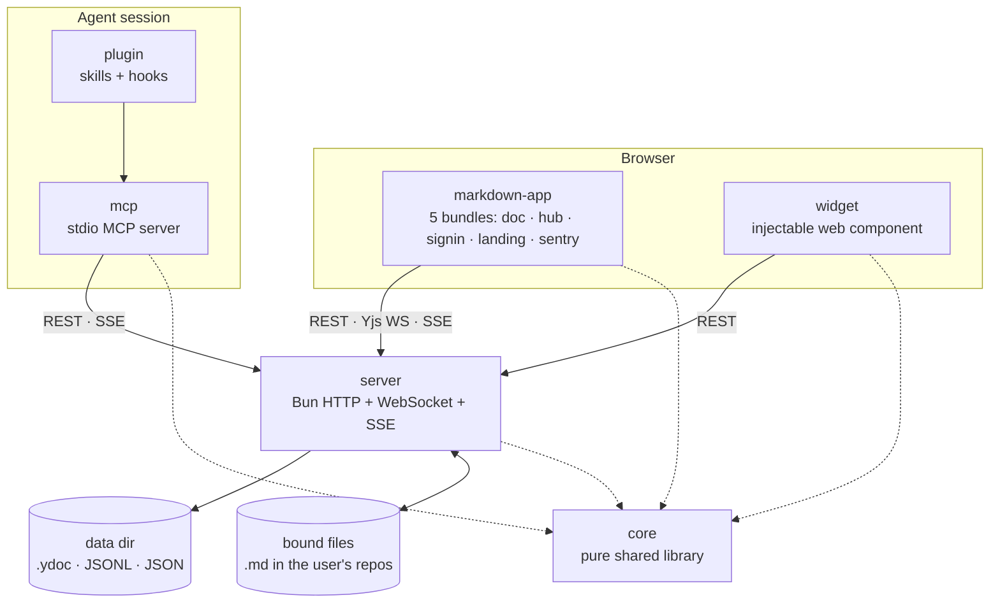
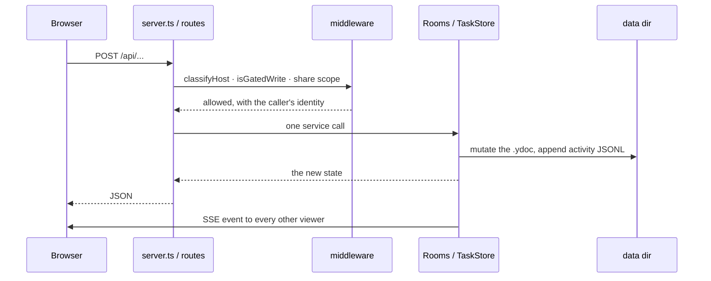
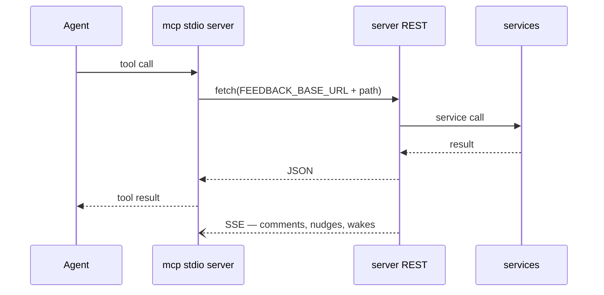
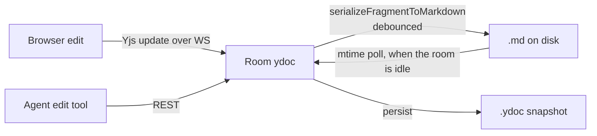
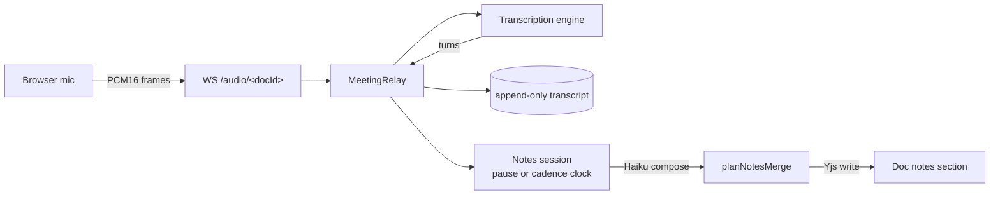

# Architecture overview

**Goal:** a person points at something and says "this", and the agent working
on it hears them within a second. Everything below exists to keep that loop
short across three surfaces — a markdown doc, a mockup or dev server, and a
board of tasks — with comment threads that survive the edits in between.

Read this before non-trivial work. It is the map: what each package is for,
which layer a new file belongs in, and which way imports are allowed to point.
The reasoning behind any individual mechanism lives in that file's own header
comment, and the per-subsystem summaries are linked at the bottom.

## The packages

| Package | What it is | Hard constraint |
|---|---|---|
| `core` | Pure shared library: wire types, the Yjs⇄markdown document model, anchors, review-item rules, goal arithmetic, prompts, path resolution. | Imports no other workspace package. No `node:` I/O beyond path math, no DOM. |
| `server` | The one process. Owns the data directory, the Yjs rooms, the board, meetings, auth, sharing, deploys. | The only writer of durable state. Everything else asks it. |
| `markdown-app` | The browser client, built into five separate bundles by `scripts/build.ts`. | Ships as static assets the server publishes as a numbered release. |
| `mcp` | The stdio MCP server agents talk to. It is a **client** of the server's REST and SSE, not a second backend. | No business logic that the server does not also enforce. |
| `widget` | The injectable comment widget for mockups and dev servers. Vanilla JS + web components. | 40 KB gzipped, enforced by `check:widget-size`. No framework deps. |
| `plugin` | The Claude Code plugin: skills, hooks, and a bundled copy of `mcp`. | Version bumped in three places; see CLAUDE.md. |

## Layers inside `server`

Six layers. **Imports point downward only.** A file may import its own layer
and every layer below it, never one above.

| Layer | Where it lives | May import | Rule in one line |
|---|---|---|---|
| **Entry / composition** | `bin.ts`, and after the split `server-config.ts` + `server-deps.ts` | everything | The only place environment variables are read and real network adapters are constructed. |
| **HTTP** | `server.ts`, `routes/**`, and after the split `shells.ts` | services, domain, infra types, core | Parse the request, call one service, format the response. Never reads env, never constructs an adapter. |
| **Request policy** | `middleware/**` | domain, core | Answers "may this request proceed on this host, as this caller" — once, for every route. |
| **Services / stores** | `rooms.ts`, `tasks.ts`, `review-items/**`, `share/**`, `auth/**`, the `meeting-*` family, `sse.ts`, `activity.ts` | domain, infra, core | Owns durable state and orchestration. Must never import a route. |
| **Domain (pure)** | `task-owner.ts`, `decision-shape.ts`, `safe-path.ts`, `diff-groups.ts`, and most of what the split extracts | core | Functions over values. No clock, no filesystem, no socket, unless passed in. |
| **Infra adapters** | `transcribe-*.ts`, `recall*.ts`, `summarize.ts`, `deploy*.ts`, `client-release.ts`, `push-notify.ts`, `share/cf-api.ts`, `share/keychain.ts`, `git-diff.ts`, `port-bind.ts`, `sentry.ts` | domain, core | One vendor or one OS facility each, behind an interface the composition root injects. |

The `routes/`, `review-items/`, `share/` and `auth/` directories are the
existing proof that this works. `routes/` handlers are
`handleXRoutes(ctx, rq) => Response | undefined`, chained by `??`, with their
dependencies named in an explicit context type rather than captured from a
closure. `review-items/store.ts` declares a nine-member persistence interface
so a test can hand it a plain object. Follow those shapes; do not invent a
new one.

## Layers inside `markdown-app`

Five layers, same downward rule. This is what makes the hub testable: the
models are DOM-free, so `hub-model.test.ts` runs without a document.

| Layer | Where it lives | Rule in one line |
|---|---|---|
| **Entries** | `app.ts`, `hub/hub-app.ts`, `signin/signin-app.ts`, `landing-app.ts`, `sentry-boot.ts` | One per bundle. The only files that call `main()` and own the top-level state object. |
| **Controllers / mounts** | `review-chrome.ts`, `meeting-strip.ts`, `redline/markup-margin.ts`, `threads.ts` | Owns a DOM subtree and, sometimes, a socket. Takes its dependencies as arguments. |
| **Renderers** | `hub/hub-render.ts`, `editor.ts`, `redline/redline-html.ts` | Data in, elements out. No fetch, no socket, no timers. |
| **Models** | `hub/hub-model.ts`, `meeting-banner-model.ts`, `hub/activity-model.ts` | Pure functions over wire types. Import `core` and nothing else in this package. |
| **Transport** | `push-client.ts`, `core`'s `ws-client.ts`, the parsers above `mountMeetingStrip` | Speaks a protocol. Returns values; never touches the DOM. |

`hub/`, `redline/`, `code/` and `signin/` are feature directories that cut
across those layers. That is intended: a feature directory holds its own
model, renderer and controller, and the layer rule still governs which of
them may import which.

## Layers inside `core`

Three tiers, bottom up: **wire types** (`types.ts`, `task-wire.ts`,
`schema.ts`) carry the shapes both sides agree on; the **document model**
(`prose.ts`, `suggest-ops.ts`, `anchor/**`, `redline.ts`) is the Yjs⇄markdown
conversion and everything anchored into it; **domain rules**
(`review-item.ts`, `goal-effort.ts`, `meeting-timing.ts`, `speaker-tags.ts`)
are the calculations both server and browser must agree on. Prompts and
machine-path helpers are leaves that import only the tier below them.

A rule lives in `core` when the browser and the server must reach the same
answer. `goal-effort.ts` is the worked example: the board recomputes the goal
bar in the browser from rows it already holds, so the arithmetic cannot live
in the server.

## The main flows

### A browser write

The route's only job is the first and last hop. A new field needs three
additions — MCP tool schema, route, service — and the route is the one
nothing type-checks, so it is the one that silently drops it. Add an
HTTP-level test through the real route for every new parameter.

### An MCP tool call

The MCP server holds no state that matters. It resolves the base URL from the
discovery file, forwards, and turns SSE frames into channel events. If a rule
exists only in `mcp`, a browser can bypass it.

### A doc edit round-trip

The file is the source of truth at rest, the live doc at runtime. Both
directions are debounced, which is why a plain `Write` to a bound file loses:
the doc reasserts itself about a second later and git still exits 0. Route
every edit to a bound file through the MCP edit tools.

### A meeting tick

The audio socket is the meeting's lifecycle: every way it can end ends the
meeting exactly once. Word-rate frames never enter the SSE replay buffer.

## Subsystem docs

Read the relevant one before touching its subsystem. None of these are
`@`-imported, so they cost no context until you open them.

- [meeting-assistant.md](meeting-assistant.md) — live transcription and notes on a pause-or-cadence clock.
- [stall-detection.md](stall-detection.md) — board wakes, what counts as stalled, and their economics.
- [goal-projection.md](goal-projection.md) — the goal bar, the remainder, and when a goal lands.
- [security.md](security.md) — the boundaries, and which gate decides each one.
- [exceptions.md](exceptions.md) — every file over 500 lines, split or excepted, one row each.
- [split-plan.md](split-plan.md) — the execution plan for the 33 files marked `Split`.

## Adding a file

1. Name its layer first. If you cannot, it is doing two jobs.
2. Check the import direction. A service importing a route, or a model
   importing the DOM, is the error the layers exist to catch.
3. Keep it under 500 lines, or add a row to `exceptions.md` saying why. CI
   fails a file that crosses the line with no row.
