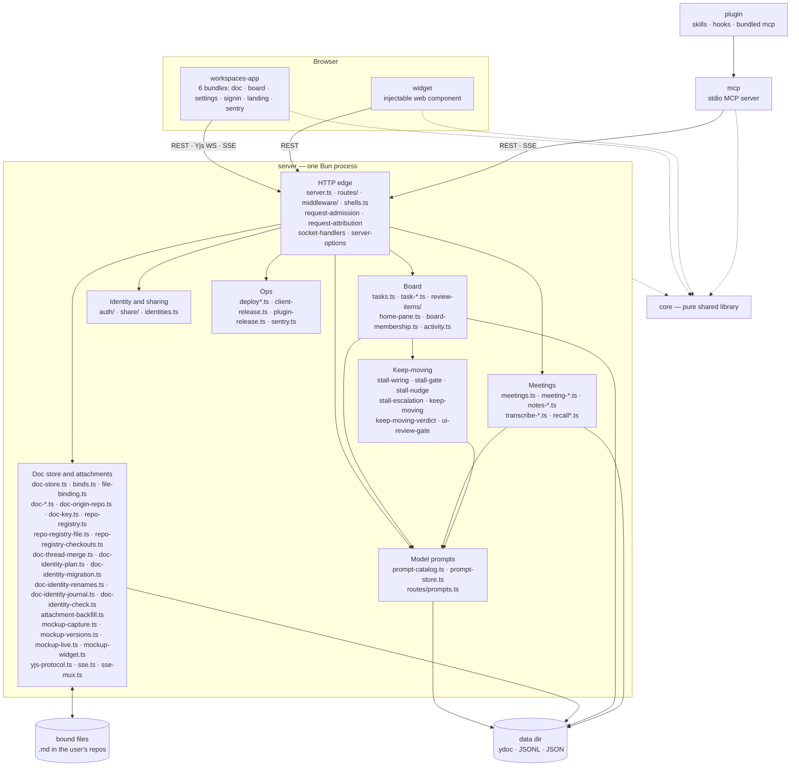
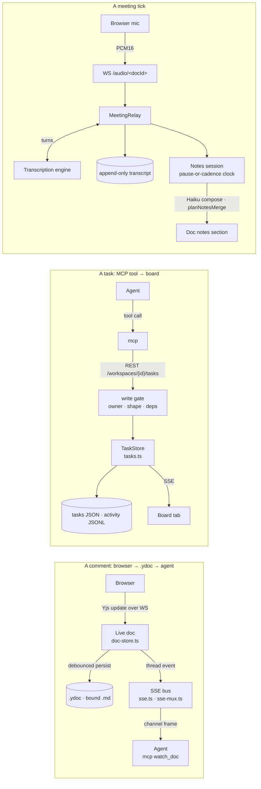

# Architecture Overview

## **Goal:** Make it easier to explore ways for human(s) to work with a team of agents to do work.

It's built on a few guiding principals or observations:

- Built for Bryan and his side projects / fractional gigs
  - *Approach*: *Start with a [local-first](https://www.inkandswitch.com/) approach that lets one primary user iterate faster with their agent fleet*
  - *Caveats: This system may or may not work for how you want to work!*
- A team of humans & agents benefit from knowing the same shared context
  - *Approach: Real-time, multiplayer space to share knowledge and streamline all important work*
- Existing APIs (and MCP) in legacy systems are evolving too slowly to explore
  - e.g. in Notion, Asana, Confluence, Jira, Linear, Figma, Github, Zoom, etc.
  - Integrating with each of these and across multiple legacy systems slows agents down
  - *Approach: Keep moving critical workflows into the workspace and synchronize with legacy tools as needed*
- Human input to make consequential decisions is becoming even more important, not less
  - *Approach*: *Make human decisions first class citizens in the architecture and make them pervasive*
  - *Approach: Try to give humans the ideal user interface where they can make decisions, in context, and just point at something and give feedback with minimal overhead*
- When our main work is review and making decisions, that work can be done from anywhere
  - *Approach: Everything works on the go from a phone, tablet, or laptop or at home on a desktop* 

## Workflows Covered by Workspaces

This project started first as a way to give real-time synchronous document, mockup, and dev server feedback between one human and a Claude Code agent.  

Over time, we've evolved this to try to cover all of these workflows and decision types in an integrated way:

- Setting goals
- Research and planning
- Prioritization against goals
- Gathering human feedback on decisions, docs, code diffs, mockups, or running apps(the original intent of this repo)
- Building, testing, peer reviewing, and deploying software products
- Having discussions

There are lots of similarities between this tool and [Claude Desktop](https://claude.com/product/claude-code), [Claude Design,](https://claude.com/product/design) [Nimbalyst](https://nimbalyst.com/), [Conductor](https://www.conductor.build/), [Ink & Switch](https://www.inkandswitch.com/), [Fireflies](https://fireflies.ai/lpv/g110-fireflies), [Notion](https://www.notion.com/), but all of these other tools are inflexible and have major gaps for my workflow.

**Goal:** one person and a team of agents share one live workspace — docs,
mockups, dev servers, a board, meetings — so giving feedback is as fast as
pointing at a thing and saying "this". Why that is worth building is
[docs/product/vision.md](../product/vision.md); this page is only how the code is
arranged. Read it before non-trivial work.

## The packages, and what is inside `server`

| Package | What it is | Hard constraint |
| --- | --- | --- |
| `core` | Wire types, the Yjs⇄markdown document model, anchors, attachment-set ids (`attachment.ts`), review-item rules, goal arithmetic, schedule rules and their English, prompts. | Imports no other workspace package. No `node:` I/O beyond path math, no DOM. |
| `server` | The one process: data dir, the doc store, board, meetings, auth, sharing, deploys. | The only writer of durable state. Everything else asks it. |
| `workspaces-app` | The browser client, six bundles from `scripts/build.ts`. | Ships as static assets the server publishes as a numbered release. |
| `mcp` | The stdio MCP server agents talk to — a **client** of the server's REST and SSE. | No business logic the server does not also enforce. |
| `widget` | The injectable comment widget for mockups and dev servers. | 40 KB gzipped (`check:widget-size`). Vanilla JS, no framework deps. |
| `plugin` | Skills, hooks, and a bundled copy of `mcp`. | Version bumped in three places; see CLAUDE.md. |

**Model prompts are a subsystem, not a scatter of literals.** Every set of
words this server sends to a model is one row of `prompt-catalog.ts`, and
`prompt-store.ts` keeps whatever the owner has rewritten in
`<dataDir>/prompts.json`. Each caller — the notes composer, the meeting
capture extractor, the voice router — takes its
instructions as a **thunk** and calls it per tick, so an edit made on
`/settings/prompts` reaches the next model call without a restart or a
deploy. The shipped default for each stays beside the code that builds the
rest of its message (`notes-prompt-store.ts`, `meeting-capture-prompt.ts`,
`voice-prompt.ts`, `core/summary-prompt.ts`), and the catalog imports them;
the store never holds a default, only an override. Two of the six are
fields on a **board** rather than on the server and keep being written
through `PUT /api/workspaces/<id>/settings` — `routes/prompts.ts` says so
with `scope` rather than serving them twice, and the client hides the split.

**Where a route lives.** Everything that decides which URL paths it answers is
under `routes/`, `server.ts` composes and delegates to it and matches nothing
itself, and imports point one way: `server.ts` → `routes/` → everything else.
So `routes/shell-static.ts` (which page or asset an address gets) and
`routes/upgrade-stream.ts` (this request wants a connection, not a response)
sit there rather than at the top level, while `request-admission.ts`,
`request-attribution.ts` and `socket-handlers.ts` stay top-level because they
run for a request whatever path it named. `server-options.ts` holds
`ServerOptions` so a route can name it without importing the router back, and
`review-gate-types.ts` holds the two verdict shapes a route and the gate both
need. Full rule: [.claude/rules/code-health.md](../../.claude/rules/code-health.md).

**And every one of those paths is written down once.** `routes/route-table.ts`
holds the vocabulary — a gate is `trusted-local`, `loopback-only`,
`share-scope`, `owner-in-handler`, `collab-scope`, `recall-callback` or `open`
— and `routes/route-table-rows.ts` holds the rows, one per path pattern.
`Bun.serve` mounts them as its `routes` object, so the table is a value the
process holds rather than a document that rots, and
[routes.md](routes.md) is the rendered copy (`bun run routes:table`). Both
files sit under `routes/` and change none of the picture above: they name URL
paths, which is what that directory is for.

The gate column is a CHECKED claim, not a comment.
`shareScopeAllows` is a pure function of the path, the method and the share, so
`test/route-table.test.ts` drives it with each row's own example address and
fails when the guard disagrees. That is what makes a route added above its
gate a CI failure: a new address under an already-allowed prefix either
declares `share-scope`, or declares `owner-in-handler` and names where the
in-route refusal lives. It cannot be filed as `trusted-local`, because the
guard would say otherwise. What the table still cannot see is whether an
`owner-in-handler` route really carries its refusal — that one is the
reviewer's, and the routes that have it carry their own tests.

Dispatch stays with the ordered chain in `server.ts` on purpose. Bun matches
by specificity; this router's order is behaviour in eight documented places,
among them the Recall status webhook immediately above the `/recall/` upgrade
and every `…/docs/:docId/meetings…` pattern above the doc resource catch-all.
So every mounted entry's handler is the same front door an unmatched address
reaches through `fetch`, and the table is the registry rather than the router.

**What runs on a clock.** Three loops in the server tick rather than answer a
request, and all three take an injected `now` so a test moves the clock
instead of waiting: the two board wakes in the Keep-moving group (the
stall tick also records `keep-moving-verdict.ts`, the PASS/FAIL measurement
of that group, off the same snapshot the wake reads, and reads
`ui-review-gate.ts` — the one finding in the group about a row that is
MOVING, an agent-filed UI row being built with nobody's answer on it —
[stall-check/](stall-check/README.md)), and
`task-scheduler.ts`, which files an instance each time a row's schedule comes
due ([scheduled-tasks](scheduled-tasks.md)) and, on the same pass, has
`task-run-record.ts` read each rule's last run back — recording the success,
and filing one review item when a rule has gone stale — and
`task-scheduled-wake.ts` get somebody onto the instance: an addressed frame
to an attached owner, one spawn request to the fleet's spawner for a detached
one, bounded retries, then a review item. What the loop reads — every rule
row with its cursor resolved, including the last change of the doc or task an
on-change rule watches — is `task-scheduler-rows.ts`. All of them join the
Board group under its `task-*.ts` glob rather than changing the picture — they
read and write the same rows through the same store, and only the clock is
new. The two
wake frames render in `mcp` through `scheduled-line.ts`, beside the other
line modules.

**A schedule rule has one spelling.** `core` holds nine modules for it and no
other package holds any: `task-schedule.ts` (the rule type and the occurrence
arithmetic), `schedule-trigger.ts` (the kind that runs on a doc or task
change, and its quiet window), `schedule-parse.ts` (a rule read off the
wire), `schedule-timezone.ts` (instant ⇄ wall clock),
`schedule-missed.ts` (what a rule wants done about an occurrence the server
missed — catch up, skip, or fold into the open catch-up that is the lock),
`schedule-run-record.ts` (what the row says about its last run, and when a
rule's last success is old enough to call it stale — one derivation the board
and the server both read), `schedule-wake.ts` (the wake's retry schedule and
what one instance's wake records, which the run record reads as answered or
not),
`schedule-phrase.ts` (a rule written as canonical English) and
`schedule-phrase-parse.ts` (English read back into a rule). The last two are a
pair and are asserted to be inverses, which is what lets the editor show one
rule as a phrase and as chips without either view being the source
([scheduled-tasks](scheduled-tasks.md)).

**A document's identity is the repo and the path, not the checkout.** Four
server modules hold that, and they sit in the doc-store group beside
`doc-origin-repo.ts` because they answer the same question one layer up.
`doc-key.ts` derives the key — the repo's origin URL (or, with no remote, its
main directory) plus the path from the repo root — reading git's plumbing
files directly rather than spawning anything. `repo-registry.ts` is the lookup
table from that key to a doc id, plus the checkouts of each repo somebody has
registered; it is a table of ALIASES, never a rename, because every component
of a key can change and a saved link must keep resolving; its file half —
the shape on disk, the atomic write, and the refusal to overwrite a registry
that did not parse — is `repo-registry-file.ts`, and its checkout rows — adding
one, retiring one softly, and listing the checkouts that exist right now — are
`repo-registry-checkouts.ts`, so the class beside them holds only the
decisions about when to write. `doc-copies.ts`
looks at all the copies one key names and says which is live, which have
drifted, and when the answer is a question rather than a value;
`doc-live-copy.ts` is the half that acts on that verdict — moving the binding,
recording drift, or refusing with a table of candidates for a person to choose
from. `routes/repos.ts` is the family that exposes the registry and that
refusal over HTTP, loopback-only for the reason the deploy route is: every
value in it is a path on this machine. Nothing here changes how a doc id is
minted — ids are still random and still minted in one place — so the picture
above is unchanged: this is a lookup in front of it.

Three more modules put the documents that already exist onto that identity,
and none of them runs on the server's own clock. `doc-identity-plan.ts` is a
pure planner — it takes the corpus as an io parameter and says which key each
document would claim, which documents would collapse onto one, and which it
cannot place — so the dry run is the same code as the run.
`doc-identity-migration.ts` is the half that touches disk: it files the
claims, copies each losing document's conversation into the winner through
`doc-thread-merge.ts`, asserts that the thread count before equals the count
after, and commits its journal and its claims together — `doc-identity-journal.ts`
holds that record and the revert that reads it back, because the journal and
the registry are written at one point and a run that cannot write one must
file neither. `doc-identity-check.ts` reads that record back long after the
run and asks whether each merged winner still holds the threads its losers
hold — read-only, and the only mode of the script that is safe with the server
up, because a write lost AFTER a run is invisible to the run's own parity
assertion. Only `doc-thread-merge.ts`
is reachable from the running server's future; the other two are driven by
`scripts/migrate-doc-identity.ts`, by hand, because a corpus walk that spawns
git and hydrates documents is not something a restart should do.
`doc-identity-renames.ts` is the fourth, split off because it is the only part
that runs a subprocess and the only part holding state between calls: one
`git log` per repository, memoized, because a corpus of thousands of documents
cannot afford one per document.

**A bound mockup is a live surface, and it keeps its rounds.** A mockup's doc
holds no content of its own — its surface is somebody's HTML file — so the four
`mockup-*.ts` modules are what make that file behave like an attachment.
`mockup-widget.ts` adds the comment widget on the way out and
`mockup-live.ts` adds the script that makes the page update itself, both at
serve time, so review scaffolding never has to live in a file a build step
writes or git tracks. `file-binding.ts` watches the source through the SAME
shared mtime sweep every bound `.md` uses — a mockup binding is watch-only,
never writes back, and touches no fragment — and hands each change up as a
`mockup.updated` frame on the doc's own channels. An open page fetches the
round it names and swaps its content in place, keeping the reader's scroll and
letting the widget re-anchor its threads onto the new DOM, so a comment whose
element is gone becomes an outdated one rather than a lost one. `mockup-capture.ts`
still keeps the single fallback copy that lets a link outlive its scratch
directory; `mockup-versions.ts` keeps the history beside it, so the page a
reviewer was looking at when he commented is still readable at `?v=<n>` after
the next round replaces it. Same link, every round — which is what a rebind
under an existing id has meant since it started destroying the page underneath
the comments.

**Which channel carries what.** *Yjs*, one WebSocket per document, carries what
two people watch change under each other's cursors: text, threads, replies,
suggestions, anchors, presence, live notes. Agents hold no replica, so an agent
edit is a REST call the server applies to the doc. *REST* carries what needs the
server as an authority — sign-in, binds, diffs, shares, deploys, and the board,
where a write is a decision with an author and a gate rather than a merged
value. *SSE* pushes changes to anyone holding no Yjs socket for them: one stream per
document at `/events/<docId>`, and one per board at
`/workspaces/<id>/events:stream`, which carries every thread event on any
member doc of that board or diff review — what an agent's `watch_doc` holds
instead of a stream per file (`routes/upgrade-stream.ts`, and
`board/board-live-wiring.ts` in `workspaces-app`). Both the colon and the
`/workspaces` prefix are deliberate, and the board stream moved to this
address on 2026-09-05 to get them: a bare `events` segment under a board path
is the activity feed's name, and a workspace id sitting outside `/workspaces`
could not be read by the guard that reads every other board path. The address
it moved off is recorded once, in [glossary.md](glossary.md).

**Board state is server-owned, and Yjs only mirrors it.** The rows live in the
sidecar-backed `TaskStore` (`tasks.ts`, JSON on disk). The `ws:<workspaceId>`
doc's `tasks` and `workspace` maps are a read-only PROJECTION of that store
(`task-projection.ts`), so the board renders in realtime without Yjs becoming
the record: the server observes those maps and reverts any transaction whose
Yjs origin is not its own `PROJECTION_ORIGIN` — firing no `task.*` event for
it, because events come only from store mutations — and reasserts the whole
projection from the store on hydrate, so a crash cannot leave forged board
state standing. `isBoardOwnedDoc` (`doc-ids.ts`) is the prefix authority for
which docs those are, `ws:` and `task:`, and none of them is ever file-bound.
That is why editing a task chip inside a document does not write the task —
the edit is reverted a moment later and the board changes only through the
named REST routes, which is the consequence [security.md](security.md) records
under "The board's own live doc is different". Task BODIES are the deliberate
exception: each is an ordinary live `task:<taskId>` doc so every edit tool,
thread and anchor applies unchanged, and the store's `body` string is a
debounced snapshot of it.

## Layers inside `server`

**Imports point downward only** — a file may import its own layer and every layer below it, never one above.

| Layer | Where it lives | Why it is its own layer |
| --- | --- | --- |
| **HTTP** | `server.ts`, `routes/**`, `middleware/**`, `shells.ts`, `request-admission.ts`, `request-attribution.ts`, `socket-handlers.ts` | The only code that knows about HTTP. Parse, admit, call one service, format. |
| **Services / stores** | `doc-store.ts`, `tasks.ts` and the `task-*` stores, `review-items/**`, `home-pane.ts`, `share/**`, `auth/**`, the `meeting-*` and `notes-*` families, `sse.ts`, `activity.ts` | Owns durable state and orchestrates one change across stores and adapters. |

`notes-timing.ts` joins the same `notes-*` family in the services tier and
changes none of the picture: it is where one meeting's per-tick latency is
recorded, opened only when the operator turns timing on. It holds no meeting
content — sizes, counts and durations — so it sits beside the notes modules
rather than with the stores that own durable text.

`notes-heading-store.ts` joins it too and changes none of the picture
either: it is the one small file per meeting that records which heading that
meeting's notes are written under, kept beside the meeting's transcript so a
restart mid-recording keeps writing under the section it opened rather than
opening a second one. Ids and a block id, no meeting words, so it sits with
`notes-timing.ts` rather than with the stores that own durable text.

`meeting-stream-set.ts` joins that services tier inside the `meeting-*`
family and moves nothing in the picture: it is the fan-out one level below
`meeting-protocol.ts`, opening an engine session per audio stream and folding
two engines' independent turn numbering and speaker labels back into the one
transcript a meeting keeps. The relay still owns the lifecycle; this owns only
what two sessions collide on.

The `notes-quality-*` family joins the same services tier and adds no new box
to the picture: `notes-quality-report.ts` and `notes-quality-thresholds.ts`
are pure (they read a markdown string and a transcript and answer counts, so
they belong beside `notes-edit-parse.ts` in the domain row on everything but
their filename), `notes-quality-store.ts` and `notes-tick-timing.ts` read and
write under the data dir the way the rest of the `meeting-*` family does, and
`notes-quality-review.ts` and `notes-quality-pass.ts` are the orchestration a
meeting's stop runs — read the notes, judge them, store the reading, file a
bad one on the row the doc belongs to. Nothing under `routes/` is added: the
week's rollup rides the existing `GET /api/metrics` reply, for the reason
`uptimeSec` does.
| **Domain (pure)** | `task-owner.ts`, `task-fields.ts`, `task-row.ts`, `decision-shape.ts`, `safe-path.ts`, `workspace-path.ts`, `path-params.ts`, `diff-groups.ts`, `pause-ticker.ts`, `keep-moving.ts`, `stall-gate.ts`, `ui-review-gate.ts`, `notes-edit-parse.ts`, `notes-research-placeholder.ts`, `ask-detection.ts`, `notes-link-intent.ts` | Functions over values: no clock, filesystem or socket unless passed in, so a rule is testable without a server. |
| **Adapters** | `transcribe-*.ts`, `recall*.ts`, `google-oauth.ts`, `summarize.ts`, `deploy*.ts`, `client-release.ts`, `push-notify.ts`, `share/cf-api.ts`, `share/keychain.ts`, `git-diff.ts`, `sentry.ts` | One vendor or OS facility each, behind an injected interface, so a swap or a test double touches one file and no state. |
| *Composition root* | `bin.ts`, `server-config.ts`, `server-deps.ts` | Reads the environment once, builds adapters, wires services. Beside the stack, not on top of it. |

`path-params.ts` joins that row for the same reason and from the same problem:
it decodes one path segment, answering rather than throwing on a stray `%`, and
`server.ts` calls it once at the front door so no route can be reached with a
segment it would die on. Pure by construction — a string in, a string or
`undefined` out — which is why it sits here and not beside the HTTP code that
happens to be its only caller today.

`workspace-path.ts` is the newest name in that row and it sat under `routes/`
until the canonical-routes cutover. It parses `/workspaces/<id>/…` and holds the
one list of which of those addresses are HTML pages — and the reason it moved is
that it now has TWO readers on opposite sides of the import rule:
`routes/shell-static.ts`, which serves those pages, and
`middleware/workspace-scope.ts`, which must pass them over. It answers no
request and returns no `Response`, so it belongs beside the other functions over
values; leaving it in `routes/` would have meant a module outside `routes/`
importing out of it, which is the direction `check:imports` exists to refuse.

`workspaces-app` layers the same way — entries, controllers, views, models,
transport — and its models are DOM-free, which is what lets `board/board-model.ts`,
`board/board-review-model.ts` and `board/board-presence-model.ts` be tested without a
document. `suggestions/` sits in the editor tier rather than inside `redline/`,
because Redline is the change view and a suggestion is the proposal: the chip
and the doc-level pending badge render on the plain markdown surface and on the
board's task-body editor, neither of which mounts a redline module. `new-indicator.ts` sits in the view tier as the doc's one report of what the reader has not seen: `comment-hints.ts` measures (threads off screen, and the tinted note blocks `settle-wash.ts` marks) and this draws the two pills. It replaced four controls that counted overlapping halves of that fact — the edge markers, the off-screen hints and the top bar's asks chip — so `recent-note-markers.ts` is gone. `recent-note-cards.ts` joins the same family for the wide layout's other half: it builds and ages the "who wrote this, and when" card and hands it to `redline/markup-margin.ts` to PLACE, which is the one direction that keeps a single stacking pass over the balloon column. `meeting-live-hold.ts` joins the meeting family in that same view tier and
changes none of the picture: it is one screenful of geometry that
`meeting-live-zone.ts` owned until the zone crossed 500 lines, holding the
live transcript still across the frame a settled chunk splits off on. Nothing
but the zone imports it. `meeting-speaker-pill.ts` joins it in the same tier
for the same reason — the zone is back on the 500-line bar — and holds one
decision that is not the zone's: a speaker pill is a rename BUTTON where
somebody handed in a way to record a name and the plain span it always was
where nobody did. Nothing but the zone imports it either, today; the strip's
own pill (`meeting-feed.ts`) is the obvious second caller. `meeting-source.ts` sits beside `meeting-audio.ts` in the same family and changes none of the picture: it is where the strip's chosen source — the microphone, or the Mac's own audio through Chrome's share picker — becomes a media stream, split out because the capture module sits on the 500-line bar. `meeting-capture-set.ts` joins that family for the meeting that opens BOTH: it is the tier above one capture, opening each stream in turn and deciding what a meeting runs on when only one of the two doors was answered. It changes no layer — it is a view-tier module calling the same `startMeetingCapture` a single-source meeting always did — and it is named here because the strip now talks to it rather than to the capture directly. `meeting-reconnect.ts` joins the same family one tier below the strip and changes no layer either: it is the policy a dropped audio socket is retried under — how long to wait, when to stop waiting, and the two sentences the strip shows while it happens — with no DOM, no socket and no timer in it, so `meeting-strip.ts` owns the doing and this owns the deciding. `notes-link-affordance.ts` joins the editor tier beside
`task-link-chips.ts`, and is the one plugin there that WRITES: the chips are
render-time and change nothing, while accepting a note's suggestion or undoing
a link edits the stored doc and calls the board. `core` is three tiers: wire types, the document model (`prose-*.ts`,
`anchor/**`, `redline.ts`), then the rules both sides must compute identically
(`review-item*.ts`, `effort-*.ts`, `goal-effort.ts`, and
`note-suggestion.ts`, which is how a note's written "did you mean this row?"
is spelled — server writes it, browser reads it back, one definition so the
two cannot drift into a suggestion nobody can accept).

`meeting-streams.ts` belongs to core's wire-types tier beside `meeting.ts`, and
is there for the usual core reason: a two-stream meeting's group names and
namespaced speaker labels are rendered by the browser, written by the server
and read back by the notes composer, so one spelling has to serve three
processes.

`footnotes.ts` belongs to that document-model tier too and does not move the
picture: it is the grammar of a `^[a note]` inline footnote — where the notes
are in a line, whether the author wrote "Unconfirmed", and which words a note
is about. Nothing about a footnote is stored, so this is a pure text question
asked at parse time (the inline parser skips a note's body rather than reading
citation punctuation as emphasis) and again at render time by the editor's
decoration plugin, which is why the answer lives in `core` rather than in
either caller.

`prose-integrity.ts` belongs to that document-model tier and does not move the
picture: it is the check the server runs after a write, asserting the live doc
holds no markdown syntax that should have become blocks. It is named here so the
next reader knows a new `prose-*` module was placed rather than missed.

`prose-identity.ts`, `prose-outline.ts` and `prose-batch.ts` join that same
document-model tier, and together they are how an agent addresses a block
rather than a region of text. `prose-identity.ts` is the leaf that names the
two attributes a block can carry — its stable id, and the agent that wrote it.
`prose-outline.ts` reads a document as a list of those ids with their headings
and text, and installs the observer that drops the authorship attribute the
moment a person edits the block. `prose-batch.ts` applies a list of scoped
edits in one transaction, refusing to rewrite what the agent no longer owns and
raising a suggestion instead. Server-side they are reached through
`doc-outline-ops.ts`, which sits beside `doc-edit-ops.ts` in the services tier
for the reason that module already gives: `doc-edit-ops.ts` was at the
500-line bar, and the outline verbs are a family of their own.

The note-taker is the first caller and deliberately not a privileged one. It
holds no private write path into a document: it reads an outline and posts
block edits through the same `DocStore` verbs the MCP tools expose, which is
why the modules that used to give it one — a section finder, an ownership
ledger, a whole-section merge planner — are gone rather than moved.

## The core flows

The file is the source of truth at rest, the live doc at runtime, both
directions debounced — which is why a plain `Write` to a bound file loses: the
doc reasserts itself a second later while git still exits 0. A new field needs
three additions, MCP tool schema, route and service, and the route is the one
nothing type-checks, so add an HTTP-level test for every new parameter. The
audio socket is the meeting's lifecycle: every way it can end ends the meeting
exactly once, and nothing word-rate enters the SSE buffer.

## Subsystem docs

- [meeting-assistant.md](meeting-assistant.md) — live transcription and notes on a pause-or-cadence clock.
- [stall-check/](stall-check/README.md) — the stall check's design, what "working" means, and per-module criteria; [stall-detection.md](stall-detection.md) is the mechanics as they run today and why each layer exists.
- [goal-projection.md](goal-projection.md) — the goal bar, the remainder, and when a goal lands.
- [security.md](security.md) — the boundaries, and which gate decides each one.
- [routes.md](routes.md) — every front-door path pattern and the gate it sits behind, generated from `routes/route-table-rows.ts`.
- [glossary.md](glossary.md) — the nouns, once each; [exceptions.md](exceptions.md) — every file over 500 lines, split or excepted, with [split-plan.md](split-plan.md) as its queue.

## Adding a file

1. Name its layer first. If you cannot, it is doing two jobs.
2. Check the import direction. A service importing a route, or a model
   importing the DOM, is the error the layers exist to catch.
3. Keep it under 500 lines, or add a row to `exceptions.md` saying why —
   `bun run loc:audit` fails a file that crosses the line with no row.
4. If it is a **top-level** module — a file or directory sitting directly in
   `packages/<pkg>/src/` — redraw the diagram above in the same PR.
   `bun run check:architecture` fails a PR that moves that map without it.
5. In `server`, if it names a URL path it goes under `routes/`; if it runs for
   every request whatever the path, or never sees a `Request`, it stays at the
   top level. The rule and its two consequences are
   [.claude/rules/code-health.md](../../.claude/rules/code-health.md), "A route
   lives in `routes/`", and `bun run check:imports` fails the import edges it
   forbids.
