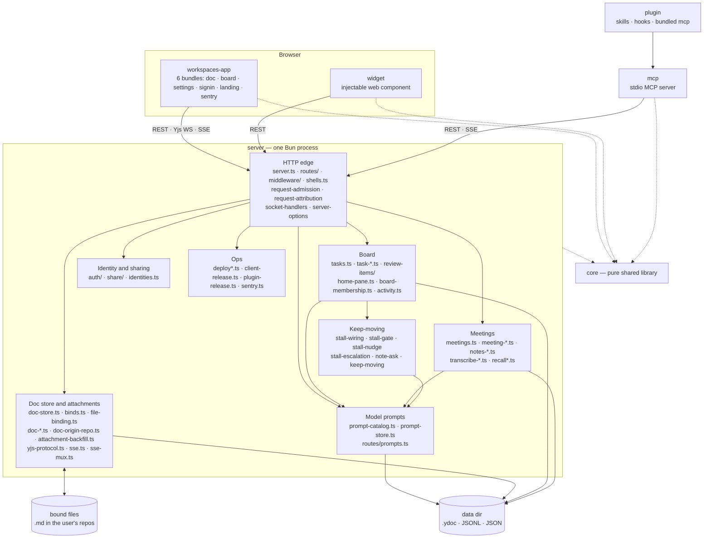
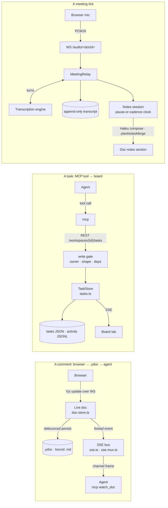

# Architecture Overview

## **Goal:** Make it easier to explore ways for human(s) to work with a team of agents to do work.

It's built on a few guiding principals or observations:

- Built for Bryan and his side projects / fractional gigs
  - *Approach*: *Start with a [local-first](https://www.inkandswitch.com/) approach that lets one primary user iterate faster with their agent fleet*
  - *Caveats: This system may or may not work for how you want to work!*
- A team of humans & agents benefit from knowing the same shared context
  - *Approach: Real-time, multiplayer space to share knowledge and streamline all important work*
- Existing APIs (and MCP) in legacy systems are evolving too slowly to explore
  - e.g. in Notion, Asana, Confluence, Jira, Linear, Figma, Github, Zoom, etc.
  - Integrating with each of these and across multiple legacy systems slows agents down
  - *Approach: Keep moving critical workflows into the workspace and synchronize with legacy tools as needed*
- Human input to make consequential decisions is becoming even more important, not less
  - *Approach*: *Make human decisions first class citizens in the architecture and make them pervasive*
  - *Approach: Try to give humans the ideal user interface where they can make decisions, in context, and just point at something and give feedback with minimal overhead*
- When our main work is review and making decisions, that work can be done from anywhere
  - *Approach: Everything works on the go from a phone, tablet, or laptop or at home on a desktop* 

## Workflows Covered by Workspaces

This project started first as a way to give real-time synchronous document, mockup, and dev server feedback between one human and a Claude Code agent.  

Over time, we've evolved this to try to cover all of these workflows and decision types in an integrated way:

- Setting goals
- Research and planning
- Prioritization against goals
- Gathering human feedback on decisions, docs, code diffs, mockups, or running apps(the original intent of this repo)
- Building, testing, peer reviewing, and deploying software products
- Having discussions

There are lots of similarities between this tool and [Claude Desktop](https://claude.com/product/claude-code), [Claude Design,](https://claude.com/product/design) [Nimbalyst](https://nimbalyst.com/), [Conductor](https://www.conductor.build/), [Ink & Switch](https://www.inkandswitch.com/), [Fireflies](https://fireflies.ai/lpv/g110-fireflies), [Notion](https://www.notion.com/), but all of these other tools are inflexible and have major gaps for my workflow.

**Goal:** one person and a team of agents share one live workspace — docs,
mockups, dev servers, a board, meetings — so giving feedback is as fast as
pointing at a thing and saying "this". Why that is worth building is
[docs/product/vision.md](../product/vision.md); this page is only how the code is
arranged. Read it before non-trivial work.

## The packages, and what is inside `server`

| Package | What it is | Hard constraint |
| --- | --- | --- |
| `core` | Wire types, the Yjs⇄markdown document model, anchors, attachment-set ids (`attachment.ts`), review-item rules, goal arithmetic, schedule rules and their English, prompts. | Imports no other workspace package. No `node:` I/O beyond path math, no DOM. |
| `server` | The one process: data dir, the doc store, board, meetings, auth, sharing, deploys. | The only writer of durable state. Everything else asks it. |
| `workspaces-app` | The browser client, six bundles from `scripts/build.ts`. | Ships as static assets the server publishes as a numbered release. |
| `mcp` | The stdio MCP server agents talk to — a **client** of the server's REST and SSE. | No business logic the server does not also enforce. |
| `widget` | The injectable comment widget for mockups and dev servers. | 40 KB gzipped (`check:widget-size`). Vanilla JS, no framework deps. |
| `plugin` | Skills, hooks, and a bundled copy of `mcp`. | Version bumped in three places; see CLAUDE.md. |

**Model prompts are a subsystem, not a scatter of literals.** Every set of
words this server sends to a model is one row of `prompt-catalog.ts`, and
`prompt-store.ts` keeps whatever the owner has rewritten in
`<dataDir>/prompts.json`. Each caller — the notes composer, the meeting
capture extractor, the note-ask judge, the voice router — takes its
instructions as a **thunk** and calls it per tick, so an edit made on
`/settings/prompts` reaches the next model call without a restart or a
deploy. The shipped default for each stays beside the code that builds the
rest of its message (`notes-prompt-store.ts`, `meeting-capture-prompt.ts`,
`voice-prompt.ts`, `core/summary-prompt.ts`), and the catalog imports them;
the store never holds a default, only an override. Two of the seven are
fields on a **board** rather than on the server and keep being written
through `PUT /api/workspaces/<id>/settings` — `routes/prompts.ts` says so
with `scope` rather than serving them twice, and the client hides the split.

**Where a route lives.** Everything that decides which URL paths it answers is
under `routes/`, `server.ts` composes and delegates to it and matches nothing
itself, and imports point one way: `server.ts` → `routes/` → everything else.
So `routes/shell-static.ts` (which page or asset an address gets) and
`routes/upgrade-stream.ts` (this request wants a connection, not a response)
sit there rather than at the top level, while `request-admission.ts`,
`request-attribution.ts` and `socket-handlers.ts` stay top-level because they
run for a request whatever path it named. `server-options.ts` holds
`ServerOptions` so a route can name it without importing the router back, and
`review-gate-types.ts` holds the two verdict shapes a route and the gate both
need. Full rule: [.claude/rules/code-health.md](../../.claude/rules/code-health.md).

**What runs on a clock.** Three loops in the server tick rather than answer a
request, and all three take an injected `now` so a test moves the clock
instead of waiting: the two board wakes in the Keep-moving group, and
`task-scheduler.ts`, which files an instance each time a row's schedule comes
due ([scheduled-tasks](scheduled-tasks.md)). The scheduler joins the Board
group under its `task-*.ts` glob rather than changing the picture — it reads
and writes the same rows through the same store, and only its clock is new.

**A schedule rule has one spelling.** `core` holds four modules for it and no
other package holds any: `task-schedule.ts` (the rule type and the occurrence
arithmetic), `schedule-timezone.ts` (instant ⇄ wall clock),
`schedule-phrase.ts` (a rule written as canonical English) and
`schedule-phrase-parse.ts` (English read back into a rule). The last two are a
pair and are asserted to be inverses, which is what lets the editor show one
rule as a phrase and as chips without either view being the source
([scheduled-tasks](scheduled-tasks.md)).

**Which channel carries what.** *Yjs*, one WebSocket per document, carries what
two people watch change under each other's cursors: text, threads, replies,
suggestions, anchors, presence, live notes. Agents hold no replica, so an agent
edit is a REST call the server applies to the doc. *REST* carries what needs the
server as an authority — sign-in, binds, diffs, shares, deploys, and the board,
where a write is a decision with an author and a gate rather than a merged
value. *SSE* pushes changes to anyone holding no Yjs socket for them: one stream per
document at `/events/<docId>`, and one per board at
`/workspaces/<id>/events:stream`, which carries every thread event on any
member doc of that board or diff review — what an agent's `watch_doc` holds
instead of a stream per file (`routes/upgrade-stream.ts`, and
`board/board-live-wiring.ts` in `workspaces-app`). Both the colon and the
`/workspaces` prefix are deliberate, and the board stream moved to this
address on 2026-09-05 to get them: a bare `events` segment under a board path
is the activity feed's name, and a workspace id sitting outside `/workspaces`
could not be read by the guard that reads every other board path. The address
it moved off is recorded once, in [glossary.md](glossary.md).

**Board state is server-owned, and Yjs only mirrors it.** The rows live in the
sidecar-backed `TaskStore` (`tasks.ts`, JSON on disk). The `ws:<workspaceId>`
doc's `tasks` and `workspace` maps are a read-only PROJECTION of that store
(`task-projection.ts`), so the board renders in realtime without Yjs becoming
the record: the server observes those maps and reverts any transaction whose
Yjs origin is not its own `PROJECTION_ORIGIN` — firing no `task.*` event for
it, because events come only from store mutations — and reasserts the whole
projection from the store on hydrate, so a crash cannot leave forged board
state standing. `isBoardOwnedDoc` (`doc-ids.ts`) is the prefix authority for
which docs those are, `ws:` and `task:`, and none of them is ever file-bound.
That is why editing a task chip inside a document does not write the task —
the edit is reverted a moment later and the board changes only through the
named REST routes, which is the consequence [security.md](security.md) records
under "The board's own live doc is different". Task BODIES are the deliberate
exception: each is an ordinary live `task:<taskId>` doc so every edit tool,
thread and anchor applies unchanged, and the store's `body` string is a
debounced snapshot of it.

## Layers inside `server`

**Imports point downward only** — a file may import its own layer and every layer below it, never one above.

| Layer | Where it lives | Why it is its own layer |
| --- | --- | --- |
| **HTTP** | `server.ts`, `routes/**`, `middleware/**`, `shells.ts`, `request-admission.ts`, `request-attribution.ts`, `socket-handlers.ts` | The only code that knows about HTTP. Parse, admit, call one service, format. |
| **Services / stores** | `doc-store.ts`, `tasks.ts` and the `task-*` stores, `review-items/**`, `home-pane.ts`, `share/**`, `auth/**`, the `meeting-*` and `notes-*` families, `sse.ts`, `activity.ts` | Owns durable state and orchestrates one change across stores and adapters. |
| **Domain (pure)** | `task-owner.ts`, `task-fields.ts`, `task-row.ts`, `decision-shape.ts`, `safe-path.ts`, `workspace-path.ts`, `path-params.ts`, `diff-groups.ts`, `pause-ticker.ts`, `keep-moving.ts`, `stall-gate.ts`, `notes-section.ts`, `ask-detection.ts`, `notes-link-intent.ts` | Functions over values: no clock, filesystem or socket unless passed in, so a rule is testable without a server. |
| **Adapters** | `transcribe-*.ts`, `recall*.ts`, `google-oauth.ts`, `summarize.ts`, `deploy*.ts`, `client-release.ts`, `push-notify.ts`, `share/cf-api.ts`, `share/keychain.ts`, `git-diff.ts`, `sentry.ts` | One vendor or OS facility each, behind an injected interface, so a swap or a test double touches one file and no state. |
| *Composition root* | `bin.ts`, `server-config.ts`, `server-deps.ts` | Reads the environment once, builds adapters, wires services. Beside the stack, not on top of it. |

`path-params.ts` joins that row for the same reason and from the same problem:
it decodes one path segment, answering rather than throwing on a stray `%`, and
`server.ts` calls it once at the front door so no route can be reached with a
segment it would die on. Pure by construction — a string in, a string or
`undefined` out — which is why it sits here and not beside the HTTP code that
happens to be its only caller today.

`workspace-path.ts` is the newest name in that row and it sat under `routes/`
until the canonical-routes cutover. It parses `/workspaces/<id>/…` and holds the
one list of which of those addresses are HTML pages — and the reason it moved is
that it now has TWO readers on opposite sides of the import rule:
`routes/shell-static.ts`, which serves those pages, and
`middleware/workspace-scope.ts`, which must pass them over. It answers no
request and returns no `Response`, so it belongs beside the other functions over
values; leaving it in `routes/` would have meant a module outside `routes/`
importing out of it, which is the direction `check:imports` exists to refuse.

`workspaces-app` layers the same way — entries, controllers, views, models,
transport — and its models are DOM-free, which is what lets `board/board-model.ts`,
`board/board-review-model.ts` and `board/board-presence-model.ts` be tested without a
document. `suggestions/` sits in the editor tier rather than inside `redline/`,
because Redline is the change view and a suggestion is the proposal: the chip
and the doc-level pending badge render on the plain markdown surface and on the
board's task-body editor, neither of which mounts a redline module. `recent-note-markers.ts` sits beside `settle-wash.ts` in the meeting family: the tint marks a fresh note where it landed, the markers say how many such notes are off screen. `meeting-live-hold.ts` joins the meeting family in that same view tier and
changes none of the picture: it is one screenful of geometry that
`meeting-live-zone.ts` owned until the zone crossed 500 lines, holding the
live transcript still across the frame a settled chunk splits off on. Nothing
but the zone imports it. `notes-link-affordance.ts` joins the editor tier beside
`task-link-chips.ts`, and is the one plugin there that WRITES: the chips are
render-time and change nothing, while accepting a note's suggestion or undoing
a link edits the stored doc and calls the board. `core` is three tiers: wire types, the document model (`prose-*.ts`,
`anchor/**`, `redline.ts`), then the rules both sides must compute identically
(`review-item*.ts`, `effort-*.ts`, `goal-effort.ts`, and
`note-suggestion.ts`, which is how a note's written "did you mean this row?"
is spelled — server writes it, browser reads it back, one definition so the
two cannot drift into a suggestion nobody can accept).

`prose-integrity.ts` belongs to that document-model tier and does not move the
picture: it is the check the server runs after a write, asserting the live doc
holds no markdown syntax that should have become blocks. It is named here so the
next reader knows a new `prose-*` module was placed rather than missed.

## The core flows

The file is the source of truth at rest, the live doc at runtime, both
directions debounced — which is why a plain `Write` to a bound file loses: the
doc reasserts itself a second later while git still exits 0. A new field needs
three additions, MCP tool schema, route and service, and the route is the one
nothing type-checks, so add an HTTP-level test for every new parameter. The
audio socket is the meeting's lifecycle: every way it can end ends the meeting
exactly once, and nothing word-rate enters the SSE buffer.

## Subsystem docs

- [meeting-assistant.md](meeting-assistant.md) — live transcription and notes on a pause-or-cadence clock.
- [stall-detection.md](stall-detection.md) — board wakes, what counts as stalled, and their economics.
- [goal-projection.md](goal-projection.md) — the goal bar, the remainder, and when a goal lands.
- [security.md](security.md) — the boundaries, and which gate decides each one.
- [glossary.md](glossary.md) — the nouns, once each; [exceptions.md](exceptions.md) — every file over 500 lines, split or excepted, with [split-plan.md](split-plan.md) as its queue.

## Adding a file

1. Name its layer first. If you cannot, it is doing two jobs.
2. Check the import direction. A service importing a route, or a model
   importing the DOM, is the error the layers exist to catch.
3. Keep it under 500 lines, or add a row to `exceptions.md` saying why —
   `bun run loc:audit` fails a file that crosses the line with no row.
4. If it is a **top-level** module — a file or directory sitting directly in
   `packages/<pkg>/src/` — redraw the diagram above in the same PR.
   `bun run check:architecture` fails a PR that moves that map without it.
5. In `server`, if it names a URL path it goes under `routes/`; if it runs for
   every request whatever the path, or never sees a `Request`, it stays at the
   top level. The rule and its two consequences are
   [.claude/rules/code-health.md](../../.claude/rules/code-health.md), "A route
   lives in `routes/`", and `bun run check:imports` fails the import edges it
   forbids.
