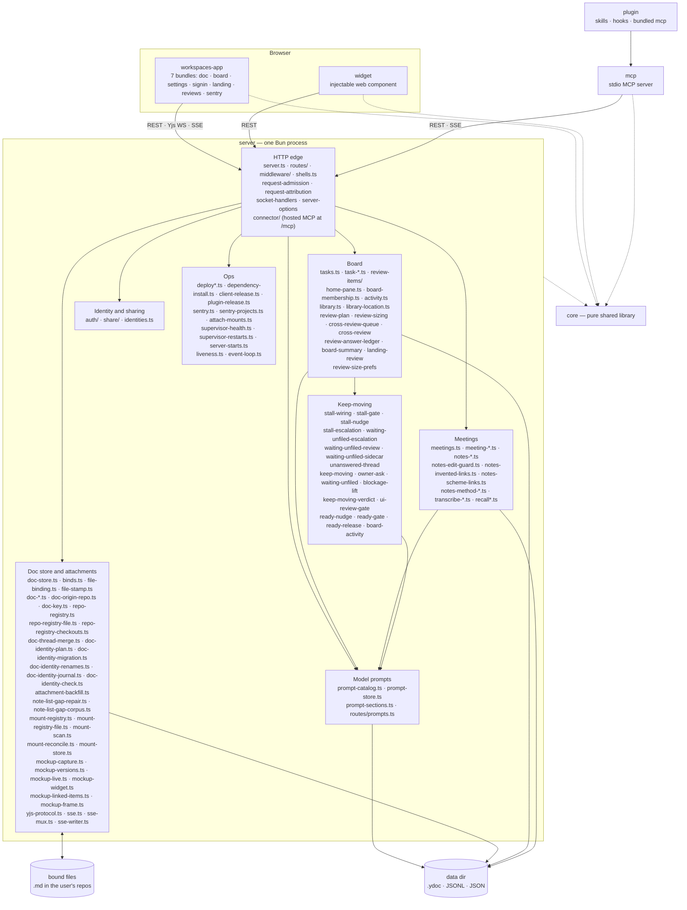
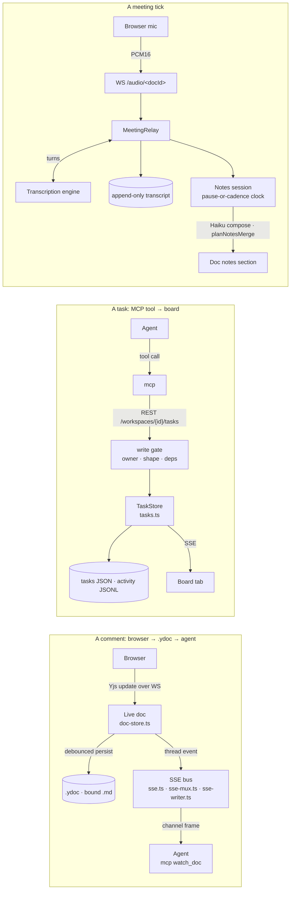

# Architecture Overview

## **Goal:** Make it easier to explore ways for human(s) to work with a team of agents to do work.

It's built on a few guiding principals or observations:

- Built for Bryan and his side projects / fractional gigs
  - *Approach*: *Start with a [local-first](https://www.inkandswitch.com/) approach that lets one primary user iterate faster with their agent fleet*
  - *Caveats: This system may or may not work for how you want to work!*
- A team of humans & agents benefit from knowing the same shared context
  - *Approach: Real-time, multiplayer space to share knowledge and streamline all important work*
- Existing APIs (and MCP) in legacy systems are evolving too slowly to explore
  - e.g. in Notion, Asana, Confluence, Jira, Linear, Figma, Github, Zoom, etc.
  - Integrating with each of these and across multiple legacy systems slows agents down
  - *Approach: Keep moving critical workflows into the workspace and synchronize with legacy tools as needed*
- Human input to make consequential decisions is becoming even more important, not less
  - *Approach*: *Make human decisions first class citizens in the architecture and make them pervasive*
  - *Approach: Try to give humans the ideal user interface where they can make decisions, in context, and just point at something and give feedback with minimal overhead*
- When our main work is review and making decisions, that work can be done from anywhere
  - *Approach: Everything works on the go from a phone, tablet, or laptop or at home on a desktop* 

## Workflows Covered by Workspaces

This project started first as a way to give real-time synchronous document, mockup, and dev server feedback between one human and a Claude Code agent.  

Over time, we've evolved this to try to cover all of these workflows and decision types in an integrated way:

- Setting goals
- Research and planning
- Prioritization against goals
- Gathering human feedback on decisions, docs, code diffs, mockups, or running apps(the original intent of this repo)
- Building, testing, peer reviewing, and deploying software products
- Having discussions

There are lots of similarities between this tool and [Claude Desktop](https://claude.com/product/claude-code), [Claude Design,](https://claude.com/product/design) [Nimbalyst](https://nimbalyst.com/), [Conductor](https://www.conductor.build/), [Ink & Switch](https://www.inkandswitch.com/), [Fireflies](https://fireflies.ai/lpv/g110-fireflies), [Notion](https://www.notion.com/), but all of these other tools are inflexible and have major gaps for my workflow.

**Goal:** one person and a team of agents share one live workspace — docs,
mockups, dev servers, a board, meetings — so giving feedback is as fast as
pointing at a thing and saying "this". Why that is worth building is
[docs/product/vision.md](../product/vision.md); this page is only how the code is
arranged. Read it before non-trivial work.

## The packages, and what is inside `server`

| Package | What it is | Hard constraint |
| --- | --- | --- |
| `core` | Wire types, the Yjs⇄markdown document model, anchors, attachment-set ids (`attachment.ts`), review-item rules, goal arithmetic, schedule rules and their English, prompts. | Imports no other workspace package. No `node:` I/O beyond path math, no DOM. |
| `server` | The one process: data dir, the doc store, board, meetings, auth, sharing, deploys. | The only writer of durable state. Everything else asks it. |
| `workspaces-app` | The browser client, six bundles from `scripts/build.ts`. | Ships as static assets the server publishes as a numbered release. |
| `mcp` | The stdio MCP server agents talk to — a **client** of the server's REST and SSE. Its per-session wiring is `connector-session.ts`, which the server also hosts, one per agent, working directory and default board, behind `/mcp` (`server/src/connector/`). | No business logic the server does not also enforce. |
| `widget` | The injectable comment widget for mockups and dev servers. The board imports it into its own bundle rather than loading `/widget.esm.js`, because that bundle carries its own Yjs and a page must run one copy (`check:client-boot` counts them). `widget-iife.ts` is only the script-tag bundle's entry: it imports `widget.ts` and exports nothing. | 40 KB gzipped (`check:widget-size`). Vanilla JS, no framework deps. |
| `plugin` | Skills, hooks, and a bundled copy of `mcp`. | Version bumped in three places; see CLAUDE.md. |

**A traced request is named by its route, and the table of routes is
checked.** Both sides send Sentry events, and neither may send a raw path: a
span or transaction name goes through `routePatternForSpan`
(`core/src/route-templates.ts`), which matches the path against every route
this server has as a whole-path template and collapses every segment it
cannot place to `:id`. The degrade is safe by construction, so the risk is not
a leak but a NAME: a route missing from the table arrives as `/:id/:id/:id`
alongside unrelated ones, and Sentry's N+1 detector reads two different calls
as one call twice. `packages/server/test/span-route-names.test.ts` walks
`ROUTE_TABLE` and fails on any fixed-length route the table cannot name, so
the list stays whole without anyone remembering to extend it. The scrub floors
either side of it — key-targeted, then id-shaped — stay in
`core/src/trace-privacy.ts`, which re-exports the function.

**Two callers wanting the same thing share one read.** The board shell mounts
`<meeting-banner>` in each pane, so the calendar read is
`workspaces-app/src/calendar-events-source.ts` rather than the element: it
hands a second caller the request already in flight and forgets it the moment
that round settles, which is a shared read and not a cache with a lifetime.
`link-titles.ts` holds the same shape for its lookup POST, keyed per URL.

**The MCP connector can run inside the server.** `server/src/connector/` hosts
the same `connector-session.ts` the stdio child builds, one per agent,
working directory and default board, behind `/mcp` (Streamable HTTP, loopback only). It is the
one place `server` imports from `packages/mcp/src`, and the direction is
deliberate: the connector is the mcp package's code, and the server only
supplies its two seams — REST over a loopback socket, so every route gate
sees what it saw from the child, and the event stream opened in-process, so
an agent the previous process was hosting is subscribed again before the
first request after a restart. The plugin still launches the stdio child;
switching `.mcp.json` to `/mcp` is a separate change.

**Model prompts are a subsystem, not a scatter of literals.** Every set of
words this server sends to a model is one row of `prompt-catalog.ts`, and
`prompt-store.ts` keeps whatever the owner has rewritten in
`<dataDir>/prompts.json`. Each caller — the notes composer, the meeting
capture extractor, the voice router — takes its
instructions as a **thunk** and calls it per tick, so an edit made on
`/settings/prompts` reaches the next model call without a restart or a
deploy. The shipped default for each stays beside the code that builds the
rest of its message (`notes-prompt-store.ts`, `meeting-capture-prompt.ts`,
`voice-prompt.ts`, `core/summary-prompt.ts`), and the catalog imports them;
the store never holds a default, only an override. The notes composer's own
half of that — assembling the tick's whole prompt — came out to
`notes-prompt-build.ts` when the compose started taking a prompt cache: it
returns the prompt already split at the line the cache breakpoint is taken
on, and `meeting-notes-composer.ts` is left with the HTTP seam.
`notes-prompt-cache-shape.ts` sits beside them as an instrument rather than a
step: it holds the previous tick's block digests so the timing row can say
whether a tick that read nothing had a prefix that MOVED or one still under
the model's minimum cacheable length. It changes no prompt and no breakpoint,
which is why it is not drawn in the flow. Two of the six are
fields on a **board** rather than on the server and keep being written
through `PUT /api/workspaces/<id>/settings` — `routes/prompts.ts` says so
with `scope` rather than serving them twice, and the client hides the split.

Every default is **markdown with `###` sections** (2026-09-11), and a caller
that changes a prompt before it goes out does it by heading, never by an
exact sentence: `prompt-sections.ts` cuts, replaces and appends whole
sections, so a solo meeting drops `### Speakers and links` and a ledger
method swaps `### Grouping` however the owner has reworded their bodies.
`prompt-markdown-migration.ts` is the one-shot move of stored overrides onto
those defaults — an override that is an old default word for word is
soft-cleared, any other is kept and marked "written before markdown" — run
by `prompt-store.ts` on a version-1 `prompts.json` and by the board hydrate
on the two board fields.

**Where a route lives.** Everything that decides which URL paths it answers is
under `routes/`, `server.ts` composes and delegates to it and matches nothing
itself, and imports point one way: `server.ts` → `routes/` → everything else.
So `routes/shell-static.ts` (which page or asset an address gets) and
`routes/upgrade-stream.ts` (this request wants a connection, not a response)
sit there rather than at the top level, while `request-admission.ts`,
`request-attribution.ts` and `socket-handlers.ts` stay top-level because they
run for a request whatever path it named. `server-options.ts` holds
`ServerOptions` so a route can name it without importing the router back, and
`review-gate-types.ts` holds the two verdict shapes a route and the gate both
need. `review-hold-message.ts` joins those two at the top level: it is the
sentences the gate says to a filer when it holds an item or admits one
unjudged, out of `review-gate.ts` so that "a hold proposes no replacement
text" is a rule with a unit test rather than a habit of one long function.
It sees no `Request` and names no path, so it is not a route. Full rule: [.claude/rules/code-health.md](../../.claude/rules/code-health.md).
The board-roles work added `routes/workspace-members.ts` — who has access and
at what level — inside a directory this picture already draws, so the picture
does not move; what a board's Owner may do that a Regular User may not is
decided in `request-admission.ts`, beside the rest of admission.

**And every one of those paths is written down once.** `routes/route-table.ts`
holds the vocabulary — a gate is `trusted-local`, `loopback-only`,
`share-scope`, `owner-in-handler`, `collab-scope`, `recall-callback` or `open`
— and `routes/route-table-rows.ts` holds the rows, one per path pattern.
`Bun.serve` mounts them as its `routes` object, so the table is a value the
process holds rather than a document that rots, and
[routes.md](routes.md) is the rendered copy (`bun run routes:table`). Both
files sit under `routes/` and change none of the picture above: they name URL
paths, which is what that directory is for.

The gate column is a CHECKED claim, not a comment.
`shareScopeAllows` is a pure function of the path, the method and the share, so
`test/route-table.test.ts` drives it with each row's own example address and
fails when the guard disagrees. That is what makes a route added above its
gate a CI failure: a new address under an already-allowed prefix either
declares `share-scope`, or declares `owner-in-handler` and names where the
in-route refusal lives. It cannot be filed as `trusted-local`, because the
guard would say otherwise. What the table still cannot see is whether an
`owner-in-handler` route really carries its refusal — that one is the
reviewer's, and the routes that have it carry their own tests.

Dispatch stays with the ordered chain in `server.ts` on purpose. Bun matches
by specificity; this router's order is behaviour in eight documented places,
among them the Recall status webhook immediately above the `/recall/` upgrade
and every `…/docs/:docId/meetings…` pattern above the doc resource catch-all.
So every mounted entry's handler is the same front door an unmatched address
reaches through `fetch`, and the table is the registry rather than the router.

**What runs on a clock.** Three loops in the server tick rather than answer a
request, and all three take an injected `now` so a test moves the clock
instead of waiting: the two board wakes in the Keep-moving group (the
stall tick also records `keep-moving-verdict.ts`, the PASS/FAIL measurement
of that group, off the same snapshot the wake reads, and reads
`ui-review-gate.ts` — the one finding in the group about a task that is
MOVING, an agent-filed UI task being built with nobody's answer on it. It
stays a pure module while judging real work: the changed-file list comes in
as an injected read, which `stall-wiring.ts` builds from the dispatch
registry's worktree path and `git-diff.ts` —
[stall-check/](stall-check/README.md); the ready-work wake's idle clock —
which of the two halves counts which events — is `board-activity.ts`, read by
both `ready-nudge.ts` in memory and the store's emit choke point on disk, and
which rows one act made dispatchable is `ready-release.ts`, the pure diff of
two readings of that same ready set — the wake for a person agreeing a goal
band or closing a blocker, neither of which is a transition on the row that
became ready), and
`task-scheduler.ts`, which files an instance each time a task's schedule comes
due ([scheduled-tasks](scheduled-tasks.md)) and, on the same pass, has
`task-run-record.ts` read each rule's last run back — recording the success,
and filing one review item when a rule has gone stale — and
`task-scheduled-wake.ts` get somebody onto the instance: an addressed frame
to an attached owner, one spawn request to the fleet's spawner for a detached
one, bounded retries, then a review item. `task-run-output.ts` runs on the
same pass: a run that wrote files into the rule's declared output folder
files ONE review item linking them, replaced by the next run. It reads the
project's files through the Library's listing, which `server.ts` hands it from
`routes/workspace-library.ts`, so the scheduler never imports a route. What the loop reads — every rule
task with its cursor resolved, including the last change of the doc or task an
on-change rule watches — is `task-scheduler-rows.ts`. All of them join the
Board group under its `task-*.ts` glob rather than changing the picture — they
read and write the same tasks through the same store, and only the clock is
new. The two
wake frames render in `mcp` through `scheduled-line.ts`, beside the other
line modules.

**A verb says what it can do, in its own answer.** Two small modules exist
because a capability announced only in a skill goes unused: a skill is read
once, at session start. `attach-mounts.ts` in `server` words what an attaching
session is told about its project's mounted folders — the count and the names,
or, when there are none, what `mount_folder` does and that `.gitignore` is not
a privacy control. It sits beside `sentry-projects.ts` in the Ops group and
for the same reason: the attach answer is where a session learns what this
deployment can do for it. `schedule-output-line.ts` in `mcp` is the same shape
one layer out — it words `set_task_schedule`'s answer about the folder a
rule's runs write into — and joins the line modules beside
`scheduled-line.ts`. Neither moves a boundary: both are pure wording, read by
one caller each.

`task-wait.ts` joins the Board group under the same `task-*.ts` glob and
moves no boundary either. It writes one field on a task — what an agent
declared the row is waiting on when the thing is NOT on the board, with the
time the declaration lapses — and the Keep-moving group is its only reader:
`stall-gate.ts` annotates the rows it names with the declarer's words, and
`stall-nudge.ts` stops escalating a stalled row while the declaration stands.
The direction is one way, Board written and Keep-moving read, which is why the
new module sits beside the store rather than inside the group that consumes
it. Nothing about dispatch changes: a declared wait alters what the wake
SAYS, and `block_task` remains the verb for a blocker the board can verify.

**A schedule rule has one spelling.** `core` holds ten modules for it and no
other package holds any: `task-schedule.ts` (the rule type and the occurrence
arithmetic), `schedule-trigger.ts` (the kind that runs on a doc or task
change, and its quiet window), `schedule-parse.ts` (a rule read off the
wire), `schedule-output.ts` (the folder a rule writes into, and which of a
project's files are one run's output), `schedule-timezone.ts` (instant ⇄ wall clock),
`schedule-missed.ts` (what a rule wants done about an occurrence the server
missed — catch up, skip, or fold into the open catch-up that is the lock),
`schedule-run-record.ts` (what the task says about its last run, and when a
rule's last success is old enough to call it stale — one derivation the board
and the server both read), `schedule-wake.ts` (the wake's retry schedule and
what one instance's wake records, which the run record reads as answered or
not),
`schedule-phrase.ts` (a rule written as canonical English) and
`schedule-phrase-parse.ts` (English read back into a rule). The last two are a
pair and are asserted to be inverses, which is what lets the editor show one
rule as a phrase and as chips without either view being the source
([scheduled-tasks](scheduled-tasks.md)).

**A document's identity is the repo and the path, not the checkout.** Four
server modules hold that, and they sit in the doc-store group beside
`doc-origin-repo.ts` because they answer the same question one layer up.
`doc-key.ts` derives the key — the repo's origin URL (or, with no remote, its
main directory) plus the path from the repo root — reading git's plumbing
files directly rather than spawning anything. `repo-registry.ts` is the lookup
table from that key to a doc id, plus the checkouts of each repo somebody has
registered; it is a table of ALIASES, never a rename, because every component
of a key can change and a saved link must keep resolving; its file half —
the shape on disk, the atomic write, and the refusal to overwrite a registry
that did not parse — is `repo-registry-file.ts`, and its checkout rows — adding
one, retiring one softly, and listing the checkouts that exist right now — are
`repo-registry-checkouts.ts`, so the class beside them holds only the
decisions about when to write. `doc-copies.ts`
looks at all the copies one key names and says which is live, which have
drifted, and when the answer is a question rather than a value;
`doc-live-copy.ts` is the half that acts on that verdict — moving the binding,
recording drift, or refusing with a table of candidates for a person to choose
from. `routes/repos.ts` is the family that exposes the registry and that
refusal over HTTP, loopback-only for the reason the deploy route is: every
value in it is a path on this machine. Nothing here changes how a doc id is
minted — ids are still random and still minted in one place — so the picture
above is unchanged: this is a lookup in front of it.

**A project's mounted folders reuse that identity for files that are not
documents.** `mount-registry.ts` is the table — which subfolders of a repo the
lead mounted, the `f-` address each file in them answers at, whether the
project's files may leave the machine, and where its conventions index lives —
with `mount-registry-file.ts` as its shape on disk. It keeps its own
`mounts.json` beside `repos.json` rather than living inside it: the repo
registry is written on every bind, and a mount table changes for unrelated
reasons; the two are joined by `repoKey` through `RepoRegistry.repoInfo`, so a
repo that re-keys carries its mounts across. `mount-scan.ts` is the walk and
the move fingerprint — a `stat` pass over folders measured in tens of
gigabytes, so nothing is read whole and only files that vanished or appeared
are ever hashed. `mount-store.ts` is every decision that needs a filesystem:
where a relative path is joined, what a mount currently holds, and the
reconcile that turns a rename into an alias so an address and its comments
follow the file. `routes/mounts.ts` carries two gates in one family — the
lead's table is loopback-only like `routes/repos.ts`, and a file's address is
member-facing but absent from `shareScopeAllows`, narrowed further to
on-the-box callers when the project is marked local-only. Retention is the
project's throughout: unmounting is soft and nothing under a mount is ever
deleted.

Three more modules put the documents that already exist onto that identity,
and none of them runs on the server's own clock. `doc-identity-plan.ts` is a
pure planner — it takes the corpus as an io parameter and says which key each
document would claim, which documents would collapse onto one, and which it
cannot place — so the dry run is the same code as the run.
`doc-identity-migration.ts` is the half that touches disk: it files the
claims, copies each losing document's conversation into the winner through
`doc-thread-merge.ts`, asserts that the thread count before equals the count
after, and commits its journal and its claims together — `doc-identity-journal.ts`
holds that record and the revert that reads it back, because the journal and
the registry are written at one point and a run that cannot write one must
file neither. `doc-identity-check.ts` reads that record back long after the
run and asks whether each merged winner still holds the threads its losers
hold — read-only, and the only mode of the script that is safe with the server
up, because a write lost AFTER a run is invisible to the run's own parity
assertion. Only `doc-thread-merge.ts`
is reachable from the running server's future; the other two are driven by
`scripts/migrate-doc-identity.ts`, by hand, because a corpus walk that spawns
git and hydrates documents is not something a restart should do.
`doc-identity-renames.ts` is the fourth, split off because it is the only part
that runs a subprocess and the only part holding state between calls: one
`git log` per repository, memoized, because a corpus of thousands of documents
cannot afford one per document.

`note-list-gap-repair.ts` and `note-list-gap-corpus.ts` join that group and
change nothing about the picture: another corpus walk nothing on the server
calls, driven by `scripts/repair-note-list-gaps.ts`. They split the way the
doc-identity pair does — the first decides and rewrites a `Y.Doc` it is
handed and never sees a filesystem, the second walks a data directory, takes
the backup and writes. It repairs the documents whose notes read
with blank lines between them — an empty paragraph a browser left at a
section end, which stopped each new note joining the list above it — by
moving the stranded items into that list and re-minting the comment anchors
at the offsets they held. The defect that made them is fixed in
`packages/core/src/prose-batch.ts`; this is only the documents already
written.

**A bound mockup is a live surface, and it keeps its rounds.** A mockup's doc
holds no content of its own — its surface is somebody's HTML file — so the
`mockup-*.ts` modules are what make that file behave like an attachment.
`mockup-widget.ts` adds the comment widget on the way out and
`mockup-live.ts` adds the script that makes the page update itself, both at
serve time, so review scaffolding never has to live in a file a build step
writes or git tracks. `file-binding.ts` watches the source through the SAME
shared mtime sweep every bound `.md` uses — a mockup binding is watch-only,
never writes back, and touches no fragment — and hands each change up as a
`mockup.updated` frame on the doc's own channels. What that sweep calls a
change is one stamp, and `file-stamp.ts` is where it is read: the mtime in
NANOSECONDS plus the byte count, so a same-length write landing in the same
millisecond as the last one is still seen. An open page fetches the
round it names and swaps its content in place, keeping the reader's scroll and
letting the widget re-anchor its threads onto the new DOM, so a comment whose
element is gone becomes an outdated one rather than a lost one. The page-side half of that script is two modules in the widget package rather
than one: `mockup-live.ts` owns the swap, and `mockup-live-scripts.ts` owns
what re-inserting the round's own `<script>` elements does — including the
redeclaration a second round used to die on, which browsers report two
different ways. It joins no subsystem; it is the swap's other half, split for
size.

`mockup-capture.ts`
still keeps the single fallback copy that lets a link outlive its scratch
directory; `mockup-versions.ts` keeps the history beside it, so the page a
reviewer was looking at when he commented is still readable at `?v=<n>` after
the next round replaces it. Same link, every round — which is what a rebind
under an existing id has meant since it started destroying the page underneath
the comments.

**A served mock runs in a sandboxed frame, and speaks to the board through
the page around it.** A mock's scripts are somebody else's code, so the mock
is never served on the board's origin beside the reader's session.
`mockup-frame.ts` (server, beside the other `mockup-*.ts` modules) makes
`/workspaces/<ws>/mockups/<id>` answer a small host page. That page holds one
frame of the same address plus `?cw-frame=1`, whose response is sandboxed by
CSP. The frame fetches nothing from the board by itself, because an
opaque-origin frame's requests carry no Lax cookie and Access would redirect
them: the server writes the bridge, the widget, `mockup-live.js` and any
board script or stylesheet the mock names (`/widget/…`, `/app/…`) into the
frame's bytes, and voice feedback's script and each round's page come through
the host. Three new top-level modules in the widget package are
the two ends of that line, and each is a separately built asset rather than
part of `widget.iife.js`. `mock-bridge.ts` runs first in the frame and hands
the widget's board-bound fetch, WebSocket and EventSource calls to the host.
`mock-host.ts` is the host page's script: it builds the frame, and it makes a
call only when `mock-relay-policy.ts` (pure, tested alone) says it is this
mock's own. It stamps every call it makes with `x-cw-via: mock-frame`, or
`cw-via=mock-frame` on a socket. The stamp travels as `via` on the
comment or answer it writes, and agents read it as "sent from inside the mock
page". Nothing else changes in the data flow: the calls are the same routes
and sockets, made from a different page. The rule and its limits are in
[security.md](security.md).

**A review item raised on a mockup is answerable on the mockup.** The ask used
to live only on the ticket, so a reader opened the mock, looked at it, and
then left for the Home queue to say what they thought. `widget-dock.ts` — a
new top-level module of the widget package, beside `widget-picker.ts` and
`widget-threads.ts` — draws the standing ask as a bar across the bottom of the
page it was raised on, opens it with every earlier ROUND still readable, and
answers it through the route the doc page already answers through
(`…/threads/:id/answer`). It joins no new data flow: a review item IS a
payload on a comment, so the dock reads the same synced threads the pins read
and adds no fetch of its own. The Home-queue entry for such an item deep-links
to `/workspaces/<ws>/mockups/<doc>?thread=<id>`, which is why a queue entry now
carries the doc's `type`.

An ask filed on a TICKET is docked on the mock it links, too. Those items live
in `task.reviews`, not in the mock's threads, so the server resolves them
instead: `mockup-linked-items.ts` (server, beside the other `mockup-*.ts`
modules) takes the Home queue's own ticket rows (`taskReviewItems`), keeps the
ones whose detail links this mock — or, for an ask that names no page, whose
task links it — and writes them into the served page as a JSON data block. The
widget reads that block once at load and answers such an item through the
ticket's own route (`…/tasks/:id/review-items/:rid/answer`). Still no new fetch
and no poll, and a share visitor is served no block: the dock shows a visitor
only the mock's own thread asks.

**The doc page draws the same dock.** A bound doc that a ticket's open ask
links shows that ask in the same bar, answered through the same ticket route.
So the dock's rules, markup, sheet wiring and stylesheet moved to `core`:
`review-dock.ts` (third tier, beside `review-item*.ts` — which asks dock, the
bar and sheet as strings, and a wiring function over the element its caller
made, so core still touches no `document`) and `review-dock-styles.ts` (the
one CSS literal, which the widget build's minifier matches by name). The
widget keeps `widget-dock.ts` for its own half. The doc page's half is
`workspaces-app/src/doc/linked-dock.ts`, mounted by `doc-floats.ts` off the
same doc-record read, in a shadow root so the sheet applies unchanged. The
items ride the doc record the page already reads — `linkedItems` on
`GET …/docs/<id>?format=json`, from `mockup-linked-items.ts`'s
`boardLinkedItems`, left out for a share visitor and when empty — so this too
adds no fetch. The bar's measured height is `--doc-dock-h`, which `doc.css`
takes out of `#shell` and adds to the composer, toast and phone comment sheet.

**A comment that never reached the server says so, on the comment.** Every
composer on every surface already handed the words back when a post was
refused; none of them left anything standing to say why, so a box holding your
sentence looked exactly like one you had never sent from.
`workspaces-app/src/not-sent.ts` is the one affordance all of them now draw —
a button reading "Not sent — tap to retry", beside the draft, clearing on a
retry, on a send that lands, or on the next keystroke. It joins no data flow
and reads no state: the four call sites (the board's `ComposerForm`, the doc
card's reply and its folded answer field, the doc's new-comment composer) hand
it the box, the control to sit beside, and the same send to run again. The
widget says it in its own `composerNote`, for the bundle's sake. The server
half is `server/src/comment-log.ts`, one stamped `[comment]` line per write
through `docStore.postComment` — the choke point all three write paths share —
carrying the doc, the thread, the author and the LENGTH of the text, never the
text. Between them, the next lost comment can be told from one nobody sent.

**And a comment that DID reach somebody says that too, on the comment.** The
other half of the same question: one grey tick means the server has it, two
mean a session watching the doc was handed it, and both disappear once a reply
lands. The decision is `core/src/comment-receipt.ts` — pure, DOM-free, so the
board, the review editor and (one day) the widget cannot come to disagree
about what a tick means — and the durable fact is a write-once `deliveredAt`
on the comment itself, stamped through `core/src/comment-delivery.ts` so it
syncs, survives a reload and rides the REST threads payload the board already
reads. The judgement is `server/src/comment-receipt.ts`, dependency-injected
over `SseBus.agentsOn` because delivery means a LIVE stream, never a line in
`agent-watches.json`; `stall-wiring.ts` calls it where it already knows a
comment's board channels, and `recordDelivery` writes the stamp once and
broadcasts a transient `comment.delivered` to pages on every channel the
comment travelled. Its other caller is the heartbeat route's hand-over of a
PARKED comment (`routes/workspace-attachments.ts`), which is where most second
ticks are set: a comment written while nobody was listening reaches a session
when that session attaches, and no doc event fires for it. On the client every app surface now draws its comment header
through `workspaces-app/src/comment-view.ts`, one module owning the structure
and the mark's position with a class-name variant per stylesheet — because a
feature added to "comments" that reaches one surface out of four is the
failure that module exists to make impossible.

**The comment card stands where its comment will live.** In comment mode the
composer is a card fixed to the right edge of the viewport at its element's
height, joined to the element by a faint line, and on post it becomes the saved
card with a tick; at phone width it is a compact panel along the bottom.
`widget-card.ts`, a top-level module of the widget package beside
`widget-picker.ts`, decides where the card goes — beside the element, or below
or above it when the element reaches into the margin, never over it — and is
asked again every frame from the widget's existing rAF loop. It joins no data
flow: it reads layout and writes only the widget's own shadow DOM.
`widget-page-bar.ts`, beside it, finds the page's own fixed or sticky bar
along the bottom of the screen and adds its height to the offset every bottom
control rides, so the FAB, the phone prompt and the dock stand on a mock's tab
bar instead of covering it. Also layout only, and re-measured on resize,
scroll and DOM change rather than per frame.

**The widget's mic, and voice feedback behind it.** The board's own widget
is bound to the Workspaces feedback doc, not to the board's project, so its
buttons are about the app; a served mock's are about the mock. On both, the
thread list shrinks to a chip and a microphone takes its slot.
`widget-mic.ts` is a top-level module of the widget package beside
`widget-card.ts`, but it is a SECOND ENTRY (`@claude-workspaces/widget/mic`)
that `widget.ts` never imports — it makes only the button, the readout and
their rules. Voice feedback itself is the widget's `voice/` directory, a third
entry (`@claude-workspaces/widget/voice`): `voice-session.ts` streams PCM over
`WS /workspaces/<ws>/docs/<docId>/voice` and writes the comments the server
settles through the ordinary thread routes, `voice-ui.ts` draws the live
comment and the settled cards (its styles in `voice-css.ts`, the column
layout in `voice-column.ts`), and `voice-mode.ts` glues them to the page (a
tap sends the next words to an element, or back into that element's earlier
note). The board imports it directly
(`board/board-feedback-mic.ts`); a mock page gets the mic from
`mockup-live.js` and fetches the rest as the lazy chunk `voice.js` on the
first tap (`voice/voice-loader.ts`), so none of it is in `widget.iife.js`,
which mock pages load against a hard size budget. Inside a served mock's frame the browser
refuses the microphone to an opaque origin, so there the host page holds it
instead: `mock-host-mic.ts` (widget, a top-level module the host asset
bundles) opens the capture when the frame asks over its voice socket, streams
the audio into that socket itself, and never sends it into the frame;
`hostCapture` in `voice/voice-audio.ts` is the frame's side of the request. The DSP the meeting capture
already used moved to core's `pcm-audio.ts` so both captures share one
resampler and one worklet; `meeting-audio.ts` re-exports it.

On the server, `routes/upgrade-stream.ts` hands that socket to
`voice-feedback-relay.ts`, which runs the meeting's transcription engine and a
Haiku tidy (`voice-feedback-tidy.ts`) that decides which words become which
comment on which catalog element. The tidy runs at a pause in the talk, with a
ceiling for talk that never pauses; `voice-feedback-turns.ts` tracks which
heard words a note holds yet, and `voice-feedback-session.ts` holds the
relay's per-recording state types. `voice-feedback-store.ts` keeps each
recording's WAV and a timestamped raw transcript beside the doc
(`routes/doc-voice-feedback.ts` serves both). No new write path: a spoken
comment is the thread POST the typed composer already makes, carrying a
`voice` note (clip and raw words).

**Which channel carries what.** *Yjs*, one WebSocket per document, carries what
two people watch change under each other's cursors: text, threads, replies,
suggestions, anchors, presence, live notes. Agents hold no replica, so an agent
edit is a REST call the server applies to the doc. *REST* carries what needs the
server as an authority — sign-in, binds, diffs, shares, deploys, and the board,
where a write is a decision with an author and a gate rather than a merged
value. *SSE* pushes changes to anyone holding no Yjs socket for them: one stream per
document at `/events/<docId>`, and one per board at
`/workspaces/<id>/events:stream`, which carries every thread event on any
member doc of that board or diff review — what an agent's `watch_doc` holds
instead of a stream per file (`routes/upgrade-stream.ts`, and
`board/board-live-wiring.ts` in `workspaces-app`). Both the colon and the
`/workspaces` prefix are deliberate, and the board stream moved to this
address on 2026-09-05 to get them: a bare `events` segment under a board path
is the activity feed's name, and a workspace id sitting outside `/workspaces`
could not be read by the guard that reads every other board path. The address
it moved off is recorded once, in [glossary.md](glossary.md).

**An agent is never sent news of its own action.** Every board and doc event
names who caused it, and the MCP child drops a frame whose actor is this
session before it becomes a wake, so an agent's own comment, review item, task
move or attach costs it no turn. The drop is the child's and never the
server's: every other reader still gets the frame, the state is still there for
the next read, and a frame whose actor cannot be identified is always delivered
— silence is the one failure an agent cannot detect. The rule and every
family's attribution field live in `packages/mcp/src/self-authored.ts`.

**Board state is server-owned, and Yjs only mirrors it.** The tasks live in the
sidecar-backed `TaskStore` (`tasks.ts`, JSON on disk). The `ws:<workspaceId>`
doc's `tasks` and `workspace` maps are a read-only PROJECTION of that store
(`task-projection.ts`), so the board renders in realtime without Yjs becoming
the record: the server observes those maps and reverts any transaction whose
Yjs origin is not its own `PROJECTION_ORIGIN` — firing no `task.*` event for
it, because events come only from store mutations — and reasserts the whole
projection from the store on hydrate, so a crash cannot leave forged board
state standing. `isBoardOwnedDoc` (`doc-ids.ts`) is the prefix authority for
which docs those are, `ws:` and `task:`, and none of them is ever file-bound.
**What a projected task carries is a size decision, because sync-step-2 is one
frame.** Opening a board costs the whole `ws:` doc, so the projection sends a
CLOSED task out in slim form: `task-row-slim.ts` drops the six fields only the
open panel renders, and `routes/task-detail.ts` hands the whole task back to the
one reader who opens it. `board-doc-compaction.ts` sheds the doc's delete set
at hydrate, which is safe for a `ws:` doc and nothing else because the sidecar
is the record and the projection is reasserted after load. `slow-load-alarm.ts`
reports a board load that crossed its budget. Measured together on the live
board: 1.53 MB on the wire before, 0.22 MB after.
**An edit re-projects the rows it names, not the board.** The projection runs on
the server's one thread, so a whole-board pass per store event taxed every
request on a busy board. `board-row-sync.ts` writes only the rows an event or a
single-row verb names, and falls back to the full pass whenever something could
have moved an unnamed row: the attached agents or the identity roster changed,
a row's notes trim window lapsed, or a row appeared or left unannounced.
Heartbeats and tool calls name no row and project none.

**"Done when" is a field on the task, and it is what closes the task.** The
list lives beside the body rather than inside it, so the server can read it:
`task-done-when.ts` (`server`) is the verb family that writes the list, takes
a builder's report against it and takes the owner's word on a line only a
person can judge, and it is also what moves the task to done once every line
is met. `done-when.ts` (`core`) holds the wire type and the pure readers both
halves share — how many lines are met, which line is still open, and what the
chip on a line says — so `task-lifecycle.ts`'s refusal to close a task with an
open line and the board's own rendering cannot disagree about what "open"
means. The lines are the sixth field `task-row-slim.ts` drops, because a
closed task's row carries only the two numbers the pill needs. The routes are
`routes/task-done-when.ts`, one family, three paths under `tasks/:id/`.
`task-done-when-input.ts` joins the same group: it reads a list write's words
(and a line's `needs: 'owner'`, written when only a person can judge it) and
is re-exported by `task-done-when.ts`, so nothing moves across a boundary. A
line that needs a person asks nobody until its builder reports it `owner`;
the stall tick reminds that builder once every other line is met
(`review-items/done-when-ready.ts`), and the reminder renders in `mcp`
through `done-when-ready-line.ts`, beside the other line modules.
`done-when-refusal.ts` (`core`) sits beside `done-when.ts` for the one case
that is nobody's to check: a proof marked `refused`, or one whose words name a
permission refusal, says the agent was DENIED permission to run the check. It
is terminal, so the three sides read the same predicate — the report route
takes it in place of the link an `owner` line otherwise needs, the item
template says why the reader is holding it, and `review-gate.ts` drops a hold
that would tell the agent to obtain the fact another way rather than handing
that instruction back.

**A rebuild changes every clientID, so a tab that was away is told to start
over.** Sync is a state-vector exchange, and after a rebuild a reconnecting
tab's vector covers none of the doc — so the protocol asks it for everything
it holds and the doc re-inflates. `board-sync-gate.ts` refuses that merge and
`yjs-protocol.ts` answers with a third message kind (2, reset) which the board
turns into a reload. Scoped to `ws:` docs in the gate itself, never by where
it is called from: for a projection the client is never authoritative, and for
a bound document dropping its offline edits is data loss. Measured on a copy
of the live board: 0.97 MB held flat across three restarts, against 2.98 MB
and climbing without it.

**`<docId>.ydoc.pre-compact` is that compaction's one safety copy.** The first
time a board doc is compacted, the bytes that were on disk are written beside
it and fsynced before the rebuild is applied, and never overwritten
afterwards — a second compaction offering already-compacted bytes is refused,
because replacing the copy with them is the one failure that would look like
the backup working. A doc whose backup cannot be written is left uncompacted
rather than compacted with nothing behind it. Nothing reads the file: it
exists so the claim that compaction loses no content is falsifiable rather
than merely argued. **It is safe to delete once someone trusts the
compaction**, and it costs the doc's pre-compaction size once per board.

That is why editing a task chip inside a document does not write the task —
the edit is reverted a moment later and the board changes only through the
named REST routes, which is the consequence [security.md](security.md) records
under "The board's own live doc is different". Task BODIES are the deliberate
exception: each is an ordinary live `task:<taskId>` doc so every edit tool,
thread and anchor applies unchanged, and the store's `body` string is a
debounced snapshot of it.

## Layers inside `server`

**Imports point downward only** — a file may import its own layer and every layer below it, never one above.

| Layer | Where it lives | Why it is its own layer |
| --- | --- | --- |
| **HTTP** | `server.ts`, `routes/**`, `middleware/**`, `shells.ts`, `request-admission.ts`, `request-attribution.ts`, `socket-handlers.ts` | The only code that knows about HTTP. Parse, admit, call one service, format. |
| **Services / stores** | `doc-store.ts`, `tasks.ts` and the `task-*` stores, `review-items/**`, `home-pane.ts`, `share/**`, `auth/**`, the `meeting-*` and `notes-*` families, `sse.ts`, `activity.ts` | Owns durable state and orchestrates one change across stores and adapters. |

`event-origin.ts` joins `activity.ts` in the services tier: it is how a row
in either analytics log (`activity.jsonl`, a board's `events.jsonl`) says
which device a person's browser was on, and roughly where. `server.ts` opens
an `AsyncLocalStorage` context around each request, filled only for a browser
and closed when the request is answered, and the two log writers stamp
`device` / `location` from it. The browser half is two cookies:
`device-context.ts` (workspaces-app) writes them and asks for location at most
once per device, `core/event-origin.ts` is the cookie format both sides share.
Location is stripped from a share visitor's Activity tab and is never on the
live stream.

`library.ts` joins the Board box in the services tier: it builds a board's
Library — the meetings and files a person opens it to find — from the board's
docs, its project repo's markdown files (`fs-scan.ts`) and its mounts. It owns
no state; `routes/workspace-library.ts` answers the list and the one verb that
binds a listed file, through `doc-store.ts` like every other bind.
`library-location.ts` sits beside it and changes none of the picture: a pure
reading of where each board doc really lives by type — the project folder, a
project it may name, or the server's own storage — compared with the folders
the project named, for the Library's "Where files live" fold. It is handed
every filesystem answer already read, and emits folder names from the repo
root and fixed phrases, never a host path.
`doc-move.ts` joins the Doc store box under its `doc-*.ts` glob and changes
none of the picture: the migration verb that moves a board doc from the
server's storage into a mounted or meetings folder of the board's project. It
writes the file, rebinds the doc through `file-binding.ts`, claims the file's
address in `repo-registry.ts` so the Library above reads it as one document,
and moves a meeting's filing record with it. `routes/doc-move.ts` answers it.

`core/src/meeting-transcript-fold.ts` and `core/src/speech-lexicon.ts` join
the shared tier and move nothing in the picture, but they are the reason a
`meeting-*` module sits in `core` at all. The fold is a pure function from
the turns a meeting stored to the ROWS a person is shown; the lexicon is the
vocabulary it and `notes-idea-coverage.ts` both ask which words carry no
subject (it moved out of that file, which re-exports every name). They are in
`core` because two packages show a meeting's words as a list of rows and each
used to build that list itself: the server composes
`<docname>-raw-transcript.md` at stop (`formatRawSegment` in
`meeting-raw.ts`), and the board's Transcript fold composes the same grammar
in the browser off the REST record (`loadDocTranscript` in
`speaker-voices.ts`). Two implementations of one grammar are two answers to
"what was said", so both now call the one function. Neither module reads a
file, writes one, or touches the append-only JSONL and the audio beside it —
acknowledgement rides on the row it answered and a wall of words breaks at a
pause, while the record a replay lines PCM up against keeps every turn at its
own number. The meeting's two LIVE surfaces are deliberately untouched: the
strip holds a rolling window of three turns and cannot grow, and the live
zone is one flowing run of inline spans with no per-turn block, so neither is
a list of rows to fold.

`notes-timing.ts` joins the same `notes-*` family in the services tier and
changes none of the picture: it is where one meeting's per-tick latency is
recorded, opened only when the operator turns timing on. It holds no meeting
content — sizes, counts and durations — so it sits beside the notes modules
rather than with the stores that own durable text.

`notes-heading-store.ts` joins it too and changes none of the picture
either: it is the one small file per meeting that records which heading that
meeting's notes are written under, kept beside the meeting's transcript so a
restart mid-recording keeps writing under the section it opened rather than
opening a second one. Ids and a block id, no meeting words, so it sits with
`notes-timing.ts` rather than with the stores that own durable text.

`notes-quality-filed-store.ts` and `notes-quality-meeting-memory.ts` join it
in the same position and change none of the picture either. Between them they
are the quality filer's memory: the memory module holds the map of meetings
it has read, its bound and its eviction rule, and the store is one small file
per meeting recording WHERE that meeting's review item went — the pointer a
later leg revises or withdraws. It is durable for the same reason the heading
record is: a restart ends a recording leg and files the item at once, while
the browser resumes across the gap, so without a file on disk the meeting
ended clean in a new process that had nothing left to take back. Ids, a
verdict's counts and shares, no meeting words; and it is not
`notes-quality-store.ts`, which is the append-only series of READINGS the
daily health check rolls up.

`notes-section-tidy.ts` joins the same `notes-*` family and moves nothing in
the picture: it is the repair on a notes section that neither a prompt nor a
block edit can make — an empty paragraph under the heading, a topic heading
repeating the topic directly above it — and it is the one module here that
writes the document directly rather than through `applyBlockEdits`, because
neither block has an authorship to write through. Two callers, both after a
write has had the last word: the tick path in `meeting-notes-doc.ts` (topic
headings only) and `notes-cleanup-pass.ts` (both). It reads no transcript and
composes nothing.

`notes-group-tags.ts` sits beside it, in the same after-the-write position and
for the same reason: a run of notes that all came from one voice carries its
speaker tag on the bullet ABOVE them rather than on every line, and that is a
fact about the whole group, which is built across several ticks and so cannot
be decided from the one block an edit carries. It moves tags and never notes —
grouping stays by topic, which is `notes-regroup.ts`'s business — and the move
is reversible: a hoisted tag is written with the `g=<count>` marker
(`core/speaker-tags.ts`) that nothing else writes, so a group gaining a second
voice can hand every note its own tag back, and a group that has gained an
untagged note the fold cannot account for is unfolded rather than guessed at. Like the tidy, it writes the
document directly, and like the tidy it reads no transcript and composes
nothing.

`notes-cleanup-pass.ts` joins the same `notes-*` family and moves nothing in
the picture either: it is the at-stop tidy-up, and it is deliberately not a
second note-taking path — it reuses `NotesComposer`, the shared
`applyBlockEdits` and the same authorship rules, adding only the whole
transcript, a restraint directive and the gate that decides which of the
returned edits a cleanup is allowed to make. One route calls it
(`routes/meetings-calendar.ts`); nothing else does. `notes-cleanup-scope.ts`
is that gate, split out because it answers a different question: not "run a
pass" but "for a block the model has named, may this pass touch it at all" —
section membership, comment anchors, and whose material it is. Pure, or a
read of the doc; it composes nothing. `notes-cleanup-prompt.ts` is the third
piece and the only one that is not code: the restraint directive and the
transcript label, split off so that rewording the pass's instructions touches
no module that decides anything. It exports two strings, imports nothing and
changes nothing in the picture. `notes-cleanup-gate.ts` is the fourth: it
composes the other gate with `notes-edit-dedupe.ts` — the tick path's "each
note once" check — into the one order that is safe, gating the model's answer
BEFORE the dedupe may rewrite it and again after. It exists because the dedupe
invents edits, so an insert the gate would refuse could otherwise emit an
authorised delete beside it and take the section's only copy of a note with
it. One caller, the pass; nothing else imports it.

`meeting-stream-set.ts` joins that services tier inside the `meeting-*`
family and moves nothing in the picture: it is the fan-out one level below
`meeting-protocol.ts`, opening an engine session per audio stream and folding
two engines' independent turn numbering and speaker labels back into the one
transcript a meeting keeps. The relay still owns the lifecycle; this owns only
what two sessions collide on.

`meeting-silence.ts` joins the same family and changes nothing in the picture
either: it is one window and its resolver, the fifteen minutes of no settled
speech after which `meeting-protocol.ts` ends a recording itself. It sits
beside the relay rather than inside it for the reason `doc-store-timings.ts`
sits outside the doc store — a cadence with an environment override is a
decision a test reads and a reviewer checks, not a number buried in a
`setTimeout`. No state, no `Request`, nothing to schedule: the relay owns the
timer, this owns only how long it runs.

`meeting-namer.ts` and `meeting-titler.ts` join the same family and change
nothing in the picture: a meeting starts as "Meeting" and is renamed to its
topic from its own notes, only while nobody has named it. The namer is the
adapter (prompt, parser, one Haiku call, built only in `server-deps.ts`); the
titler decides when it runs and holds the guard, and `meeting-notes-doc.ts`
calls it from the sinks it already wraps. The one-time rename of the old clock
titles is `retitleClockTitles` in the titler, which `server.ts` starts once
the port is bound, beside the effort re-scoring pass. No route reaches it.

`notes-invented-links.ts` sits in the Meetings box beside `notes-edit-guard.ts`
and is the second deterministic refusal on the applier path: the guard says
which edits may touch the section, this says which links inside them the tick
was actually given, and `applyNotesUpdate` runs both before the store sees a
batch. Pure like the parser — a list of edits and a list of sources in,
rewritten edits and dropped URLs out — so `scripts/notes-eval.ts` counts the
same rule to report how often the composer invents an address.

`notes-scheme-links.ts` is the third, and runs BEFORE the other two on the
applier path. It answers a citation the note-taker wrote as a scheme rather
than as an address — `[the cap](task:Production cost target)`, or the same
words bare in parentheses — which the link check cannot judge because a
markdown destination may not contain a space. Resolved against the titles the
tick was handed it becomes the row's real link; unresolved it comes out as
words, and the `task:` residue goes with it. Pure like its neighbours, and it
adds no box: a list of edits and the tick's own catalogue in, rewritten edits
out.

The `notes-quality-*` family joins the same services tier and adds no new box
to the picture: `notes-quality-report.ts` and `notes-quality-thresholds.ts`
are pure (they read a markdown string and a transcript and answer counts, so
they belong beside `notes-edit-parse.ts` in the domain row on everything but
their filename), `notes-quality-coverage.ts` is the same tier and holds the
one check whose answer depends on something outside the notes — did what was
said reach a note — together with the third state that keeps a FAILED notes
reading from arriving as a confident 100%-uncovered verdict,
`notes-quality-verdict.ts` is pure too and holds one rule — whether two
readings of the same meeting differ enough to re-ask a person about, which is
counts exactly and rates to within a band, so that a share drifting a point
per leg does not re-judge a standing item — `notes-quality-store.ts` and `notes-tick-timing.ts` read and
write under the data dir the way the rest of the `meeting-*` family does, and
`notes-quality-review.ts` and `notes-quality-pass.ts` are the orchestration a
meeting's stop runs — read the notes, judge them, store the reading, file a
bad one on the task the doc belongs to, or on the doc itself when no task
links it. `notes-quality-filing.ts` sits between the pass and that filing and
is the one arrow worth drawing: the stop of a recording LEG is not the end of
a meeting (a dropped socket ends a leg and a resume carries the same meeting
on), so the pass hands its reading there and the filer holds it until the
socket layer says the meeting is over — one item per meeting, revised rather
than duplicated when a later reading changes. `notes-written.ts` joins the pure end of that
family and is the one box worth naming, because it answers WHICH BLOCKS ARE
THE MEETING'S: the note-taker's authorship marks wherever they sit in the
doc, union the section it opened. It reads a doc and answers markdown plus
whether that markdown is a reading at all, writes nothing, and both the
quality pass and the rerun harness address the notes through it — whole-doc
note-taking means a heading id no longer names a meeting's output, and a
reading that finds nothing in a document holding blocks says so rather than
answering the empty string a genuinely empty document would. Nothing under `routes/` is added: the
week's rollup rides the existing `GET /api/metrics` reply, for the reason
`uptimeSec` does.

WHAT A TIDY-UP DID, IN THE WORDS A PERSON READS, is
`core/notes-cleanup-report.ts` — a new DOMAIN-tier module in `core`, drawing
no new box: it takes the cleanup route's reply and answers with a headline,
the rules that dropped edits grouped with a count each, a recovery line and
whether another press could answer differently. It sits in `core` because
three surfaces ask the same question about one pass — the offer dialog
(`workspaces-app/meeting-cleanup-offer.ts`), `meeting:rerun`'s report file,
and the server's own log line — and a pass that changed nothing has to read
the same way in all of them. The reasons it groups are the gate's own
(`notes-cleanup-scope.ts`), carried out of the route on `refusals` /
`failures`. The two arrays are not written alike — the gate writes a sentence
per dropped edit, the applier writes its error code — so this module reads
each applier code into the gate's own wording as it groups. One fact then gets
one row however it was found, and nothing addressed to a person carries an
identifier. Its recovery line is the commonest rule a reader can act ON,
which is not always the commonest rule.

The NOTE-TAKER A DOC USES is five modules and no new box.
`core/notes-method.ts` is the shared vocabulary — the three methods, their
labels and prices, the default, and the parser that drops an unknown one
rather than defaulting it — so the chooser, the wire contract and the server
name the same thing. `notes-method-store.ts` keeps the choice per doc beside
that doc's meetings (`<meetingDir>/notes-method.json`), with who changed it
and when. `notes-method-composer.ts` is one `NotesComposer` that is three: it
reads the doc's method at the top of every compose, so a switch made while
the room is talking is honoured by the next tick and nothing in
`meeting-notes.ts` restarts. `notes-ledger.ts` is the two-pass note-taker's
first pass — a cheap extract that enumerates a tick's points so the compose
is handed a checklist — and every failure in it degrades to the original
rather than to no notes. `notes-section-fit.ts` is the DOMAIN-tier rule for
whether new minutes may write into the section a meeting already owns — which
it finds by the CLAIM the meeting recorded, not by a reserved heading name:
there is no `Meeting notes` container any more, and notes land under the topic
heading they belong to. Two modules joined that tier with it.
`notes-heading-level.ts` derives the level a topic heading is written at from
the document's own outline, so nothing in the notes path hardcodes `##`, and
`notes-heading-rename.ts` decides whether a `replace_block` on a heading is a
rename worth proposing — it comes out as a SUGGESTION whoever owns the block,
via the `propose` flag on `prose.applyBlockEdits`, because renaming the page's
furniture is a reader's call. All three sit beside `notes-edit-guard.ts` in
the row below, which is where the rename is wired in.
`notes-regroup.ts` joins that DOMAIN tier too, and is arithmetic rather than
policy: it reads the outline a tick is about to be composed against, finds the
topics whose flat run has reached the bar `notes-quality.ts` scores, and writes
the block ids into the prompt so the note-taker groups that topic instead of
extending it. It counts runs the way `flatBulletRuns` does, deliberately, so
the directive can never fire on a topic the eval calls fine.
`notes-unconfirmed.ts` joins the same DOMAIN tier as the half that settles the
guesses a meeting marked "(unconfirmed)" — it finds them and names their ids to
the cleanup pass, which counts what is left afterwards.

WHAT A MEETING COSTS is three modules and no new box, and the point of them is
that one price table answers both ends. `core/model-cost.ts` is that table —
dollars per million tokens per model family, the cache read and write
multipliers, and the two functions everything else calls (`dollars` for one
call's usage, `perHour` for a total over an elapsed meeting). It sits in core
because the chooser row, the meeting's own report and `scripts/notes-eval.ts`
all quote a price and must not each carry their own arithmetic.
`notes-spend.ts` joins the `notes-*` services family and is pure: a meeting's
recorded calls in, the total and the compose/capture split out, with any model
the table cannot price NAMED rather than counted as free. `notes-cost-store.ts`
sits with `notes-timing.ts` and `notes-heading-store.ts` in that same family —
one small file under the data dir (`meetings/notes-cost.json`) holding, per
note-taker, the last twenty finished meetings as a timestamp, a duration, a
dollar amount and a call count. No meeting content and not even a doc id, so
it belongs with the timing files rather than with the stores that own durable
text. The figure it answers rides the chooser's existing
`GET …/notes-method` read; no route is added.

`notes-edit-guard.ts` joins the DOMAIN tier below as well, and it moves no
boundary either: it is one function over values — a tick's edit list and the
block id of the section this meeting writes under, in; the edits that may be
applied and the reasons for the rest, out. It sits between the composer's
answer and `meeting-notes-doc.ts`'s call to the shared `applyBlockEdits`,
which is the one place a meeting can edit away the heading its own notes hang
from. Pure, so the rule is testable without a doc store; named here because
it is a REFUSAL the picture had no home for — a batch it empties is reported
as `guard-refused` and is deliberately not retried, unlike the write failures
beside it.

`notes-edit-bullets.ts` runs just before the guard, in the same tier: a
tick's edits and the outline in, the same edits out with every top-level prose
line made a bullet. It is the answer to "what if the model writes a note as a
paragraph", and no boundary moves.

`notes-edit-dedupe.ts` sits right after it in the same flow and the same
tier: the guard's edits and the doc's outline in, the same edits out with a
topic heading the section already has re-addressed to it, a note it already
carries dropped or moved, and a `Decision:` label nobody spoke taken off. Pure
like the guard, and named for the same reason — it is the answer to "what if
the model writes it twice anyway", which no box above says.

`notes-edit-correction.ts` is the guard's own question split out, in the same
tier and the same place in the flow: whether a note the tick writes is the
speaker taking back one already there, judged on the tick's speech. The guard
asks it of a replace, and of an insert, which it turns into a replace of the
one note the insert withdraws. Pure, and no boundary moves.

`notes-idea-coverage.ts` joins the DOMAIN tier below, not this one, and it
changes no boundary: it is functions over values — sentences in, a verdict on
whether the notes carry them out — plus a per-meeting ledger the notes session
owns. It is named here only because it is the answer to a question the picture
did not previously have anywhere to ask: whether a tick's speech produced a
note, as opposed to whether it reached the composer.

| **Domain (pure)** | `task-owner.ts`, `task-fields.ts`, `task-row.ts`, `decision-shape.ts`, `safe-path.ts`, `workspace-path.ts`, `path-params.ts`, `diff-groups.ts`, `pause-ticker.ts`, `keep-moving.ts`, `owner-ask.ts`, `stall-gate.ts`, `unanswered-thread.ts`, `waiting-unfiled.ts`, `waiting-unfiled-review.ts`, `ui-review-gate.ts`, `blockage-lift.ts`, `notes-edit-parse.ts`, `notes-prompt-build.ts`, `notes-prompt-cache-shape.ts`, `notes-invented-links.ts`, `notes-scheme-links.ts`, `notes-research-placeholder.ts`, `ask-detection.ts`, `notes-link-intent.ts`, `notes-idea-coverage.ts`, `notes-edit-guard.ts`, `notes-edit-bullets.ts`, `notes-edit-correction.ts`, `notes-section-fit.ts`, `notes-heading-level.ts`, `notes-heading-rename.ts`, `notes-unconfirmed.ts`, `notes-method.ts` (core), `notes-cleanup-report.ts` (core), `model-quota.ts`, `notes-notice.ts`, `notes-edit-address.ts`, `dispatch-request-event.ts`, `agent-listening.ts`, `claude-key-source.ts` | Functions over values: no clock, filesystem or socket unless passed in, so a rule is testable without a server. |
| **Adapters** | `transcribe-*.ts`, `recall*.ts`, `google-oauth.ts`, `summarize.ts`, `deploy*.ts`, `client-release.ts`, `push-notify.ts`, `share/cf-api.ts`, `share/keychain.ts`, `secret-store.ts`, `git-diff.ts`, `sentry.ts` | One vendor or OS facility each, behind an injected interface, so a swap or a test double touches one file and no state. |
| *Composition root* | `bin.ts`, `server-config.ts`, `server-deps.ts` | Reads the environment once, builds adapters, wires services. Beside the stack, not on top of it. |

`answer-coverage.ts` (server) and `answer-coverage-prompt.ts` (core) join
the Board group beside the review judge, split the same way and moving no
boundary. When a person types or speaks an answer to a review item that asks
more than one question, one Haiku call asks whether the answer covers them
all. That holds for every door an answer comes through: a ticket item's answer
route, an item declared on a comment (its answer route, or a plain reply
folded into an answer) and voice. An answer that leaves questions open is
stored as a partial answer, on the ticket item or on the comment's payload.
The item stays on the queue with a note naming what is left, and the filer's
`decision.answered` event or `thread.replied` frame lists it, as does the
lead's wake. The server module is the network call and
the rules for when it runs; it fails open, so the answer closes the item. The
core module is the prompt, the parser and the note, with no socket.

`supervisor-health.ts` joins Ops and moves no boundary. It is the health
check `scripts/serve.ts` runs against the server it supervises — one HTTP
request to a route that already exists, a verdict, and a restart ledger that
outlives the supervisor — so the server imports only its probe-marker
constant, and only so `sentry.ts` can leave the probe out of tracing.

`supervisor-restarts.ts` joins Ops beside it and moves no boundary. It is the
half of that check which has to remember something across a process: the
three-per-hour limit, the `supervisor-restarts.json` ledger it reads, and the
first-bind grace the ledger lengthens. The split is one-way —
`supervisor-health.ts` imports it and nothing imports back — and it exists
because the two halves answer different questions: the health file reads a
socket, this one reads a file written by a supervisor that no longer exists.
`server-starts.ts` reads the same ledger, and now reads its `restarts` field
rather than a bare array.

`liveness.ts` joins Ops and moves no boundary. It is a pure description of
whether THIS process is bound and owns the machine's discovery slot, which
`GET /api/deploy` carries beside the deploy verdict. It sees no `Request` and
does no I/O: `bin.ts` constructs the one real discovery reader, on the same
seam rule as `deployer` and `secretWriter`, so no test resolves the
developer's own `~/.claude`.

`event-loop.ts` joins Ops and moves no boundary. It is an observer plus a
helper, importing nothing from the subsystems it watches: a lag monitor that
reports a turn which held the single JS thread past a threshold and names the
requests in flight at the time, and `timeSlice`, the budget a long pass uses to
hand the loop back. `server.ts` registers each request at the front door and
arms the monitor beside the other running-board timers; `doc-edit-ops.ts` is
its first `timeSlice` caller. The reason it exists is that the 2026-09-16
outages were legible only as a 404 that took 56 seconds — the block itself was
recorded nowhere, and whether a stall was a synchronous pass or the OS
descheduling the process could not be told apart. A stall with nothing in
flight is that second thing, and the line says so.

`server-starts.ts` joins Ops and moves no boundary. `bin.ts` records every
start of the process in `server-starts.json` beside the deploy log: once at
start, and again once serving, with the deploy it confirmed. It reads the
watchdog's restart ledger at that moment, because the ledger keeps only an
hour. `scripts/server-starts.ts` (`bun run starts:report`) reads a day of
those records back for the health check, and the planned uptime report will
use the same record to label outages as deploys.

`dependency-install.ts` joins Ops beside it and moves no boundary. It is the
`bun install --frozen-lockfile` runner, taken out of `deploy.ts` so the deploy
verb and `scripts/serve.ts` run one copy: the verb installs before the restart
it schedules, and the supervisor installs before it builds or boots, which
covers the manual pull-and-kickstart fallback the verb never sees.

`claude-key-source.ts` joins the DOMAIN row and moves no boundary. It
decides which Claude key a process may spend: prod's Keychain item when the
environment carries the prod launchd job's label in `XPC_SERVICE_NAME`, and
the eval item everywhere else. `summarize.ts`'s `resolveKeyFrom`, which every
Claude adapter already calls, asks it; `scripts/eval-credential.ts` asks it with
the marker stripped. The environment and the Keychain reader are parameters.

`claude-key-slot.ts` joins the SERVICES row and moves no boundary, because
it holds one piece of process state the domain row's purity bar would not
take. It names the slot a credential came out of — the Keychain service or
the environment variable, plus the role `prod` or `eval` — and keeps the
latest answer each call path resolved, so `bun run keys:trace` can ask a
RUNNING process which name every adapter consulted rather than inferring it
from `claude-key-source.ts`. The slot rides `NotesCallUsage` into the
meeting timing ledger, which is how a stored row says which key paid. It
imports the service names from `claude-key-source.ts` and nothing else; a
value never reaches it, and nothing derived from one is ever produced.

`model-quota.ts` and `notes-notice.ts` join the DOMAIN row and move no
boundary. The first answers one question about a refused model call — is the
account out of quota, or is this request's own problem — from a status and a
body, and re-emits nothing from either. The second turns a verdict into the
block edits that put one sentence in the meeting doc and later take it away.
Both are functions over values, which is the point: what a person in the room
is told when the note-taker stops is now testable without an API or a Yjs doc.
`notes-notice.ts` was `notes-quota-notice.ts` until it grew a second
sentence — a tick whose words could not be written — and the rename is the
whole of that move: announce once, adopt an existing one, retract when it
stops being true, believe nothing until the write is accepted. One mechanism
taking a `NoticeKind`, not a copy of it per sentence.

`notes-edit-address.ts` joins the same row for the same reason, and sits in
the same place in the flow as `notes-edit-guard.ts` — between the composer's
answer and the shared `applyBlockEdits` — but on the far side of the write.
The guard reads edits BEFORE they are applied and drops the ones the notes
cannot survive; this reads the applier's own VERDICTS afterwards and puts back
the words of any edit that failed because its ADDRESS was wrong (the block is
gone, or it is a bullet where a heading was wanted), re-addressed to the
meeting's own section. It is what stops a repeated addressing mistake costing
a meeting every note after the first. Pure: edits and verdicts in, edits out.

`dispatch-request-event.ts` joins the DOMAIN row and moves no boundary. It
builds one event — the moment a lead asked for a builder lane — and hands it to
an injected sink through an injected scheduler, so the route that calls it gains
no write it waits on and no failure it can inherit. It is named here because it
answers a question the picture had nowhere to ask: the board recorded a row
going in-progress and a lane starting, and nothing in between, which made the
largest measured wait in the pipeline unattributable. `scripts/dispatch-timing.ts`
is the reader.

`agent-listening.ts` joins it too, and draws no new boundary — it is the one
question the presence strip was missing. The roster has always answered *did a
session sit down here*, which is durable and outlives the session; whether
anybody is there is answered by the stream that session's MCP child holds, and
the SSE bus already knew (`agentsOn`). The module shapes that set into the
frame the board reads, so `/workspaces/<id>/agents` can say `listening` per row
and a circle is drawn only for somebody present. The field itself is derived
inside the store's own reads, where the visitor allowlist can name it. This
module reaches for no bus of its own, which is why it sits here and not beside
`sse.ts`.

`sse-writer.ts` sits beside `sse.ts` and draws no new boundary either: both
streams (`sse.ts` per doc, `sse-mux.ts` per tab) write through it instead of
straight onto their controllers. It hands one stream's queued frames to its
socket per event-loop turn, because under Bun on macOS a chunk written to a
second socket in the same turn is held for about 100ms. That is the delay the
board's wake frames and every comment broadcast were paying on the machine
prod runs on.

`path-params.ts` joins that row for the same reason and from the same problem:
it decodes one path segment, answering rather than throwing on a stray `%`, and
`server.ts` calls it once at the front door so no route can be reached with a
segment it would die on. Pure by construction — a string in, a string or
`undefined` out — which is why it sits here and not beside the HTTP code that
happens to be its only caller today.

`workspace-path.ts` is the newest name in that row and it sat under `routes/`
until the canonical-routes cutover. It parses `/workspaces/<id>/…` and holds the
one list of which of those addresses are HTML pages — and the reason it moved is
that it now has TWO readers on opposite sides of the import rule:
`routes/shell-static.ts`, which serves those pages, and
`middleware/workspace-scope.ts`, which must pass them over. It answers no
request and returns no `Response`, so it belongs beside the other functions over
values; leaving it in `routes/` would have meant a module outside `routes/`
importing out of it, which is the direction `check:imports` exists to refuse.

`workspaces-app` layers the same way — entries, controllers, views, models,
transport — and its models are DOM-free, which is what lets `board/board-model.ts`,
`board/board-review-model.ts` and `board/board-presence-model.ts` be tested without a
document. `suggestions/` sits in the editor tier rather than inside `redline/`,
because Redline is the change view and a suggestion is the proposal: the chip
and the doc-level pending badge render on the plain markdown surface and on the
board's task-body editor, neither of which mounts a redline module. `new-indicator.ts` sits in the view tier as the doc's one report of what the reader has not seen: `comment-hints.ts` measures (threads off screen, and the tinted note blocks `settle-wash.ts` marks) and this draws the two pills. It replaced four controls that counted overlapping halves of that fact — the edge markers, the off-screen hints and the top bar's asks chip — so `recent-note-markers.ts` is gone. `recent-note-cards.ts` joins the same family for the wide layout's other half: it builds and ages the "who wrote this, and when" card and hands it to `redline/markup-margin.ts` to PLACE, which is the one direction that keeps a single stacking pass over the balloon column. `reading-hold.ts` is the same family's other half and changes none of the picture: a view-tier module, mounted by `doc/doc-margin.ts` on the `#editor` scroller, that keeps the reader's topmost visible line on its pixel while an agent writes above it — the page's own scroll anchoring, because Safari had none before 27 and Chrome's anchors a node of its own choosing rather than the line being read. It imports nothing but `mount-scope.ts`. `meeting-live-hold.ts` joins the meeting family in that same view tier and
changes none of the picture: it is one screenful of geometry that
`meeting-live-zone.ts` owned until the zone crossed 500 lines, holding the
live transcript still across the frame a settled chunk splits off on. Nothing
but the zone imports it. `meeting-speaker-pill.ts` joins it in the same tier
for the same reason — the zone is back on the 500-line bar — and holds one
decision that is not the zone's: a speaker pill is a rename BUTTON where
somebody handed in a way to record a name and the plain span it always was
where nobody did. Nothing but the zone imports it either, today; the strip's
own pill (`meeting-feed.ts`) is the obvious second caller. `meeting-source.ts` sits beside `meeting-audio.ts` in the same family and changes none of the picture: it is where the strip's chosen source — the microphone, or the Mac's own audio through Chrome's share picker — becomes a media stream, split out because the capture module sits on the 500-line bar. `meeting-capture-set.ts` joins that family for the meeting that opens BOTH: it is the tier above one capture, opening each stream in turn and deciding what a meeting runs on when only one of the two doors was answered. It changes no layer — it is a view-tier module calling the same `startMeetingCapture` a single-source meeting always did — and it is named here because the strip now talks to it rather than to the capture directly. `meeting-reconnect.ts` joins the same family one tier below the strip and changes no layer either: it is the policy a dropped audio socket is retried under — how long to wait, when to stop waiting, and the two sentences the strip shows while it happens — with no DOM, no socket and no timer in it, so `meeting-strip.ts` owns the doing and this owns the deciding. Three modules join that family for the capture that dies while the meeting is still running, and they split noticing from deciding for the same reason: `meeting-track-watch.ts` is the noticing — it watches a capture's tracks on the audio graph's own block clock and reports the first loss once, with no DOM, no timer and no policy in it, because a `MediaStreamAudioSourceNode` downstream of a dead track keeps delivering silence and nothing else in the capture path was listening. `meeting-stream-health.ts` is the deciding: which streams can be reopened without a person (a microphone can, the Mac's audio cannot — the share picker is a modal no page may open by itself), what the strip says while one is gone, and what the button is called where only a press will do. Both are pure, so the strip owns every side effect. `meeting-room-audio.ts` changes none of the picture: it is the room-processing constants and constraint builders lifted out of `meeting-audio.ts`, which sits on the 500-line bar, and `meeting-audio.ts` re-exports them so no caller moved. `meeting-transcript-panel.ts` joins the same family in the view tier and
changes none of the picture either: it is the Transcript fold the start panel
grows once a meeting has ended, split out of `meeting-chooser.ts` — which sits
on the 500-line bar — because that panel is where every billed choice for the
NEXT recording is made and this is a report on the last one. It reads the
meetings route the cast list already reads, at the tap rather than at mount.
`meeting-notetaker.ts` joins the same view tier for the same reason and
changes no layer: it is the Note-taker fold in that panel — which of the three
note-takers this doc's minutes are written by — split out of
`meeting-chooser.ts` because that file sits on the 500-line bar and this is a
section with its own state and no dependency on the rest of the form. It is
also the client half of the `notes-method` route, so a switch made while a
meeting is running goes over the meeting socket and one made at rest goes over
HTTP.
`meeting-cleanup-offer.ts` joins the same view tier and changes no layer: it
is the one button a finished recording leaves at the end of the prose, asking
whether to read the notes once more, plus the POST that press makes. It is
the client half of `notes-cleanup-pass.ts` on the server, and it is separate
from the strip because the strip is chrome for a meeting that is HAPPENING
and this exists only once one has stopped.
`meeting-tidy-line.ts` joins that view tier beside it and changes no layer
either: it is the SAME offer for the ending nobody was present for. A
recording that timed itself out for silence raises no dialog — there is
nobody there to answer one — so the tidy-up becomes a control on the strip's
idle line, beside the sentence saying the recording is over. It holds the
request and the small state machine that turns a reply into a label; the
strip draws it and owns every side effect. What the reply MEANS it does not
decide — `readCleanupReply` in `packages/core` does, for this line and for
the dialog both, so the two surfaces cannot name one reply differently. The
line takes that report's headline and its `retry`, and leaves the grouped
per-edit reasons to the dialog, which has a card where this has one row.
`notes-link-affordance.ts` joins the editor tier beside
`task-link-chips.ts`, and is the one plugin there that WRITES: the chips are
render-time and change nothing, while accepting a note's suggestion or undoing
a link edits the stored doc and calls the board. `core` is three tiers: wire types, the document model (`prose-*.ts`,
`anchor/**`, `redline.ts`), then the rules both sides must compute identically
(`review-item*.ts`, `effort-*.ts`, `goal-effort.ts`, and
`note-suggestion.ts`, which is how a note's written "did you mean this row?"
is spelled — server writes it, browser reads it back, one definition so the
two cannot drift into a suggestion nobody can accept). The `review-item*.ts`
glob is deliberate: `review-item-look-ask.ts` is the gate's two English
heuristics lifted out whole when the gate crossed the line, and it changes no
boundary the diagram draws.

`review-hold.ts` is the newest member of that same glob's neighbourhood, and
it is there for the usual reason: the BOUND on what a hold may say — a quote
must be the item's own words, a diagnosis may carry no figure the item does
not state — is checked on the server before the hold is sent, while the
derived note a card draws from a stored verdict is read in the browser. One
definition, two readers, no boundary moved.

`secret-name.ts` joins that third tier for the same reason, with the two
readers furthest apart in this repo: the server's writer spells the stored
name when it runs `security`, and the MCP tool descriptions tell an agent the
name to read back. Neither package can import the other, and the two used to
be hand-written copies of one prefix — one in code, one in prose — so a rename
could leave every agent reading an entry that does not exist. It changes no
boundary the diagram draws; it holds names and one command string, and no
value passes through it. `secret-line.ts` sits beside it: the command line a
value is stored with, its budget, and whether a value fits — measured by the
server's writer and by the board's secret form before it sends. Apart from
`secret-name.ts` only so the MCP bundle, which never measures a line, does
not carry the budget.

`mock-swap-noise.ts` joins that third tier for the same reason and an unusual
pair of readers: the widget's mockup swap raises a flag there while it inserts
a script it is about to retry, and the page's Sentry init reads it in
`beforeSend` to drop the redeclaration the swap already recovered from. They
are separate bundles that share nothing but the page, so the flag's name and
the "is this a declaration collision" test have to have one definition — and
the narrowness is the point, since a collision nothing recovers still files.

`meeting-streams.ts` belongs to core's wire-types tier beside `meeting.ts`, and
is there for the usual core reason: a two-stream meeting's group names and
namespaced speaker labels are rendered by the browser, written by the server
and read back by the notes composer, so one spelling has to serve three
processes.

`meeting-parse.ts` joins that tier too and moves the boundary rather than the
picture: `meeting.ts` keeps the VOCABULARY — the frame shapes, the capture
modes, the engine names, the bounds — and this holds the reading of an
untrusted frame against it, which is a different job under a different rule.
It imports from `meeting.ts` and never the other way, because both sides of
the socket use the types and only the server reads the frames. It was split
out when a new frame took `meeting.ts` past the 500-line bar.

`speaker-name.ts` sits in that same wire-types tier, and joins the picture
without changing it: what a voice is CALLED — the placeholder until somebody
names it, and the normalisation that keeps a stale display string from being
read back as a name — was a function inside `meeting.ts` until the rules
outgrew it. Four processes render it (strip, notes editor, notes composer, raw
transcript), which is the same reason `meeting-streams.ts` is here.

`footnotes.ts` belongs to that document-model tier too and does not move the
picture: it is the grammar of a `^[a note]` inline footnote — where the notes
are in a line, whether the author wrote "Unconfirmed", and which words a note
is about. Nothing about a footnote is stored, so this is a pure text question
asked at parse time (the inline parser skips a note's body rather than reading
citation punctuation as emphasis) and again at render time by the editor's
decoration plugin, which is why the answer lives in `core` rather than in
either caller.

`prose-integrity.ts` belongs to that document-model tier and does not move the
picture: it is the check the server runs after a write, asserting the live doc
holds no markdown syntax that should have become blocks. It is named here so the
next reader knows a new `prose-*` module was placed rather than missed.
`prose-keep-source.ts` sits in the same tier and does not move the picture
either. It is the serializer the file write-back uses. It keeps the file's own
bytes for every block an edit did not touch, so editing one paragraph rewrites
one paragraph, and a note added to a list rewrites only that list item. A block
counts as touched when its content changed, whoever changed it. Before it, the
first edit re-serialized the whole file, which in an `.mdx` post joined the
`import` lines onto one line.
`prose-mdx.ts` is the other half of that fix, in the same tier. For a file
ending `.mdx` it finds each JSX component, `{…}` expression and import run,
and the parser stores it as a code block whose language is `mdx-flow` and
whose text is the exact source lines. A component is then one block the
writer serializes byte for byte, not a paragraph that an edit could reflow.
`prose-mdx-retype.ts` sits beside it and does not move the picture. A doc
parsed before that grammar holds its components as paragraphs, and once a
flush had written one onto a single line, the doc and its file serialized
alike, so the attach never re-read it. The attach now re-types each such
paragraph in place into the block the grammar makes, with the same text, so
the file does not change.
The editor draws that block through four client modules beside
`mermaid-code-block.ts`, and they do not move the picture either.
`mdx-flow-block.ts` is the node view and the plugin that makes the block
read-only. `mdx-preview.ts` reads a component's props with a literal parser,
never by running them, and shows a component's title and words.
`mdx-chart-props.ts` takes those props by shape rather than by component
name — a `series` of x/y points is lines, a `data` list of label/value rows is
bars — and `mdx-chart.ts` draws what it returns as SVG whose every string is a
text node. The two were one file until the drawing had to follow the published
site's chart: a band shades a stretch of x over the whole plot rather than a
y range, each line carries its name and last value at its own end instead of a
legend below, an indexed chart's reference line is drawn and labelled, and the
component's own `width` decides the drawing's width.

`prose-identity.ts`, `prose-outline.ts` and `prose-batch.ts` join that same
document-model tier, and together they are how an agent addresses a block
rather than a region of text. `prose-identity.ts` is the leaf that names the
two attributes a block can carry — its stable id, and the agent that wrote it.
`prose-outline.ts` reads a document as a list of those ids with their headings
and text, and installs the observer that drops the authorship attribute the
moment a person edits the block. `prose-batch.ts` applies a list of scoped
edits in one transaction, refusing to rewrite what the agent no longer owns and
raising a suggestion instead. That suggestion is written by `suggest-blocks.ts`,
which proposes whole blocks rather than a run of text: the target's words
struck, the replacement offered as real blocks beside it under the same sid,
so `suggest-ops.ts` resolves it with no new code and a replacement that is
itself a heading, a list or a fence is accepted as one rather than as
characters. `prose-batch-structure.ts` holds what an applied edit must leave
standing around itself: the notes nested under a bullet it replaces, the
editor's trailing blank line kept at the end rather than stranded above an
insert, and a block with no words, which applies directly whoever owns it.
`prose-nest.ts` is one of those edits given a
module of its own: `nest_blocks` MOVES existing list items under a lead bullet
rather than restating them, which is what lets a note-taker regroup a topic
without retyping a point or orphaning the comment threads anchored to it. Server-side they are reached through
`doc-outline-ops.ts`, which sits beside `doc-edit-ops.ts` in the services tier
for the reason that module already gives: `doc-edit-ops.ts` was at the
500-line bar, and the outline verbs are a family of their own.

The note-taker is the first caller and deliberately not a privileged one. It
holds no private write path into a document: it reads an outline and posts
block edits through the same `DocStore` verbs the MCP tools expose, which is
why the modules that used to give it one — a section finder, an ownership
ledger, a whole-section merge planner — are gone rather than moved.

## The core flows

The file is the source of truth at rest, the live doc at runtime, both
directions debounced — which is why a plain `Write` to a bound file loses: the
doc reasserts itself a second later while git still exits 0. A new field needs
three additions, MCP tool schema, route and service, and the route is the one
nothing type-checks, so add an HTTP-level test for every new parameter. The
audio socket is the meeting's lifecycle: every way it can end ends the meeting
exactly once, and nothing word-rate enters the SSE buffer.

**The cross-board review** reads every board at once and writes through none
of its own routes. `cross-review.ts` builds one queue from each board's Home
rows (`home-pane.ts`), sized by `review-sizing.ts` against the rates in core's
`review-size.ts` and ordered project-first by `review-plan.ts` and
`cross-review-queue.ts`. `/review` walks that queue with the board's own
walkthrough card (`workspaces-app/src/reviews/`), and each answer posts to the
board the item lives on. When an answer lands, `review-answer-ledger.ts`
records where it stood in the order last shown and how long it waited, which
is what `/api/review-wait` reads back per board. The landing page's bar and
project list are `landing-review.ts`, with each project's one-line summary
from `board-summary.ts`; the bar counts waiting items per project and needs no
script, so the app's `landing-review-bar.ts` is gone. Choose-difficulty is off
unless a browser turns it on (`review-sizes.ts`); when on, the size a person
picks is kept per signed-in identity by `review-size-prefs.ts` (the browser's
copy is only a cache), and the project
order comes from a hand-edited `review-plan.json` naming the plan board —
there is no route that sets it.

**How long an item waited to be READ** is two rows on the board's own event
log, and nothing else: `review_item.viewed` when somebody's client first puts
an item on screen, `review_item.answered` when an answer lands on it. Both are
built in `server/src/review-items/analytics.ts` and nowhere else, so
"ids and timestamps only, never the ask and never the answer" is a property of
one function rather than a rule six emit sites remember; they land in
`<dataDir>/workspaces/<ws>.events.jsonl` beside every other board event, and
`workspace-next.ts` strips them from the Activity feed the way it strips ticks.
The browser half is `workspaces-app/src/review-item-seen.ts` — one
`IntersectionObserver` and one per-page ledger shared by the three surfaces
that show an item (the walk card, the task panel's card, a doc thread's card),
so meeting the same ask twice in one page load is one row. Neither adds a
subsystem: the server module joins the review-item family under `routes/`, and
the client module is chrome-free measurement with no UI of its own.

## Subsystem docs

- [meeting-assistant.md](meeting-assistant.md) — live transcription and notes on a pause-or-cadence clock.
- [stall-check/](stall-check/README.md) — the stall check's design, what "working" means, and per-module criteria; [stall-detection.md](stall-detection.md) is the mechanics as they run today and why each layer exists.
- [goal-projection.md](goal-projection.md) — the goal bar, the remainder, and when a goal lands.
- [supervisor.md](supervisor.md) — the health check `scripts/serve.ts` runs against the server it supervises: what the probe asks, why the budget is 75s and a first bind's is 240s, the three-per-hour restart limit and its on-disk ledger, and the 16 September 2026 outage as the worked example. It adds no module to the picture — `supervisor-health.ts`, `server-starts.ts` and `event-loop.ts` are already drawn in Ops — but the budgets and the restart limit were stated nowhere a reader could find them, and the 75s was being read as 45s.
- [stall-detection.md](stall-detection.md) — gains two top-level modules and no new shape. `waiting-unfiled.ts` is pure: given a task's notes and the board's owner names it says which note the stall clock may read, so it sits in the domain tier beside `keep-moving.ts` and `stall-gate.ts` and calls `detectAsk` rather than reading prose itself. `waiting-unfiled-escalation.ts` is the aging half, a sibling of `stall-escalation.ts` in the same keep-moving box, sharing its `TeamLeadReach` and its filing actor; `stall-nudge.ts` calls it once per tick with the boards it has just read. Neither adds an edge the picture did not already draw. `waiting-unfiled-review.ts` was later split off the escalation — the words on its fleet-wide item, plus the `AgingWait` shape that is their input — and adds no edge either: it is pure, sits in the domain tier beside `waiting-unfiled.ts`, and has exactly one importer. `waiting-unfiled-sidecar.ts` was split off the same file for the other reason: it is the persistence half, and while it sat inside the escalation there was no test anywhere that read or wrote the file — which left "an old sidecar still escalates, and a restart does not re-gift a row its spent wakes" as a comment rather than a case. Both splits are the seam `exceptions.md` already names as the obvious cut on `stall-escalation.ts`, taken here because the escalation stood at 498 lines and the fleet-wake cap would have pushed it past the bar.
- [stall-detection.md](stall-detection.md) — gains one more top-level module, `owner-ask.ts`, and no new edge. It is the reading `keep-moving.ts` used to fold into its bucket branch: given whether an open item is filed, whether the board says a person owns the row, whether the row is in the backlog, and — since 2026-09-17 — the date of the row's own schedule rule, it says whether a person is owed an answer and whether the ask is where they read it. The fourth fact is there because splitting the two questions made every reading reachable for a rule row, a future-dated one included, and a row deferred to January owes nobody an answer today. Pure, so it joins the domain tier beside `keep-moving.ts`; `keep-moving.ts` is its only caller and re-exports `FiledItemAddress` and `ReviewItemRow` from it, so no other module's imports moved. It exists apart because whether a row is dispatchable and whether it carries an unanswered question are two questions, and deciding both in one branch is how a schedule rule swallowed a comment.
- [stall-detection.md](stall-detection.md) — gains one more top-level module, `blockage-lift.ts`, and no new edge. It is the reading behind the `unresumed` finding: given a task's answered asks and its done-when lines it says WHEN the blockage lifted, and given the classifier's own quiet reading it says whether anything has happened since. Pure — no clock, no store — so it joins the domain tier beside `keep-moving.ts` and `ui-review-gate.ts`, and it is wired exactly where `noteClocks` is: `stall-wiring.ts` reads both answer surfaces on the walk it already makes over each row's review state and hands `evaluateStalls` a map, so `stall-gate.ts` gains an optional input rather than a store. The finding rides the existing stall frame and the existing verdict line; nothing new reaches the board's owner.
- [stall-detection.md](stall-detection.md) — gains one more top-level module, `unanswered-thread.ts`, and no new edge. It is the other DIRECTION of the same question. `review-queue.ts` walks every open thread for an agent's unanswered comment and for a declaration awaiting a person, and both of those runs end at a person — `unansweredRun` breaks at the first author who is not an agent — so a thread whose last speaker is Bryan produces no row anywhere, on a doc that may hang on no task at all. This module is the predicate for that case and the row the wake names: pure, so it joins the domain tier beside `stall-gate.ts`, reading only `classifyActor` from `actor-identity.ts`. `stall-wiring.ts` calls it once per board tick over `workspace.docIds` — the same walk `heldThreadReviewItems` already pays for — and the row rides the existing stall frame to the board's LEAD. It never reaches the board's owner: the escalation that goes past a lead anchors on `stalled`/`unfiled` rows, and a waiting thread is neither, so a question Bryan asked can never be filed back onto Bryan's own queue.
- [unfiled-ask.md](unfiled-ask.md) — the two top-level modules `unfiled-ask.ts` and `unfiled-ask-filing.ts`, which judge whether a closing message asked the board's owner something with nothing filed. They join the services tier beside `chat-audit.ts` and move nothing in the picture: one is pure text, the other one walk of the task store, and only `routes/dispatch-and-notes.ts` calls either. The doc carries the measured false-positive and false-negative rates, because the count they feed is unreadable without them.
- [unfiled-ask.md](unfiled-ask.md) — also gains `agent-note-log.ts`, one more top-level module in the services tier and no new edge. It is the durable half of `agent-notes.ts`'s per-agent ring: a board where one session holds several in-progress rows can place none of its end-of-turn notes, and the ring they fell back to is in-process, twenty deep and read by nothing, so every one of them was dropped. The log appends each unplaced note to `<dataDir>/workspaces/<ws>.agent-notes.jsonl` — its own file rather than a new `TaskStoreEvent`, because a store event is a change to the board and an unplaced note is a record about an agent, and because every consumer of `events.jsonl` keeps an exclusion list that a new type would have to be added to. `routes/dispatch-and-notes.ts` is its only caller, writing on the POST and merging it into the GET.
- [security.md](security.md) — the boundaries, and which gate decides each one.
- [routes.md](routes.md) — every front-door path pattern and the gate it sits behind, generated from `routes/route-table-rows.ts`.
- [glossary.md](glossary.md) — the nouns, once each; [exceptions.md](exceptions.md) — every file over 500 lines, split or excepted, with [split-plan.md](split-plan.md) as its queue.

`meeting-home.ts` is the one new top-level module in the Meetings box, and it
holds the two facts a meeting needs before anybody speaks: which folder of its
project it files into, and how much of it that project chose to keep. The
choice sits on the `ProjectRecord` the mount registry already keeps per
project, beside privacy and the conventions path, because it is the same kind
of thing — something the project decided and this server applies. The filing
record beside it is one append-only line per meeting saying which board,
project and lead seat the conversation belonged to, folded on read like
`meetings.jsonl` next door. Retention is expressed as what is never WRITTEN,
so nothing here deletes; `meetings.ts` asks it once at start and carries the
answer on the meeting. `routes/mounts.ts` is the lead's door to the choice and
`routes/doc-title.ts` is the fourth member of the docs chain, which is where a
person renames the meeting the clock named. On the client `doc/doc-rename.ts`
joins the existing `doc/` family in the view tier and adds no box: it makes
the topbar title its own editor.

## Adding a file

1. Name its layer first. If you cannot, it is doing two jobs.
2. Check the import direction. A service importing a route, or a model
   importing the DOM, is the error the layers exist to catch.
3. Keep it under 500 lines, or add a row to `exceptions.md` saying why —
   `bun run loc:audit` fails a file that crosses the line with no row.
4. If it is a **top-level** module — a file or directory sitting directly in
   `packages/<pkg>/src/` — redraw the diagram above in the same PR.
   `bun run check:architecture` fails a PR that moves that map without it.
5. In `server`, if it names a URL path it goes under `routes/`; if it runs for
   every request whatever the path, or never sees a `Request`, it stays at the
   top level. The rule and its two consequences are
   [.claude/rules/code-health.md](../../.claude/rules/code-health.md), "A route
   lives in `routes/`", and `bun run check:imports` fails the import edges it
   forbids.
