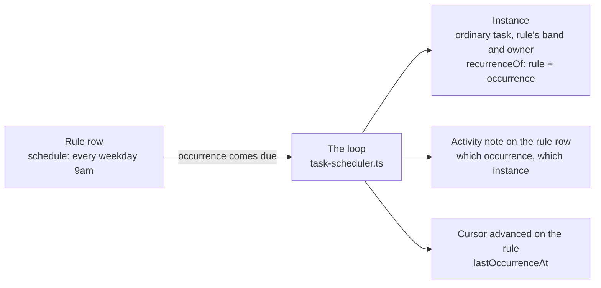

# Scheduled tasks — the board starting work at its time

A board row can carry a **rule** that says when its work should start. When
the rule comes due the server files the work as an ordinary task and puts it
in front of its owner. Nobody has to be watching a clock, and no session has
to stay awake to be the thing that remembers.

This file is the **product rules** — what a rule means, what happens when the
server was not running, and what a reader on the board is looking at. The
mechanics live in the two modules' own doc comments and are not repeated
here: `packages/core/src/task-schedule.ts` (all the arithmetic, pure) and
`packages/server/src/task-scheduler.ts` (the loop that acts on it).

## A rule row is not the work

The row you write the rule on is the **rule**. It never moves through
statuses, and closing it would be closing the thing that produces the work.
Each time the rule comes due the server creates a separate ordinary task — an
**instance** — and that is the row somebody actually does.

An instance is a real task in every way that matters. It lands in the rule's
own goal band, owned by the rule's owner, filed through the same door as
anything a person files, so it queues, blocks, gets picked up and closes
exactly like its neighbours. What sets it apart is one mark, `recurrenceOf`,
naming the rule it came from and — this is the part a reader needs — **the
occurrence it stands for**, which is not the same as when the row was
created. A catch-up after downtime files a row on Friday for Monday's
occurrence, and the board has to be able to say so.

## The rule shapes

Four kinds, and the split between the first three and the fourth is the one
design decision worth knowing.

| Kind | Means | Next occurrence comes from |
| --- | --- | --- |
| `once` | a one-off at an instant | the instant, and then it is spent |
| `every` | a fixed interval | the arming, plus whole steps |
| `calendar` | times of day, optionally on named weekdays | the local calendar |
| `after-completion` | a delay after the last run finished | the completion |

`every` and `calendar` are **fixed cadence**: the next occurrence comes from
the schedule whether or not the last one was ever done. `after-completion`
is the other mode: a rule whose instance is still open is owed nothing at
all, which is what stops a slow-moving chore stacking up behind itself.

The two fixed-cadence kinds are not one kind because a day is not a fixed
number of milliseconds. `calendar` recomputes the instant from the local wall
clock each day, so nine in the morning stays nine in the morning across a
daylight-saving change; an interval rule meaning "every morning" would be an
hour wrong for half the year. Rules finer than a day are `every`; rules
grained in days are `calendar`. A rule carries its own timezone, because this
board has no workspace-level one to inherit.

Two optional limits apply to any of them: `until`, after which the rule is
owed nothing more, and `armedAt`, which is set when somebody writes the rule
and is the floor for its first occurrence. A rule can never fire for a moment
before it existed.

## Missed runs do not pile up — and the rule says what happens instead

When the server has been down, several occurrences may have come due. The
arithmetic collapses them into **one** occurrence, the latest, carrying a
count of the ones behind it; the cursor advances past all of them so none
fires again tomorrow. What is done with that one occurrence is the rule's
own choice, written as the last clause of its phrase and shown as a chip:

| Policy | Phrase | After an outage |
| --- | --- | --- |
| catch up (default) | *nothing written* | one instance, **flagged as a catch-up** |
| skip | `…, skip if missed` | no instance; the skip is recorded |

An occurrence is *missed* when something later has also come due, or when the
fire would land more than five minutes past its instant — never more than
half an interval for an interval rule. An on-time occurrence is the ordinary
fire whatever the policy says; the policy is about missed work only. An
after-completion rule has no slot to miss, so it takes no clause and no chip.

The catch-up instance is an ordinary row with `catchUp` on its recurrence
mark: the board draws the mark in the accent and its title says how many
occurrences it stands in for. A skip leaves no row, so the record is the rule
row's activity ("Skipped missed occurrence …") and two counters on the rule:
`missedTotal`, every occurrence that got no row of its own, and
`skippedTotal`, the part of that the policy declined.

**The open catch-up row is a lock.** While a catch-up instance is still open,
the next occurrence of a fixed-cadence rule *folds into it* — the cursor
advances, the catch-up's own count grows, the activity says where the
occurrence went, and no second row is filed. The lock is held on the board,
in the row's status, not in any process: closing or archiving the catch-up
releases it, and the next occurrence files as normal. An ordinary open run is
not a lock — fixed cadence stacks by design, and only the row that already
stands in for missed work refuses company. The decision is
`missedRunOutcome` in `packages/core/src/schedule-missed.ts`, pure like the
rest of the arithmetic.

## Restart safety

The guarantee is that a rule **neither loses an occurrence nor fires one
twice**, across any number of restarts. Two things make it true.

The cursor records **the occurrence, not the clock**. What is stored is the
instant the fire was *for*, so a catch-up hours late still compares correctly:
an occurrence at or before the cursor is spent forever, and every later one is
still owed. Storing when the server happened to notice would make a late fire
indistinguishable from a fresh one.

The instance and the cursor **land in one write**. Both the rule row and the
instance live in the same workspace sidecar, written whole and renamed into
place. A crash between them is not possible: either both survive, or neither
does and the next boot fires the occurrence it never finished. That is why
the loop advances the cursor the moment the instance exists, and why nothing
in this subsystem needs a journal of its own.

A create the board **refuses** — a stood-down board, a goal band that has
since been deleted — leaves the cursor exactly where it was, so the occurrence
is still owed on the next pass. A refusal is a condition somebody fixes;
swallowing the occurrence would hide it.

## The clock is injected

The loop reads its time from a function, not from `Date.now`, all the way
down: every function in `task-schedule.ts` is a total function of the `now`
it is handed. That is the same seam the stall wake uses, and for a stronger
reason — this feature *is* a comparison against a clock, so a test that could
not move the clock would have to wait until tomorrow to assert that a daily
rule fires tomorrow. `schedulerNow` on `ServerOptions` is where a caller
supplies one.

## A rule is written as a sentence

A rule is set by typing English — "every weekday at 9am" — and read back as
chips you can click. The phrase and the chips are **two views of one rule**
(Bryan, on the approved mock), so neither is the source: the phrase is parsed
into the rule, the chips are drawn from the rule, and editing a chip rewrites
the phrase from the rule it just changed. That is the only arrangement in
which a chip cannot say something the sentence above it does not.

The pair lives beside the arithmetic in `core` —
`schedule-phrase-parse.ts` reads, `schedule-phrase.ts` writes and owns the
vocabulary both the sentence and the chips are spelled in — and the tests
assert they are inverses, and that the canonical spelling is a fixed point.
Without the second property a chip edit followed by a phrase edit could drift.

Two limits are worth knowing because they are shapes the rule type does not
have, not gaps in the parser:

- **An interval rule never writes the word "day."** `every` is a fixed number
  of milliseconds and `calendar` is a wall clock, and "every day" has to mean
  the second one — so one day of interval writes as "every 24 hours". "every 3
  days" is still ACCEPTED; it just canonicalises to hours, which is also the
  honest reading, since an interval really does drift across a DST change.
- **An interval and a time of day cannot both be set.** `calendar` has no
  interval field, so "every 3 days at 9am" is refused rather than silently
  becoming "every day at 9am" and throwing away what was typed.

The editor is the task panel's Schedule section. An unscheduled row shows one
ghost affordance; everything else appears once there is a rule to show.

## What is not here yet

Deliberately, and each is a row of its own:

- **the Scheduled board section** — rule rows have no home of their own on the
  board yet, and Scheduled is separate from Blocked;
- **the run record** — the activity note is the run history today;
- **the wake path** — an instance is filed and its owner is named on it, but
  the scheduler does not wake anybody. It never starts sessions itself.
