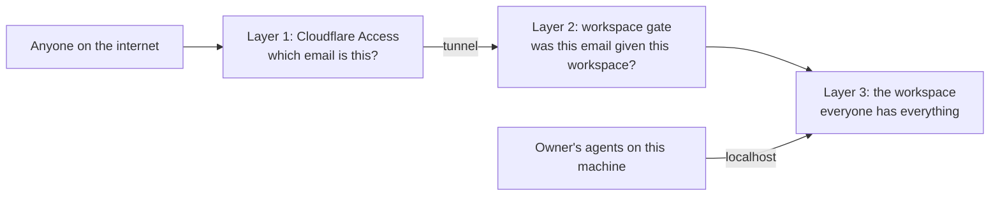

# Security model

Three sentences say most of it:

1. **Cloudflare proves who you are.** Every browser signs in through Cloudflare Access before a request reaches the server.
2. **A workspace gate checks that your email has been given access to the workspace you asked for.** Whether you arrived by share link or by the owner's own address, the server asks this on every request.
3. **Inside a workspace there are no roles yet.** Everyone who is in has everything. Finer permissions come later.

This document says where the trust boundary is, what layers stand between the internet and a workspace, and what each layer does. It describes the design as it is, not a promise that nothing was missed. File names and settings are collected at the end. Every check named there has a comment at the top of its own file saying why it exists; read that before changing it.

## The trust boundary

Claude Workspaces runs on one person's computer. That person is the owner. There is no shared service and no shared database; the boundary is the owner's machine, and the only way across it from outside is a Cloudflare tunnel the owner set up.

**Trusted:**

- The owner's machine and the programs on it: their Claude Code agents, hooks and shell, talking to the server over `localhost`.
- Cloudflare Access's verdict on who a visitor is. The server never checks a password itself.
- Cloudflare's own marker on every request it forwards (`cf-ray`). That marker alone proves a request came through the tunnel, so a tunnel visitor who claims to be `localhost` is not believed.
- Signed messages from the meeting-bot service that delivers transcripts. Its hostname sits outside the sharing master switch on purpose, so switching sharing off mid-meeting does not drop a transcript; each of its two routes works only while its own credential is set.

**Not trusted:**

- Anything else that arrives through the tunnel, until it has passed the layers below.
- What a request says about itself: a header naming an identity, a body naming an author, a `Host` of `localhost`. Identity comes from Cloudflare's stamp, never from the request's own claims.
- Any name that happens to point at this machine other than `localhost`: a Tailscale name, a local-network alias. These are refused outright.
- Web pages running on other local ports. A dev server on this machine is not the owner, even though the owner's browser session would travel with its requests.

It is a vulnerability if anyone outside the boundary can read or change a workspace they were not given, or reach the machine's files, secrets, or deploy controls. Something a member does inside a board they were given is not one, because for now everyone in a workspace has everything.

## The layers

| Layer                | Question it answers                                    | Who answers it                                    | When the answer is no                         |
| -------------------- | ------------------------------------------------------ | ------------------------------------------------- | --------------------------------------------- |
| 1. Cloudflare Access | Which email is this?                                   | Cloudflare, before the request reaches the server | A sign-in page. Nothing reaches the server.   |
| 2. Workspace gate    | Was this email given the workspace this request names? | The server, on every request                      | Refused, in the same words an unknown id gets |
| 3. The workspace     | What may they do here?                                 | Nobody yet: everything is allowed                 | Not applicable until roles exist              |

The owner's own programs enter at layer 3 directly. Two things must both be true for a caller to count as a program on this machine: the request is addressed to `localhost`, and the connection starts on this machine. The tunnel connects from this machine too, and anyone can type `localhost`, so either one alone can be faked.

### Layer 1: Cloudflare proves who you are

Every hostname a browser can use sits behind a Cloudflare Access application. There are two applications, and they answer the same question for different crowds:

- **The owner's application** fronts the owner's own hostname and the collaboration hostname. It admits the owner's emails and the people the owner's identity provider allows.
- **The share application** fronts the share hostname. It admits anyone willing to receive a one-time code by email, because its only job is to establish an email. Getting through it proves nothing about workspaces.

Each application has its own audience, so a token minted for one hostname is worthless at the other. That matters most in one direction: the share application lets in anyone who can read email, so its token must open nothing at the owner's address.

There is no other way in from a browser. The server's own emailed-code sign-in is switched off. A hostname listed in configuration without an Access application behind it is ignored and refused, and the server says so at boot. A hostname on no list at all is refused before any page or API runs.

A name that is on two lists resolves to the narrower grant, never the wider one.

### Layer 2: a workspace gate checks the email

An email gets a workspace in one of two ways:

- **The owner's emails** have every workspace, at the owner's hostname.
- **A share link** gives one workspace, fixed when the link is made. The link is an invitation, not a credential. On the first visit, after Cloudflare has confirmed an email, the server checks the link is still live and records that email as a member of the workspace the link names. From then on the membership admits them, and the link is incidental. The collaboration hostname answers the same question from the workspace's own share records, which list emails and domains.

The gate runs on every request, against the workspace named in that request's own path. A request that names no workspace is refused rather than answered, so an admitted stranger learns nothing about what else exists. A link that is revoked, expired, or never existed shows one page, the same page in all three cases, naming no workspace and no owner.

Two verbs end access, and only these two. Revoking a link stops new redemptions but leaves existing members; a link is usually revoked for having been passed around, not to remove the people who used it. Removing a member ends that person's access at once, including any live connection they already had open. Neither destroys anything: a revoked link keeps its record of who redeemed it and when.

Retiring a board is not one of them. A retired board is still a board, so its members keep reaching it; retirement stands work down, it does not take anyone's access away. To remove somebody, remove the member.

Above all of this is a master switch. Off, every outside hostname is refused before any sign-in check runs and every visitor's open connection is dropped. Only a program on this machine can throw it.

### Layer 3: inside a workspace, everyone has everything

A member is a participant, not a reader. They can file and edit tasks, move status, answer review items and decisions, comment anywhere, edit any document filed on the board, file onto the board a document they can already open on it, start and join a meeting on it, name and rank the goal bands, open and change the board's settings, read its activity log and the roster of agents working it, and turn a comment into a task. Every write is attributed to the email Cloudflare confirmed; whatever the request claims about its author is ignored.

Filing a document onto the board is what makes it readable there, so a member may file only what they can already open. Pulling one in from elsewhere would be a read of another board dressed as a write.

"Everything" means everything on that board. What is outside the board is refused in the same words a guessed id gets: other boards, the list of boards, share administration (minting or revoking links, reading the member list, the master switch), the board's own lifecycle, the seats on it that belong to the owner's agents, and anything that names a path on the owner's machine or acts on the machine itself. Each route a member may call is written out by name, so a route added later is closed until someone opens it. A request reached through a task or goal id is resolved to its own board first, and the gate is asked about that board and no other. The files a phone fetches to put the board on its Home Screen are on the list too: the product's icons, and a manifest of the board's own that starts on the board rather than on the root page a member may not see. An installed app carries none of the browser's cookies, so its first open is a sign-in, once.

Two things on the board itself are still the owner's alone, and both spend the owner's machine rather than working the board: sending a meeting bot into a call somewhere else, and routing a spoken request to the owner's agents.

Two things a request names in its BODY rather than in its path get the same question asked of them, because no path check can see them. Filing a document onto the board is one, above. The other is a cross-reference: a task may point at another task, a document or a comment thread, and what points at a thing is shown beside it — so a reference out of the board would put a chip from a member's task onto a board nobody gave them. A member may point only at things on their own board, and a reference to something that does not exist at all is refused in the same words, so the refusal cannot be read as an answer to "is this id real". Saying that one task waits on another is the same kind of write with none of the same shape around it — a bare id in the body — and it is the sharper one, because the gate that stops a waiting task from moving reads the task it waits on and reports that task's title and state back to whoever tried. So it is asked the same question, and the report is narrowed to the asker's own board before it is sent, even for a link the owner made across boards themselves. The task still refuses to move; only the name of what is holding it is withheld.

A route a member may call still filters what it sends back. Where a task can point across boards, what comes back is narrowed to the reader's own: the tasks pointing at one of their tasks, at a document they can open, or at a thread in it. The settings withhold the notes checkout, which is a path on the owner's disk, and refuse to accept one. The activity log names people the way the board's live feed already does, by display name rather than by internal id, so the two doors onto the same record cannot disagree.

Document text is edited over the live-editing connection, and that is what a review is for. The board's own live doc is different: its contents are a projection the server owns, so a write arriving on it from any peer is reverted, and a member changes the board through the named routes instead.

Roles, and finer control than "everything", are not built yet. When they are, they belong in this layer.

## Rules that guard the machine itself

**A browser may never name a path on this machine.** Binding a file or folder, importing a task list, starting a diff review, deploying, refreshing the plugin, and reading or exercising the process's own Sentry state (`/api/sentry`, loopback only, never through the edge) all refuse every browser, signed in or not. They exist for the owner's agents, over `localhost`. The danger is a page on another local port riding the owner's session. The same routes are refused to a member of a shared board by the workspace gate as well, and that second refusal is the load-bearing one: the browser rule turns away pages, and a member could arrive from a client that is not a page.

**Changing anything from a browser needs a sign-in, decided by read-versus-write, not by a route list.** The gate looks at whether a request asks to change something, so a new route that writes is covered without anyone adding it. The hole is a live connection, because opening one looks like a read: the document-editing socket and the meeting-audio socket each check the sign-in themselves when they open and keep that answer for as long as the connection lasts. A third live connection has to do the same; nothing will catch it for you.

**A shared folder shows only what git lists.** A reviewer can open a file from a shared folder or diff review only if `git ls-files` lists it, so ignored files and anything under `.git` never appear. Files whose names look like credentials (`.env`, `*.pem`, `*.key`, `id_*` and their relatives) are refused even when untracked. Outside a git checkout, every dotfile is hidden.

**An agent's own event feed is that agent's to read.** Everything one session subscribes to — every board, document and comment thread it watches — arrives on a single connection addressed by that agent's name, and the list of what is on it is a second door onto the same thing. The name is written on the board for everyone in it to see, so the address was never a secret and cannot be the check. Both doors are now served only to a process on this machine that is not a browser and did not arrive through the edge, and only against a token the server mints for that one agent and no other. What this does not do is separate two programs the owner is already running: they share one account and one trust zone. The token turns away a page on another local port, anything on the network, and an agent asking for the wrong name by mistake — it is not a wall between the owner's own processes, and nothing here should be read as claiming otherwise. Sessions on an older plugin present no token yet and are still served, with a line in the log naming them, until the fleet has updated and a switch closes the window.

**What a visitor is sent is built from a list of allowed fields, not forbidden ones.** Review links are rewritten to the visitor's own workspace, paths on this machine are removed, and the record of which agents are present names exactly the fields a visitor gets. A field added later is withheld until someone adds it to the list.

## Where secrets live

Secrets are kept in the macOS Keychain or in files only the owner's account can read. None is checked into this repository, and none is written into the launchd configuration, which holds hostnames and feature switches only.

| Secret                                                       | Where                                    |
| ------------------------------------------------------------ | ---------------------------------------- |
| API keys (LLM, transcription, meeting bot, mail, Cloudflare) and the Google OAuth credentials | Keychain, one service each               |
| The key that signs cookies and widget tokens                 | `<dataDir>/share-cookie.key`, owner-only |
| Share links and their members                                | `<dataDir>/share-links.json`, owner-only |
| The key that signs browser notifications                     | `<dataDir>/push-vapid.json`, owner-only  |
| The meeting webhook signing secret                           | The environment                          |

The server creates its own key files on first use and resets their permissions if they already exist. All signed tokens go through one module, so there is one place a signature is checked.

## Reporting a vulnerability

Please do not open a public issue. Report privately through GitHub's [private vulnerability reporting](https://github.com/fryanpan/claude-workspaces-plugin/security/advisories/new) on this repository, with what you did, what you saw, and the version or commit you tested. This is a personal project with no bug bounty and no response-time promise, but reports are read and acted on.

## Changing any of this

Run the checklist in [`.claude/rules/security-review.md`](../../.claude/rules/security-review.md) before a pull request that adds or changes a route, a token, a share surface, a webhook, or a sign-in default. The `ship-it` skill runs it when the changed files touch those areas.

## Every route and its gate, in one table

[routes.md](routes.md) lists every front-door path pattern this server answers
with the gate it sits behind. It is generated from
`packages/server/src/routes/route-table-rows.ts`, which `Bun.serve` mounts as
its `routes` object, and the gate column is checked rather than asserted:
`packages/server/test/route-table.test.ts` drives `shareScopeAllows` with each
row's own example address and fails when the guard disagrees with the row. So
a route added under an already-allowed prefix cannot be filed as owner-only —
it declares `share-scope`, or it declares `owner-in-handler` and names where
its own visitor refusal lives.

Answer heading 1 of the security-review checklist from that table, and add the
row in the same pull request as the route.

## Where to look

Every hostname below is a placeholder; the real ones live in the launchd configuration, not in this repository.

| Layer                                    | Code                                                         | Configuration                                                |
| ---------------------------------------- | ------------------------------------------------------------ | ------------------------------------------------------------ |
| Sorting callers by hostname              | `classifyHost`, `packages/server/src/middleware/host-guard.ts` | `CW_ACCESS_ONLY_BROWSER_HOSTS` (the rule; on by default)     |
| Owner's hostname `workspaces.<domain>`   | `isProxiedTrustedHost`                                       | `CW_PROXIED_TRUSTED_HOSTS`, `CW_PROXIED_TRUSTED_EMAILS`, `CF_ACCESS_TEAM_DOMAIN`, `CF_ACCESS_AUD` |
| Collaboration hostname `collab.<domain>` | `collabScope`                                                | `CF_ACCESS_TUNNEL_HOSTS`, same Access application as the owner's |
| Share hostname `share.<domain>`          | `isShareLinkHost`, `shareScopeAllows`                        | `CW_SHARE_LINK_HOSTS`, `CF_ACCESS_SHARE_AUD` (its own audience) |
| Member route tables                      | `memberRouteAllows`, `host-guard.ts`                         | none                                                         |
| Every route and its gate                 | `routes/route-table-rows.ts`, rendered to [routes.md](routes.md) | none                                                     |
| Master switch                            | `share/sharing-gate.ts`                                      | set from an agent, not from a browser                        |
| Meeting-bot hostname `recall.<domain>`   | `middleware/recall-callback-gate.ts`                         | `CW_RECALL_CALLBACK_HOST`, `RECALL_WEBHOOK_SECRET`           |
| Browser write gate                       | `isGatedWrite`, `middleware/write-gate.ts`                   | `CW_REQUIRE_SIGNIN_TO_WRITE` (on by default)                 |
| Fields sent to a visitor                 | `share/redact-meta.ts`                                       | none                                                         |
| Shared-folder listing                    | `isListedFile`, `fs-scan.ts`                                 | none                                                         |
| Agent event feed and its index           | `authorizeAgentCaller`, `auth/agent-token.ts`                | `CW_REQUIRE_AGENT_TOKEN` (off during the rollout)            |
| Signed tokens                            | `auth/signed-token.ts`                                       | none                                                         |
| Emailed-code sign-in                     | off                                                          | `CW_EMAIL_CODE_SIGNIN=1` turns it on                         |

One retired mechanism remains readable: workspaces used to be shared by creating a Cloudflare Access application and hostname per share (`share-<slug>.<domain>`, `CF_SHARE_BASE_HOSTNAME`). Nothing new is minted that way where a share hostname is configured; records already minted keep resolving until they expire and can still be revoked.
