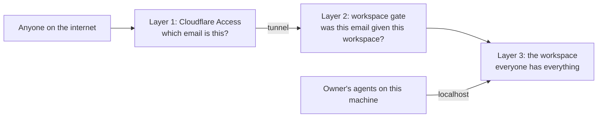

# Security model

Three sentences say most of it:

1. **Cloudflare proves who you are.** Every browser signs in through Cloudflare Access before a request reaches the server.
2. **A workspace gate checks that your email has been given access to the workspace you asked for.** Whether you arrived by share link or by the owner's own address, the server asks this on every request.
3. **Inside a workspace there are no roles yet.** Everyone who is in has everything. Finer permissions come later.

This document says where the trust boundary is, what layers stand between the internet and a workspace, and what each layer does. It describes the design as it is, not a promise that nothing was missed. File names and settings are collected at the end. Every check named there has a comment at the top of its own file saying why it exists; read that before changing it.

## The trust boundary

Claude Workspaces runs on one person's computer. That person is the owner. There is no shared service and no shared database; the boundary is the owner's machine, and the only way across it from outside is a Cloudflare tunnel the owner set up.

**Trusted:**

- The owner's machine and the programs on it: their Claude Code agents, hooks and shell, talking to the server over `localhost`.
- Cloudflare Access's verdict on who a visitor is. The server never checks a password itself.
- Cloudflare's own marker on every request it forwards (`cf-ray`). That marker alone proves a request came through the tunnel, so a tunnel visitor who claims to be `localhost` is not believed.
- Signed messages from the meeting-bot service that delivers transcripts. Its hostname sits outside the sharing master switch on purpose, so switching sharing off mid-meeting does not drop a transcript; each of its two routes works only while its own credential is set.

**Not trusted:**

- Anything else that arrives through the tunnel, until it has passed the layers below.
- What a request says about itself: a header naming an identity, a body naming an author, a `Host` of `localhost`. Identity comes from Cloudflare's stamp, never from the request's own claims.
- Any name that happens to point at this machine other than `localhost`: a Tailscale name, a local-network alias. These are refused, except that the Tailscale name answers the widget's own routes to a page holding a board token (below).
- Web pages running on other local ports. A dev server on this machine is not the owner, even though the owner's browser session would travel with its requests.

It is a vulnerability if anyone outside the boundary can read or change a workspace they were not given, or reach the machine's files, secrets, or deploy controls. It is also one if a Regular User on a board does something only that board's Owner may do: change who has access, or answer an ask whose answer this machine then acts on. Everything else a member does inside a board they were given is not, because on a board everyone shares the work.

## The layers

| Layer                | Question it answers                                    | Who answers it                                    | When the answer is no                         |
| -------------------- | ------------------------------------------------------ | ------------------------------------------------- | --------------------------------------------- |
| 1. Cloudflare Access | Which email is this?                                   | Cloudflare, before the request reaches the server | A sign-in page. Nothing reaches the server.   |
| 2. Workspace gate    | Was this email given the workspace this request names? | The server, on every request                      | Refused, in the same words an unknown id gets |
| 3. The workspace     | What may they do here?                                 | Nobody yet: everything is allowed                 | Not applicable until roles exist              |

The owner's own programs enter at layer 3 directly. Two things must both be true for a caller to count as a program on this machine: the request is addressed to `localhost`, and the connection starts on this machine. The tunnel connects from this machine too, and anyone can type `localhost`, so either one alone can be faked.

### Layer 1: Cloudflare proves who you are

Every hostname a browser can use sits behind a Cloudflare Access application. There are two applications, and they answer the same question for different crowds:

- **The owner's application** fronts the owner's own hostname and the collaboration hostname. It admits the owner's emails and the people the owner's identity provider allows.
- **The share application** fronts the share hostname. It admits anyone willing to receive a one-time code by email, because its only job is to establish an email. Getting through it proves nothing about workspaces.

Each application has its own audience, so a token minted for one hostname is worthless at the other. That matters most in one direction: the share application lets in anyone who can read email, so its token must open nothing at the owner's address.

There is one other way in from a browser, and it carries a token Access vouched for: the tailnet widget door, below. The server's own emailed-code sign-in is switched off while the browser hostnames are Access-only, which is the default: Access has already proven an address, so a second sign-in would ask a person to prove it twice. Turn the access-only rule off and the emailed-code sign-in comes back with it; `CW_EMAIL_CODE_SIGNIN=1` forces it on either way. A hostname listed in configuration without an Access application behind it is ignored and refused, and the server says so at boot. A hostname on no list at all is refused before any page or API runs.

A name that is on two lists resolves to the narrower grant, never the wider one.

### Layer 2: a workspace gate checks the email

An email gets a workspace in one of two ways:

- **The owner's emails** have every workspace, at the owner's hostname.
- **A share link** gives one workspace, fixed when the link is made. The link is an invitation, not a credential. On the first visit, after Cloudflare has confirmed an email, the server checks the link is still live and records that email as a member of the workspace the link names. From then on the membership admits them, and the link is incidental. The collaboration hostname answers the same question from the workspace's own share records, which list emails and domains.

The gate runs on every request, against the workspace named in that request's own path. A request that names no workspace is refused rather than answered, so an admitted stranger learns nothing about what else exists. A link that is revoked, expired, or never existed shows one page, the same page in all three cases, naming no workspace and no owner.

Two verbs end the access a share link gave, and only these two. Revoking a link stops new redemptions but leaves existing members; a link is usually revoked for having been passed around, not to remove the people who used it. Removing a member ends that person's access at once, including any live connection they already had open — the same act whether it is asked for from this machine or from the board's own settings by an Owner. Neither destroys anything: a revoked link keeps its record of who redeemed it and when.

On the collaboration hostname the share records are the membership, so ending a share is what ends access there. Revoking one ends it at once for everybody its allow list admitted whom no other live share, and not the owner's own list, still admits, and closes the live connections they already had open; expiry does the same within a minute. Somebody a second share still names keeps both. Removing a share-link member never closes a collaboration-hostname connection, because that person may still be admitted there by a share.

Retiring a board is not one of them. A retired board is still a board, so its members keep reaching it; retirement stands work down, it does not take anyone's access away. To remove somebody, remove the member.

Above all of this is a master switch. Off, every outside hostname is refused before any sign-in check runs and every visitor's open connection is dropped, on the share hostname, the collaboration hostname and the owner's own hostname through the tunnel alike. The tailnet widget door is not under it: like the meeting-bot hostname, that name is outside the switch, and what holds it shut is its own short allowlist and the board token each of its routes asks for. Only a program on this machine can throw it. Every flip writes one line to the error log naming who, from which address, when and why. Turned off, it also files a decision on the owner's queue, and the owner answering "Turn back on" turns it on through the same path, logged with the owner as the actor. An agent's answer flips nothing. While the switch is off that answer can only come from this machine, because every outside hostname is refused.

One board can also be closed on its own. Its share, share-link and collaboration visitors are refused, its links admit nobody new and their open connections drop, while the master switch, every other board and the owner's own hostname stay as they were. The same local-only call does both: naming a board closes that board, and leaving the board out is the master switch.

A board can also be locked never-shareable. Closing a board refuses its visitors but still lets a link be minted, so a board holding files that must never leave the machine stayed one `share_workspace` call away from a link. A locked board refuses every mint, `share_workspace`, the share-link route and the retired `share_doc` alike, with `board_never_shareable` naming the lock and the board. It is also closed to its visitors, and reopening it with the sharing switch does not undo the lock. `POST /api/share/lock` sets and clears it, and it is loopback-only: a call carrying `cf-ray` is refused with `lock_through_the_edge`, and one from a non-loopback peer with `lock_from_the_box`, before the body is read, so the owner's own tunnel cannot unlock it either. Every change writes one line to the error log naming who, from which address and why.

### Layer 3: inside a workspace, an Owner and Regular Users

A member is a participant, not a reader. They can file and edit tasks, move status, answer review items and decisions, comment anywhere, edit any document filed on the board, file onto the board a document they can already open on it, start and join a meeting on it, name and rank the goal bands, open and read the board's settings, read its activity log and the roster of agents working it, and turn a comment into a task. Every write is attributed to the email Cloudflare confirmed; whatever the request claims about its author is ignored.

Every membership carries a level: Owner, or Regular User. Redeeming a link makes a Regular User unless the link was minted as an Owner's, and the person whose machine this is is an Owner of every board on it without holding a membership record at all — so demoting everyone on the list still leaves the board an owner, and nobody let in from outside can take the board away from the person who made it.

An Owner can do three things a Regular User cannot. They can change who has access and at what level. They can write the board's own settings — the words every ask on this board is judged against, the prompt the effort scorer weighs, the number that limits how many builders a dispatch may run at once, and where notes are filed — because each of those is a rule the whole board then runs by, and one guest retuning it changes what everybody else's asks have to clear. Reading them stays everyone's: a criterion you cannot read is one your agents are judged against in secret. And they can drive an ask flagged owner-only: the asks whose answer this machine then acts on, running a command or handing over a credential. Driving it is more than answering it — rewording the question, taking it off the Owner's queue, overruling the gate holding it, or asking a question back where the answer goes all change the ask the Owner is expected to act on — so every write onto one is the Owner's, wherever the ask was raised. The flag belongs to the ASK, not to the surface: the same question reaches a person as a row on a ticket or as a thread on a doc, and `refuseOwnerOnlyWrite` (`share/board-role.ts`) is the single check all three route families call, because two spellings of "only the owner" agree today and the one that drifts open is the breach. Both refusals are the server's — a 403 on the route, decided from the level the request's own email holds on the board its path names — never a control the page happened not to draw. Everything else on the board is still everyone's, including reading the list of who has access, because a person who cannot see who else is here cannot know who reads what they write.

Filing a document onto the board is what makes it readable there, so a member may file only what they can already open. Pulling one in from elsewhere would be a read of another board dressed as a write.

"Everything" means everything on that board. What is outside the board is refused in the same words a guessed id gets: other boards, the list of boards, share administration (minting or revoking links, reading the links themselves, the master switch), the board's own lifecycle, the seats on it that belong to the owner's agents, and anything that names a path on the owner's machine or acts on the machine itself. Each route a member may call is written out by name, so a route added later is closed until someone opens it. A request reached through a task or goal id is resolved to its own board first, and the gate is asked about that board and no other. The files a phone fetches to put the board on its Home Screen are on the list too: the product's icons, and a manifest of the board's own that starts on the board rather than on the root page a member may not see. An installed app carries none of the browser's cookies, so its first open is a sign-in, once.

Two things on the board itself are still the owner's alone, and both spend the owner's machine rather than working the board: sending a meeting bot into a call somewhere else, and routing a spoken request to the owner's agents.

Two things a request names in its BODY rather than in its path get the same question asked of them, because no path check can see them. Filing a document onto the board is one, above. The other is a cross-reference: a task may point at another task, a document or a comment thread, and what points at a thing is shown beside it — so a reference out of the board would put a chip from a member's task onto a board nobody gave them. A member may point only at things on their own board, and a reference to something that does not exist at all is refused in the same words, so the refusal cannot be read as an answer to "is this id real". Saying that one task waits on another is the same kind of write with none of the same shape around it — a bare id in the body — and it is the sharper one, because the gate that stops a waiting task from moving reads the task it waits on and reports that task's title and state back to whoever tried. So it is asked the same question, and the report is narrowed to the asker's own board before it is sent, even for a link the owner made across boards themselves. The task still refuses to move; only the name of what is holding it is withheld.

A route a member may call still filters what it sends back. Where a task can point across boards, what comes back is narrowed to the reader's own: the tasks pointing at one of their tasks, at a document they can open, or at a thread in it. The settings withhold the notes checkout, which is a path on the owner's disk, and refuse to accept one. The activity log names people the way the board's live feed already does, by display name rather than by internal id, so the two doors onto the same record cannot disagree.

Document text is edited over the live-editing connection, and that is what a review is for. The board's own live doc is different: its contents are a projection the server owns, so a write arriving on it from any peer is reverted, and a member changes the board through the named routes instead.

Finer control than the two levels is not built yet. When it is, it belongs in this layer.

## Rules that guard the machine itself

**An attached dev server is a mock that answers from a port.** `attach_app` binds a dev server's origin to a board; `POST /workspaces/:ws/apps` is `trusted-local` and refuses every browser. The origin must be `http://127.0.0.1:<port>` or `http://localhost:<port>` with nothing after the port, and never this server's own port, because a proxy bound to itself would reach the trusted-local routes from loopback (`parseLoopbackOrigin`, `app-proxy.ts`). Reads under `/workspaces/:ws/apps/:id/` are GET and HEAD only, and a share or collab visitor reaches them exactly as they reach a mock: the host guard admits the path only for an app filed on the board the path names, and the workspace-scope middleware 404s an app from another board. A path tail cannot name another host: leading slashes are folded away, so `//host` is a path on the bound origin; a dot segment, an encoded slash or backslash, or NUL is refused before any fetch; and the built URL must still have the bound origin (`upstreamUrl`). The dev server is addressed as itself, so it sees `Host: 127.0.0.1:<port>`, and it is sent content-negotiation and resume headers only, never the reader's cookie, Access assertion or token. Its `set-cookie`, framing and CSP headers never reach the reader; a document is served in the mock's sandboxed frame, and every other response carries a bare `sandbox` policy. **The limit that matters:** the frame's own subresource requests carry no Lax cookie, so behind Access or a share session the app's stylesheets, `<script src>` files, images and fonts are redirected to sign-in. Measured headless behind a gate refusing cookieless requests: the frame document, the relayed `fetch` and the reload event stream passed; `site.css`, a `<script src>` and an `` under the app prefix were refused. On loopback and the tailnet, where no cookie is needed, the app renders whole. Tests: `packages/server/test/app-access.test.ts`, `app-routes.test.ts`, `packages/widget/test/app-reload.test.ts`.

**A browser may never name a path on this machine.** Binding a file or folder, importing a task list, starting a diff review, deploying, refreshing the plugin, and reading or exercising the process's own Sentry state (`/api/sentry`, loopback only, never through the edge) all refuse every browser, signed in or not. They exist for the owner's agents on this machine, but only some of them check that the caller is on it. Deploying, the Sentry state, the mount table, the repo registry, an agent's token, watch list and event feed, and the hosted MCP connector (`/mcp`) check the connection's own address, so only a program on this machine gets through. `/mcp` also refuses anything that came through the tunnel and any page, in the same function the agent feed uses. It asks for no agent token, because a loopback caller can mint one for any agent; the connector it hosts still presents one on every REST call it makes. Between restarts it keeps `<dataDir>/connector-identities.json` (mode 600): each hosted agent's name, working directory, board id and plugin version, and no token or session id. The rest — binding, importing, a diff review, refreshing the plugin — are `trusted-local` and check no address. The host gate decides who reaches them. By default it admits `localhost` from a loopback address, and the owner's own hostname once Cloudflare Access has verified the owner; refreshing the plugin also refuses anything that came through the tunnel. Set `CW_ACCESS_ONLY_BROWSER_HOSTS=0` and any client on the tailnet or the local network that uses one of this machine's names reaches them too. [routes.md](routes.md) names the gate on each. The danger is a page on another local port riding the owner's session. The same routes are refused to a member of a shared board by the workspace gate as well, and that second refusal is the load-bearing one: the browser rule turns away pages, and a member could arrive from a client that is not a page.

**A value the reader hands over goes to the store and nowhere else.** A review item may ask for one to six named secrets, and the reader types them into the card. They are sent to one route — `POST /workspaces/:ws/tasks/:id/review-items/:id/secrets` — which is `trusted-local`: the host guard's member allowlist does not name it, so a visitor of any role, owner included, is refused in admission before the handler exists, and the handler rebuilds the owner-only refusal behind that. The board refuses to file this shape from a share visitor at all, on every door an item arrives through, and the widget's dock — which renders on somebody else's page — never shows an owner-only ask. The route writes and never reads: nothing in this server hands a stored value back, so an agent reads its own with its own Keychain access. The value reaches the store on **stdin**, never in an argument list, because `ps` shows every process's arguments to every user on the machine. It travels as one command line of `security -i`, not through `security`'s password prompt, which keeps only the first 128 characters and exits as if it had kept them all. Every value is checked against the store's rules before the first one is written, including a length ceiling chosen well inside that line's own measured cap, so a bad second value cannot leave a first one behind. Every write is read back, and an entry that does not match is deleted, so a name never holds a cut value an agent would take for the real one. What the item, the answer line and the activity feed record is the NAMES only.

**Changing anything from a browser needs a sign-in, decided by read-versus-write, not by a route list.** The gate looks at whether a request asks to change something, so a new route that writes is covered without anyone adding it. The hole is a live connection, because opening one looks like a read: the document-editing socket, the meeting-audio socket and the voice-feedback socket each check the sign-in themselves when they open and keep that answer for as long as the connection lasts. A fourth live connection has to do the same; nothing will catch it for you.

**A mock's own script cannot act as the reader.** A mock is HTML somebody else wrote, usually an agent. It used to be served on the board's origin, right next to the reader's session. On staging, a mock planted threads on a different doc, and every one was attributed to the signed-in reader. Now `/workspaces/<ws>/mockups/<id>` answers a small host page holding one frame, `?cw-frame=1`. The frame's response carries `Content-Security-Policy: sandbox` without `allow-same-origin`, so the mock runs with an opaque origin whether it is framed or opened directly. The browser then sends `Origin: null` on every write the mock tries, and the server already refuses that on writes and on sockets. The widget inside the frame still has to talk to the board, so it hands its calls to the host page. The host makes only this mock's own calls: its threads, its live socket, its voice socket and the ticket items docked on it. The ids come from the server's page, never from the frame. The host keeps only `content-type` and `accept` from what the frame asked for, and never forwards a token (`mock-relay-policy.ts`). Everything it relays is stamped: `x-cw-via: mock-frame` on a request, `cw-via=mock-frame` on a socket. Agents see the stamp as "sent from inside the mock page". The frame cannot set or strip the stamp, because the host builds every request itself. A page on the board's own origin could send it, but such a page is already the reader's, and the stamp only makes its own write look less trusted. A relayed live socket is read-only. A relayed edit or re-pin reaches only a comment that was itself written from inside the mock. The host, not the frame, holds the microphone, and it passes on only text frames from the frame. Files served as bytes, meaning a non-HTML mock or a mounted file, get a bare `sandbox` with no scripts, because an SVG opened by its address runs its own script. PDFs are the exception: Chrome will not render a sandboxed PDF. The frame's own requests carry no cookie, and Access redirects a request without one, so the frame fetches nothing from the board by itself. The server writes every board script and stylesheet the mock names (the widget, `/widget/…` and `/app/…`, read from the builds it already serves) into the page, and voice feedback's script and each round's page come through the host. A test puts a gate that refuses cookieless requests in front of a real server and checks the frame gets past it (`widget/test/mock-access.test.ts`). An image or font the mock loads from the board, and an `/app/` module that imports files beside it, are still requested without a cookie and fail behind Access. The host asks for the microphone only on a tap it can confirm; a browser without `navigator.userActivation` gets no microphone. What stays open is what the sandbox allows by design: loading files from elsewhere, popups (which inherit the sandbox), and a tap that navigates the top page.

**A page on the tailnet name gets the widget and nothing else.** An app page served on this machine's Tailscale name can embed the widget, but its requests carry no Access cookie, so that name answers a short allowlist of paths (`middleware/widget-door.ts`) and 404s the rest: the bundle, the microphone chunk an embed fetches on load, the lazy voice chunk, the lazy edit chunk, the two sign-in probes, and one doc's thread list, thread verbs, live socket, recorder socket and recordings. A route added later is closed on that name by default. Everything but the four scripts needs a board widget token (`wt2`, `auth/widget-token.ts`), as a Bearer header or as the socket's subprotocol, because a browser cannot set a header on a WebSocket. The four scripts need none and can carry none: the widget cannot ask for a token before it has run, and the `<script src>` that fetches the mic, and the ones the mic fetches for the two chunks, set no header at all. All four are static, the same bytes for every embed, and already public to a share visitor, so they widen nothing; they are named one by one rather than as a `/widget/` prefix, which would have grown with the build output. A recording is the speaker's own voice, so it keeps the token like every other doc route — which is why the widget fetches a clip and plays it from a blob rather than handing its URL to an `<audio>`, an element that sends no header. The raw-words log beside the recordings is not on the door at all. Without one the answer is a 401 naming where to sign in. The sign-in is a popup on the owner's own hostname, a top-level window that Access fronts as usual. The mint there issues a token only to an email Access verified whose role on that board lets them comment — the owner or a member, since Access admits collaborators too — never on a session cookie alone (a board token outlives a logout), only for a page origin on the Tailscale name, and only for a board that exists. The token names one board and one page origin and lives a day. The server checks it against the path's board, the request's own `Origin`, the person's session watermark and their role on the board, so signing everyone out, or removing that person from the board, kills it. A socket is checked once when it opens, so a sweep hangs up a door socket whose token has died within a minute — either of them, the live doc's and the recorder's, the second of which spends a transcription engine for as long as it stays open and belongs to no document's connection set for the sweep to find by itself. The door's socket is read-only. The door refuses a doc on another board and any existing doc that is not a page doc (a mock); a doc id not used yet opens as one, which is how the widget starts a new page. The widget accepts the token only from a message sent by the sign-in origin. A stolen token lets its holder read and comment on that one board's page docs as the person it names, from a page on the Tailscale name, for up to a day. The door never admits a request that came through Cloudflare. The Tailscale name is discovered at boot, not configured; with the Access-only rule off, that name is fully local as before and the door does not apply. If the Access login page sets `Cross-Origin-Opener-Policy`, the popup loses its opener and cannot hand the token back. That would break sign-in, not open anything.

**A mounted folder may be narrower than its project.** A project's mounted
files are served to a board member over the tunnel or the tailnet by default,
and marking the project `local-only` keeps every one of them on the machine.
One folder can be marked instead, so a project holding an outside party's
material shares its harmless folders and not that one. The answer a file is
served against is the NARROWER of its folder's setting and its project's, so
marking the project can never be undone a folder at a time, and a folder
nobody marked follows the project exactly as every mount did before folders
had a setting of their own. It is decided in two places, both against the
combined answer: the address a file answers at (`routes/mounts.ts`) and the
Library listing that would carry its NAME off the machine first
(`routes/workspace-library.ts`, which drops a hidden folder from both the
mount listing and the project's own git listing).

**An attached folder can be local-only too.** A folder bound with
`attach_folder` has no project around it, so it carries its own privacy, set
by passing `privacy: 'local-only'` on the bind. Its files and their names are
then served to a caller on this machine alone: a loopback peer with no
`cf-ray`, the rule a local-only mount is served under. A share-link visitor, a
collaboration visitor, the owner through the tunnel and a page on the tailnet
are all refused with `local_only`. The check is one function
(`addressesLocalOnlySet` in `attachment-privacy.ts`) that runs right after
admission and before the websocket upgrades, on every address under a board
that names the set or one of its files: the file list and tree, a file's
content, socket and threads, and an ask derived from a file's thread. The
Library listing and the board's review-item queue drop the set's names for
off-box callers. The answer to every bind names the set's privacy, and says
`shareable` when the flag was left out. Leaving it out on a later bind keeps
the set's current setting, so a re-bind never widens a local-only set. The
record fails closed: an `attachment-privacy.json` that cannot be read serves
every set as local-only and refuses changes until it is fixed. Three surfaces
still carry a file's name or title off the machine without passing the check:
the board brief's text, the activity feed and a task's link chips. Opening
any of them reaches the refusal.

**A shared folder shows only what git lists.** A reviewer can open a file from a shared folder or diff review only if `git ls-files` lists it, so ignored files and anything under `.git` never appear. Files whose names look like credentials (`.env`, `*.pem`, `*.key`, `id_*` and their relatives) are refused even when untracked. Outside a git checkout, every dotfile is hidden.

**An agent's own event feed is that agent's to read.** Everything one session subscribes to — every board, document and comment thread it watches — arrives on a single connection addressed by that agent's name, and the list of what is on it is a second door onto the same thing. The name is written on the board for everyone in it to see, so the address was never a secret and cannot be the check. Both doors are now served only to a process on this machine that is not a browser and did not arrive through the edge, and only against a token the server mints for that one agent and no other. What this does not do is separate two programs the owner is already running: they share one account and one trust zone. The token turns away a page on another local port, anything on the network, and an agent asking for the wrong name by mistake — it is not a wall between the owner's own processes, and nothing here should be read as claiming otherwise. Sessions on an older plugin present no token yet and are still served, with a line in the log naming them, until the fleet has updated and a switch closes the window.

**Where a person was stays on this server.** When a browser allows it, the analytics rows its actions write carry a location rounded to about a kilometre, read from a cookie the page sets and rounded again on arrival. It is written to the log file only, never onto the live event stream. It is removed from every row a share visitor's Activity tab reads (`share/redact-board-events.ts`), never logged, and never passed to Sentry or to a model. The same module strips the actor id from the two review-item measurement rows (viewed and answered) before a visitor sees them: those ids derive from an email address, and a visitor has no use for a subtraction's author. The browser asks at most once per device, and a refusal is remembered.

**What a visitor is sent is built from a list of allowed fields, not forbidden ones.** Review links are rewritten to the visitor's own workspace, paths on this machine are removed, and the record of which agents are present names exactly the fields a visitor gets. A field added later is withheld until someone adds it to the list.

## Where secrets live

Secrets are kept in the macOS Keychain or in files only the owner's account can read. None is checked into this repository, and none is written into the launchd configuration, which holds hostnames and feature switches only.

| Secret                                                       | Where                                    |
| ------------------------------------------------------------ | ---------------------------------------- |
| API keys (LLM, transcription, meeting bot, mail, Cloudflare) and the Google OAuth credentials | Keychain, one service each               |
| Secrets a review item asked the reader for                   | Keychain, under `claude-workspaces-secret.<name>` |
| The key that signs cookies and widget tokens                 | `<dataDir>/share-cookie.key`, owner-only |
| Share links and their members                                | `<dataDir>/share-links.json`, owner-only |
| The key that signs browser notifications                     | `<dataDir>/push-vapid.json`, owner-only  |
| The meeting webhook signing secret                           | The environment                          |

Everything an item asks for is namespaced. The Keychain has no folders, and this server reads its own configuration out of the same flat keyspace by service name, with a lookup that falls back to any account — so a name a filer chose could otherwise have named, and updated in place, one of the server's own entries. Every asked-for name is stored under a prefix of this feature's own, applied at the one place a name becomes a command argument (`packages/core/src/secret-name.ts`, used by the writer and by the read-back command an agent is handed). The card keeps showing the bare name.

The server creates its own key files on first use and resets their permissions if they already exist. Every token this server signs goes through one module, `auth/signed-token.ts`, so there is one place such a signature is checked. Two HMACs sit outside it because the format is someone else's. The meeting-bot webhook check (`recall-webhook-auth.ts`) verifies the vendor's Svix signature with the vendor's secret. Browser notifications (`push-crypto.ts`) use the encryption and signing the Web Push standards define. Neither mints a token for this server.

Claude has two keys, and the process decides which one it may read. Prod's key (`claude-workspaces-summary-api-key`) is read only by the prod launchd service, which is recognised by the `XPC_SERVICE_NAME` that launchd sets to the job's label, so it needs no setting of its own. Every other process reads the eval key (`claude-workspaces-eval-api-key`): staging, dev servers, tests, CI, and the eval and cost scripts. Without an eval key, that process runs with Claude switched off and says so once at boot (`packages/server/src/claude-key-source.ts`).

**Which slot a run actually used is recorded, by name.** Every adapter that reaches the Anthropic API resolves through `resolveKeySlotFrom` / `resolveCredentialSlotFrom` (`summarize.ts`), which records the SLOT it consulted — the Keychain service or the environment variable, plus its role — in the process ledger in `packages/server/src/claude-key-slot.ts`. A meeting's timing JSONL carries the same slot on every priced call, so "which key paid for this run" is answered by a stored row rather than re-argued from config. The record is a NAME and a role and never the credential: no key, no prefix of one and no hash of one, because a hash enables re-look-up. The decision is made from which name was consulted, before any value exists in the process. `bun run keys:trace` builds every adapter in both environments — prod marker present and absent — and prints what each one resolved; it constructs adapters only, so it spends nothing and touches no Keychain item.

## Reporting a vulnerability

Please do not open a public issue. Report privately through GitHub's [private vulnerability reporting](https://github.com/fryanpan/claude-workspaces-plugin/security/advisories/new) on this repository, with what you did, what you saw, and the version or commit you tested. This is a personal project with no bug bounty and no response-time promise, but reports are read and acted on.

## Changing any of this

Run the checklist in [`.claude/rules/security-review.md`](../../.claude/rules/security-review.md) before a pull request that adds or changes a route, a token, a share surface, a webhook, or a sign-in default. The `ship-it` skill runs it when the changed files touch those areas.

## Every route and its gate, in one table

[routes.md](routes.md) lists every front-door path pattern this server answers
with the gate it sits behind. It is generated from
`packages/server/src/routes/route-table-rows.ts`, which `Bun.serve` mounts as
its `routes` object, and the gate column is checked rather than asserted:
`packages/server/test/route-table.test.ts` drives `shareScopeAllows` with each
row's own example address and fails when the guard disagrees with the row. So
a route added under an already-allowed prefix cannot be filed as owner-only —
it declares `share-scope`, or it declares `owner-in-handler` and names where
its own visitor refusal lives.

That check cannot tell `trusted-local` from `loopback-only`, because a share
visitor reaches neither. A second test,
`packages/server/test/route-table-loopback.test.ts`, covers that: it calls
every row filed under either gate once from a loopback address and once from
a non-loopback one, and fails when the route refuses a different caller than
its row says. That half skips on a machine with no non-loopback address to
call from. It also calls every `loopback-only` row as the operator through the
tunnel, which arrives from a loopback address, and fails unless the route
refuses it for carrying `cf-ray`.

Answer heading 1 of the security-review checklist from that table, and add the
row in the same pull request as the route.

The cross-board review reads every board at once, so its four paths —
`/review`, `/api/review-queue`, `/api/review-wait` and `/api/review-size` —
are `trusted-local`. No member allowlist names them, and the handler refuses a
visitor again behind admission. The one write is `PUT /api/review-size`, a
person's own Easy/Medium/Hard choice: it needs a live session cookie (the
handler answers 401 without one, even to a caller the write gate took for an
agent), is keyed by that session's identity so it can change nobody else's,
and accepts only the three sizes. Every answer goes to the owning board's
existing route and meets that route's gate.

## Where to look

Every hostname below is a placeholder; the real ones live in the launchd configuration, not in this repository.

| Layer                                    | Code                                                         | Configuration                                                |
| ---------------------------------------- | ------------------------------------------------------------ | ------------------------------------------------------------ |
| Sorting callers by hostname              | `classifyHost`, `packages/server/src/middleware/host-guard.ts` | `CW_ACCESS_ONLY_BROWSER_HOSTS` (the rule; on by default)     |
| Owner's hostname `workspaces.<domain>`   | `isProxiedTrustedHost`                                       | `CW_PROXIED_TRUSTED_HOSTS`, `CW_PROXIED_TRUSTED_EMAILS`, `CF_ACCESS_TEAM_DOMAIN`, `CF_ACCESS_AUD` |
| Collaboration hostname `collab.<domain>` | `collabScope`                                                | `CF_ACCESS_TUNNEL_HOSTS`, same Access application as the owner's |
| Share hostname `share.<domain>`          | `isShareLinkHost`, `shareScopeAllows`                        | `CW_SHARE_LINK_HOSTS`, `CF_ACCESS_SHARE_AUD` (its own audience) |
| Member route tables                      | `memberRouteAllows`, `host-guard.ts`                         | none                                                         |
| Owner vs. Regular User on a board        | `boardRoleOf`, `board-membership.ts`; `requireOwner`, `request-admission.ts`; `refuseOwnerOnlyWrite`, `share/board-role.ts` | none                                          |
| Every route and its gate                 | `routes/route-table-rows.ts`, rendered to [routes.md](routes.md) | none                                                     |
| Master switch                            | `share/sharing-gate.ts`                                      | set from an agent, not from a browser                        |
| Meeting-bot hostname `recall.<domain>`   | `middleware/recall-callback-gate.ts`                         | `CW_RECALL_CALLBACK_HOST`, `RECALL_WEBHOOK_SECRET`           |
| Browser write gate                       | `isGatedWrite`, `middleware/write-gate.ts`                   | `CW_REQUIRE_SIGNIN_TO_WRITE` (on by default)                 |
| Fields sent to a visitor                 | `share/redact-meta.ts`                                       | none                                                         |
| Shared-folder listing                    | `isListedFile`, `fs-scan.ts`                                 | none                                                         |
| Served mocks: sandbox, relay and stamp   | `mockup-frame.ts`; `packages/widget/src/mock-relay-policy.ts`, `mock-host.ts` | none                                        |
| Attached dev servers: origin rule, path check, headers | `app-proxy.ts`, `routes/apps.ts` | none |
| Agent event feed and its index           | `authorizeAgentCaller`, `auth/agent-token.ts`                | `CW_REQUIRE_AGENT_TOKEN` (off during the rollout)            |
| Signed tokens                            | `auth/signed-token.ts`                                       | none                                                         |
| Tailnet widget door `<tailnet-host>`     | `widgetDoorRoute`, `middleware/widget-door.ts`; `isWidgetDoorHost`, `host-guard.ts`; `verifyBoardWidgetToken`, `auth/widget-token.ts` | none: the name is discovered, the sign-in origin is the first `CW_PROXIED_TRUSTED_HOSTS` entry |
| Emailed-code sign-in                     | `emailCodeSignIn`, `server-config.ts`                        | Off while the Access-only rule is on, so off by default; `CW_ACCESS_ONLY_BROWSER_HOSTS=0` brings it back and `CW_EMAIL_CODE_SIGNIN=1` forces it on |

One retired mechanism remains readable: workspaces used to be shared by creating a Cloudflare Access application and hostname per share (`share-<slug>.<domain>`, `CF_SHARE_BASE_HOSTNAME`). Nothing new is minted that way where a share hostname is configured; records already minted keep resolving until they expire and can still be revoked.
