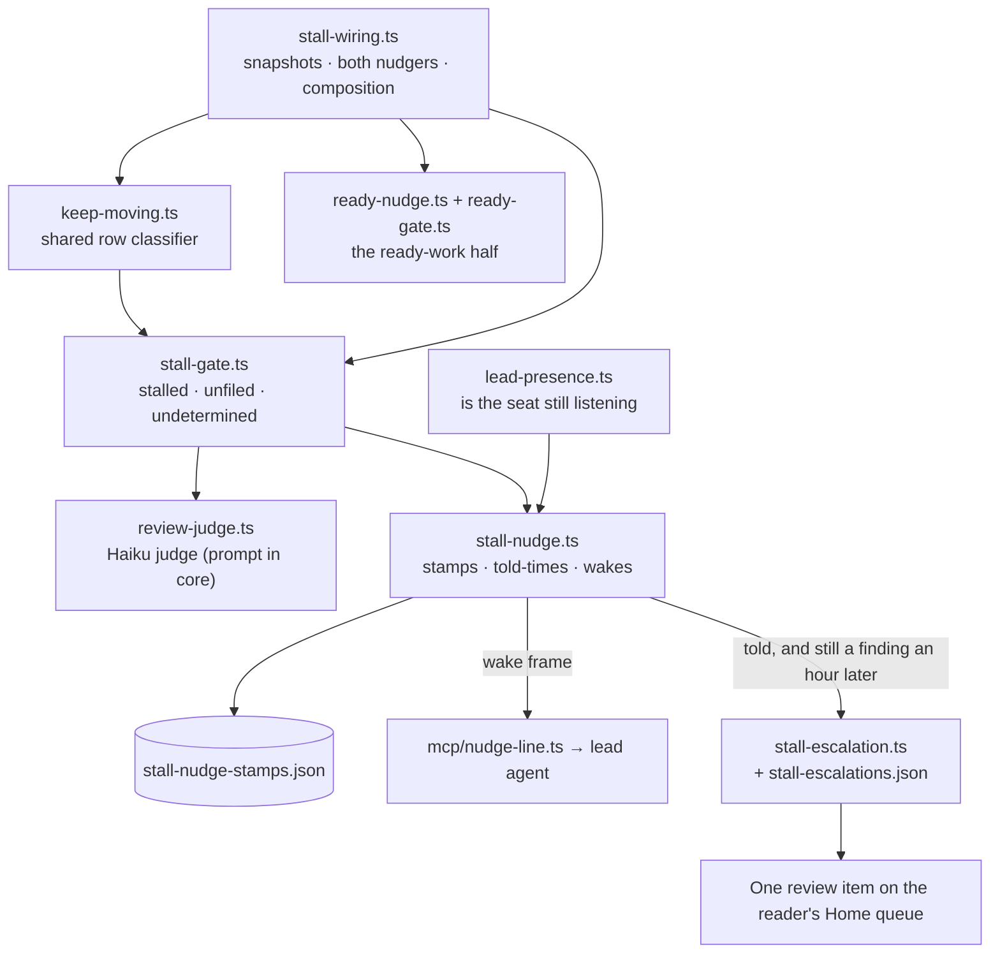

# Server-side stall detection

> This page is the mechanics as they run today and the record of why each
> layer exists. The design the rebuild of 2026-09-08 holds them to — what
> "working" means, who is told what, and each module's criteria — is
> [stall-check/](stall-check/README.md). Read that first.

**Goal:** every open ticket on every board is moving or names its blocker
where the owner can see and answer it — without the owner poking, and
without agents polling. The server watches; leads get woken only when there
is something to do.

Shipped 2026-08-27/28 across PRs #404 (detection loop), #405 (parked state
removed), #406 (20-minute threshold), #407 (board-level wake dedupe),
#409 (repeat-window knob), #411 (growth-only firing). This doc is the
summary; the design reasoning lives in the file headers of
`packages/server/src/stall-gate.ts` and `stall-nudge.ts`.

## Shape

Every module is named again, with what it owns, under
[Where things live](#where-things-live) at the foot of this page.

## What counts as a finding

The loop runs every 60s and sorts every open row into three lists, one
frame per board:

| List | Meaning | Gate |
|---|---|---|
| `stalled` | todo/in-progress, not dependency-blocked, no pending human review item, quiet ≥ threshold | 20 min quiet (`CW_STALL_NUDGE_MINUTES`) |
| `unfiled` | waiting on the owner but with NO review item on their queue — an ask that exists nowhere they read; a protocol violation | same 20-min quiet (#411) — a fresh ask gets a grace window for the lead to file it |
| `undetermined` | rows whose review data could not be read — the one thing that could have explained the silence | none; unreadable is always reported |

Deliberate exclusions: **triage** rows (unvetted work shouldn't nag),
rows with a **pending review item** (that's legitimately waiting on the
owner — their Home queue is the surface), and the **backlog** on boards
with goal bands. Boards without goal bands carry whole columns as
stall-eligible; structure the board to scope the watcher.

**A row already named is not named again until it changes.** The stamp is the
board's CURRENT finding set, so a row that left it was forgotten and its next
quiet window read as a brand-new stall — one wake per window on any board
whose owner keeps reporting (measured 2026-09-04: five wakes in sixty-five
minutes over two rows that were being worked the whole time). `stall-nudge.ts`
now remembers which rows a board's lead has been told about, across the row's
own absence and across a restart, and forgets a row that has not been a
finding for a whole repeat window. A remembered row is news again only when it
comes back under a different BUCKET — a dispatched row whose builder then died
returns as `builder-silent`, which is a different ask. Every repeat wake
carries `changed`: the rows, holds, unreadable rows and escalation that are
new since the last one, rendered ahead of the full lists.

**An open question counts wherever it was asked.** A row's own `task:<id>`
doc is read for both things a discussion can say — somebody is talking,
somebody is waiting on an answer — and so is every doc the row LINKS. Reading
a linked doc for its prose alone missed the common case: thread writes carry
no transaction origin, `lastContentChangeFor` refuses an unnamed one, so a
question asked on a mock or a design doc left its row reading as quiet with
nobody waiting while the reader had it on their queue.

On a LINKED doc the ask is SCOPED, because a doc is a shared surface: without
a scope one unanswered question on a design doc would park every row linking
it, for as long as the question stayed open. Two ways an ask can count for a
row. **Nothing else links the doc** — then the question cannot be about any
other row, whoever typed it, so a builder's ask on a lead-owned row parks it.
**Otherwise the asker must be the row's owner**, resolved through
`taskStore.ownerIdOf`, which is the only signal separating the rows of a
shared design doc from each other. Owner-matching alone was the first rule and
missed the first case, leaving a row waking while a person owed it an answer;
matching the row's ASSIGNEE instead is rejected on purpose, because it
over-exonerates the moment one agent holds two rows. The row's own `task:<id>`
doc needs no scope at all, because a task-body thread belongs to exactly one
row. Two consequences to know: on a doc several rows link, an ask by a person
or by an agent the roster cannot place parks nobody, and a linked doc's plain
COMMENTS
and edits still count for every row that links it — that exoneration expires
with the quiet window rather than lasting as long as a question does. Reading
those threads goes through `docStore.listThreads`, which hydrates an evicted doc
from disk rather than peeking, so a board whose rows link many cold docs pulls
them back into memory on the loop's schedule.

**Task notes count as movement.** A row's quiet time is measured from the
newest of: its status change, its last workspace event, its last thread
activity, and its newest note in `task.notes` — the end-of-turn message the
Stop hook posts, an explicit `post_status`, or a denial. Notes are read from
the row itself: `task.noted` is deliberately kept out of the workspace event
stream and the board trail, so a talking agent resets its own task's stall
clock without lighting up every board it is attached to. The board-level
ready-idle clock (`ready-nudge.ts`) ignores notes on purpose — that wake
exists to catch a session that keeps talking without moving anything.

**A note that says the agent is waiting on a person is still just a note.**
Waiting is DECLARED, never inferred (rebuild step 2, 2026-09-08). A row is
`blocked-on-owner` only while a filed ask on the person's queue excuses it,
and the snapshot carries the ADDRESS of every such ask on the row
(`waitingOn`: a ticket item by id, or a comment-borne item by doc, thread and
comment), read from the three places an ask can be filed — the ticket's own
items, a payload on a comment in the ticket's body doc, and a payload on a
comment in a doc the row links. Whether an item still excuses the row is the
Home queue's own predicate (`isReviewItemOnQueue` for ticket items,
`pendingDeclaration` minus a gated payload for comment-borne ones), so an
answered, withdrawn, held or reader-asked-back item excuses nothing. A row
whose status says the owner is waiting with nothing filed is
`blocked-on-owner-unfiled`; a row whose NOTE says "waiting on Bryan" with
nothing filed is a plain stall, and the lead hears about it on the ordinary
clock. Between 2026-09-04 and 2026-09-08 a prose reader (`note-ask.ts`, a
prefilter plus a Haiku confirmation) tried to recover the unfiled ask from
the note itself; it was removed because a wait that has to be guessed from
prose is a wait nobody filed, and the fix for that is to file it.

Known gap, deliberately open: nothing ages review items sitting unanswered
on the owner's queue. That is a different signal (ask-aging, not
row-stalling) and gets its own design if it proves needed. The one kind of
review item the loop DOES age is the held one, below — an ask the reader
cannot see is not waiting on the reader.

**An ask only excuses a row while the reader can still act on it.** The count
the loop reads (`reviewState.open`) has to agree, item for item, with the Home
queue's own filter — so it drops the same four: answered, held or still being
judged, WITHDRAWN by its asker, and WAITING because the reader asked back and
it is now the owner's turn. When the two disagree the row parks forever: the
ask is off the queue, so nobody can answer it, so nothing ever clears it and
the watchdog stays off that row. Withdrawn and waiting were exactly that bug.
Both surfaces call the same predicates rather than re-deriving the rule, for
the reason the bug demonstrates — a second spelling of "on the queue" is free
to disagree with the first.

**A held review item is a finding of its own.** Every filing path that can
put a row on the reader's queue passes a quality gate: a Haiku judge reads the board's
`reviewItemCriteria` (a natural-language prompt; `set_review_item_criteria`,
or `PUT /workspaces/:id/settings`) and the item, and answers
`{ok, reason}`. Not ok → the item is HELD: it stays on the ticket with the
reason, leaves the Home queue and the answerable count, and the filer is
told in the tool result and on the channel (`workspace.review_item_held`).
A judge that has no key, times out, errors, or answers unparseably PASSES
the item — the gate is a nudge toward better asks, never a door that
closes when the API does (`decisions.md`, 2026-08-29). Held state is
stored on the item (`judge: {at, verdict, reason}`) and the filer's agent id
beside it, store-only; the item is `pending` — off the queue, nothing on
the ticket — from the moment it is filed until the verdict lands, and a
`pending` still on disk at boot becomes `unavailable`. `stallSnapshot` lists the holds older than
`CW_HELD_ITEM_MINUTES` (default 5) as `held`; the nudger wakes the FILER
once per item per process (`filersTold`), and the frame to the lead carries
them as `heldItems` — a board with nothing else wrong still wakes on one.
Held rows enter the stall stamp under their ticket's id, so a later stall
or unfiled finding on the same ticket while it stays held re-wakes nothing:
one complaint per item, not per pass. Revising re-judges; a pass clears
the hold, keeps the original filing time, and forgets the filer stamp, so
a fresh hold on the same item is nudged afresh.

**Every filing path, not one of them.** The gate shipped applying only inside
`taskReviewItems`' branch, while `.claude/rules/workspaces-default.md` tells
the fleet to file asks with `create_thread(review=…)` / `post_reply(review=…)`
— so the documented path reached the queue with the judge called zero times
(measured 2026-08-29, both calls in one run). A gate the standard path
bypasses is worse than no gate, because it produces confidence it has not
earned. One implementation now serves all THREE surfaces (`runReviewGate` in
`server.ts`, with one adapter each for a ticket item, a comment-borne payload
and a ticket's own decision), so the order of operations, the failure policy
and the shape of a hold cannot drift apart:

| Filing path | Where the row lands | Judged? | How a hold is lifted |
|---|---|---|---|
| `add_review_item` → `POST /workspaces/:workspaceId/tasks/:id/review-items` | `task-review` | yes | `revise_review_item(taskId, reviewItemId)` |
| `create_tasks` / `POST …/tasks` with `review` | `task-review` | yes (batched, bounded concurrency) | same |
| `revise_review_item` ticket form | `task-review` | yes, on every revision | same |
| `create_thread(review)` → `POST /workspaces/:workspaceId/docs/:id/threads` | `task-thread` / `doc-thread` | yes | `revise_review_item(docId, threadId, commentId)` |
| `POST /workspaces/:workspaceId/docs/:id/threads/by_find` with `review` | `doc-thread` | yes | same |
| `post_reply(review)` → `…/threads/:id/comments` | `task-thread` / `doc-thread` | yes | same |
| `revise_review_item` doc form → `…/threads/:id/revise` | as above | yes, on every revision | same |
| `…/threads/:id/withdraw/undo` (reinstate) | as above | **exempt** — no new words | the hold placed on those words still stands, so a reinstated held item stays off the queue and is not announced |
| `…/review-items/:id/release` (the reader overruling) | `task-review` | **exempt by design** — see below | n/a |
| `create_tasks` / `POST …/tasks` with `needs: 'decision'` — the ticket that IS the ask (`r-legacy`) | `task-review` | yes | `revise_review_item(taskId)`, no item id |
| `rewrite_task` / `POST …/tasks/:id/body` / `…/title` on a decision row | `task-review` | yes, on every words edit | same |
| The allow-rule filer (`allow-rules.ts`, `store.addReviewItem` direct) | `task-review` | **exempt** — the words are the PRODUCT's, built by `buildAllowRuleReview` from a fixed template, and no agent authored them. Holding one would be the dead end this design forbids: the "filer" is the server, which cannot revise, and a held finding is a finding silently dropped | n/a |
| Meeting research capture (`meeting-task-capture.ts`, same door) | `task-review` | **exempt**, same reason — template text the assistant fills in, with no author to send it back to | n/a |
| An `unreplied` row (prose the server INFERRED asks a person) | thread rows | **exempt** — nobody declared it, so there are no authored words to judge; a held declaration's own comment is excluded from this band so a hold cannot leak back through it | n/a |

**The ticket that is itself the decision.** A `needs: 'decision'` row reaches
the queue through the row `legacyReviewItem` DERIVES at read time, whose id is
the fixed `r-legacy` — so it was the last path that put a row in front of the
reader with the judge never called (measured 2026-08-31: one `create_tasks`
decision row, zero judge calls, one queue row). It is gated now by the same
`runReviewGate`, through a third adapter, with two differences that both fall
out of the row having nothing of its own:

- **The verdict lives on the TASK** (`Task.decisionJudge`), because the item is
  rebuilt on every read and a stamp on it would vanish. `listReviewItems` hangs
  it back on the derived row, so `isReviewItemGated` — the one predicate the
  queue consults — is unchanged.
- **The version is `wordsRevisionOf`**, not a count of revisions, because the
  words being judged are the row's own title, body and options. Every door that
  writes those already moves that counter, which is what makes a verdict that
  outlived them refusable.

The same fact is why the hold is not a dead end and why lifting it needed no
new verb: revising the decision means rewriting the ticket's words, so
`revise_review_item(taskId=…)` — `reviewItemId` omitted, the shape
`answer_decision` has always taken for this row — delegates into
`reviseTaskDecision`, which writes through the ordinary title/body doors. The
`r-legacy` REST address delegates the same way, exactly as `answerTaskReview`
delegates it into `answerDecision`. And because those words have other writers,
`rewrite_task` and the board's inline title edit re-judge too: a filer who
fixed a held decision the obvious way would otherwise leave the stale hold
standing with nothing left that could clear it.

The item's verdict lives on `TaskReviewItem.judge` for a ticket item and on
`ReviewPayload.judge` for a comment-borne one — the payload IS the item there,
the same reason `revisions` lives on it. `reviewFromBody` strips `judge` from
anything a caller sends: it is written by the gate and restored from the CRDT,
and accepting it at the door would be a one-key bypass. Both surfaces' holds
are enumerated for the stall loop (`taskStore.heldReviewItems` +
`heldThreadReviewItems`), and the row, the filer's wake and the filing route's
result all carry the same paste-ready `revise_review_item(…)` call — three
copies of an address is how one of them ends up naming a verb that refuses.

**The reader can overrule the judge.** The held note on the ticket names
who filed the item and how long the hold has stood, and carries "Ask me
anyway" — `POST /workspaces/:workspaceId/tasks/:taskId/review-items/:itemId/release`, which
records an `ok` verdict naming the person and puts the item on the queue
the way any passed item reaches it. The gate is not disarmed by it: the
next revision goes past the judge like any other. Added after a UX review
found the note had no interactive element at all, so a reader looking at a
question they could answer in ten seconds could only wait for an agent.

It takes a ticket's own decision too (`r-legacy`), where the verdict lands on
the task instead of on an item. That row is worth releasing precisely because
the reader CAN see it: a held decision is still a ticket on the board, and the
held note renders on it.

Known limit: the release door does not reach a COMMENT-borne item. One can be
lifted by its filer revising it (and by the gate being turned off, which
releases it on the next revision), but there is no "ask me anyway" for the
reader — a held comment is not on the queue, so the reader has no surface to
press it from. Giving one means rendering held declarations in the doc, which
is a UI decision rather than a gate one.

A release can be issued while the judge is still out, and it wins. The
verdict a judge comes back with is refused unless the `pending` stamp it
placed before asking is still on the row: a release does not change the
item's words, so the version check alone would have let a late `held`
overwrite it and take the item off the queue seconds after the reader was
told it was on.

## Wake economics — the number that shaped everything

**A wake is not a notification; it is a lead session's whole turn** —
measured ~800k tokens, because a woken lead takes several turns to read,
act, and stand back down. Every design decision below exists to price
wakes correctly:

- **One frame per board**, never per row. The frame carries the full lists;
  the plugin renders the top rows plus "and N more". (Pre-0.1.116 bundles
  render a single task id — an updated plugin, then a session restart,
  fixes the rendering.)
- **A stamp per board dedupes wakes.** The stamp is the board's repeat
  bucket plus the sorted finding-row ids. Stamps persist to disk, so a
  server restart does not re-bill every board. (Any stamp FORMAT change
  re-bills each board exactly one wake on the first tick after deploy —
  expected, one-off, not a rate.)
- **Wakes fire on growth only** (#411): a new finding row, a bucket
  escalation, or a newly unreadable row. Never on shrink — before this, a
  lead FILING the ask changed the set and re-armed the wake, a
  self-sustaining loop measured at 6 wakes on one board in an evening,
  3 inside 5 minutes. A lead's response can only shrink the set, so the
  loop is now structurally impossible. Per-row bucket transitions also
  left the stamp: a lead's own dispatch moves a row's classification, and
  that must not read as growth.
- **The repeat window escalates a board that stays bad**: the oldest quiet
  row's silence, quantized by `CW_STALL_REPEAT_HOURS` (default 4h), so an
  unchanged board is re-said at most once per window. The default repeat
  floor across a 9-board fleet prices at roughly 43M tokens/day — the knob
  exists because that floor has to be tunable faster than a release.
- **The repeat bucket is HELD, never lowered by a flicker**: a
  remembered row that drops off the findings for one pass used to take the
  armed bucket down with it, so its return read as another window crossed and
  woke the lead about a row nothing had changed on — two wakes three minutes
  apart on one 12h `ready-unpicked` row, measured 2026-09-04. Two things make
  a row flicker without moving: an escalation item masks its anchor row from
  the gate until it is withdrawn or re-anchored, and a row on the parallelism
  cap's boundary leaves the judged set whenever another row starts or stops
  being runnable. The bucket is now held UP with the row that earned it, and
  the hold expires with that row: `told` forgets a row that has been off the
  list for a whole repeat window, and the next row then escalates on its own
  clock. Holding until the board went wholly clean was tried first and is a
  ratchet — on a board that always has a finding, a number set hours ago
  swallows every later row's repeat window, which is the repeat switched off.
- **An unreachable lead escalates, and only then costs nothing**: the wake
  goes to any other session holding a stream on that board, carrying
  `escalatedFrom: <lead>` so the stand-in knows why it was told. The frame
  says UNREACHABLE, never "gone": holding no stream is also what a
  reconnecting session looks like, and deciding a session is dead takes
  evidence over a window — that call belongs to `leadSeatHealth`, which is
  what the board's presence strip and the attach result read. With nobody
  at all attached the wake stays owed and fires when someone reattaches.
  Before this, the monitor addressed one identity it could not verify: a seat
  held by a session that had stopped listening turned every wake on that
  board into silence, and that silence read exactly like a healthy board (a
  lead respawned under a new name on 2026-08-29, and for four and a half
  hours nothing reached a live session). Healthy board = silence; there is
  no "all clear" frame.
- Every successful wake logs
  `[stall] wake ws=<id> lead=<agent> stalled=<n> unfiled=<n> undetermined=<n>`
  — billed turns, not decided wakes. `lead=` always names the SEAT HOLDER;
  an escalated wake adds `to=<agent>` for who actually got it.

## Past the lead: the board files it itself

Everything above ends at the lead. That is the right first addressee and the
wrong last one: a lead session that has died, hit its usage limit, or is
itself waiting on somebody cannot act on a wake, and every later wake is
addressed to the same silence. Nothing in the loop could tell that apart from
a board being driven.

So when a row **the lead was already told about** is still a finding an hour
later, the board goes over the lead's head and files ONE review item on the
reader's own queue (`stall-escalation.ts`). What makes that possible is a
told-time in the nudger's memory: `ToldRow.toldAt`, stamped on a DELIVERED
wake, never refreshed while the row is remembered, and persisted in
`stall-nudge-stamps.json` so a deploy does not hand every board a fresh hour.

**A board with nobody to tell starts the same clock.** When the loop finds a
row and there is no addressee at all — the lead seat held by a session that is
not answering, nothing else attached — it stamps that first undeliverable
attempt in a separate `undeliverable` map and the window runs from there. The
two are kept apart on purpose: the wake stays owed, so a session that attaches
later is still told, and the item can say which case it is (*"nobody could be
reached on this board for 3h"* rather than *"the lead was told 3h ago"*). This
is the case the whole feature opened with — a board whose lead had died, whose
rows were therefore never told about, and which under a delivered-only clock
would have escalated never.

- **One item per board, revised in place.** The rows live in its body, each
  with a relative link (`/workspaces/<id>?task=<taskId>`), what kind of stuck
  it is in plain words, how long it has been quiet and how long ago the lead
  was told. Rows joining or leaving revise that item; they never file a
  second one. A queue that grows an entry per stuck row is the wake's own
  failure mode wearing a different hat.
- **Unjudged, by the same door the allow-rule proposals use.** It calls
  `addReviewItem` on the store directly, so it lands in `task-review` without
  passing the quality gate, which lives on the ROUTE. Deliberate: the judge
  exists to make an agent's ask readable, and an item generated from board
  state has no author to send it back to.
- **Written as the server.** `agent-workspaces-server` / "Claude Workspaces",
  the identity `park-migration.ts` and `artifact-check.ts` already use. No
  session decided this and no person did.
- **The anchor is the worst UNFILED row**, falling back to the worst stalled
  one. A review item has to hang on a ticket, and an open item makes that row
  `blocked-on-owner` — so the anchor stops being a stall finding while the
  item is open. On an unfiled row that is the loop closing (this IS the filed
  ask that was missing); on a stalled row it is a real loss of visibility,
  which is why it is the fallback rather than the choice.
- **Told AND stuck, both for a full window.** A row escalates only if it has
  been silent for the escalation window as well as told-about for it.
  `ToldRow.toldAt` is stamped once and never refreshed while the row is
  remembered, so the told clock alone said nothing about whether the lead had
  answered: a row told about 33h ago, commented on and moved through statuses
  all day since, qualified again the moment it went quiet for the gate's
  twenty minutes. The item that produced said so in its own words — *"Quiet
  1h; the lead was told 33h ago"* — thirty-two of those hours being the lead
  working the row. The clock the row is judged by is its
  quiet time (`StalledRow.quietMs`) and nothing else.
- **It clears itself, and does not blink.** The item is withdrawn when no
  named row still qualifies; the anchor, which the gate can no longer judge,
  is read from its own ticket instead (closed, or touched by somebody after
  our own write). Without that the module would react to the silence it
  caused — file, watch the anchor leave the findings, withdraw, watch it come
  back. A re-file cooldown of one escalation window is the second half of the
  same guard.
- **An ask gets a minimum life before movement can take it back.** The two
  halves of the old anchor test were acted on identically, and they are not
  the same question: an anchor the reader cannot see is a placement fact, but
  a WRITE to the anchor is only a claim that the row is moving — and one write
  is a far weaker claim than the hour of silence that filed the item. The
  commonest write on any live board is the row's own agent posting its
  end-of-turn note, so the ask retracted itself: measured 2026-09-05, item
  filed 04:56:21, `task.noted` by the row's own lead at 04:58:19, item
  withdrawn 04:58:20 with *"the rows it named are moving again"*. For those
  two minutes it was a real ask — a watching session saw `review_item.added`
  and told the reader something was waiting for them, and it was not. Movement
  now retracts an item only once it has stood a quiet window
  (`STALL_ESCALATION_SETTLE_DEFAULT_MS`, tied to `CW_STALL_NUDGE_MINUTES`),
  which is long enough that a row writing once and going quiet again keeps its
  ask. A done, archived or vanished anchor still moves or withdraws on the
  tick it is seen, and a retired board still withdraws unconditionally — an
  item nobody can read is not an ask being kept.
- **When the anchor stops holding, the item MOVES.** A `done` or archived
  anchor is not a reason to keep revising: `taskReviewItems` skips a done
  ticket's rows, so the ask would be open forever and visible to nobody while
  every other stuck row on the board went unreported behind it. The item is
  withdrawn and re-filed on the worst row that still qualifies, in the same
  tick and with no cooldown — a cooldown is for a board that keeps flickering,
  not for one ask being carried somewhere it can be read. The withdrawal also
  unmasks the old anchor, which is how a row that dropped out of the body can
  come back into a later one.
  An item the reader asked back on is a different case and is NOT moved: a
  revision with a later timestamp answers their turn, so revising it in place
  returns it to the queue, and re-anchoring would abandon the thread they
  started.
- **A retired board withdraws unconditionally.** Standing a board down is the
  owner saying nobody is working it, and the ask outlives the reason it was
  filed. Checked before the qualifying set, because the anchor is re-read from
  its own ticket and would otherwise keep the item alive on a board the gate
  no longer looks at.
- **The residual trade-off:** while an item is open its anchor is invisible to
  the wake. There is no home for a board-level item that is not a ticket — the
  allow-rule proposals hang on one too — so the alternative was anchoring on a
  row that is NOT stuck, which would tell the reader something false about a
  healthy row.
- **Answered means heard.** An item the reader answered or withdrew is not
  re-filed for rows it already named; a row it did not name files afresh.
- `[stall] escalated ws=<id> rows=<n> item=<id>` and
  `[stall] escalation cleared …` are the log lines — this is the one place
  the server writes to a person's queue on its own, so it says so.

## Field results (first night, 2026-08-28)

9 wakes across 4 boards. The stall class worked (a board woken for 2
genuinely stalled rows; next frame showed them cleared). The unfiled class
caught 2 real protocol violations (asks done-but-unfiled; both filed, both
answered same night) — and also exposed the shrink-loop and the missing
grace window that #411 fixed.

## Knobs

| Env (server launch) | Default | Meaning |
|---|---|---|
| `CW_STALL_NUDGE_MINUTES` | 20 | quiet time before a row is a finding, and the minimum life of an escalation item before movement may retract it |
| `CW_STALL_REPEAT_HOURS` | 4 | how often an unchanged bad board is re-said |
| `CW_HELD_ITEM_MINUTES` | 5 | how long a held review item may stand before its filer, then the lead, is told |
| `CW_STALL_ESCALATE_MINUTES` | 60 | how long a row the lead was already told about may stay stuck — told AND silent, both — before the board files over the lead's head. Also caps the settle window below |
| `CW_REVIEW_GATE` | on | `0` turns the judge off; every item passes unjudged (also the state with no summary API key) |

Both accept fractions; zero, negative, or unreadable values fall back to
the default rather than firing every tick (`positiveEnvDuration` in
`packages/core/src/env-names.ts`).

## Where things live

`packages/server/src/stall-wiring.ts` (the wiring: both per-board snapshots,
the two nudgers, the lead-presence monitor and the comment-queue bridge —
`createServer` composes it and arms the nudgers, it derives none of it) ·
`packages/server/src/stall-gate.ts` (classification) ·
`packages/server/src/stall-nudge.ts` (stamps, told-times, wakes, logging) ·
`packages/server/src/stall-escalation.ts` (the review item filed past the
lead, and its sidecar `stall-escalations.json`) ·
`packages/server/src/review-judge.ts` (the Haiku judge; prompt in
`packages/core/src/review-judge-prompt.ts`) ·
`packages/server/src/keep-moving.ts` (shared row classifier — the report
counts unfiled asks with NO age gate on purpose; only the wake path has
the grace) · `packages/mcp/src/nudge-line.ts` (frame rendering) ·
protocol: `docs/product/plans/g2-keep-moving-plan.md`.
