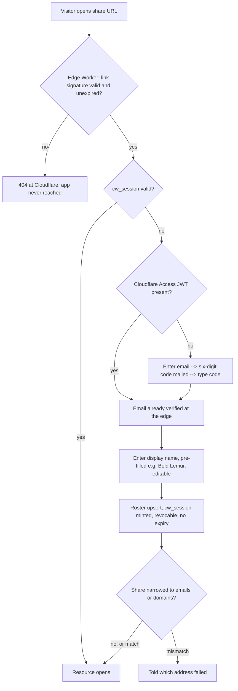

# Email authentication & sharing — design

**Task:** Every user authenticates by email, and sharing is one act: send a link; the visitor verifies an email and is in.

## The flow everything plans around

Per Bryan (2026-08-27): share a URL that works for anyone. On first visit the visitor proves control of an email address (under a minute), enters a display name, and the shared resource opens the moment they verify. No pre-enumeration of recipients, no approval step, ever.

- **Six-digit code, not a magic link.** iOS home-screen PWAs keep their own cookie jar; a link tapped in Mail signs in the wrong window. A code is typed into whichever window asked for it, which also covers mail arriving on a different device. Where Cloudflare Access already verified the email at the edge, there is no code box at all.
- **A name, not a hash.** The verify screen asks for a display name, pre-populated with a generated `<short adjective> <zoo animal>` (each word ≤6 characters — "Bold Lemur", "Calm Okapi"), editable before continuing. The `user-<hash>` id derived from the email stays internal and is never shown.
- Identity is real from the first comment: it carries their chosen name ("Bold Lemur"), backed by a stable internal id derived from the email — the id is plumbing, like a row key, and never appears anywhere a person reads. The guest- path retires for new shares.
- **Optional narrowing, same experience.** A share may carry `allowedEmails` / `allowedDomains`. Verification is unchanged; the gate additionally checks the verified address, and a mismatch is told which address failed. Access is still instant on verify — the list never adds an approval step.
- **Returning visitors** with a live `cw_session` skip everything.

## Layers of security

From the edge inward. Each layer is independent; traffic clears every layer that applies to its path.

1. **The edge** — two independent gates before the tunnel (adopted 2026-08-28). 
  1. **Gate one**, the signed link: share links are capability URLs carrying an id, an expiry, and an HMAC signature; a small Cloudflare Worker on the share path verifies both before anything is forwarded, so an invalid or expired link 404s at Cloudflare and the box never sees the request. 
  2. **Gate two**, identity: Cloudflare Access, split by path — the share subtree takes one-time PIN to any email (its login IS the verify flow: enter an email, type the code Cloudflare mails), while the rest of the hostname stays restricted to Bryan's own email indefinitely. The app trusts only a **validated** `Cf-Access-Jwt-Assertion` — checked against Cloudflare's public keys, never the bare header — and mints the same `user-<hash>` a code would have. The policy change is a dashboard edit and is Bryan's to make; agents don't write to the Cloudflare account.
2. **The tunnel.** The box exposes no public ports; the only public path is the Cloudflare Tunnel, so layer 1 cannot be routed around.
3. **Network identity on private paths.** The tailnet and LAN never pass Cloudflare. There, Tailscale device identity is the outer gate, and the app's own email + code flow supplies the identity Access would have supplied at the edge.
4. **App session**. cw_session: HMAC-signed, HttpOnly, SameSite=Lax, Secure derived from the real client scheme. No expiry until revoked (Bryan, 2026-08-28) — which makes server-side revocation load-bearing: the cookie carries a session id checked against the roster, so logout or a future "sign out everywhere" actually ends it. Minted only after email verification, by either path. The revocation denylist **fails closed** (Bryan, 2026-08-28, superseding the fails-open tradeoff the store originally documented): if the file exists but cannot be read, no session validates — and the server self-heals by ending every outstanding session through the roster's `sessionsValidFrom` watermark, keeping the broken file aside as evidence, and restarting the list empty, so everyone re-logs in rather than anyone being resurrected or permanently locked out. The file is created eagerly at first boot, and a denylist that vanishes at runtime also refuses all sessions.
5. Resource authorization. The edge proves a live link and a verified person; the share grant decides what this person may see — exactly the shared resources. allowedEmails / allowedDomains are enforced here, instantly on verify. With the signed-link Worker in front, this layer is defense-in-depth rather than the load-bearing wall.
6. **Attribution integrity.** When a request carries a verified session, the server's identity verdict outranks whatever the body claims (`CW_REQUIRE_EMAIL_AUTH` today).

### How this flow is secured (industry pattern — adopted, Bryan, 2026-08-28)

The standard pattern for "share a link with a stranger" — Google Docs, Figma, Notion — is a **capability URL**: the link itself carries an unguessable token, so *holding a live link* is the first factor and *proving an email* is the second. Crucially, the surface a stranger can reach without a valid link is tiny — a login page and a not-found page. The app as a whole is never exposed to arbitrary signed-in strangers.

Applying that here, three changes:

1. **Two edge policies, split by path.** Cloudflare Access defines applications per hostname *and path*. The share subtree (`/share/*`) gets one-time-PIN-to-any-email; everything else on the hostname stays restricted to Bryan's own email at the edge, indefinitely. A stranger who verifies an email reaches only the share surface — never the board, the editor, or the API at large. The burden to reach the app layer stays high everywhere except one narrow, purpose-built path.
2. **The share surface is deny-by-default.** One middleware guards the subtree: no valid, unexpired share grant named in the URL → refused before any handler runs. A verified email alone earns nothing.
3. **Links stay capability URLs.** Unguessable ids plus the two-week default expiry, so admission always takes both factors: a live link AND a verified email. Edge rate limiting on the subtree comes with Cloudflare.

And the robust-outer-layer version (Bryan's follow-up, 2026-08-28 — don't make the app layer load-bearing): the link check itself moves to the edge. Share links become signed URLs — id, expiry, and an HMAC signature, the S3-presigned-link pattern — and a small Cloudflare Worker in front of the share path verifies signature and expiry before traffic reaches the tunnel. An invalid or expired link 404s at Cloudflare; the box never sees the request. With Access adding the email PIN on the same path, a stranger crosses two independent edge gates (valid live link, verified email) before touching the app, and the app's own grant check becomes defense-in-depth rather than the load-bearing wall. Early revocation of a still-unexpired link stays an app-layer refusal (or a Worker KV denylist later if it matters).

The composition matters: Access decides whether traffic reaches the app at all; the app decides what a verified person may see. Neither replaces the other.

## Where this already stands

Already on main:

- **`auth/email-code.ts`** — six-digit codes, hashed with a per-challenge salt, 10-minute TTL, five attempts, three separate rate limits.
- **`auth/session.ts`** — the `cw_session` cookie as described in layer 4.
- **`identities.ts`** — the people roster. A person becomes a row the first time they prove control of an address. The id is *derived* from the email, so a lost roster costs display preferences, not attribution.
- **Routes** — `POST /api/auth/start`, `POST /api/auth/verify`, `GET /api/auth/session`, `POST /api/auth/logout`.
- **Cloudflare Access composition** — an Access-verified email mints the same `user-<hash>` a code would have.
- **`auth/cloudflare-code-sender.ts`** — real mail through Cloudflare Email Sending, falling back to printing the code in the server log until configured.
- **`identity-links.json`** — explicit `anon-xxxx → identity` links, read at boot and by the activity backfill.

Not built yet: the share verify-then-admit gate, the display-name screen, any sign-in UI, the Access-everywhere policy (Bryan's dashboard edit), and the decision about what the flag should eventually enforce.

## Goals

- One person is one identity, across devices and browser profiles — derived from an email address, not minted by a browser, so it survives a cleared cookie jar or a new device.
- Comments, activity and presence attribute to that identity; a name in a request body can no longer claim to be somebody else.
- Signing in is a few seconds on the device already in your hand.
- Sharing to anyone takes under a minute for both sides: send the URL; the visitor verifies and is in.

## Non-goals

- Enterprise SSO, SAML, org directories, roles or per-doc permissions. A workspace stays a shared view — everything in it is available to everyone in it.
- Passwords, password reset, account recovery.
- Authenticating MCP agents by email.

## Mechanics

Sending codes: Postmark, behind a seam (Bryan, 2026-08-28). Cloudflare's own sender would have required onboarding the whole fryanpan.com zone, which stays on Google Workspace; Postmark instead verifies a sending subdomain with two DNS records (a DKIM TXT and a Return-Path CNAME) at the current DNS host — apex MX and Google Workspace untouched. The CodeSender seam makes this a single-file swap of cloudflare-code-sender.ts. Needs three things only Bryan can do: create the Postmark server and verify the sending subdomain (e.g. send.fryanpan.com); set AUTH_EMAIL_FROM to an address on it (deliberately not defaulted — a guessed domain fails on the first real login); put the Postmark server token in the Keychain under postmark-api-token. Until then codes print to the server log and the boot log names the missing piece.

**Identity mapping: resolve at read, never rewrite at rest.** An email becomes `user-<hash>`, derived, never assigned. `known-bryan` is already bridged via `CW_OWNER_EMAIL`; `anon-xxxx` ids resolve through `identity-links.json` plus the roster's `mergedFrom`. Stored ydocs keep the id stamped on them — bulk-rewriting history would be a destructive migration for a benefit a lookup already provides. No self-service claim flow (Bryan, 2026-08-28): a one-time historical migration linked every anonymous id to date to Bryan instead — he has been the only user — with test probes excluded. Applied to identity-links.json with a dated backup beside it; takes effect at the next server restart.

**The widget cannot carry the session, and that is a real gap.** The widget runs in another origin's page, calls `fetch` without credentials, and the server answers `Access-Control-Allow-Origin: *` — incompatible with credentials anyway. Widget comments on a dev server stay anonymous even after you sign in on the same laptop. Decided (Bryan, 2026-08-28): mockups need nothing — they are served from the workspace's own origin, so the session cookie already travels. Dev servers get a popup handshake, filed as its own task: the widget opens the workspace origin, already signed in, which hands back a token tied to the session and revoked with it. Production sites never offer workspace auth — the widget is a review-time surface, and a prod visitor has no reason to hold workspace access.

**Agents do not email-authenticate.** They keep the claimed-body identity made distinct by `FEEDBACK_AGENT_NAME` and `attach_agent`. Agent ids stay in their own namespace; nothing in the code path may mint a `user-` id for one, so "a person" and "a session" stay separable in every activity view.

## Rollout

1. **Now** — set `CW_OWNER_EMAIL`, finish the Email Sending setup, turn `CW_REQUIRE_EMAIL_AUTH` on. Today the flag changes attribution only — a verified session outranks the body's claim; it refuses nothing — so nothing breaks.
2. **Next (the build)** — the share verify-then-admit gate with the display-name screen, the sign-in UI (workspace-header entry plus a prompt when an unauthenticated browser first writes), and the "this was me" claim.
3. Then (Bryan's dashboard edit) — Cloudflare Access covers the whole public hostname; the app validates the JWT. From that point no unidentified traffic reaches the app from the public internet. Revised after Bryan's low-burden concern (2026-08-28): two Access applications split by path — see "How this flow is usually secured" above. The whole hostname stays restricted to Bryan's own email indefinitely; only the share subtree gets one-time-PIN-to-any-email, and only after the signed-link Worker and the deny-by-default grant middleware both ship.
4. **Later, and only if wanted** — enforce on *writes*: an unauthenticated browser can read but not comment. First step that breaks anything (any browser that never signed in).
5. **Probably never** — enforce on reads over the tailnet. It is already an authenticated network; a second gate mostly locks you out of your own board on a device you have not signed in on yet.

## Open questions

1. **Which From address?** 
  1. Sender is Postmark (decided 2026-08-28). Name the sending subdomain and address, e.g. auth@send.fryanpan.com — two DNS records at your current DNS host; Google Workspace untouched.
2. **Session length**: never expire until revoked (Bryan, 2026-08-28). Build note: sessions become revocable server-side, and the existing 90-day sliding code moves to this model.
3. Access policy scope: decided (Bryan, 2026-08-28) — any email may use a share link; the edge policy stays one-time PIN to any email. Folded-in requirement: share links expire by default two weeks after creation (a temporary-use default while sharing is young; the share module's existing TTL support carries it, and a longer TTL stays a deliberate per-share choice).
  1. Link should expire by default in 2 weeks, this is for temporary use at the beginning
  2. And okay to allow any email to use the link
4. Writes on the private paths — the one remaining sign-in question. (Answering the comment: "step 4" is Rollout step 4 above. On the public internet all access WILL require sign-in once the Access policy lands — nothing reaches the app unidentified. The gap is the tailnet/LAN, which never passes Cloudflare: there a browser that has not signed in can still read and write today.) The question: should such a browser be blocked from writing (commenting) until it signs in, or is read-and-write-with-attribution-when-available fine on your own network?
  1. I thought all access requires sign-in?  What is "step 4". I don't see this above
5. **"This was me"**: 
  1. no automated flow (Bryan, 2026-08-28). 
  2. Done instead as a one-time historical migration — every anonymous browser id to date is linked to Bryan (sole user), except two test probes. Once email sign-in gates shares, new anonymous ids stop appearing.
6. **Widget identity** (Bryan, 2026-08-28): 
  1. dev servers get the popup-handshake token as its own task; production sites never offer this auth — kept separate.
7. Existing shares: migrate or deprecate (Bryan, 2026-08-28) — no share keeps working ungated. Each existing share either moves to verify-then-admit or is retired.
  1. Existing shares migrate or deprecated

## Meeting notes

- **Analytics tracking** — how to maintain accurate, per-user tracking of time spent in tool when multi-user support is added; need design for this

### Per-person analytics (how to handle it)

**What already exists.** Every open, read, comment and presence tick lands in an append-only activity log with an actor id — the same log the weekly analyses are rebuilt from. Nothing here changes storage.

**What email auth adds.** The actor id becomes one stable identity per person, across devices and browsers (before auth, one person was many anonymous ids; the one-time migration above collapsed that history). Per-person rollups become meaningful for the first time.

**How time-in-tool is measured.** Sessionize at read: order one identity's events, split on gaps longer than an idle cutoff (~5 minutes), sum the runs. Resolve-at-read, like identity mapping — no rewriting stored events, cutoffs tunable later, all history recomputable under new rules.

**Accuracy rules.** Presence counts only while the tab is actually visible; agents stay in their own namespace and are never counted as people; events that resolve to no identity are reported as their own bucket rather than silently dropped — a silently-low count is this system's known failure mode.

**When to build.** The log and identities exist now; the sessionizer is a read-side module plus a small per-person report. Design the report surface when multi-user actually arrives — nothing about waiting loses data.

## What local-first software does about security (researched 2026-08-28)

Local-first apps — the school of software named by Ink & Switch, where your data lives on your devices and servers just relay and store — face the same question we do: how do you share something with a specific person when there's no big trusted login system in the middle? Their answers cluster into three patterns.

**Pattern 1: the link is the permission (capability URLs).** The dominant pattern, and the one we adopted. An unguessably long link IS the access right: Automerge document ids work this way, and Excalidraw's share links go further by putting the decryption key after the `#` in the URL, where browsers never send it to the server. Anyone holding the link can open the document; nobody else can find it. Our signed share links are this pattern plus two things the pure local-first version can't do: an expiry date baked into the link, and a signature a server (our edge Worker) can check and refuse — a plain capability URL lives forever, which is exactly the weakness Bryan flagged.

**Pattern 2: encrypt so the server can't read anything.** Excalidraw encrypts every drawing in the browser (AES-GCM) before it touches their server; Ink & Switch's Keyhive project aims for sync servers that only ever hold ciphertext. What this buys: a compromised server leaks nothing. What it costs: every server-side feature that needs to read the document dies — search, the meeting assistant, per-person analytics, and above all agents reading and editing docs. Our product's whole point is that the server is a *participant* (agents live there), so full end-to-end encryption fights the product. We take the other trade deliberately: readable server, protected by the edge gates and the tailnet — and the server being Bryan's own local box means "the server can read everything" is not the threat it is for a hosted service (Bryan, 2026-08-28). Where this pattern becomes relevant for us is a future cloud mirror: content leaving the box for someone else's infrastructure is the point where encrypting it starts paying for what it costs.

**Pattern 3: permissions as signed data, not a server table.** The research frontier (Keyhive's "convergent capabilities", the UCAN certificate-chain approach): who-can-access travels *with* the document as cryptographically signed statements, and revocation means rotating keys. Not adoptable today — it's active research — but the mental model already matches our design: a signed share link is authorization-as-data in miniature.

**What we take from this now:**

- Our adopted flow is the industry pattern, strengthened — capability URL + expiry + server-checkable signature. No redesign needed.
- Capability URLs have one classic leak: the link escapes through server logs, browser history, and `Referer` headers. Local-first apps dodge this with the `#` fragment trick; we can't (the Worker must see the signature), so instead: set `Referrer-Policy: no-referrer` on share pages, and never log full share URLs — scrub the `sig` parameter in any request logging.
- Worth watching, not building: Keyhive-style encrypted sync for a per-doc "sensitive" tier someday — with the honest caveat that agents would go blind on those docs.

Sources: [Local-first software (Ink & Switch)](https://www.inkandswitch.com/local-first-software/) · [Keyhive](https://www.inkandswitch.com/keyhive/notebook/) · [Excalidraw end-to-end encryption](https://plus.excalidraw.com/blog/end-to-end-encryption)
