# Workspace Hub — v1 Build Plan

Status: draft for Bryan's review · 2026-08-13. "Workspace Hub" is a placeholder product name. A companion review doc (kept local, not in this repo) holds the long-form rationale and the worked example; this plan is the buildable subset.

**The thing being built:** one URL per project that answers "where are we, what's next, what's waiting on me" — truthfully. A workspace has a **goal**, a task board, its review docs and diffs, its open threads, and one or more **attached agents**. Task status, assignees, and evidence are structured data the system maintains — not prose an agent retypes — so they can't go stale, and agents stop wasting time (and tokens) hand-copying state that a plain field update handles better. When a task says "done", it links to the actual commit or thread that proves it. Task bodies are still free-form prose, so they can still drift; everything behind the gate can't.

---

## 1. Outcomes

Above all else, this tool should help streamline Bryan and his coordination with his agent team on projects and collaboration with a growing circle of other folks.

In time, this may also become more useful to other people and teams.

### Detailed Outcomes 

Every line is a yes/no you can check on a running build, except lines tagged [direction] — steering principles, not v1 checks — or marked as future work.

**Priority order (decided 2026-08-13):** the goals below are listed in priority order and numbered accordingly — goal 1 (Tasks), goal 2 (Goal), goal 3 (Best surface), goal 4 (Collaboration); goals 5–6 and the misc list are nice-to-haves. Cross-references throughout the doc use the numbers as listed. (Corrected by ultrareview 2026-08-13: an earlier revision of this line carried a stale pre-reorder numbering that inverted the build order if read literally, and the stale cross-refs in §3.8/§3.9/§5 were fixed to match.) Bryan wants to reach the Collaboration goal within the next day; the minimal-share slice in §3.12 (PR 1, commit 8) is what makes that reachable.

1. **UC1: Tasks are extremely lightweight and designed for agents to move quickly ****Pain Point: **When your work surfaces are more efficient and it takes 5 seconds to spawn a new task for an agent and the agent might go do half a day's work in 2-10 minutes, the overhead of managing tasks even for one person and their agent team quickly overwhelms existing standalone task management tools.  
  1. Tasks can be easily created from anywhere
    1. Comment on a doc, and if it's a big enough chunk of work, it turns into a task A comment thread on any doc/diff/mockup becomes a task in one tool call (agent) or two taps (human), keeping a bidirectional link between doc thread and task, and the task automatically gets proper context in it.
    2. Talk to the agent from the main workspace manager and make multiple tasks at once
    3. Agent can create tasks as it's doing existing work
    4. Decisions can turn into tasks
    5. Can import tasks from other linked tools via MCP (e.g. import and keep this task in sync with a Jira task) 
  2. Agents streamline task lifecycle 
    1. Deciding if it's worth creating a task, or just doing something quick
    2. Automatically choosing assignee, choosing priority and grouping
    3. Create a detailed enough task description
    4. Works on tasks according to priority and dependencies (and has the flexibility to spin up additional subagent teams and workflows when needed)
  3. All things link to each other (tasks, documents, decisions, etc.) to provide good context and organization
    1. Agents and humans can understand the details of a task by having all relevant links easily available 
    2. Tasks can be flexibly organized into whatever structure serves the purpose (e.g. an agent can take a minute and create custom views for you in markdown docs)
2. **UC2: Goals guide all work to optimize value delivery ****Pain Point This Solves: **Agents regularly go off task when they're given free rein on harder problems for many hours.  Setting a pervasively recorded goal that governs all work and doesn't just start a "goal loop" is one attempt to get better at this.  This will also allow agents to start taking over some of the product management decisions -- in manual testing, Fable/Opus seem to do okay at these tasks these days.** **
  1. Each workspace has a `goal` markdown rendered at the top of the hub and editable in place e.g. for one of the fleet's other projects, right now it is to get critical bugs squashed and have the branch ready for PR by EOD
  2. Over time, the agent can help to automate work to go after the goal [direction]
    1. Make prioritization decisions as new tasks are created from anywhere in the workspace And then report on the task how it was prioritized
    2. Come up with additional tasks that are needed
  3. If the goal changes or refines, the agent can execute reprioritization of work (and ask for approval if there's any questions)
3. **UC3: Work happens on the best surface for that work to improve productivity and joy ****Pain Point This Solves: **Chat is rarely the best surface to do work -- it's just the only surface we have.  Other tools (Notion, Google Docs, Confluence, Jira, etc.) also often are rarely the best surface because they have heavyweight, sucky agent interfaces that are in their own silos and divorced from other tools and the project context.  This goal is about doing work in the best surface for that work.  Which will over time may include having custom surfaces for each project -- but for now, I've found that having docs, interactive mockups, folder tree diffs, tasks, and decisions are the most important types to start with.
  1. All surfaces are tuned for usability, speed, etc. [direction]
    1. No long transitions or cute things that don't add value
    2. All layout and formatting is built for speed and comprehension first and delight second
  2. Planning happens in a document with access to full markdown + mermaid
    1. Human can create using whatever methods are most efficient Voice, typing, asking agent to do research and fill in a section, commenting to agent, etc.
  3. Task management happens in a task manager Designed to streamline the most important operations
    1. Batch and highlight what needs human attention and help make that work smooth What's the top hit list for human(s) right now
    2. Where is the agent at and is it blocked on anything?
  4. All surfaces support the best possible interfaces for target audiences
    1. Experiment with voice interfaces for everyone [direction; the sub-items below are the v1 checks]
      1. Every surface has an affordance to do a general voice chat in that context with agent
      2. Prototyped already for main workspace view
      3. Should also work in doc (and agent should be aware roughly where we are in doc scroll)
      4. Should also work with task 
      5. **Voice always answers.** Every push-to-talk request gets an explicit ack naming what was heard and which route is handling it (fast path vs workspace agent) — including "agent away, queued".
    2. Hotkeys for Bryan
    3. Future work: prototype interface on iPhone where we use the IR camera for gaze sensing + voice so we know what you're looking at as you talk and you can look at different things as you're talking...sounds like it might be fun :) [direction] 
  5. Almost nothing happens in a chat screen -- chat is the worst common denominator But sadly the frontier labs are stuck in chat world and are moving away from it too slowly
4. **UC4: Can easily (remote) collaborate on anything saving hours to days a week of Bryan's time coordinating with other people ****Pain Point: **Existing review cycles are too slow and managing feedback from collaborators is hard when it all bottlenecks through Bryan.  Instead, why not let collaborators have direct, secure access to the work while it happens?
  1. **Fast, secure share** Collaborators have a share flow to get secure access to the whole workspace within 1-2 minutes
  2. **Everything is multiplayer live edit **All of it is multiplayer synchronously updated and satisfies all properties above (agent keeps team on goal, work is lightweight, and humans have the best possible surface for using their expertise)
  3. **Collaborators can steer the work while it happens **Policy (TBD) can be declared up front somewhere
    1. In the future, collaborators may bring their own agents with their own skills and perspectives
  4. **Everything works on mobile **Need to be able to remotely work from anywhere for both Bryan and collaborators. Availability target (decided 2026-08-13): 99% uptime — the hub is up when you pull out your phone, and recovery after a crash loses no data
  5. **Ambient Awareness** Agents and humans work slightly different ways, but awareness of what the agent is doing and why is it answering or not can be helpful
    1. There's a way to see and jump to where each person is in the workspace And go to the place they're at and follow them
      1. If the person or agent is working on more than one thing (e.g. multiple tabs open) Give affordances to show when they last interacted with each thing And let the user choose which active thing they want to follow
  6. Future Goal (v2+ — the buildable detail lives in §5): Digital Twin for Legacy Applications Legacy applications are slow, but at many companies, they integrate with existing people and processes And so they're a necessary evil
    1. **Workspace and legacy apps stay in sync**
      1. Workspace is primary, and legacy apps are secondary
    2. **Sync with the workspace breaks down silos**
      1. Workspace is the single unified context that goes across
      2. Users can collaborate with legacy apps or with the workspace e.g. comments in Confluence show up as comments on the digital twin doc in the workspace and agent replies in workspace get sync'ed back out
5. **UC5: Verifiability improves work**
  1. **Evidence is attached.** 
    1. Every transition to `done` or `in-progress` stores evidence (commit hash and/or thread id) and the board renders it as a chip linking to the diff review or thread.
  2. **Auditability for self-improvement**
    1. All interactions are collected so that in combination with the agent transcript(s), we have a rich source of information to trawl for what went well, or what didn't.  To continue improving 
6. **UC6: High Quality Work + Token Efficiency**
  1. **Token Efficiency**
    1. We regularly review with agents using the workspace platform over time to optimize tool use (e.g. make it easier for agents to do what they need to do with fewer tokens). Budget (decided 2026-08-13): even at 30+ hands-on hours a week, total fleet usage stays under two 20x Max Claude accounts
    2. We also review for other chances to optimize [direction]
      1. For example, do we want to automatically batch comments together for agents to review all at once instead of sending events piecemeal?

1. Also in v1 — misc goals (each is checkable and has a PR commit)
  1. **Decisions keep the words.** Answering a row in the quick-decisions strip emits one event per decision carrying the verbatim answer text; the row keeps the quote.
  2. **One login, N workspaces.** `grant_workspace_access(workspaceId, grantee)` returns a join link; the grantee logs in with their email (OTP), lands **directly in the shared thing**, and acts as themselves everywhere. A login outside the grant gets a byte-identical refusal that leaks nothing about who was invited.
  3. **Adoption isn't re-keying.** `import_tasks_markdown` ingests an existing hand-maintained markdown tracker (group headings + status tables), with a dry-run that returns the mapping first.

**Out of scope (explicit):** bring-your-own-agent for collaborators (wake: relay exists + a real team reviewing regularly) · burndown/reporting · an aggregated cross-workspace "what needs Bryan" and other aggregated cross-workspace views. Decided 2026-08-13 (Bryan, on Team Lead's adoption test): the team-lead runs a metaproject workspace of its own; workspace-to-workspace linking comes later, and keeping boards in sync is the team-lead's job during the transition, to be automated over time. Ref already points across workspaces — task ids are globally unique — so a metaproject goal can reference the project tasks that satisfy it from day one; only the aggregated read side is deferred · cross-workspace views beyond "shared with me" · the reverse-ordering resolve hazard (needs `resolvedAt`; separate backlog item).

---

## 2. Key use cases & flows

### 2.1 Day zero: empty workspace → plan → tasks

A workspace starts empty, and planning comes first — the board is born from the plan, not typed in by hand. Two ways in, converging on the same path:

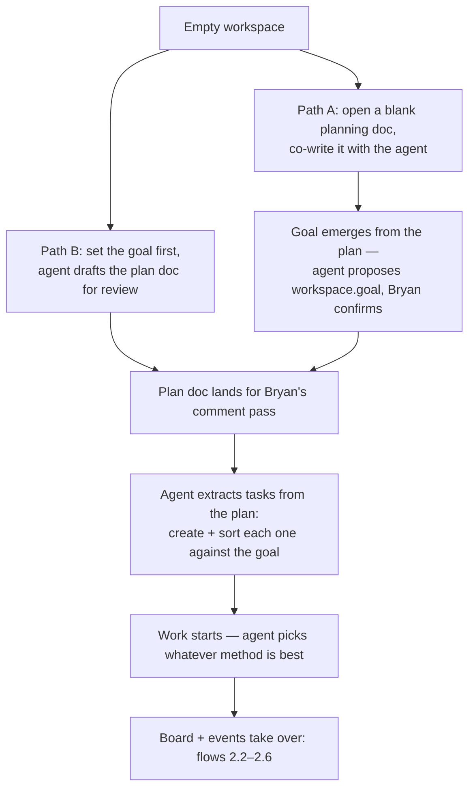

- The planning doc is a normal review doc in the workspace — comment threads, live co-editing, and tracked suggestions you accept or reject — so "planning" and "reviewing the plan" are the same activity.
- Either path, the goal is set before tasks exist. It has to be: when a task is created, the agent sorts it against the goal, deciding its priority group and whether a person or an agent should own it. This doc calls that **triage**. In Path A the agent proposes the goal from the plan; confirming it is one edit in place on the goal strip.
- Task extraction is the same `create_task` plus triage as every later path (§3.4) — day zero isn't a special mode, just the first run of the normal loop.
- "Whatever method is best" is the agent's call (solo, subagents, a workflow pipeline); the board only sees what actually happened — a record of each task change, with the commit or comment thread that proves it.
- The empty hub therefore shows one main button: **start planning** (open the first plan doc, or set the goal), not an empty board.

### 2.2 Comment → task, triaged against the goal

The default path into the board. The agent doesn't just file the task; it places it.

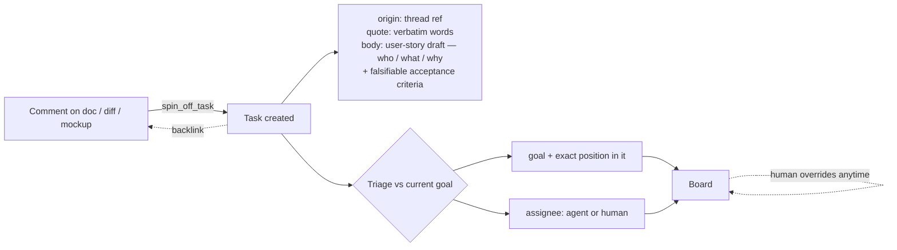

The agent's choice is a starting point, not a ruling — you can move any task in one tap, and that move is recorded the same way the agent's was.

### 2.3 Morning drive-by (phone, 90 seconds)

The mobile flow that has to work — if only one thing does, it's this: read the goal, clear the decisions, nudge priorities, put the phone away. (A **strip** is a single-line band running across the top of a column.)

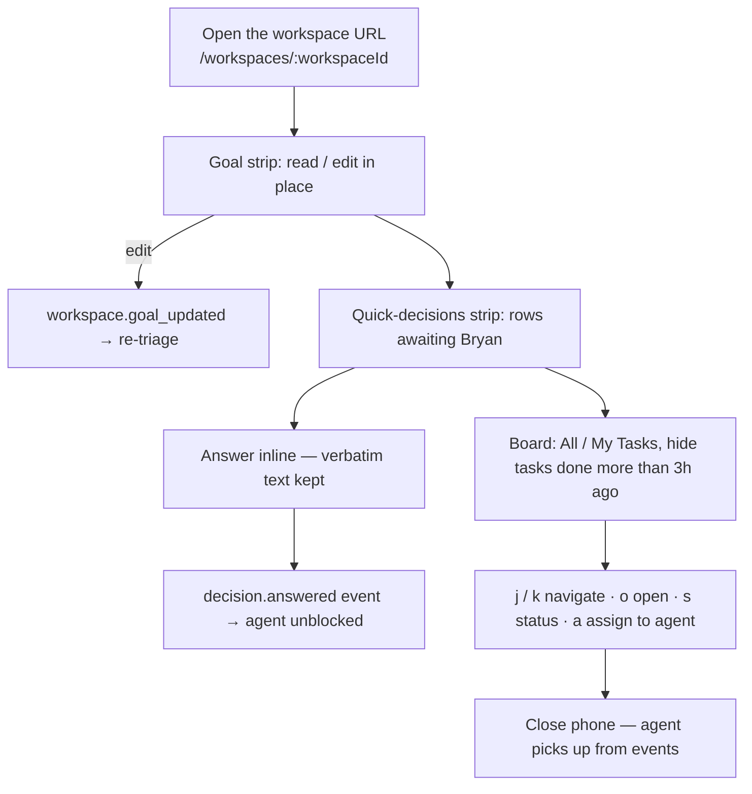

| Key     | Action            |
| ------- | ----------------- |
| `?`     | shortcut help     |
| `j` `k` | move between rows |
| `o`     | open task detail  |
| `s`     | cycle status      |
| `a`     | assign to agent   |

Same keys on desktop; on mobile the equivalent is tap-to-change status chips and the assignee autocomplete.

### 2.4 Voice push-to-talk, two routes

Hold Space anywhere on the board (or hold the mic button, bottom-left, out of the deep-work path). Dictation streams live while held; the full transcript lands on release.

**The agent follows you** (decided 2026-08-13). A voice session isn't one-shot: say "take me to doc X" and keep holding — the page navigates, the mic stays open, and the agent keeps listening with the surface you're now on as its context. Navigation doesn't end the conversation; releasing does.

Two pieces this flow depends on, both used throughout the rest of the plan:

- **The choke point.** Every change to a task goes through one place on the server — a single gate. Nothing writes to the board directly. That gate records who made the change, attaches the proof, and notifies everyone watching.
- **The fast path.** A small, quick model (Claude Haiku) running on the server, which handles simple lookups without waking the main agent.

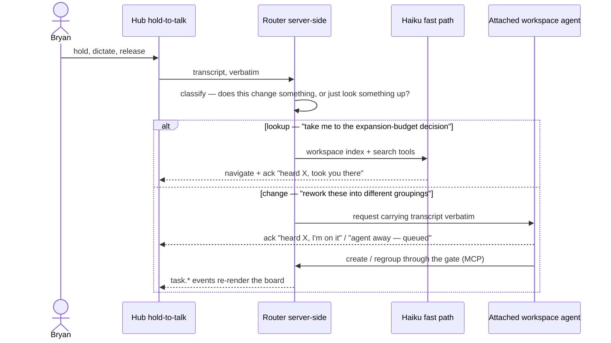

**Voice always answers.** Every time you speak, you get a reply confirming what was heard and what is being done with it — describing what actually happened, not what is likely to happen next. The fast path runs on the server, so lookups work even with no agent attached.

### 2.5 Sharing: invite, deep-link, uniform denial

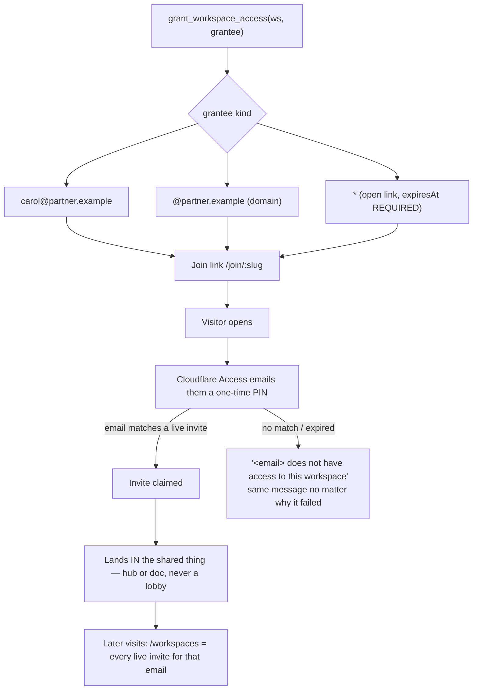

Sharing a single doc and sharing a whole workspace use the same mechanism — an invite just records which one it covers. To decide whether someone can open a doc, we ask one question: does their invite name this doc, or the workspace it lives in?

### 2.6 Agent ↔ Bryan loop (comments + adaptive delivery)

**Decision (2026-08-13): comments are the primary channel.** When an agent has something to share about a task or a piece of work, it posts a markdown comment on the relevant thread or task — not a chat message in the terminal session. Comment threads and task comment streams already *are* chat, anchored to the work. A dedicated hub chat surface is a future consideration, not v1.

If an agent needs to convey something even bigger that's not readable in a comment, it can create a doc in the workspace (may be temporary or backed by a file in the git repo) and then link to that doc from a comment in a thread or task.

Messages going the other way — server to agent — arrive instantly when the agent is free. They're only bundled up when the agent is already mid-task and couldn't have read them anyway.

```mermaid
stateDiagram-v2
  [*] --> IDLE
  IDLE --> BUSY: event arrives → deliver NOW, mark BUSY
  BUSY --> BUSY: hold messages; if a thread changes twice, keep only the newest
  BUSY --> IDLE: agent finishes its turn (signalled by a Claude Code Stop hook) → send everything held
  BUSY --> IDLE: 120s cap reached → send everything held
  BUSY --> IDLE: anything goes wrong → send everything held anyway (never drop a comment)
```

**Escalation exception:** a comment on the thread the agent most recently acted on skips the hold — that reply is about the thing the agent is doing right now, so it goes straight through instead of waiting.

### 2.7 Ambient awareness: see where everyone is

(Goal 4.5 — this section exists because the goals review found the goal had no design at all.) Half of it already exists: every live doc connection carries Yjs awareness (who is in which doc, where their cursor is), and the agent side has `lastHeartbeat` plus the last thread it acted on (§3.7 tracks it). The hub aggregates both into a **presence strip**: one chip per person and agent, showing the surface they're in and how long since they last touched each thing they have open (covering the multiple-tabs case in goal 4.5). Tap a chip to jump to where they are; long-press to **follow** — your view navigates when theirs does, driven by `presence.moved` events.

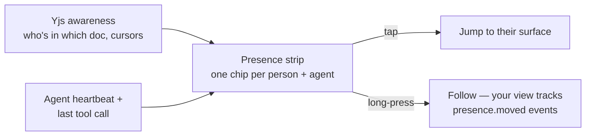

Agents surface the same way ("in t-abc123 · editing search.ts · 40s ago") — which also answers goal 4.5's "what is the agent doing and why is it answering or not" from real signals (heartbeat, last tool call), never from guesses.

---

## 3. Technical decisions

### 3.1 Component map

Four words used throughout this section:

- **ydoc** — a live shared document (Yjs), the thing browsers sync to see each other type.
- **sidecar** — a plain JSON file next to the doc that only the server writes.
- **projection** — a read-only copy of server data pushed into the live doc so the UI updates instantly.
- **SSE** — the one-way live event feed the server pushes to agents.

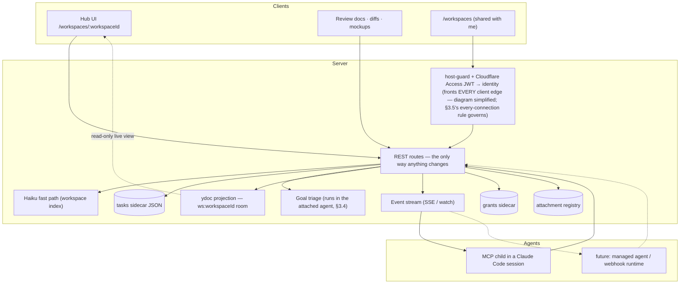

One rule holds this together: **every change goes through the server's single gate.** The live shared document is a mirror the UI reads — nothing is ever changed by writing into it. (Later, a cloud copy could host this same arrangement — the boxes move, the wiring doesn't. See §4.1.)

### 3.2 Data model

```ts
type Ref =
  | { kind: 'doc'; docId: string }
  | { kind: 'thread'; docId: string; threadId: string }
  | { kind: 'task'; taskId: string }
  | { kind: 'diff'; workspaceId: string };          // a diff review is a workspace

interface Workspace {
  id: string;                       // crypto-random, unguessable — URLs hang off it
  name: string;                     // e.g. "search-revamp"
  goal: string;                     // FIRST-CLASS. Markdown (Bryan, 2026-08-13). Shown at the top of the hub, editable in place.
  goalUpdatedAt: number;
  goals: Array<{                    // ordered by priority — REPLACES free-form groups (decided 2026-08-13)
    id: string;                     //   board sections ARE the goals; goal order IS priority order
    title: string;                  //   e.g. "1. Get the PR out" — a shape taken from a real project
    dueAt?: number;                 //   optional at EVERY level — goal, subgoal, task (Bryan, 2026-08-13)
    subgoals?: Array<{ id: string; title: string; dueAt?: number }>;  // ONE level max; deeper nesting kills the 5-second task
  }>;                               // plus a standing Chores catch-all for no-goal work
}

interface Task {
  id: string;                       // t-<nanoid> (crypto-random)
  workspaceId: string;
  title: string;
  body: Y.XmlFragment;              // live markdown in a CRDT, same editor as docs; snapshot in store
  assignee: 'human' | 'agent' | string;  // agent-decided by default on create
  needs?: 'action' | 'decision';    // only meaningful when assignee = human
  goal: string;                     // goal or subgoal id (decided 2026-08-13); 'chores' = the catch-all
  order: number;                    // sort key; decimals mean you can always insert between two tasks
  status: 'todo' | 'in-progress' | 'done';  // deliberately just three (2026-08-13) — no 'held' status;
                                    // "don't start yet" isn't a status, it's a dependency (see `after`)
  after: string[];                  // task ids this depends on — separate from group order
  dueAt?: number;                   // optional (added 2026-08-13, Team Lead's adoption test) — goal sections
                                    // can't express "due Thu, it's Wed, not started"; slippage reporting needs a date
  links: Ref[];                     // from inline ⌘K mentions in body + structural refs; backlinks computed
  origin?: Ref;                     // the thread/doc this was promoted from
  quote?: string;                   // the human's verbatim words at promotion or creation
  answer?: { text: string; by: string; ts: number };   // decisions keep the verbatim answer
  triagedAgainst?: { goalId: string; goal: string; ts: number };  // which goal (id + its text at the time) produced this placement
  transitions: Array<{              // append-only audit trail
    ts: number; from: string; to: string;
    by: { id: string; name: string; kind: 'person' | 'agent' };
    note?: string;
    evidence?: { commit?: string; threadRef?: Ref };
    usage?: { inputTokens: number; outputTokens: number };  // agent-reported cost at done
  }>;
  createdAt: number; updatedAt: number;
}

interface WorkspaceGrant {
  workspaceId: string;
  grantee: string;                  // lowercased; "carol@partner.example" | "@partner.example" | "*"
  scope: { kind: 'workspace' | 'doc'; id: string };
  role: 'collaborator';             // v1 has one role
  expiresAt?: number;               // REQUIRED for "*" grants (self-revoking open links)
  createdAt: number;
  joinSlug: string;                 // invite link slug; single-purpose, revocable
  claimedAt?: number;               // set on first successful login
}

interface AgentAttachment {         // see §4
  workspaceId: string;
  agentId: string;
  runtime: 'claude-code-local' | 'managed-agent' | 'webhook';
  endpoint?: string;                // absent for the local session
  lastHeartbeat: number;
  lastToolCallAt: number;           // heartbeat proves the child is alive; this proves it can work
  capabilities: string[];           // e.g. ['tasks.write', 'docs.edit', 'voice.mutations']
}
```

A **CRDT** is a data structure where two people editing at once merge automatically — no locking, no "who wins". A **fractional index** (`order`) uses decimals so a task can always be dropped between two others without renumbering the rest.

**Goals replace groups (decided 2026-08-13).** The board's sections are an ordered list of goals with at most one subgoal level — a shape taken from a real project: 1 = get the PR out, 1.1 = post-PR tickets, 2 = blog post, 3 = binary size. Goal order is priority order, so reprioritizing means reordering goals, never re-bucketing tasks. The markdown `goal` field stays as the north-star statement that §3.4 judges against; the goal list is the work breakdown, and each goal completes observably when its tasks do. A standing Chores catch-all holds no-goal work — and a task that fits no goal is the off-task signal, surfaced at creation instead of during review. Goals, subgoals, and tasks all take an optional dueAt (Bryan, 2026-08-13); optional is load-bearing — a required date pushes agents into inventing one, which is worse than none. v1 stance on what dates DO: presentation and slippage reporting only — triage stays purely goal-driven, so triagedAgainst fully explains every placement. Making triage date-aware would add a second competing input ("is it about to be late?") and is a deliberate later decision, not a silent one.

**Reordering goals emits an event but never a re-triage (Team Lead, 2026-08-13).** Dragging goal 3 above goal 1 is the largest single-gesture priority change the board offers, and no goal text changes — so the goal_updated hook never sees it. It gets its own event, workspace.goals_changed (old list, new list, actor, kind — broadened by ultrareview 2026-08-13 to also cover add/retitle/dueAt edits, which previously emitted nothing), so attached agents learn the priority moved and the audit trail shows who moved it and when; without it this is §3.3's noticing-weeks-later failure one level up. Deliberately NO re-triage fires: every affected task still sits under the goal it serves and its triagedAgainst is still accurate, so re-triage would be busywork that churns timestamps. The omission is intentional — do not read it as an oversight and wire it in later.

**Goal-list edit contract (ultrareview, 2026-08-13; restated 2026-08-17 once goal ids became generated).** 'chores' is a reserved out-of-band section id: never present in goals[], always rendered last, not reorderable or deletable. set_goal_list replaces the ordered list; open tasks whose goal or subgoal id disappears are moved to Chores, each emitting task.regrouped batched under the one workspace.goals_changed event, and the tool result reports how many tasks were moved so the caller can re-place them. (task.regrouped keeps its groups-era name; it now means a goal-to-goal move.)

What SUBMITTING a list means, now that ids are server-minted: "these are my bands, in this order". An entry carrying an `id` is a band the board already holds — an id it does not hold is refused (`unknown-goal-id`) rather than created, because that is the spelling a re-key arrives in. An entry with no `id` is new, and the server mints an opaque one (`newGoalId`, `g-` + 12 base64url chars) and reports it in `created`, in submission order. So the call keeps every gesture it had — add, remove (still gated by `would-strand-tasks` + `drop`), retitle, reparent, reorder — and loses exactly two: choosing an id, and changing one. Its remaining legitimate callers are the goal route (agents via `set_goal_list`) and `applyImport`, which now submits its new bands id-less and re-points the imported rows onto the minted ids.

**The hit list is a cross-goal computation, not the top of goal 1 (Team Lead, 2026-08-13).** Priority-ordered sections visually argue "start at the top and work down" — the one reading that produces a wrong morning. What a person should do right now is computed ACROSS sections: assignee = human, plus threads awaiting them, plus dueAt proximity — typically 2–4 items pulled from different goals (newly unblocked, newly needs the human, due today). The board shows priority; the hit list shows now.

**Identifiers** (decided 2026-08-13; goals added 2026-08-17): workspace and task ids are crypto-random, because URLs hang off them and they shouldn't be guessable. GOAL ids are crypto-random too, for a different reason — a caller-supplied slug put ordering (`g1-`, `g2-`) inside the identity, and the only way to restate it was a re-key, which strands every task filed under the band. Generated ids make that unexpressible rather than merely refused. Reserved ids are the named exception: `chores` is a literal that code and agents must be able to say without a lookup, enumerated once in `RESERVED_GOAL_IDS`. The `task:<taskId>` / `ws:<workspaceId>` doc addresses are a reserved PATTERN, not aliases — everything after the prefix is an already-opaque generated id, so the address inherits its opacity and needs no readable-alias layer. Doc ids are the open half: caller-supplied and visible in `/review/<docId>`, so they get an opaque id plus a permanent readable alias (Bryan, 2026-08-17) — designed and migrated separately, since that half touches every live URL and this one touches none.

**Decisions are not a separate entity.** A decision is a task with `assignee: 'human'`, `needs: 'decision'` — the quick-decisions strip is a filter, `answer` records the verbatim text, and `after` edges express what it unblocks. One store, one tool set, no second notion of "question"; reuse what exists rather than adding a parallel one. And a decision doesn't end at the answer (Bryan, 2026-08-13): answering turns immediately into next actions — the agent takes the propagation checklist on decision.answered (§3.6), acts on or creates a task for each item, and prioritizes them right away.

**Nothing stores a list of "what needs Bryan".** It's computed fresh each time, from tasks assigned to you plus threads where an agent is waiting on you — so it can never be out of date. The agent's inbox is the same computation read from the other side.

### 3.3 Storage & enforcement

**Words people write together are free-for-all. Facts the system is accountable for — status, priority, who owns it — go through the server.**

Tasks live in a **server-owned JSON sidecar** (`<dataDir>/workspaces/<id>.tasks.json`, written to disk on a short delay after changes settle, the same way we already persist doc metadata) and are **projected into a workspace ydoc** (`ws:<workspaceId>` room, a `tasks` Y.Map only the server writes) so the board renders in realtime. Changing a task's status, goal placement, order, dependencies, or the workspace goal always goes through the server — never by typing into the shared document. Two rules make "only the server writes" true rather than aspirational (ultrareview, 2026-08-13): the server **observes the tasks map and reverts any transaction whose Yjs origin is not its own** — a client write, buggy or malicious, is reverted and fires no task.* event, with a §6 test that proves it through a real Yjs client — and on hydrate the **sidecar is authoritative for gated fields**: the ws:<workspaceId> ydoc persists like any doc room, and the server reasserts the projection map from the sidecar after load, so a crash can't leave forged or stale board state standing.

**Projection visitor contract (ultrareview, 2026-08-13 — the §3.5 lesson applied to the room this plan creates).** Yjs sync is all-or-nothing: whatever is in the ws room, every connected peer gets, share visitors included. Three rules follow. (1) **AgentAttachment records never enter the ydoc** — endpoint and every other host-machine-describing field reach the hub via REST with visitor redaction, exactly the DocMeta private-meta sidecar pattern. (2) **The workspace room requires a workspace-scope grant**: a doc-scoped invite gets doc rooms only, and task chips inside docs resolve through a small REST endpoint (id, title, status, assignee) rather than the room. (3) What a workspace-scope visitor DOES sync, stated so it's a decision rather than an accident: task titles/status/order, transitions with actor display names, evidence commit hashes, token usage, goal text, and verbatim quote/answer fields. Signed off as-is (Bryan, 2026-08-13) — there is no field-level withholding once these are in the map, so anything an invited visitor shouldn't see has to move to REST now, not later. **Amended (Bryan, 2026-08-13): everything in a workspace is available to everyone in it**, so the enumeration is no longer a fence — task DESCRIPTIONS now ride in the projection with the rest, because the board renders them in place and withholding a field on one transport while the ws room syncs it reads as a guarantee and is none. Rule (1) is untouched and is NOT covered by this amendment: AgentAttachment records describe the HOST MACHINE (endpoints, paths), not workspace content, and stay out of the ydoc.

Task descriptions are the deliberate exception (decided 2026-08-13): each body lives in its **own lightweight doc room** (docId `task:<taskId>`, no file binding; the tasks map stores the docId), live-edited with the SAME collaborative markdown editor as review docs. Own-room is what makes the existing machinery apply unchanged (ultrareview, 2026-08-13): every edit tool, thread store, REST route, and SSE event is keyed by docId — a fragment buried inside the ws room would be unaddressable by all of them (the createThreadByFind lesson from learnings.md). Two people — or a person and an agent — can type in the same task description at once without overwriting each other, comments anchor into it, and the agent edit tools (`find_and_replace` etc.) work on it. The room persists as a normal .ydoc, so fragment identity survives restart and body-anchored threads never orphan; the server snapshots serialized markdown into the store on the debounced flush **for search and export only — a snapshot never re-seeds a live fragment**.

**Why not put tasks in the CRDT: state needs a gatekeeper.** Anyone connected to a shared document can write to it — and read all of it. There's no way to hold part of a document back from one person, which is why anything private has to live outside it entirely. Routing every change through one server gate is what makes the board trustworthy.

**Prior art — the mature collaborative systems all split it the same way:**

- **Figma** — multiplayer edits merge on a central server rather than through a pure CRDT, because a server that decides the order of writes keeps authority simple. That server also validates structure (it refuses to let you move a layer somewhere it can't legally go), and permissions are entirely server-side.
- **Google Docs** — a central server puts every keystroke in a definite order (operational transforms, an older approach than CRDTs). Permissions, comments, and accepting or rejecting a suggestion are separate server systems outside that stream.
- **Notion** — a block store where, if two people change the same field, the later change wins and the server decides which was later. Permissions and workspace membership are server-enforced.
- **Linear** — your change appears instantly on your screen before the server has agreed to it; a server-authoritative transaction log then replays it and can reject it.
- **Replicache / Zero** — the same shape, stated as a framework: your change appears instantly on your screen, then re-runs on the server, which is free to refuse it.
- **Automerge and the local-first projects** — pure CRDT documents, where access control is an acknowledged open problem; in practice, enforcement lands on the sync server anyway.

Even the main Yjs server product (Hocuspocus, from Tiptap) can only allow or refuse a whole connection — it can't hide one field from one person. Same limit we hit ourselves. The consistent pattern: free-running merge for content people co-author, a server that can say **no** for state that carries authority. Nobody ships enforcement inside the CRDT.

Rules at the gate:

| Rule                                                         | Behavior                                                     |
| ------------------------------------------------------------ | ------------------------------------------------------------ |
| `→ done` / `→ in-progress` with no commit or thread attached | Allowed, but the task is shaded to show it has no proof attached. Nothing is blocked — the worst this rule can do is draw your attention to something that turned out to be fine, which is much better than refusing a change someone legitimately needs to make |
| goal placement / rerank                                      | **Open to everyone, Bryan AND agents** (decided 2026-08-13, reversing the earlier person-only stance). Every move is recorded and fires `task.regrouped`, so if priorities move you can see who moved them and when, instead of noticing weeks later that the order changed. Agents are *allowed* to regroup, never required |

**No held status** (decided 2026-08-13 — Bryan cut it). "Don't start this yet" is a dependency, not a status: the blocked task takes an `after` edge on the decision task that gates it (e.g. "Open the PR" is `after` the "your go" decision), and the dependency renders on the row. Three mechanics make the edge stronger than agent discipline (peer input from another agent session on this fleet, 2026-08-13 — its context-rollover failure stories drove these): transitioning a task with open after dependencies RETURNS the blocker in the tool result ("blocked by open decision t-x: 'your go'"), landing in the agent's context at exactly the moment it matters; an edge that gates on a human decision can be marked enforce, and the gate then refuses the transition outright rather than warning — opt-in per edge, because a blanket refusal rule would block legitimate work; and attaching to a workspace returns a one-line summary of open gating decisions ("2 open decisions gating 3 tasks"), so a fresh context learns the gates exist without having to think to read the board.

### 3.4 Goal-driven triage

**Decision (2026-08-13): the workspace goal is a first-class field and the input to every intake decision.** Nothing lands "untriaged" for a human to sort later. An untriaged pile that a human has to sort through is exactly the problem this whole thing exists to remove. One limit stated explicitly so nobody assumes otherwise (2026-08-13, Team Lead's adoption test): capacity is not represented in v1 — triage sorts value against the goal, blind to hours available. Capacity math stays in the plan doc; with estimates now fleet-standard (§3.12), estimate + capacity is the pair that decides a commit, and a Workspace capacity field is the natural v2 candidate.

**Why judgment-goals, not a goal loop (Bryan, 2026-08-13):** a goal loop optimizes a clearly measurable target and runs until done; this system deliberately admits vaguer goals that require judgment, applied pervasively to all work. The patterns already tried on squishy goals — agents managing themselves, and check-ins from a coordinator without project context — both went off the rails. The operative rules, evidence in parentheses:

- **The gate fires on direction-setting inputs** — a peer suggestion, a subagent audit finding, an ambiguous instruction — not on elapsed time. (Transcript mining, 2026-08-13: 6 incidents in 14 days, ~6.6 agent-hours + ~2.5 human-hours; every incident began as an external direction-setting input never re-checked against the goal; none was invented unprompted.)
- **The agent restates the current goal before starting any multi-hour work stream** — a standing product-manager role applied per work stream, not per session. (The overnight 2026-08-12→13 incident: hours of edge-case yak-shaving that no longer met the goal; the agent's own post-mortem — the goal hadn't changed, it stopped consulting it once a peer's suggestion set the direction.)
- **A dedicated PM subagent** that does nothing but this check is the fallback if the working agent's own judgment proves insufficient.
- **Evidence check:** before hardening or fixing anything, ask whether our own evidence says the problem exists. (The costliest incident shipped hardening for a defect two of its own reports had called unreachable.)
- **Mode guard:** when the instruction verb is suggest, copy, or review, confirm before substituting a different mode of work. (A quarter of the counted losses were mode-substitution, not goal drift.)

Full incident reconstruction: the off-task-incidents review doc.

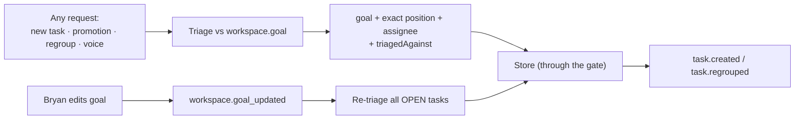

- **The agent picks the exact spot, not just the bucket** (decided 2026-08-13). Triage output is a goal (or subgoal), an exact position within it, and an assignee — set_task_goal carries a position, and fractional ordering means there is always room between two tasks. There is no Inbox and no fixed landing section: the agent places each task where it believes it belongs, and the goals-as-sections model (§3.2) makes the triage question sharper — which goal does this serve? — with Chores as the honest answer for none.

- **Who runs triage (ultrareview, 2026-08-13): the attached workspace agent, asynchronously.** §3.8's routing already decides this — the Haiku fast path gets lookups only; changes belong to the attached agent — and §3.1's diagram is corrected to match (triage is not a server component). The resting state before the agent places a task: it lands at the bottom of Chores with a triage-pending marker, stamped only at the moment the triage request is actually emitted to a live attachment (the grounded-pending rule from the summaries incident: never promise work that isn't queued). No agent attached → no marker; the task simply sits in Chores, and an agent sweeps untriaged tasks when it attaches. Goal-edit re-triage is likewise the attached agent's job; with no agent attached it doesn't happen, which is honest — placements stay as they were. The 5-second capture goal is unaffected because the human is never blocked on placement.
- **Agents own every decision they're capable of executing** (decided 2026-08-13) — no safety-margin landing zones, no approval queue for placement. The safety is that overriding is one tap and every move is recorded, not that the agent asks first. The bounding rationale: as long as an agent does nothing destructive, taking a task first isn't actually harmful. **Acceptance thresholds (decided 2026-08-13):** track every agent prioritization/refinement decision and review them after the fact — if agents are correct over 80% of the time on all tasks and over 95% on high-risk tasks, they keep prioritization and task management. The `triagedAgainst` field plus the event log is the record this review reads from; no separate instrumentation needed.
  - **Risk tiers gate execution, not placement** (encoded 2026-08-13 from the fleet's standing risk guidance; reviewed with Team Lead). Risk is a property of the ACTION, never the task's importance or difficulty — a hard task that only edits branch code is green; a one-line task that sends an email is high-risk. Guarding this matters for measurement too: if "important" stands in for "high-risk", the 95% number measures the wrong population, in the flattering direction. Triage stamps `riskTier: green | yellow | red` at placement time, beside `triagedAgainst` and rendered on the row — stored when the decision was made, so the after-the-fact review grades the agent against what it knew, not against today's understanding. Green (reversible and contained: branch code, docs, drafts, research, capture) — agents execute freely; the 80% threshold applies. Yellow (outward-facing or hard to reverse: external sends, schema/public-contract changes, money, permissions/sharing, breaking deploys) — agents may create and prioritize, but execution requires live human confirmation shown the concrete effect; the 95% threshold applies, and yellow-or-red is the definition of "high-risk". Red (the D-class stops made general: irreversible deletes, force pushes to shared branches, breaking default-branch merges, credentials/other-people's-data, one-way doors like private→public) — the gate refuses agent execution outright. Two invariants carried from the fleet rules verbatim: **the tier is keyed to damage, not provenance** — an authenticated requester never unlocks yellow or red — and the gate fires at execution regardless of where triage placed the task. **Honest reach (ultrareview, 2026-08-13):** the gate hard-blocks LF-mediated mutations — transitions, goal placement, LF edit tools, sharing and grant changes — because those flow through the server. Actions an agent executes in its own runtime (force pushes, external sends, deletes via Bash) never touch the LF server; there the tier is advisory and the fleet's existing permission rules remain the enforcement layer. A hard stop for runtime actions would need a mechanism that actually sees them — a PreToolUse hook keyed off the active task's riskTier is the plausible shape — and is **explicitly deferred, not silently assumed**. So for LF-mediated actions the 80/95 thresholds stay a quality measure rather than a safety mechanism; for runtime actions the gate claims bookkeeping refusal only. `riskTier` (agent-classified) and §3.3's per-edge `enforce` (human-marked) both block independently; neither depends on triage having been right.

    **No hard precedence between human and agent placement (decided 2026-08-13).** An agent may move a task a human placed — no preemptive limit that assumes agents should always defer to human judgment. What the design guarantees instead is context and conversation: every placement records who moved it and against what goal (the event log and `triagedAgainst` already carry this), the triaging agent sees that history before moving anything, and when a move would cross a human's earlier prioritization the agent is expected to ask a question or notify — a task comment referencing the prior placement — whenever it judges the human might want to chime in. Awareness plus judgment plus notification, not hard limits; §3.3's enforce-gated edges remain the only hard stops. This also answers the re-triage question directly: goal-edit re-triage may move human-placed tasks, with the same awareness-and-notify expectation. The flip side of no-precedence (same decision): every agent decision is tracked and reviewable over time — the activity review view in §3.9 is where issues get spotted in the record rather than blocked in the moment.
- **Tasks read like small user stories.** When the agent creates or promotes a task, the body says who it's for, what changes, why it matters, and gives brief falsifiable acceptance criteria — so "done" is checkable rather than a judgment call. Proportionate, not ceremony (peer session, 2026-08-13): the story shape is best-effort, never schema-required — a task the agent will do itself within the hour can stay a bare title; the full shape is for anything handed to a human or parked beyond today.
- Newly created tasks default to an **agent-decided assignee**; the human override is one tap (`a` assigns to agent, autocomplete assigns to a person).
- `triagedAgainst` records the goal text at placement, so when a task looks wrongly prioritized you can see it was sorted against an older version of the goal.
- Re-triage touches open tasks only; done stays put. A goal edit that re-triages N tasks emits one batched workspace.retriaged event (its member task.regrouped events marked as parts of the batch), so delivery (§3.7) collapses it to a single digest instead of firing N notifications at a busy agent.

### 3.5 Sharing & identity

Today's Access mode creates **one Cloudflare Access app per share** — right for a one-off doc, wrong for a person who collaborates across workspaces. v1 moves to an identity model, in which live-feedback (LF, this plugin) does the deciding and Cloudflare does the login. Throughout, an **invite** is a stored `WorkspaceGrant` record (§3.2):

**Demand evidence (Bryan, 2026-08-13):** on one of the fleet's team projects, team coordination ran on status reports every 1–3 days — dozens of comments back, information shuffled by hand, meetings — days of coordination time against hours of hands-on work with the agent team. Sharing the live work in progress removes two costs at once: the reports themselves, and the writing burden — everything had to be written airtight precisely because the team had no access to the agents for review and Q&A. That names a first-class expectation for this section: **a collaborator can ask the agents questions directly** — a thread comment an agent answers is the Q&A channel — not just view the artifacts. Team communication is the hypothesis this whole goal tests.

1. **One Access app** on a single collaborator hostname (`team.<baseHostname>`), policy = one-time PIN to any email address. Cloudflare runs that loop; we never touch passwords. We already verify Cloudflare's signed login tokens (`cf-access.ts`); this just means checking against one app instead of one per share.
2. **LF owns authorization.** The verified email from the token is the identity key. `host-guard` gains a `collaborator` target kind: a request is allowed only when there's an unexpired invite matching that email address and that workspace or doc. To cut someone off, delete one row — nothing has to be reconfigured at Cloudflare.
3. **The join link binds the invite.** One call can list several emails (one invite per email, sharing a `joinSlug`), name a domain, or mint an open link (`"*"` plus a required `expiresDays`). Login is always mandatory, so every visitor is attributed as themselves. **An expired invite stops working immediately** — not just at login, but on every page load and every live connection. (An earlier version checked expiry only at login, so someone already connected stayed connected forever.) If someone forwards the invite link to a person who wasn't invited, it does nothing for them: access comes from who you logged in as, not from having the URL. Once you've joined, the link is just a bookmark.
4. **Deep-link landing.** Claiming lands the visitor in the exact thing shared — hub or doc — never a lobby. `/workspaces` is for later visits, and lists every live invite for that email. One login, N workspaces.
5. **Uniform denial.** A refused login is told only `"<their email> does not have access to this workspace"` — never who was invited or that a domain rule exists. The message is exactly the same whether you used the wrong address, are at the wrong company, or were simply never invited.
6. **Scoped invites.** `scope: {kind:'workspace'|'doc', id}`; claim flow, denial, expiry, live checks, and landing all work the same either way. A doc is reachable if an invite names it, or names the workspace it lives in. The hub's Share button creates workspace invites, a doc-view Share button creates doc invites. **The real risk is running two sharing systems**, so PR 2 converges today's per-doc email shares onto the same Grant table; the anonymous link-mode share stays for one-off URLs.
7. **They act as themselves.** A collaborator gets a real identity derived from their email (`User { id: 'email:<sha8>', name, kind: 'known' }`), so the system treats them as a person — which matters because a person's reply reopens a resolved thread, while an agent's doesn't.

Every way of connecting — page loads, live document sockets, and the event feed — re-checks the invite. It's easy to secure the obvious one and forget a long-lived connection that was authorized once, when it opened.

**Trust levels, later** (direction set 2026-08-13): access should eventually scale with how much we trust a user or a source of data — more trust, more direct write access. v1 ships the single collaborator role and defers the gradations.

**Operator prerequisites (still pending, gate PR 2 only):** one DNS record, the Cloudflare team domain, one scoped API token.

### 3.6 Event stream

All events ride the **existing SSE/watch pipeline** — no new transport.

| Event                                                   | Carries                                                      |
| ------------------------------------------------------- | ------------------------------------------------------------ |
| `task.created`                                          | task, goal, assignee, triagedAgainst                         |
| `task.assigned`                                         | taskId, from → to assignee                                   |
| `task.transitioned`                                     | from/to status, actor, evidence (commit / thread ref), optional `usage` — what the task cost in tokens |
| `task.regrouped`                                        | from/to goal + position, actor                               |
| `workspace.retriaged`                                   | one batched event per goal-edit re-triage; its member regroupings reference it |
| `decision.answered`                                     | **verbatim answer text**, actor, the decision task's links — a ready-made propagation checklist |
| `workspace.goal_updated`                                | old goal, new goal, actor                                    |
| `voice.request`                                         | transcript, chosen route, ack text                           |
| `presence.moved`                                        | who, which surface (hub / doc / task), rough position        |
| `agent.attached` / `agent.detached` / `agent.heartbeat` | attachment record (§4)                                       |

This list has to be exhaustive. Anything that subscribes to this feed — the mirrors that push tasks and docs into Notion or Jira later (§5), and cloud agent runtimes (§4) — sees nothing at all for a change that doesn't emit an event, and that failure is invisible until much later.

**The event log is the audit trail (goal 5.2).** Every emitted event is also appended to a per-workspace `events.jsonl` sidecar — same pattern as the tasks sidecar — so "interactions are collected" simply means "an event was emitted", which is already the invariant above, and the audit log can never disagree with what subscribers saw. Voice requests are in the feed (`voice.request` carries the transcript, the chosen route, and the ack text), which also gives "voice always answers" a checkable artifact. Retention is local and workspace-lifetime, and the share flow says plainly that workspace activity is logged, so collaborators aren't surprised. **The consumers are real and already running (Bryan, 2026-08-13):** the weekly-review agent trawls transcripts and every LF comment and edit today, Team Lead trawls transcripts, and agents self-trawl to reconstruct what happened — so this log is not speculative collection, it's a cheaper, structured substrate for miners that currently parse raw transcripts. The three questions it exists to answer: where did everyone spend time; where were the blockers; what bottleneck should be addressed next. The events already carry what those need — transitions are timestamped (time allocation), a decision task's created→answered gap is machine-readable human-wait time (blockers), and `after` edges plus wait-gaps aggregate into bottleneck rankings.

### 3.7 Adaptive comment delivery

Decided 2026-08-13 (Bryan's ask — and the design session was itself the proof case: 16 threads arriving one at a time mid-implementation).

**Where it lives:** the MCP child process, because that's the only place that sees both sides — the incoming comment events and every tool call the agent makes. (Implementation sites: `packages/mcp/src/mcp.ts` — the SSE watchers around L1504–1608, which today send one notification per event with no buffering, and the tool handler at L905.) Each Claude Code session runs its own copy of this process, so we can just keep the busy/idle state in memory — no shared store needed. One requirement from the multi-workspace review (Team Lead, 2026-08-13): the bundling key is the SUBSCRIBER, not the workspace — a session attached to ten workspaces gets one digest spanning all of them, not ten independently-bundled streams (measured on a same-shape session: 29 compactions in one day, 68% of context spent on tool results). Still in-memory, still per-session; the state just spans every workspace the session is attached to. That also gives us the §2.6 exception for nothing: every tool call names its thread, so we already know which thread the agent touched last.

**Don't guess whether the agent is busy — find out.** The MCP child sees only live-feedback tool calls, not Read/Edit/Bash, so "no live-feedback activity" means the opposite of what it looks like: an agent deep in a code edit makes zero live-feedback calls, reads as idle, and gets exactly the interruption this protocol exists to prevent. (We shipped a "generating…" indicator once that guessed the same way and promised results that never came.) The two signals we actually observe: **delivering a channel message marks BUSY**; a **Stop hook** (the plugin already ships `hooks.json` and a hook-runner pattern) marks the real end of a turn. The hook touches a file keyed to the SESSION, not the workspace (<dataDir>/idle/<sessionId>; the MCP child writes its identity there at startup so the hook knows the path) — per-workspace was the wrong grain, since one session attaches to N workspaces (§4) and idleness is a session fact (ultrareview, 2026-08-13). Our process checks that file's timestamp to know the agent went idle. Sessions on an older plugin version have no Stop hook and fall back to the 120s cap — the already-designed deliver-anyway behavior. Fallback if the hook bridge proves fragile: an explicit ack tool.

Constraints the implementation must own:

- **(a) One message, one thread label.** The channel envelope (`{doc_id, thread_id, ...}`) carries a single id, so when we bundle several threads the per-thread ids go in the message text itself and the envelope is labelled `meta.event = digest`.
- **(b) When in doubt, deliver.** Held-back messages can't be re-fetched, so every safety rule errs the same way: the worst outcome is a message arriving sooner than ideal, never one silently dropped. Flush on abort, on `unwatch_doc`, on process exit. A comment stuck in a buffer forever is the exact bug where comments appear to go missing.
- **(c) The 120-second cap needs a real timer** — nothing else will wake up to fire it. Set it for whichever pending item expires soonest; cancel it on shutdown.
- **(d) Make the delays configurable** (Summarizer's `debounceMs` pattern, `packages/server/src/summarize.ts:49`) so tests can set them to zero — otherwise the suite really waits two minutes.
- **(e) Before testing that a message is withheld, prove the test can see a message at all** — send one while the agent is idle and confirm it arrives. Otherwise "nothing arrived" might just mean the test was broken.
  - **(f) Never deliver an author's own events back to them.** Observed in the field (Team Lead, 2026-08-13): an agent watching a doc it comments on receives its own comments back as inbound channel messages — 8 of one session's last 40 turns were its own words arriving as new input, on a session already compacting hourly. Filter on author identity at the delivery layer. This is also a live bug in today's watchers, worth fixing ahead of this plan.

Size: roughly 250–350 lines plus tests for the child-only version; meaningfully more if we add the Stop-hook signal. Open detail: whether the harness injects channel notifications mid-turn or holds them to turn boundaries — what we observe is that notifications get appended to tool results while the agent is mid-task, so the interruption is real and bundling is worth doing.

### 3.8 Voice routing

Decided 2026-08-13. Hold-Space anywhere on the board plus a quiet mic button (bottom-left, out of the deep-work path). Dictation streams live while held, Wispr-style — you watch the words land as you speak; the full transcript sends on release.

**Which route handles what:**

| Request kind                                                 | Route                                                        | Why                                                    |
| ------------------------------------------------------------ | ------------------------------------------------------------ | ------------------------------------------------------ |
| Changes — add tasks, regroup, reprioritize, "rework these into different groupings" | Workspace agent (current attachment), carrying the transcript **verbatim** | Needs judgment, the goal, and write access             |
| Quick lookups — "take me to the expansion-budget decision", "open the task about the device re-run" | **Haiku fast path**, on the server: workspace index (tasks, docs, threads, decisions) plus search tools, navigates directly | No full-agent round trip; works with no agent attached |

A session survives navigation: "take me to the doc" takes you there with the mic still open, and what you say next is understood against the new surface — the same requirement as the doc-scroll awareness in §1. Concretely: the hold is a session, each utterance routes independently (fast-path lookups mid-session included), and the context sent with each utterance is wherever you are now. This is also how the "almost nothing happens in chat" goal reconciles with voice-everywhere (Bryan, 2026-08-13): the conversation is fluid and the anchor SHIFTS as it proceeds, but at any given moment it is anchored to a specific place — the per-utterance context object is that anchor. What the goal rules out is the unanchored transcript, a conversation attached to nothing.

Voice is not board-only (goal 3.4.1 requires every surface): the mic affordance and hold-Space work on the hub, in a doc, and in a task detail. What changes per surface is the context object sent with each utterance — `{surface: 'hub' | 'doc' | 'task', docId?, taskId?, visibleHeading?}` — where `visibleHeading` is the topmost heading currently on screen, giving the agent rough scroll awareness with no pixel tracking. The router and both routes are unchanged.

Prototyped in the hub mockup. Holding Space doesn't trigger the mic while you're typing in any text field, dropdown, or the comment widget. And a hold ends on `pointercancel`, not just on release — on mobile the browser cancels a touch whenever the system takes it over (a scroll, a long-press menu), and if you only listen for release the button stays stuck down forever. The fast-path example genuinely navigates to the decision task.

### 3.9 Hub UI decisions

- **Goal strip at the very top**, above the board — read-first, editable in place. On an empty workspace the hub leads with "start planning" (open the first plan doc or set the goal) instead of an empty board.
- **Controls sit with what they control:** All/My Tasks tabs ("My Tasks", not "Mine" — Bryan, 2026-08-13) and the done-visibility filter live **inside the board column**, with the decisions strip directly beneath them. The topbar carries only the workspace name, `←` to `/workspaces`, and a button reading "Share workspace".
- **Done filter default: last 3h** (none / hour / 3h / day / all).

- Goal and task titles are editable in place on the board (Bryan, 2026-08-13) — tap the title text to edit, Enter commits; tapping the rest of a row still opens the drawer.
- **Done is a status, not a group.** Finishing a task doesn't move it. It stays where it was in the priority list, drawn in a distinctly "done" style.
- **Assignee autocomplete** on the row and in the detail header; `a` assigns to the agent.
- **Tab title: ****`<workspace> · <product>`** (e.g. `search-revamp · Workspace Hub`) — the browser tab is a workspace switcher.
- Rows one line; **task detail opens instantly, no transition**, near-full-screen on desktop (once open it's the primary work surface).
- Inline link mentions in task descriptions via a **⌘K search palette** — links live in the prose, lighter than a separate links section. Selected text becomes the link text; pasted URLs link the selection; backlinks still computed.
- Tap-to-change status chips; Gmail-style shortcuts (`?` help, `j`/`k`, `o`, `s`, `a`).
  - **Activity review view (decided 2026-08-13):** a filterable history of agent decisions — placements, regroupings, transitions, re-triages — across time, built on the per-workspace events.jsonl audit log. Two filters only (Bryan, 2026-08-13): All, and Decisions — the rows where the agent exercised judgment (placements, moves, re-triages, gate refusals); plain status transitions appear under All only. A five-way taxonomy filter was mocked and cut. This is the surface where the after-the-fact 80/95 review (§3.4) actually happens and where slow drift gets spotted; it exists because the no-precedence decision trades hard limits for reviewability, so the review has to be effortless. Known boundary (Team Lead, 2026-08-13): this grades agent placement decisions, not a coordinator's prose summaries — placement accuracy is measured, reporting accuracy is not; don't mistake a rich audit trail for verified reporting.
- Mobile at 430px per `design-mobile.md`: grid columns that can actually shrink (`minmax(0,1fr)`, not `1fr`), 16px body text, 36px tap targets.
  - **Presence strip** (§2.7): one chip per person and agent showing where they are; tap to jump, long-press to follow.
  - **Task mentions render as live chips** — an inline task mention in any doc shows title + status + assignee read from the projection, so an agent-authored "view" doc stays truthful without regeneration (goal 1.3.2). Cheap: the projection exists and doc rendering already resolves mentions.

### 3.10 Interfaces

| Surface | New                                                          | Notes                                                        |
| ------- | ------------------------------------------------------------ | ------------------------------------------------------------ |
| MCP     | `create_task(title, opts)`                                   | opts: assignee, needs, goal, after, links, body, quote — verbatim words for chat-born asks, where no thread exists to promote from; omitted goal/assignee are triaged |
| MCP     | `spin_off_task(docId, threadId, opts?)`                    | captures the origin ref, the latest human comment as `quote`, and a draft body; returns the task |
| MCP     | `task_transition(taskId, to, note?, evidence?)`              | the single gate for status changes; the result names any open after dependencies |
| MCP     | set_task_goal(taskId, goalId, position) · set_goal_list(workspaceId, goals) — renamed from set_workspace_goals (ultrareview, 2026-08-13): one letter from set_workspace_goal and two from the already-shipped set_workspace_groups was a mis-call trap | open to humans and agents; recorded                          |
| MCP     | `list_tasks(workspaceId, filter?)`                           | by goal/status/assignee/needs                                |
| MCP     | `set_workspace_goal(workspaceId, goal)`                      | emits `workspace.goal_updated`, triggers re-triage           |
| MCP     | `answer_decision(taskId, text)`                              | normally answered in the UI, so it's attributed to the person; this form is for when you tell an agent your answer and it records it for you |
| MCP     | `link_refs(from, to)` / `unlink_refs`                        | task↔doc↔thread↔diff, both directions computed               |
| MCP     | `import_tasks_markdown(workspaceId, path)`                   | group headings + tables; dry-run returns the mapping first; a successful import stamps the source file with a banner + hub link, so the old tracker can't quietly stay a second source of truth |
| MCP     | `grant_workspace_access(workspaceId, grantees, scope?, expiresDays?)` → join URL · `revoke_workspace_access` · `list_grants` | grantees: email[] · @domain · "*" (expiresDays required)     |
| MCP     | `attach_agent(workspaceId, runtime, capabilities)` · `heartbeat` · `list_agents` | §4                                                           |
| REST    | `GET/POST /api/workspaces/:id/tasks` · `POST /api/tasks/:id/transition` · `.../answer` · `.../links` · `PUT /api/workspaces/:id/goal` | Each route hand-copies fields from the request, and a field that isn't copied is silently discarded while the request still returns success. Every new parameter gets a test that goes through the real route |
| REST    | `POST /api/workspaces/:id/voice`                             | transcript in, route decision + ack out                      |
| REST    | `GET /api/me/workspaces`                                     | live invites for the authenticated email                     |
| REST    | `GET /join/:slug`                                            | invite claim + login redirect                                |
| Events  | see §3.6                                                     | on the workspace watch channel                               |
| UI      | `/workspaces/:workspaceId` hub · `/workspaces` shared-with-me list · docs at `/workspaces/:workspaceId/docs/:docId` | hub = goal strip + board + decisions strip + docs sidebar + open-threads sidebar + attachment state |

**URL shape (decided 2026-08-13): every artifact lives under its workspace, with full-word resource names** — `/workspaces/:workspaceId`, `/workspaces/:workspaceId/docs/:docId`, `/workspaces/:workspaceId/tasks/:taskId`. Existing `/review/:docId` pages keep working; new surfaces use the nested form.

**Agent edit-interface conventions (decided 2026-08-13, from the streaming-edits review — research survey plus three heavy agent users of today's tools).** These bind every new tool in the table above:

- **Anchored, targeted edits are the default; whole-doc rewrite is the exception.** Morph's published numbers (vendor figures, directionally right per Aider's benchmarks): an anchored edit runs ~700–1,400 output tokens where a full rewrite runs 3,500–4,500. Measured in our own fleet: a one-row table edit cost an agent ~9k tokens via full-doc rewrite where a block-addressed edit would be ~200.
- **Stable block IDs**: reads return them, edit tools accept them. The single biggest token win available; everything else on this list is smaller.
- **Tolerant matching** — accept a unique substring or line-range anchor, not only a byte-exact string. Every failed exact match costs the agent a full re-read before it can retry.
- **Batched atomic edits** — several edits in one call, all-or-nothing. Kills round trips and the ambiguous-partial-state re-read that follows a mid-sequence failure.
- **Dry-run on destructive ops** — a delete reports what it WOULD remove before removing it. In the field, a section delete that over-matched destroyed four sections and reported the damage only afterward.
- **Trimmed tool results** — an edit returns id + status, not the full object the agent just wrote (it pays for those words twice). Companion rules on the watch channel: never deliver an author's own events back to them (§3.7f), and collapse replied+resolved on the same thread into one event.
- **Version/hash precondition** — a cheap "current doc hash" so an agent can assert "apply only if unchanged" instead of defensively re-reading.
- **Streaming is a human-latency feature, not an agent-efficiency one** — same tokens, same cost, only arrival timing changes; every major system that streams (Cursor, Copilot, Zed, Tiptap) confirms this split. If we build it, the shape is one stream-rewrite tool applied per completed block (never per character — two independent systems retreated from per-char after event storms), streamed into the SUGGESTION layer so partial state is visibly provisional, committed atomically at stream end, dropped clean on abort.

### 3.11 Alternatives considered

| Decision          | Options                                                      | Effort                                                | Risk                                                         | Verdict                                                      |
| ----------------- | ------------------------------------------------------------ | ----------------------------------------------------- | ------------------------------------------------------------ | ------------------------------------------------------------ |
| Task storage      | (a) tasks live in the ydoc · **(b) server store + read-only ydoc projection** · (c) external tracker (Linear) | same effort as (a)                                    | (a) any peer — and any visitor — can write state; no single gate to attach proof or fire events · (c) loses realtime, cross-references, and the agent gate | (b) — having a single gate is what makes the board trustworthy |
| Collaborator auth | (a) per-share Cloudflare Access apps (today) · **(b) one Access app + LF-side invites** · (c) LF sends its own login codes | (c) means building and running our own email delivery | (a) N apps, no identity across workspaces · (c) we own a login loop we don't need to | **(b)** — Cloudflare does the login, LF decides access       |
| Decisions         | (a) separate entity · **(b) task with needs:decision**       | (b) is smaller                                        | (a) second store, second tool set, drift                     | **(b)**                                                      |
| Board realtime    | (a) poll REST · **(b) ydoc projection**                      | about the same                                        | (a) recreates the stale-board problem this exists to fix     | **(b)**                                                      |
| Intake            | (a) untriaged inbox a human sorts · **(b) goal-driven auto-triage with one-tap override** | about the same                                        | (a) recreates exactly the untriaged pile this is meant to eliminate | **(b)**                                                      |
| Agent link        | (a) implicit "the local session" · **(b) attachment record from day one** | same as (a), plus one extra table                     | (a) means every future kind of agent forces us to change the core data model | **(b)** — see §4                                             |

### 3.12 Workstreams & sequencing

Two PRs, because PR 2 waits on DNS and Cloudflare setup that isn't done yet — and that shouldn't hold up PR 1. The commit order matches Bryan's goal ranking (decided 2026-08-13: tasks > goal > best surface > collaboration): PR 1 leads with the task store, then goal triage. His target of reaching collaboration within a day argues for an early minimal-share slice — workspace-level reuse of today's per-doc email shares — landing ahead of the full grant/identity work — that slice is commit 8 below. Each numbered item is one ordered commit, TDD, splittable across agents.

**PR 1 — goal, tasks, hub, cross-refs**

1. Task store + transitions + enforcement (tasks.ts, sidecar persistence, the gate, classifyActor wiring) — unit + route tests including evidence stamping and actor attribution. Includes workspace creation (ultrareview, 2026-08-13): a create_workspace(name, goal?) MCP tool + route — the hub Workspace is a NEW first-class entity; today's workspaceId is only a grouping tag on DocMeta minted by diff reviews. A diff review's reviewId is linked from (not reused as) a hub workspace: attach_doc(workspaceId, docId) adds existing docs and reviews to a hub workspace, and docs with no workspace keep working at their current URLs — nothing is migrated.
2. Workspace `goal` field + triage hook + `workspace.goal_updated` re-triage.
3. Ydoc projection + workspace room + SSE/channel events (task.*, decision.answered with verbatim, workspace.goal_updated, workspace.goals_changed — the goal-list event is prose-only in §3.2 today, so this commit also adds its row to the §3.6 events table) + the per-workspace events.jsonl audit log.
4. Cross-reference model (`Ref`, links, computed backlinks; thread→task and doc→task surfacing in existing doc/thread payloads).
5. Attachment registry + heartbeat + `agent.*` events (§4).
6. MCP tools: create_workspace, attach_doc, spin_off_task, create_task, list_tasks, set_task_goal, set_goal_list, set_workspace_goal, answer_decision (+ a route-forwarding test per param). New tools conform to the §3.10 agent edit-interface conventions.
7. Hub UI per §3.9, including the presence strip (§2.7).
8. Minimal-share slice — the one-day Collaboration target (§1): workspace-level reuse of today's per-doc email shares, so the hub URL is shareable the way a doc is now. Three NEW guard allowances, each with §6-style presence-then-absence tests per transport (ultrareview, 2026-08-13): the hub page path, the ws:<id> room socket (not a member doc — today's workspaceOf() returns null for it), and the workspace SSE feed. Visitors are read-only on the gate — every task/goal/decision mutation route rejects visitor auth, with a route-level test that a visitor POST to transition and answer is refused — and may post comments only, the existing visitor capability. What a visitor syncs from the ws room is exactly the §3.3 visitor-contract list. Collaborators appear as visitors; named identity waits for PR 2.
9. Voice on hub + doc + task detail: hold-to-talk capture with per-surface context, /voice route, Haiku fast path + agent route, the always-answers reply.
10. Markdown importer with dry-run.
11. Deploy: prod restart rebuilds bundles (restart == deploy, already in place). Uptime starts being measured here: events.jsonl gap analysis against the 99% target (goal 4.4), rendered in the §3.9 activity view. Acceptance exercise once deployed (Bryan, 2026-08-13): a peer project session and Team Lead port their current active tasks into the new structure as early testers and report what works or doesn't — that project's goal shape and the Team Lead weekly plan are the two real workloads the goals model was fitted to, so they're the test.

**PR 2 — collaborator identity** (after the operator steps land)

1. Invite store + `WorkspaceGrant` + grant/revoke/list tools and routes.
2. Single Access app + token → identity middleware; `host-guard` collaborator target; live invite check on WS + SSE + REST.
3. `/join/:slug` claim flow + `/workspaces` page.
4. Attribution end-to-end (User minting; comments, tasks, answers).
5. Convergence of existing per-doc email shares onto the Grant table.
6. Tests that prove an absence, each with a matching test that proves a presence (see §6).

**Adaptive delivery (§3.7)** is a parallel workstream in the MCP child — it touches no server state and can land before, between, or inside PR 1.

**Plugin version bump — every PR.** Both manifests, identical values: `packages/plugin/.claude-plugin/plugin.json` and `.claude-plugin/marketplace.json` (PR 1 starts at 0.1.9). (Agent, 2026-08-17: stale — there are three version sites now, not two manifests: packages/plugin/.claude-plugin/plugin.json, .claude-plugin/marketplace.json, and the PLUGIN_VERSION constant in packages/mcp/src/mcp.ts; main is past 0.1.38. See CLAUDE.md for the live source.) Any PR touching `packages/mcp/src/**` must run `bun run build:mcp` and commit `packages/plugin/mcp/index.js` — peers load the committed bundle, not the source. CI fails on both.

Estimate (decided 2026-08-13: weekly-review method — decisions-made as the complexity proxy, not LOC or commit count; baseline scaled ÷20 for Bryan's hands-on time and ÷10 for wall clock). Counting the decisions each commit forces — schema shapes, transition and gate semantics, event contracts, UI judgment calls — PR 1 carries ≈55 decisions (heaviest: task store ~8, hub UI ~10, voice ~8) and PR 2 ≈25. Calibration assumption, stated so it can be checked: ~2 hours of human-engineer work per decision (decide + implement + verify), giving PR 1 ≈ 110 baseline hours (~3 engineer-weeks) and PR 2 ≈ 50 (~1.25). Scaled per the standard: PR 1 ≈ 5–6 hours of Bryan's hands-on time, ≈ 11–14 hours wall clock — a long day and a half of elapsed time; PR 2 ≈ 2.5 hands-on / ≈ 5 wall-clock hours. Note this lands ~5x more aggressive than the earlier gut estimate (1–1.5 weeks for PR 1); the lever is the hours-per-decision calibration, and it is checkable after PR 1 ships — count the actual entries in decisions.md against the clock and recalibrate — when PR 1 lands, record the actual hands-on and wall-clock numbers next to this estimate so the recalibration has something to work with (Team Lead's condition, 2026-08-13). Fleet-standard status: Team Lead audited all 23 projects — two-thirds have empty or missing decisions.md files, and the projects with real records disagree ~5x on what counts as one decision — Bryan then overrode the staged rollout: shipped fleet-wide same day as rule effort-estimates.md — the standard is baseline human-engineer hours (always shown, so it can be argued with), ÷20 for hands-on, ÷10 for wall clock; decision-counting stays the complexity proxy where decision records exist. Team Lead validated the constants against 711 recorded tasks (Apr–Jun 2026): measured medians run 37x hands-on and 9.3x wall clock (83x/26x on ≥10h baselines), so ÷20/÷10 deliberately under-promise and this PR 1 estimate is conservative rather than optimistic. Workflow-pipeline execution (per `workflow-conventions.md`) once approved.

---

## 4. Agent attachment model — where the intelligence runs

**v1: the workspace agent is the local Claude Code session.** The MCP child in that session is the delivery channel, and the Stop hook is how we know it's still alive. That's the only runtime that exists on day one.

**But the workspace↔agent link is modeled as DATA from day one** — an `AgentAttachment` record (§3.2), even while there is exactly one local session. And one agent can hold attachments to N workspaces at once (stated explicitly 2026-08-13, answering Team Lead): the record is keyed (workspaceId, agentId) with no uniqueness constraint on agentId, and §3.7's delivery already bundles per subscriber across every workspace a session is attached to — so a team-lead attaches to its metaproject plus each active project workspace and receives one digest spanning all of them. That's the whole design consequence: adding a cloud agent later (Claude Managed Agents) or a webhook endpoint becomes a matter of pointing messages somewhere new, rather than reshaping how workspaces work.

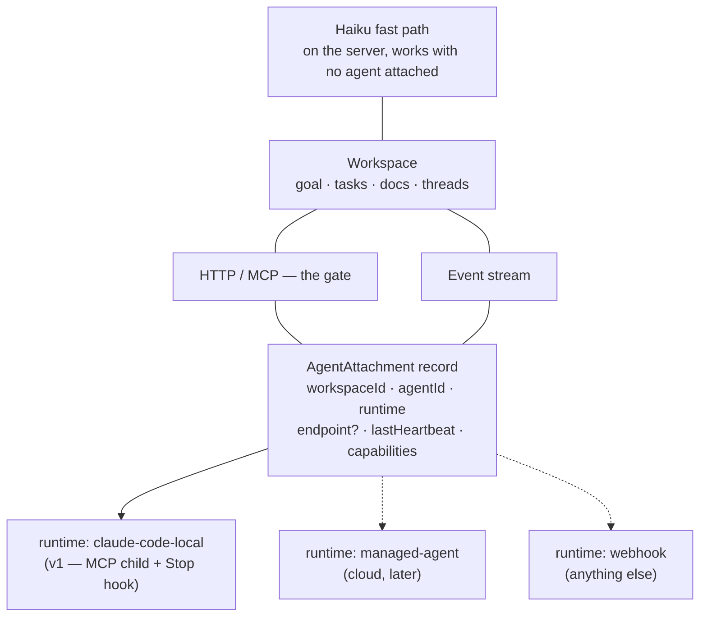

Consequences, all cheap now and load-bearing later:

- **Everything flows through the same gate.** No local-only side doors. A cloud agent calls the same REST/MCP surface and subscribes to the same event stream; only the delivery mechanism differs.
- **The hub shows attachment state**: "agent: local session · active 2m ago" or "away — requests queue". We show "active 2m ago" because a heartbeat actually arrived 2 minutes ago — we never guess from the absence of activity. And a heartbeat only proves the MCP child process is alive, not that the session can work: a session that hit its usage limit heartbeats normally for hours (observed in the fleet — "running but not working" is the standard outage shape). The outage signature is the two fields disagreeing — fresh lastHeartbeat, no lastToolCallAt movement in 30+ minutes — and the hub renders that as "process up, agent unresponsive", never as active.
- **Queueing is the away behavior**, and the spoken reply says so explicitly rather than pretending the request was picked up.
- **The Haiku fast path doesn't depend on an attachment.** It runs on the server over the workspace index, so lookups and navigation work with no agent attached at all.
- **Later, each agent gets an invite of its own, exactly like a person does** (`kind: 'agent'`) — so there's one access system, not two. Right now an agent is identified by an environment variable (`FEEDBACK_AGENT_NAME`) on a machine we trust; a cloud agent would need a real credential we can revoke. Same record either way.
- **A coordinating agent uses the board like anyone else.** A team-lead agent creates tasks, assigns them (`assignee` already takes arbitrary identities), watches `task.*`, and reads and writes comments. No parallel coordination channel — the coordination artifact and the work artifact are the same surface. A team-lead agent is just another attachment.
- **The busy/idle logic is tracked per agent session today; in the cloud it'd be tracked per subscriber.** Nothing about it is local-only, and a team-lead's digest is just another subscription.

Three rules v1 must never break, so this future stays cheap: **every change goes through the gate**; **every change emits an event**; **the workspace-to-agent link is a stored record, not an assumption.**

### 4.1 Cloud mirror of the workspace (direction, not v1)

Yes — a cloud instance that syncs with the local workspace is where this goes. But "mirror" means two different things for our two kinds of state, because we deliberately split them (§3.3):

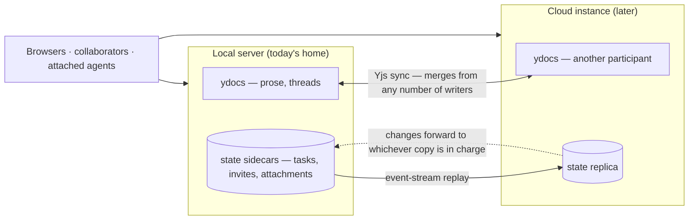

- **Prose and threads mirror for free.** Documents already merge from any number of writers at once. A cloud server would sync a document exactly the way a browser tab does — it's just another participant. Concurrent edits merge, anchors survive, nothing new to invent; this is the part CRDTs were chosen for.
- **State must NOT work that way.** Tasks, invites, and attachments are server-owned precisely so one gatekeeper can attach proof, name the actor, and refuse (§3.3). A second independent writer would reintroduce exactly what we rejected. So the local and cloud copies aren't equals: exactly one of them is "in charge" of a workspace at a time and is the only one allowed to make changes. The other serves reads and forwards changes to whoever is in charge. (Call it holding the lease.)
- **Moving the lease = moving the workspace's home.** "A team workspace tied to a Slack channel rather than a local session" is the lease living in the cloud; the local Claude Code session stops being the host and becomes just another attached agent (§4) and another editor in the room. Nothing else changes shape.
- **v1 ships none of this.** Remote access happens through the Cloudflare Tunnel; the local server is the only home there is, and if it's down the workspace is down (the launchd supervisor mitigates). What v1 does carry for this future is the same three rules already stated: every change through the gate, an event for every change, and the agent link stored as a record.

---

## 5. Future direction: legacy-tool mirroring (the outer loop)

Direction set 2026-08-13 (Bryan): **the workspace is the primary agent/human collaboration surface — designed to move at the speed of agents, with unified context. Legacy tools (Notion, Confluence, Asana, Linear, Jira) are where this work becomes visible to everyone who needs to track it but isn't doing it — a slower audience, on a slower cadence.** Docs mirror into Notion/Confluence pages; tasks into Linear/Jira/Asana issues tied to the workspace. Sync goes both ways; the two directions are not symmetric. Worth naming (noted 2026-08-13): this is a new architecture for a problem the fleet already solves manually and in a fractured way — the GitHub and Notion Claude-channel connectors already deliver events into Claude Code sessions, but every one of those events is handled by the LLM: read, interpreted, re-typed into the destination. The mirror loop makes the sync deterministic, so statuses, fields, and comments move without spending model attention, and the LLM only sees the events that actually need judgment.

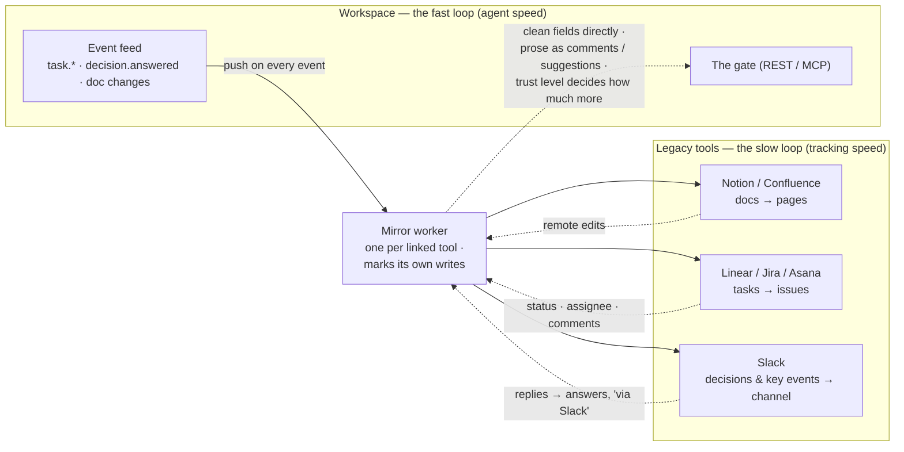

v2+ scope, but it shapes v1 cheaply:

- **A mirror is just another subscriber to the event feed.** `task.*` and `decision.answered` already emit; a mirror worker subscribes and pushes. Adding a target changes nothing about the task store or the hub — which is exactly why the events must stay **complete** (every change emits, no silent paths).
- **Mirror record, not schema churn:** `{ localRef, remote: {system, id, url}, direction, lastSyncedHash }` in a sidecar keyed by workspace, the same pattern as `private-meta`. v1 ships nothing here; the `Ref` union and event completeness are the only prep, and both are already in scope.
- **The mirror is deliberately a lesser copy.** Full fidelity lives in LF. Converting between markdown, Notion blocks, and Jira's rich-text format loses structure in both directions, and we've been burned by exactly this: a conversion that drops nested structure destroys it permanently the next time the converted version is written back. So by default, remote edits come back EITHER as fields that map cleanly (status, title, assignee, comments) OR as inbound comments and suggestions rather than direct prose overwrites. That default is a starting point, not a hard rule (decided 2026-08-13): how much a remote edit may change directly should scale with how much we trust the user or the source of the data — trust levels mapping to access levels, worked out later.
- **Whoever is working faster wins a conflict.** While work is active here, our copy is authoritative and reasserts itself over the mirror — the same rule we already use for files on disk, where the live editor beats the file. Divergence is recorded (the `syncError` pattern), never silent. We already have the logic for this: the four-way decision we make when a file changes on disk (`in-sync | catch-up | apply | conflict`, in `decideReconcile`) is the same decision a mirror needs, with a remote API where the filesystem is.
- **Don't mistake our own writes for someone else's.** When we push a change out, mark it, so the change coming back doesn't look like a remote edit. (Same trick we use with file timestamps.) Remote-originated changes attribute as "via Linear/Jira" so `classifyActor` and the activity history stay honest.
- **Slack is the same idea, just faster.** Decisions and key events post into a channel; replies come back as comments and answers, attributed "via Slack". Humans lurk at Slack speed; agents move at workspace speed.
- **Prior art:** the production feedback widget already ships Linear tickets (the origin of this project), and `import_tasks_markdown` is the manual seed of the same idea — import is mirroring with a cadence of once. v1 ships exactly that import-once; the "keep this task in sync with a Jira task" half of goal 1.1.5 is this section, v2+.

Cloud and multi-agent direction lives in §4 (attachment model), not here.

---

## 6. Testing & deployment

- **Every enforcement rule gets a route-level test**, because the HTTP layer is the one place the compiler can't catch a dropped field. Every new route param gets one HTTP-level test.
- **Any test that proves something doesn't happen must first prove it can detect the thing happening at all.** Forwarded-link inertness, revoked-invite WS/SSE cutoff (the probe must first prove it can see *anything*), BUSY-state suppression (prove a message arrives while idle first).
- **Assert the denial messages are literally identical**: wrong email, wrong domain, and never-invited must produce the same response body, character for character.
- **Transition attribution test** asserts every transition records the actor's identity and kind (person vs agent) on the audit trail.
- **Projection test:** change something via REST, then assert the **ydoc ****`tasks`**** map** carries the change — not the store. Checking the store would pass even if the board never updated.
- **Triage test:** create a task with no goal/assignee and assert both are populated and `triagedAgainst` matches the current goal; change the goal and assert open tasks re-triage while done tasks don't move.
- **Delivery timings configurable**, or the suite burns real seconds.
- Importer golden-file test against a realistic hand-maintained tracker shape — synthetic content ONLY (ultrareview, 2026-08-13): invented project names and goals in the carol@partner.example register. Never derive a fixture from a real workspace's tracker, events.jsonl, or task titles — the repo is public, and "realistic" otherwise invites exactly the leak the pre-push scanners exist to backstop. The same rule covers every fixture and seed file in PR 1.

- **Projection integrity test:** connect a real Yjs client to the ws room, write into the tasks map, assert the server reverts the write and no task.* event fires. Anchor a thread into a task body, force a projection refresh and a server restart, assert the anchor still resolves.
  - **Token telemetry:** a done task with `usage` reported renders the number on its chip, and the workspace running total matches the sum of its tasks.
  - **Dependency gate:** transitioning a task with an open `after` dependency returns the blocker in the tool result; an edge marked `enforce` actually refuses; attaching to a workspace returns the open-gating-decisions summary.
- **Mobile:** 430px pass on the hub before ship — and note that already-open tabs keep running the old bundle until a hard reload.
- **Production:** restarting the server also rebuilds the browser bundles, so restart is the deploy. Confirm by checking `dist/BUILD_INFO.txt` is newer than the merge.

---

## 7. Resolved during review (was: open questions)

1. **Done with no proof attached.** Flagging is easier to live with; blocking makes the board more trustworthy. Decided 2026-08-13: flag but don't block — an evidence-less transition is allowed and visibly shaded, never refused; hard blocking stays reserved for enforce-marked decision edges (§3.3). (Peer signal, 2026-08-13: a peer session endorses allowed-but-flagged — "a done chip linking the actual commit is a stronger claim than anything I can type" — and would reserve hard blocking for enforce-marked decision edges, §3.3.)

Answered 2026-08-13 and folded into the sections above: no Inbox — the agent places tasks at an exact position (§3.4) · agents own any decision they can execute (§3.4) · tasks read like user stories (§3.4) · URLs nest under the workspace with crypto-random ids (§3.10, §3.2) · the board changes only on real events, no placeholder rows, and voice is a continuous session that follows navigation (§2.4, §3.8) · mirror edits follow trust levels rather than a hard rule (§5, §3.5).

---
