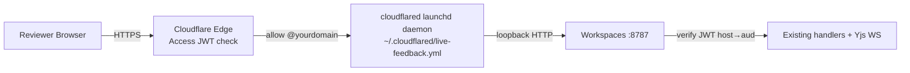

# Sharing a review surface with an external team

This guide explains how to publish a Workspaces review surface to a
public URL gated by Cloudflare Access — so a team you don't share a
Tailscale network with can review for a bounded window (default 72h) and
then have their access expire automatically.

## Mental model

**A board is the unit of sharing** (Bryan, 2026-08-17: "Workspace only — a
review must be filed on a board before it can be shared"). You bind docs the
way you always did — `attach_markdown`, `attach_folder`, `create_diff_review`
— and then you share the BOARD they are filed on.

Two smaller grants used to exist, and both are gone:

| What you had | What it minted | What you get now |
|---|---|---|
| `share_doc`, or a `docId` in a share body | a share scoped to one doc | `410 per_doc_sharing_removed` |
| `share_workspace` with a folder-bind or diff-review id | a share scoped to that grouping | `410 grouping_sharing_removed` |
| `share_link` | a Cloudflare Access application per share | `410 link_share_mint_retired` |

So the id you pass is always a board id — the one `create_workspace`
returned, or the `hubWorkspaceId` that `attach_folder` / `create_diff_review`
reports back.

That is a deliberate narrowing rather than a missing feature. Everything on a
board is available to everyone in it (`.claude/rules/workspace-board.md`), so
the board is the boundary a person can actually reason about; a share per doc,
or per review, made the real audience of a review impossible to see. Decide
what belongs on the board *before* you share it.

The narrowing does move a cost onto you, and it is worth naming: the tight
scope used to be "share just this folder bind". Now the tight scope is "give
this review its own board". `create_workspace` makes an empty one in about a
second and `create_diff_review` accepts it as `hubWorkspaceId` in the same
call, so the flow is still two calls — but the *default* is no longer tight.
A bind or review created without an explicit `hubWorkspaceId` lands on the
shared **"Unfiled"** board along with everything else nobody filed, and
sharing Unfiled shares all of it.

Beyond that, sharing is **purely additive**: same comment threads, same agent
watching, just a different audience.



## One-time setup (host machine)

1. **Enable Cloudflare Access.** Dashboard → Zero Trust → Access. On
   first visit you pick a team subdomain (e.g.
   `fryanpan.cloudflareaccess.com`). **Permanent** — choose carefully.
   Accept ToS, pick the default email-OTP IdP. ~3 min.

2. **Note your Account ID.** Right sidebar of any zone page in the
   Cloudflare dashboard.

3. **Create a scoped API token.** Dashboard → Profile → API Tokens →
   Create Custom Token:
   - Permissions: `Account → Access: Apps and Policies → Edit`
   - Account Resources: scoped to the account
   - TTL: 1 year (rotate annually)

4. **Stash the token in macOS Keychain:**
   ```sh
   security add-generic-password -a "$USER" -s "cloudflare-api-token" -w "<paste-token>"
   ```

5. **Install cloudflared as a launchd service** so the tunnel survives
   reboots and runs alongside the existing `notion-bridge` /
   `sentry-bridge` tunnels:
   ```sh
   sudo cloudflared service install
   ```

6. **Edit `~/.cloudflared/live-feedback.yml`** so the wildcard ingress
   points at the Workspaces server port (default `8787`):
   ```yaml
   tunnel: live-feedback
   credentials-file: /Users/bryanchan/.cloudflared/<tunnel-uuid>.json
   ingress:
     - hostname: "*.tunnel.fryanpan.com"
       service: http://localhost:8787
     - service: http_status:404
   ```

7. **Set server env** (in your shell rc, launchd plist, or wherever
   `bun run dev` reads its env):
   ```sh
   export CF_ACCESS_TEAM_DOMAIN="fryanpan.cloudflareaccess.com"
   export CF_ACCOUNT_ID="<your-account-id>"
   export CF_SHARE_BASE_HOSTNAME="tunnel.fryanpan.com"
   ```
   Then restart the Workspaces server. Look for these lines in startup
   logs to confirm it's wired:
   ```
   [feedback]   cf-access:  team=fryanpan.cloudflareaccess.com aud=auto-from-shares
   [feedback]   share:      base=tunnel.fryanpan.com account=abc12345…
   ```

## A standing collaboration hostname (no share link needed)

The two modes above mint a grant per audience: a share hostname, or a link to
redeem. There is a third shape for the case where the audience is standing
rather than per-review — a collaborator you have already admitted to
Cloudflare Access, who should be able to open any board you send them the URL
of, from outside the tailnet.

Bryan set the boundary (2026-08-18): *"workspaces.fryanpan.com is meant to be
the Cloudflare tunnel for collaboration that's reachable outside tailnet. But
not used for the privileged access that inside-tailnet traffic gets."*

```sh
export CF_ACCESS_TUNNEL_HOSTS="workspaces.example.com"
export CF_ACCESS_TEAM_DOMAIN="<team>.cloudflareaccess.com"
export CF_ACCESS_AUD="<the AUD of the Access app over that hostname>"
```

…plus an ingress entry pointing the hostname at `http://localhost:8787`, and a
Cloudflare Access application covering that exact hostname. Startup logs then
carry `[feedback]   collab:     workspaces.example.com (via Cloudflare Access)`.

**What it grants is the share surface, not the product.** Read the boards and
the docs filed on them, comment, co-edit — scoped per request to whichever
workspace the URL names. What it does not grant is anything an operator does:
the doc list and the workspace list (so a visitor cannot enumerate what
exists), share administration, folder binds, diff creation, delete, wholesale
rewrite, the deploy verb, the plugin refresh, and the landing page. Those stay
on the tailnet and on loopback.

**All three variables travel together or none of them do.** The server ignores
the host list unless the team domain *and* a static AUD are both set, and says
so loudly at boot, because a listed hostname with no Access application in
front of it would be the API exposed to anyone who can reach the tunnel — the
exact hole the `cf-ray` veto in `middleware/host-guard.ts` was added to close.
That veto is untouched: a hostname on this list classifies `collab`, never
`local`, and a request that did not arrive through the edge is refused whatever
Host it claims.

Two things worth knowing before you turn it on:

- **The AUD is the hostname's own.** Cloudflare issues one AUD per Access
  application, and this hostname has its own application — it is not a share
  hostname, so the per-share AUD resolver cannot answer for it. That is why
  `CF_ACCESS_AUD` is required here even on a deployment where link or Access
  sharing is already configured.
- **The master switch covers it**, so `set_sharing_enabled(false)` shuts this
  door with the others. One honest limit: a collaboration request carries no
  shareId, so the hang-up sweep that runs on the switch cannot find its live
  websockets. New requests are refused immediately; an already-open editing
  socket survives until the server restarts.

**This list and the operator's list below share one Access application and
one `CF_ACCESS_AUD`.** A collaborator's token is therefore just as valid at
the operator's hostname as at this one — a token proves the Access policy
admitted someone, never who. What keeps the two doors apart is the operator
email allowlist (`CW_PROXIED_TRUSTED_EMAILS`, below): the operator's hostname
serves the product only to a verified email on that list, and refuses
everyone else the same application admits. Keep the allowlist to the operator,
and keep collaborators on this hostname.

## The operator's own hostname (the whole product, from outside)

The collaboration list above is deliberately NOT the privileged surface. When
the operator wants their own product — the doc list, the landing page, share
administration, the deploy verb — from outside the tailnet, that is a third
list, kept apart from the other two because it grants the most:

```sh
export CW_PROXIED_TRUSTED_HOSTS="ops.example.com"
export CW_PROXIED_TRUSTED_EMAILS="you@example.com"  # defaults to CW_OWNER_EMAIL
export CF_ACCESS_TEAM_DOMAIN="<team>.cloudflareaccess.com"
export CF_ACCESS_AUD="<the AUD of the Access app over that hostname>"
```

A hostname here classifies `proxied-local`: the request must have come
through the edge (`cf-ray`), must carry a valid Access token for that
application, **and the email that token was issued to must be on the
allowlist** — then it is served exactly as loopback is. Anyone else the same
Access application admits gets a bare 403. Startup logs carry
`[feedback]   operator:   ops.example.com (via Cloudflare Access, full product, 1 allowed email)`.

Through the tunnel the browser-origin policy is same-origin plus
`ALLOWED_ORIGINS` and nothing else: a visitor's `localhost` is the visitor's
machine, so the loopback and LAN allowances a `TRUSTED_HOSTS` name gets do not
apply here.

Four things that do not move:

- **`TRUSTED_HOSTS` does not gain this.** A LAN name reached through the
  tunnel is still refused, whatever token it carries — the `cf-ray` veto is
  untouched, and this list is a separate door with a separate key.
- **Without Access it is ignored**, loudly at boot and silently in the request
  path — the same all-or-none rule as the collaboration list, and the reason
  is stronger: honoured without a token to check, this would be the full API
  to anyone who can reach the tunnel. The token is demanded regardless of
  whether link or Access sharing is configured on the same server.
- **Without an operator allowlist it is ignored too.** A token is admission,
  not identity; with nobody named, the door cannot tell the operator from a
  collaborator, so it does not open.
- **A host on both opt-in lists stays a collaboration host.** The contradiction
  resolves toward the narrower grant, and the boot log names the overlap.

What does move: the sharing master switch does not cover this door. It is the
operator's own, keyed to their own identity, and it is how sharing gets turned
back on from outside.

**Nothing skips the Access token here** (2026-08-31). Two requests briefly
did — Recall.ai's meeting-bot callbacks — because this hostname was the one
public address this deployment had, and the vendor's backend has no browser,
no Access session and no way to acquire either, so demanding a token refused
every callback: the bot joined the call, recorded, billed, and delivered
nothing.

Bryan's call was a **dedicated first-level hostname** instead, not a hole in
this one. `CW_RECALL_CALLBACK_HOST` names it (`recall.<domain>`), it is
pointed at the same tunnel with **no Access application in front of it**, and
it classifies its own host kind that serves exactly two routes:

- `GET /recall/<token>` — the transcript websocket. The 128-bit per-bot token
  in the path is the authentication. Open only while the Recall relay is
  configured; on a server that can never mint a token there is no credential
  behind the route. It still answers 404 for a token no bot minted.
- `POST /recall/status` — the bot status webhook. Recall's Svix signature over
  the body is the credential, and the route verifies it. Open only while
  `RECALL_WEBHOOK_SECRET` is set — with the secret unset the route accepts
  UNSIGNED bodies, and that mode must never be reachable from the tunnel.

**Everything else on that hostname is 404** — the API, the app shell, a real
doc's websocket, the deploy verb, and any of them even to a caller holding a
valid operator Access token. It is an allowlist, so a route added to this
server tomorrow is closed there by default, and every near-miss fails closed:
`/recall/abc`, anything under or beside a token, a percent-encoded spelling of
one, a trailing or doubled slash, the wrong method. Unlisted hostnames are
denied exactly as before.

Two conditions this host class deliberately does NOT impose: Cloudflare Access
(a browser flow the caller cannot complete — refusing it here is the whole
point) and arrival through the Cloudflare edge (that veto protects a product
this hostname does not serve, and requiring `cf-ray` would break a deployment
fronted by anything else).

The trade this makes is worth stating plainly: the unauthenticated surface
went from two exemptions on the address people open the product on, to two
credential-carrying routes on an address only a vendor is told about. Boot
logs name the callback host, both URLs, and whether each route is armed.

**And a bot that could not call back is not offered.** With the exemptions
gone, a deployment still deriving its callback URL from `CW_PUBLIC_BASE_URL`
would look configured while every callback was refused — a bot that joins,
bills, and delivers nothing. When the address this server would hand Recall is
one of its own Access-gated hostnames, meeting bots report themselves not
configured and the invite names the fix.

## Per-repo team config

Each repo that uses sharing should set a default allow-list in its
`.claude/live-feedback.json`:

```json
{
  "share": {
    "defaultAllowDomains": ["@yourteam.com"],
    "defaultTTL": "72h"
  }
}
```

The agent reads this when you ask it to share. If the repo has no
`share` section, the agent will **ask before sharing** rather than
default to "anyone."

## Day-to-day: sharing a workspace

Tell the agent something like:

> "Publish this review to the partner team for a 72h review."

The agent will:

1. Confirm the docs are filed on a board — binding the folder
   (`attach_folder`), creating the diff review, or `attach_doc`-ing a loose
   doc onto a board.
2. Check what else that board holds, because the visitor gets all of it. For
   a diff review the grouping's root is the whole repo, so `files` /
   `context-file` reach every file in it. If the review should travel alone,
   the agent gives it a fresh board rather than the shared "Unfiled" one.
3. Read `share.defaultAllowDomains` from `.claude/live-feedback.json`.
4. Call the `share_workspace` MCP tool with the BOARD id and that allow-list.
5. Hand you a URL like `https://share-2026-05-07-a3f.tunnel.example.com/workspaces/<boardId>`.
6. Watch the docs so external comments arrive on the same channel as
   yours.

There is no share without a sign-in. `share_link` used to mint an unguessable
URL whose slug WAS the credential; that is retired, and so is the per-share
Cloudflare Access application the verb minted after it. One verb remains, and
whoever opens its link signs in through Cloudflare Access before they reach
anything. Links do not expire by default — pass `ttl` (`'15m'`, `s`/`m`/`h`/
`d`/`w`) or `ttlSeconds` when a window is wanted. `CF_SHARE_MAX_TTL` (same
grammar, e.g. `30d`) caps a mint or an extension, and a clamped reply carries
`ttlClamped`. Shares already minted the old way keep working until they lapse:
`list_shares` lists them, `set_share_ttl` shortens one, `unshare` revokes one.

You can also drive it manually with the CLI:

```sh
bun share workspace <workspaceId> --allow-domain @partner-org.example --ttl 72h
bun share list
bun share revoke <shareId>
```

`bun share doc` and `POST /api/share/doc` still exist as refusals rather than
as routes: they answer with the replacement, so an older plugin bundle calling
them gets a sentence instead of a 404.

## What the reviewer sees

1. They click the share URL.
2. Cloudflare shows the email-OTP login page.
3. They enter their `@allowed-domain` email.
4. They get a 6-digit code by email; entering it lands them on the
   editor or widget surface.
5. Comments save the same way they would for a Tailscale visitor —
   anchored, persistent, watched by the agent.

The session cookie lives the full TTL of the share. After that, the
cf-access app is gone, the URL stops working, and any cached cookie
becomes useless.

## Troubleshooting

- **"missing_jwt" 401 on the share URL** — the request didn't carry an
  Access cookie. Usually means the reviewer hit the URL before
  authenticating; refreshing kicks the OTP flow.
- **"no_share_for_host" 401** — the URL points at a hostname we don't
  have an active share for (expired or revoked). Run
  `bun share list` to confirm and re-share if needed.
- **Reviewer's allowed domain rejected** — confirm the domain in the
  Cloudflare Zero Trust dashboard (Access → Applications → your app →
  Policies). The policy is `email_domain` based and exact.

## Limitations (current build)

- Markdown / code / diff workspaces are implemented. `share_site` (dev server) and
  `share_mockup` (static HTML) are scoped for the next iteration — they
  need the cloudflared ingress YAML mutator and (for mockup) a small
  static-file server.
- Background sweeper for expired shares isn't running yet; expired
  shares clean up on the next server startup. Manual `unshare` works
  any time.
- **Comments need a signed-in person, and the widget's token lives on the
  host page.** The server refuses unsigned browser writes by default
  (`requireSignInToWrite`, owner decision on the security task, 2026-09-02;
  `CW_REQUIRE_SIGNIN_TO_WRITE=0` turns it off). Reading is never gated. The
  widget asks `GET /api/auth/session` on load and, when the answer is
  `signInToWrite:true`, offers the popup-token handshake on every embed —
  a mockup the workspace serves, a dev server on another origin — with the
  401 on a write as the backstop; `auth-offer` now only means "offer it
  even on an open workspace". The minted token is kept in the HOST PAGE's
  localStorage, where every script on that origin can read it — a
  third-party tag, an XSS, an extension. Fine on a developer's own dev
  server and on a mockup the workspace serves; a bearer credential handed
  to strangers on any page whose scripts are not all yours, so do not embed
  there. Documented in `packages/widget/src/widget.ts` (`authOffer`) and the
  `embedding-widget` skill.
