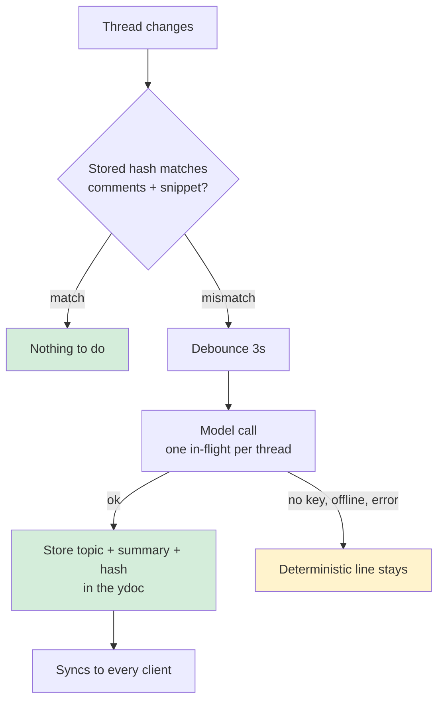

# streamlined_review — thread cards you can read at a glance

**Status:** UX approved 2026-08-10 (mockup: `demos/streamlined-review-mobile.html`). Summary *generation* was approved separately, later the same day, and is a **separate build** — nothing in the first build calls a model. See *How the two lines are produced*. · **Date:** 2026-08-10

## The problem

Collapsing thread cards made the review surface calmer. It also collapsed away what you need to triage.

A collapsed card today renders four things — author swatch, author name, the text of the **first** comment, and a reply count. It shows how a thread *started* and never what it *became*. So triaging means expanding every card to find the two that still need you.

**Goal:** tell what a thread is about, where it got to, and whether it still needs you — without expanding it. Close it in one tap. And when you do open one, have it *become* the conversation rather than being replaced by it.

## What's approved

|                            |                                                              |
| -------------------------- | ------------------------------------------------------------ |
| **Surfaces**               | desktop margin balloons **and** mobile — inline in the document/source, plus an over-doc sheet |
| **The card**               | one shape for every thread: topic line + discussion line, always both |
| **The morph**              | 150 ms two-phase expand/collapse, content-preserving — see *Expanding* |
| **What ships first**       | the **deterministic** topic/discussion lines (anchor snippet + latest comment). No model call. |
| **Approved, second build** | generating the two lines with a model — outbound API access from `packages/server` and comment text leaving the machine, both approved 2026-08-10, carrying a measure-the-first-week condition on the unmeasured cost |

## The card

Every thread renders the same shape, whatever its state. Four rows:

```
● Alice                                          ›
 │ Error handling in the retry helper
 ▪▪ +2 others
 ↳ Debating whether to keep the fallback path
3 replies · 2h ago                    [ ✓ Resolve ]
```

Exactly one replier is worth naming rather than counting to one:

```
● Dave                                           ›
 │ Timeout applied per attempt, not overall
 ▪ Alice replied
 ↳ Agreed to move it into the client wrapper
1 reply · 25m ago                     [ ✓ Resolve ]
```

**A thread with no replies keeps both lines.** The discussion line says so, in muted italic, instead of a topic line standing alone or the card changing shape:

```
● Carol                                        ›
 │ Jitter missing from the backoff
 No replies yet
8m ago                                [ ✓ Resolve ]
```

There is no participants row when nobody has replied — there is nobody to list. That is the *only* row that comes and goes; topic and discussion are always present, because the same shape everywhere is what makes a column of cards scannable, and because both lines are halves of the morph (below) and a missing half has nothing to become.

The mobile sheet adds status to the header row, because there it varies: `● Alice · orphan`.

Lines truncate with an ellipsis rather than wrapping, so a card cannot exceed its five rows at any width.

### One implementation, every surface

`ThreadPanel.renderThread` (`packages/workspaces-app/src/threads.ts:195`) is already shared between the panel and the margin — its own comment says a balloon "is literally this same card (plus positioning classes), so reply/resolve/reopen/re-anchor behave identically everywhere instead of a second implementation drifting out of sync."

The summary lines follow that rule: **one builder** produces the card, consumed by `renderThread`, by the margin's collapsed balloon (`buildCollapsedComment`, `redline/markup-margin.ts:456`), by the inline mobile card and by the sheet. Do not fork it. The two faces of each slot are built together by that one builder — see *Expanding*, which depends on both faces existing in the same node.

### Status

The margin renders **only open threads** — `redline/markup-margin.ts:588` filters on `status === 'open'` *and* a resolvable anchor, because resolved and orphaned threads have no anchor to hang a balloon from. Printing `· open` there would be a constant. So the **margin card omits status**, and so does the mobile *inline* card, for the same reason: inline placement already means "this has a line to sit beside".

The sheet carries all three states (`open | resolved | orphan`) and already heads a section *"Orphaned (N) — re-anchor needed"*. **Orphan is the state that demands action**, and the sheet is the only place an orphan can appear at all. So the sheet card shows status.

### Participants

Participants sit on **their own small row directly above the discussion line** — with the block they describe, not up in the header.

The header row is the attribution for the **opening message**, and nothing else. That is why the opening message does not repeat its author's name when the card expands: the header already said it, and it is the one row the morph never touches.

- Repliers = distinct comment authors after the first comment, in order of

  first appearance, **excluding the thread's author**.
- A colour swatch per person, then the label.
- **Exactly one** replier is named: `Alice replied`. Counting to one is worse

  than saying who.
- **Two or more** is a count: `+2 others`.
- **None**: no row at all.

Rendered as **text, never HTML** — author names are agent-supplied and untrusted. `redline/markup-margin.ts:451` holds this invariant today (`nameEl.textContent = name`, with the comment explaining why); the participants row is one more place it has to hold, and it is the newest place a name reaches the DOM.

### The resolve control

One control, labelled **`✓ Resolve`**, in the card's footer row beside the meta line. The **same element with the same colour in both states** — not an icon-only button, and not a control that only becomes green once the thread is resolved. It reads as an action before you take it.

It lives **outside both folding slots**, in the footer, so expanding never rebuilds it and it never moves relative to the caret.

Wired to the same resolve path the expanded card uses, reusing `.cw-collapsed-actions` (`redline/markup-margin.ts:507`). Needs an explicit `aria-label` ("Resolve thread"), matching the existing collapsed accept/reject buttons.

Collapsed *suggestion* cards get no resolve control — accept/reject is already their resolution, and a third checkmark beside `✓/✕` would be ambiguous.

### Caret and tap target

The expand caret sits at the card's **top right**, rotating 90° when open.

It is deliberately as far from `✓ Resolve` as the card allows. The two were a thumb-width apart on the same row, and the misfire that costs you is the one that resolves a thread by accident.

**Tapping anywhere on the card toggles expand/collapse.** The caret is a hint, not the hit target. The only exclusions are things you tap *for something else*:

- `input, textarea, select, button, a, label`
- an in-progress text selection (`!getSelection().isCollapsed`) — dragging to

  quote a comment must not collapse the comment out from under you

Everything else, including the comment bodies themselves, is fair game.

### Typography

The topic line uses the **same font face, size and line-height** as the message it morphs into. It was serif italic; mid-cross-fade that read as two different things swapping rather than one becoming the other.

The distinction is carried by a **thin left rule and a muted colour** instead — properties that can fade away without moving a single glyph.

## Expanding: the morph

Not a collapse-then-expand. Each summary line is **paired with what it becomes**, and both faces live in the same box:

| slot  | summary face                       | detail face                 |
| ----- | ---------------------------------- | --------------------------- |
| **A** | the topic line                     | the opening message         |
| **B** | participants row + discussion line | the replies + the reply box |

### Structure

```
.slot        { position: relative; overflow: hidden }
.slot > .face{ position: absolute; left: 0; right: 0; top: 0 }
```

Both faces of a slot are stacked at the **same top**. A slot therefore has no intrinsic height — its height exists only because JS sets it, from the **measured** `offsetHeight` of whichever face is currently showing. Nothing ever collapses to zero, because a slot is never empty: one face is always resting at its measured height.

### Two phases

Total **150 ms**. `span = 62% = 93 ms`, `lag = 38% = 57 ms`.

**Expand**

|         | window      | what happens                                                 |
| ------- | ----------- | ------------------------------------------------------------ |
| Phase 1 | 0 → 93 ms   | slot A grows in place; topic cross-fades into the opening message |
| Phase 2 | 57 → 150 ms | slot B rides down **intact** on slot A's growth, then cross-fades into the replies |

**Collapse** runs the same two phases in the opposite order — slot B first (0 → 93 ms), slot A second (57 → 150 ms) — so the thread retreats back into the two lines it came from.

Each slot's animation is: `height` from measured-old to measured-new; the **arriving** face `opacity 0 → 1` over the same window; the **leaving** face `opacity 1 → 0` over `0.6 ×` the duration (≈56 ms) at the same delay, so the two texts never read as one overlapping smear.

The class flip (`.expanded`) happens **first** and sets the resting state; the keyframes only replay the journey. The delayed keyframes use **`fill: 'backwards'`**, which holds the *old* height and opacity through the delay — that is precisely what lets slot B sit still and simply **travel** while slot A is still growing, instead of starting to change at t=0.

### Invariants (testable)

1. **Nothing above the card moves.** The card's own `getBoundingClientRect().top`

  is unchanged for the whole 150 ms. Only content *below* it moves, by exactly the sum of the two slots' growth.
2. **Slot A holds its top.** Slot A's offset within the card is constant.
3. **The opening message lands on the topic line's row.** Measure `.topic`'s

  rect top while collapsed and `.msg`'s rect top while expanded — they are equal. This is what the matched font face/size/line-height buys, and it is the assertion that fails if someone restyles the topic line.
4. **Slot B travels exactly slot A's growth.** At every frame,

  `Δ(slotB.top) === Δ(slotA.height)`. It holds because slot B's own height is pinned to its old value through the delay, so its top is purely a function of slot A's height.
5. **Card height is monotonic and never dips.** No frame is shorter than the

  collapsed resting height (expand) or taller than the expanded one (collapse).
6. At `t = 150 ms` the card's height equals the sum of the measured resting

  heights.

### Measurement staleness

A measured height goes stale the moment text metrics change. Re-measure every slot:

- after every render,
- on `resize` (a reflow changes how many lines a message takes),
- after `document.fonts.ready` — a webfont landing after first paint leaves

  every card holding a height computed against the fallback face.

### Toggle in place, and only in place

**Toggling must mutate the existing node, never re-render it.** A freshly built node mounts at its final height and cannot animate — there is no "from" to tween out of.

This collides with how the margin works today, and the collision is the riskiest part of the build:

- `renderBalloons` (`redline/markup-margin.ts:605`) puts

  `isExpanded('c:'+id)` **in the render key** and, on any key change, does `marginEl.textContent = ''` and rebuilds every balloon. Expanding a thread is therefore a full teardown today.
- Collapsed and expanded are **two different builders** today

  (`buildCollapsedComment` vs `buildCommentBalloon`), plus an `addCollapseButton` bolted on when expanded.

The morph needs the opposite: **one builder emitting both faces**, expansion as a class flip plus measured tweens on the existing node, `expanded` **out** of the render key, and the expanded-only collapse button gone (the whole card is the tap target now, and `✓ Resolve` is the only footer control).

**Never key the toggle by a document-unique id.** One thread is on screen **twice** on mobile — inline in the document *and* in the sheet — and expand state is **shared** between the two copies. Drive every copy from the thread id: `document.querySelectorAll('.thread[data-id="…"]')`. A `getElementById`/`querySelector`-singular lookup animates one copy and leaves the other silently wrong.

### Reduced motion

Honour `prefers-reduced-motion: reduce` by setting **duration and delay to 0**. The class flip and the measured height assignment still run, so the card lands in exactly the right state with no tween. Do not branch to a different layout.

## Mobile navigation

There is **no standalone thread drawer** on mobile. Two surfaces:

1. **Inline** — the card sits directly under the text (or the source line) it

  points at, exactly where a GitHub PR comment sits. Only threads that have a line to sit beside appear here: open, with a resolvable anchor. Code scrolls sideways; the card does not, so a card never needs a horizontal scroll to read.
2. **The over-doc sheet** — opened by tapping the **comment-count badge** in

  the app bar. A bottom sheet over the document (scrim + rounded sheet + grabber, the pattern `mountDeletionSheet` and review-chrome's full-screen thread view already share). Grouped `Open` / `Orphaned — no line to anchor to` / `Resolved`, with an Open/All filter. This is the only place orphaned and resolved threads appear.

**Prev/next comment nav** buttons (`‹ ›`) sit in the app bar **to the left of the badge**. They walk the *inline* comments in document order and centre the target inside the scroll container:

```
top = clamp(el.offsetTop - sc.clientHeight / 2 + el.offsetHeight / 2,
            0, sc.scrollHeight - sc.clientHeight)
```

Not `scrollIntoView()` — it walks up and scrolls every ancestor scroller too, which moves the page behind the review surface. Keep the clamp pure so it can be unit-tested without a DOM. The target card flashes briefly on arrival.

Expand state is **shared** between a thread's inline copy and its sheet copy (see *Toggle in place, and only in place*).

## How the two lines are produced

### What ships now: the deterministic path

Both lines are derived on the client from data the thread already carries. No network call, no key, no new dependency.

| line                       | source                                                       |
| -------------------------- | ------------------------------------------------------------ |
| **topic**                  | the anchor snippet as stored — already capped at `SNIPPET_MAX = 80` chars (`packages/core/src/anchor/text-range.ts:5`), ~12 words, so it fits the line as-is |
| **discussion**             | the latest comment's opening words, clipped to the line      |
| **discussion, no replies** | the literal string `No replies yet`, muted italic — nothing is derived, because there is no discussion yet |

This is a working card, not a placeholder one. A snippet is sometimes a mid-sentence code fragment that reads poorly as a topic — that is the limitation being accepted, and the reason generation is on the table at all.

### The seam

Both lines come from **one pure function** — `threadSummary(thread): { topic, discussion }` — called by the shared card builder and by nothing else. It is the single place that decides what the two lines say.

Generation changes *only* that function: it prefers stored generated text when present and falls back to the deterministic result otherwise. No UI, no card builder, and no CSS changes. Keep the function pure and unit-tested against thread fixtures, so the fallback stays provably correct after generation lands on top of it.

### Render-key staleness — live today, not deferred

The margin's balloon render key is `comment|id|status|commentCount|lastActivity|active|expanded` (`redline/markup-margin.ts:617`).

**The topic line's input is not in that key.** The anchor snippet changes when the doc is edited, independently of every term in the key — so an edited anchor keeps a stale topic on screen until an unrelated repaint happens to rebuild the margin. Whatever `threadSummary` reads must be reflected in the render key. Today that means the snippet; if generated text lands later, its stored hash joins the key for exactly the same reason.

(`expanded` comes *out* of the key at the same time — see the morph section. The key gains what the card actually displays and loses what it merely animates.)

### APPROVED 2026-08-10, and out of scope for THIS build — generating the lines with a model

Bryan approved the outbound access and the comment text leaving the machine on 2026-08-10, a few minutes after approving the UX. It is a **separate build**: nothing in this branch adds an Anthropic client to `packages/server`, opens an outbound connection, or reads an API key. The design below is what that build implements.

The shape it would take: one call per thread returning `{topic, summary}`, ~10 words each, on a small fast model; triggered server-side on thread change, 3 s debounce, one in-flight call per thread deduped so three browsers on one doc cause one call, not three; **share visitors never trigger generation** (a public tunnel URL must not be able to spend the key); result stored in the ydoc with a hash covering **comment texts *****and***** the anchor snippet** (the snippet feeds the topic line and changes independently of the comments, so hashing comments alone would strand an edited anchor with a stale topic forever); absent key or failed call leaves the deterministic line in place.



What the approval carries:

- **Comment text goes to an external API.** `scrub-haiku.py` sets the

  precedent of sending repo content to the same vendor, but that is a git hook — **there is no Anthropic client in ****`packages/server/src`**** today**, and this would be the server's first outbound API access.
- **Summaries live in the ydoc.** Defensible *here* because a summary is no

  more sensitive than the comments it summarizes, and share visitors already receive those. It does not generalize — `private-meta.ts` exists precisely for fields that must never reach a visitor.
- **The cost is unmeasured.** Order-of-magnitude estimate, stated so it can be

  checked: ~26 threads on a large live review, ~3 regenerations per thread per day, ~500 input + ~30 output tokens per call ≈ 40k tokens/day ≈ $0.05/month at small-model pricing. Approving it means accepting a measure-the-first-week condition before it is treated as free.

  **Measured 2026-08-11, and the estimate above was low by ~18×.** The production prompt was run over every thread from the preceding 21 days — 288 threads, 640 comments, 60 docs, 288/288 calls succeeding. Real cost is **$0.00099 per call**: 753 input tokens, not 500, because real threads carry more text than the estimate assumed. Real volume is **30.5 calls/day**, not ~2, because that is the actual comment rate. Together: **$0.91/month**, against the $0.05 guessed here. Still small in absolute terms, and the condition is met — but quote the measured figure, not the estimate.
- **Latency changes what the card says.** A summary lands ~5 s after a reply

  (3 s debounce + ~2 s call), so the discussion line is stale for a moment right after you speak. A pending state may be worth the flicker.
- **Interface**, if built: `POST /api/docs/:docId/threads/:threadId/summary`,

  request `{}` (the server reads the thread it already holds), response `{topic, summary, hash}`, `503` when the key is absent or the call fails. Wrap as an MCP tool `summarize_thread` **in the same change** — a server route meant for agents that ships without its MCP tool is a documented failure mode in this repo.
- **Opt-out**: `CW_SUMMARIES=0` disables generation; cards fall back to the

  deterministic path and nothing breaks.

  **The key's account is a privacy boundary, and nothing enforces it.** Every doc on a server is summarized through whichever API key that server holds, so all comment text reaches one account no matter which project it came from. That is fine while the key and the work share an owner — the case today, and why this is mild rather than blocking. It stops being fine as soon as they diverge: a project with tighter privacy needs than the key's account has no way to opt one doc out, nothing in the request records which project the text belongs to, and a reviewer cannot see which account their words were sent to. The exposure grows with each additional project reviewed on one server, and again if a server ever hosts review for more than one person. Deferred, not solved. The shape of a fix is a key selected per workspace rather than one global key, plus a per-doc opt-out that survives a re-bind — worth revisiting before this server hosts work whose privacy needs differ from the key's.

## Layout

Taller cards displace each other further in the margin's shared anchor-sorted `layoutBalloons` pass, lengthening leader lines. That is accepted: no cap, no scroll container, no new overflow behavior. Cards displace exactly as they do today.

The morph's measured heights make this well-behaved rather than worse: the card's top edge never moves, so a re-layout is a translation of everything below it, not a reflow of the column.

## Testing

**Card**

- margin card and mobile inline card omit status; sheet card renders all three

  states including orphan
- every thread renders both lines; a no-reply thread renders `No replies yet`

  in the discussion slot and **no** participants row
- participants: dedup, author excluded, exactly-one names the replier,

  two-or-more counts `+N others`
- author names render as text, not HTML (untrusted-input regression test, the

  participants row included)
- `threadSummary` is pure: topic from the anchor snippet, discussion from the

  latest comment, deterministic for a fixed thread fixture
- a changed anchor snippet repaints the card (render-key regression test)
- `✓ Resolve` is the same element with the same class in both states; suggestion

  cards have none

**Morph** — assert relationships, not pixel values:

- the card's top edge is unchanged at every sampled frame of expand and collapse
- `.topic`'s rect top collapsed === `.msg`'s rect top expanded
- `Δ(slotB.top) === Δ(slotA.height)` at every sampled frame
- card height is monotonic and never dips below the collapsed height
- both phases land: total 150 ms, final height === sum of measured resting heights
- collapse reverses the phase order (slot B leads)
- `prefers-reduced-motion: reduce` → duration 0, final state still correct
- expanding a thread does **not** rebuild the card node (identity check on the

  element before and after)
- a thread rendered twice (inline + sheet) morphs **both** copies from one tap
- a slot re-measures on resize and after `document.fonts.ready`

**Navigation**

- prev/next walk inline threads in document order and wrap
- the centring clamp is unit-tested pure: clamps to 0 and to

  `scrollHeight - clientHeight`
- tapping the card body toggles; tapping `input/textarea/select/button/a/label`

  does not; dragging a text selection across a comment does not collapse it

**Browser check at 430 px and >1100 px** — both surfaces, every card state.

## Out of scope

- **Summary generation** (above) — approval, then its own build.
- **Read/unread awareness** — per-file "viewed" markers that auto-invalidate on

  change, unread markers, "changes since my last review" — needs per-user server-side state and gets its own spec, opening with research into how Word, Google Docs, and GitHub model per-reader review state.

## Open questions

Two the mockup could not settle:

1. A **resolved thread inline**: today it still has a card sitting in the

  middle of the prose. In the sheet it simply leaves the Open list. Should it disappear inline too?
2. Whether the sheet should remember its Open/All filter across opens.

## What was approved, and in what order

Build one — the card itself, approved first and shipped in this branch:

1. The card shape, both lines on every thread, participants above the

  discussion line
2. The 150 ms two-phase morph, the top-right caret, whole-card tap target, and

  the single `✓ Resolve` control
3. Mobile as inline + over-doc sheet with prev/next nav — no standalone drawer

Build two — generation, approved the same day, deliberately not in this branch:

1. Giving `packages/server` outbound API access
2. Sending comment text to an external model
3. The cost, which remains **unmeasured** — the approval carries a

  measure-the-first-week condition, so log real call volume before anyone describes it as free
